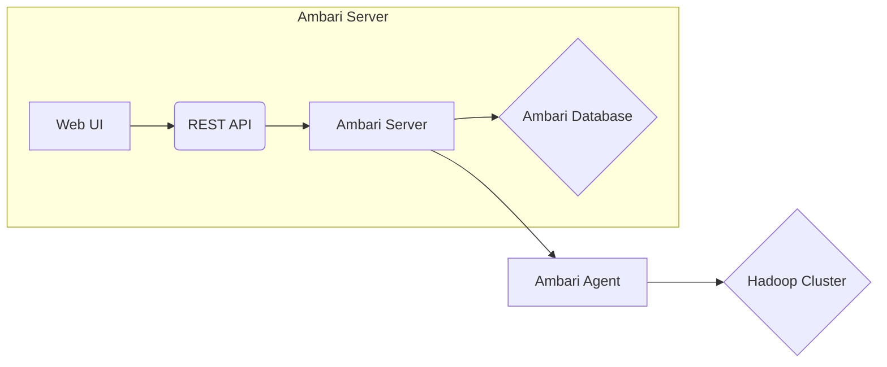

## 1. 背景介绍

### 1.1 大数据时代的集群管理挑战

随着大数据时代的到来，海量数据的处理和分析需求日益增长。为了应对这一挑战，分布式计算框架如 Hadoop 和 Spark 应运而生，它们能够将计算任务分布到多台服务器上并行执行，从而显著提升计算效率。然而，随着集群规模的不断扩大，如何高效地管理和维护这些服务器集群成为了一个新的难题。

### 1.2 Ambari：简化 Hadoop 集群管理的利器

Ambari 是一款开源的基于 Web 的工具，旨在简化 Hadoop 集群的部署、管理和监控。它提供了一套直观的界面，用户可以通过简单的操作完成复杂的集群配置和管理任务，从而降低了运维成本，提高了集群的稳定性和可靠性。

### 1.3 Ambari 的优势

* **易于使用：** Ambari 提供了用户友好的图形界面，简化了集群管理操作。
* **自动化部署：** Ambari 可以自动完成 Hadoop 集群的安装和配置，无需手动干预。
* **集中式管理：** Ambari 提供了集中式的管理平台，可以监控整个集群的运行状态和性能指标。
* **可扩展性：** Ambari 支持多种 Hadoop 生态系统组件，可以根据实际需求进行灵活扩展。

## 2. 核心概念与联系

### 2.1 Ambari 架构

Ambari 的核心架构由以下组件构成：

* **Ambari Server：** 负责管理和监控整个集群，提供 Web 界面和 REST API 供用户访问。
* **Ambari Agent：** 部署在每台服务器上，负责执行 Ambari Server 下发的指令，收集服务器的运行信息并上报。
* **Ambari 数据库：** 存储集群的配置信息、服务状态、监控数据等。

**Ambari 架构图**



### 2.2 Ambari 核心概念

* **Cluster：** 代表一个由多台服务器组成的 Hadoop 集群。
* **Service：** 代表 Hadoop 生态系统中的一个服务，例如 HDFS、YARN、MapReduce、Hive 等。
* **Component：** 代表一个服务的组成部分，例如 NameNode、DataNode、ResourceManager、NodeManager 等。
* **Host：** 代表集群中的每台服务器。
* **Configuration：** 代表服务的配置参数。
* **Repository：** 代表软件包的存储库。

### 2.3 Ambari 工作流程

1. 用户通过 Ambari Web UI 或 REST API 发送请求到 Ambari Server。
2. Ambari Server 根据请求内容生成相应的指令并下发到 Ambari Agent。
3. Ambari Agent 执行指令，完成相应的操作，并将执行结果上报给 Ambari Server。
4. Ambari Server 收集所有 Agent 的上报信息，更新集群状态和监控数据，并将结果反馈给用户。

## 3. 核心算法原理具体操作步骤

### 3.1 集群部署

Ambari 提供了两种集群部署方式：

* **手动部署：** 用户需要手动安装 Ambari Server 和 Agent，并配置相关参数。
* **自动化部署：** Ambari 提供了自动化部署脚本，可以自动完成 Ambari Server 和 Agent 的安装和配置。

**自动化部署步骤：**

1. 下载 Ambari 安装包。
2. 运行安装脚本，根据提示输入相关信息，例如集群名称、主机列表、软件包存储库等。
3. 脚本会自动安装 Ambari Server 和 Agent，并完成相关配置。
4. 访问 Ambari Web UI，完成集群服务的安装和配置。

### 3.2 服务管理

Ambari 提供了以下服务管理功能：

* **服务安装：** 用户可以通过 Ambari Web UI 选择要安装的服务，并配置相关参数。
* **服务启动/停止：** 用户可以通过 Ambari Web UI 启动或停止服务。
* **服务配置：** 用户可以通过 Ambari Web UI 修改服务的配置参数。
* **服务监控：** Ambari 提供了丰富的监控指标，用户可以通过 Ambari Web UI 监控服务的运行状态和性能指标。

### 3.3 监控与告警

Ambari 提供了以下监控和告警功能：

* **实时监控：** Ambari 可以实时监控集群的运行状态，并以图表形式展示各项指标。
* **历史数据：** Ambari 可以存储历史监控数据，用户可以查看历史运行趋势。
* **告警机制：** Ambari 可以根据预先设定的阈值触发告警，通知管理员及时处理问题。

## 4. 数学模型和公式详细讲解举例说明

Ambari 本身并不涉及复杂的数学模型和算法，其核心功能是通过简化操作流程和自动化配置来管理 Hadoop 集群。

## 4. 项目实践：代码实例和详细解释说明

### 4.1 使用 Ambari REST API 管理集群

Ambari 提供了 REST API 供用户以编程方式管理集群。以下是一些常用的 REST API 示例：

**获取集群信息：**

```
curl -u admin:admin -X GET http://<ambari_server_hostname>:8080/api/v1/clusters
```

**启动服务：**

```
curl -u admin:admin -X POST http://<ambari_server_hostname>:8080/api/v1/clusters/<cluster_name>/services/<service_name>/commands/start
```

**停止服务：**

```
curl -u admin:admin -X POST http://<ambari_server_hostname>:8080/api/v1/clusters/<cluster_name>/services/<service_name>/commands/stop
```

### 4.2 使用 Ambari Blueprints 自动化部署

Ambari Blueprints 是一种基于 YAML 的模板语言，可以用于描述 Hadoop 集群的配置和部署方案。用户可以使用 Blueprints 定义集群的拓扑结构、服务配置、软件包版本等信息，然后使用 Ambari 自动完成集群的部署。

**Blueprints 示例：**

```yaml
name: my-cluster
stack_name: HDP
stack_version: "3.1"

configurations:
  - core-site:
      fs.defaultFS: hdfs://namenode:8020

services:
  - HDFS:
      components:
        - NAMENODE:
            hosts:
              - namenode
        - DATANODE:
            hosts:
              - datanode1
              - datanode2
  - YARN:
      components:
        - RESOURCEMANAGER:
            hosts:
              - resourcemanager
        - NODEMANAGER:
            hosts:
              - datanode1
              - datanode2
```

## 5. 实际应用场景

### 5.1 企业级大数据平台

Ambari 可以用于构建企业级大数据平台，管理和监控 Hadoop 集群，确保平台的稳定性和可靠性。

### 5.2 云计算平台

Ambari 可以集成到云计算平台，例如 AWS、Azure、GCP 等，提供自动化部署和管理 Hadoop 集群的功能。

### 5.3 物联网平台

Ambari 可以用于管理物联网平台中的 Hadoop 集群，处理海量的传感器数据，并提供实时分析和预测功能。

## 6. 工具和资源推荐

### 6.1 Ambari 官方文档

* [Ambari Documentation](https://cwiki.apache.org/confluence/display/AMBARI/Ambari)

### 6.2 Ambari 社区

* [Ambari Mailing Lists](https://ambari.apache.org/community/#mailing-lists)
* [Ambari Stack Overflow](https://stackoverflow.com/questions/tagged/ambari)

### 6.3 Hadoop 生态系统

* [Apache Hadoop](https://hadoop.apache.org/)
* [Apache Spark](https://spark.apache.org/)
* [Apache Hive](https://hive.apache.org/)

## 7. 总结：未来发展趋势与挑战

### 7.1 云原生化

随着云计算技术的不断发展，Ambari 也在积极拥抱云原生化趋势，例如支持 Kubernetes 部署、容器化服务等。

### 7.2 AI 赋能

人工智能技术的应用可以进一步提升 Ambari 的智能化水平，例如自动故障诊断、性能优化、安全加固等。

### 7.3 生态整合

Ambari 需要不断整合 Hadoop 生态系统中的新组件和技术，以满足不断变化的大数据处理需求。

## 8. 附录：常见问题与解答

### 8.1 如何解决 Ambari Server 启动失败？

* 检查 Ambari Server 日志文件，查找错误信息。
* 检查 Ambari 数据库连接是否正常。
* 检查 Ambari Server 的端口是否被占用。

### 8.2 如何解决 Ambari Agent 无法连接到 Ambari Server？

* 检查 Ambari Agent 的配置文件，确保主机名和端口正确。
* 检查 Ambari Server 的防火墙设置，确保 Agent 可以访问 Server 的端口。
* 检查网络连接是否正常。