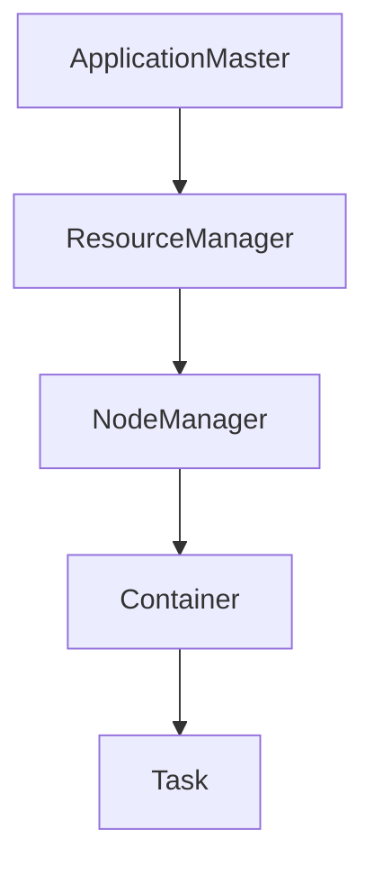

## 1. 背景介绍

### 1.1 分布式计算的兴起

随着互联网的快速发展，数据量呈爆炸式增长，传统的单机计算模式已经无法满足海量数据的处理需求。分布式计算应运而生，它将计算任务分解成多个子任务，并行地在多个计算节点上执行，从而提高计算效率和处理能力。

### 1.2 Hadoop 与 YARN

Hadoop 是一个开源的分布式计算框架，它提供了一种可靠、可扩展的方式来存储和处理大规模数据集。YARN (Yet Another Resource Negotiator) 是 Hadoop 2.0 中引入的资源管理系统，它负责集群资源的分配和调度，为各种分布式应用程序提供统一的资源管理平台。

### 1.3 ApplicationMaster 的角色

在 YARN 中，每个应用程序都由一个 ApplicationMaster (AM) 负责管理。AM 负责向 YARN 申请资源，启动和监控任务，并处理任务的失败和恢复。AM 是 YARN 架构中的核心组件之一，它扮演着应用程序的“大脑”角色。

## 2. 核心概念与联系

### 2.1 Container

Container 是 YARN 中资源分配的基本单位，它代表一定数量的 CPU、内存和磁盘空间。每个任务都运行在一个 Container 中，AM 负责向 YARN 申请 Container 并启动任务。

### 2.2 NodeManager

NodeManager (NM) 是 YARN 中的节点管理组件，它负责管理单个节点上的资源，包括 Container 的创建、启动、监控和销毁。AM 通过与 NM 通信来获取 Container 并启动任务。

### 2.3 ResourceManager

ResourceManager (RM) 是 YARN 中的中央资源管理组件，它负责管理整个集群的资源，包括接收 AM 的资源请求、分配 Container、监控节点状态等。AM 通过与 RM 通信来申请资源。

### 2.4 核心概念联系



## 3. 核心算法原理具体操作步骤

### 3.1 AM 的启动过程

1. 用户提交应用程序到 YARN。
2. RM 接收应用程序请求，并为 AM 分配第一个 Container。
3. NM 启动 AM Container，并加载 AM 程序。
4. AM 向 RM 注册，并开始申请资源。

### 3.2 AM 的资源申请流程

1. AM 根据应用程序的需求，向 RM 申请 Container。
2. RM 根据集群资源情况，分配 Container 给 AM。
3. AM 接收 Container 信息，并与 NM 通信启动任务。

### 3.3 AM 的任务管理

1. AM 监控任务的运行状态，并处理任务的失败和恢复。
2. AM 收集任务的输出结果，并进行汇总和处理。
3. AM 完成应用程序的执行后，向 RM 注销并释放资源。

## 4. 数学模型和公式详细讲解举例说明

YARN 的资源调度算法比较复杂，涉及到多种因素，例如资源需求、优先级、公平性等。这里不详细展开，感兴趣的读者可以参考 YARN 的官方文档。

## 5. 项目实践：代码实例和详细解释说明

以下是一个简单的 MapReduce 程序的 AM 代码示例：

```java
public class MyApplicationMaster extends ApplicationMaster {

    @Override
    public void main(String[] args) throws Exception {
        // 1. 获取配置信息
        Configuration conf = new Configuration();

        // 2. 创建 Job
        Job job = Job.getInstance(conf, "My Job");
        job.setJarByClass(MyApplicationMaster.class);
        job.setMapperClass(MyMapper.class);
        job.setReducerClass(MyReducer.class);
        job.setOutputKeyClass(Text.class);
        job.setOutputValueClass(IntWritable.class);

        // 3. 设置输入输出路径
        FileInputFormat.addInputPath(job, new Path(args[0]));
        FileOutputFormat.setOutputPath(job, new Path(args[1]));

        // 4. 提交 Job
        job.waitForCompletion(true);
    }
}
```

代码解释：

1. 获取 Hadoop 配置信息。
2. 创建 MapReduce Job，并设置 Mapper、Reducer、输入输出类型等。
3. 设置输入输出路径。
4. 提交 Job 到 YARN 集群，并等待 Job 执行完成。

## 6. 实际应用场景

### 6.1 数据分析

YARN 可以用于各种数据分析应用程序，例如日志分析、用户行为分析、机器学习等。

### 6.2 科学计算

YARN 可以用于各种科学计算应用程序，例如基因组分析、气候模拟、物理模拟等。

### 6.3 实时流处理

YARN 可以用于各种实时流处理应用程序，例如实时推荐、欺诈检测、网络监控等。

## 7. 工具和资源推荐

### 7.1 Hadoop 官方文档

Hadoop 官方文档提供了 YARN 的详细介绍和使用方法。

### 7.2 YARN Cookbook

YARN Cookbook 是一本关于 YARN 的实用指南，包含了各种 YARN 应用场景和代码示例。

### 7.3 Apache Ambari

Apache Ambari 是一款 Hadoop 集群管理工具，可以简化 YARN 集群的部署和管理。

## 8. 总结：未来发展趋势与挑战

### 8.1 云原生化

随着云计算的普及，YARN 也在朝着云原生化方向发展，例如支持 Kubernetes 集成、容器化部署等。

### 8.2 资源调度优化

YARN 的资源调度算法仍然存在一些挑战，例如如何提高资源利用率、如何保证应用程序的公平性等。

### 8.3 安全性增强

随着大数据应用的普及，YARN 的安全性也越来越重要，例如如何防止数据泄露、如何保障应用程序的安全运行等。

## 9. 附录：常见问题与解答

### 9.1 AM 失败了怎么办？

YARN 会自动重启 AM，并尝试恢复应用程序的执行。

### 9.2 如何查看 AM 的日志？

可以通过 YARN 的 Web 界面或者命令行工具查看 AM 的日志。

### 9.3 如何调试 AM 程序？

可以使用 Java 调试工具或者 YARN 的日志来调试 AM 程序。
