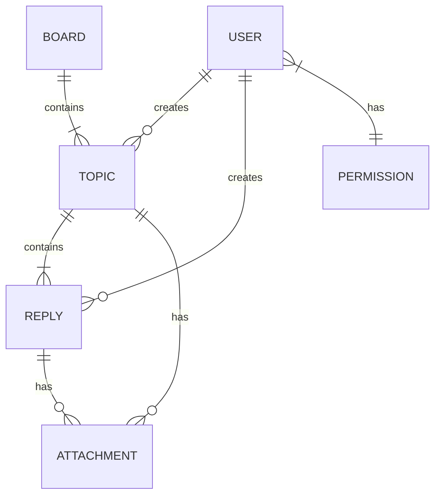

# BBS论坛系统详细设计与具体代码实现

## 1. 背景介绍

### 1.1 BBS论坛系统概述

BBS（Bulletin Board System，即电子公告板系统）是一种允许用户通过互联网进行信息交流和资源共享的在线论坛系统。BBS论坛系统最初诞生于20世纪70年代，作为一种基于文本的通信系统，为用户提供了一个交流想法、分享资源和建立社区的平台。

随着互联网的发展和Web技术的进步，BBS论坛系统也不断演进和升级。现代BBS论坛系统通常采用基于Web的架构，提供了更加丰富的功能和更好的用户体验。用户可以发布主题帖、回复帖子、上传附件、进行搜索等操作，并且可以根据自己的兴趣加入不同的板块或子论坛。

### 1.2 BBS论坛系统的重要性

BBS论坛系统在现代互联网时代扮演着重要的角色，它为人们提供了一个开放、自由的交流平台。BBS论坛系统的主要作用包括但不限于以下几个方面:

1. **信息交流与知识分享**：BBS论坛系统是一个宝贵的知识宝库,用户可以就感兴趣的话题进行深入讨论,分享经验和见解,相互学习和提高。
2. **社区建设与维系**：BBS论坛系统可以汇聚志同道合的人,建立起具有共同兴趣或目标的虚拟社区,增强彼此之间的联系和凝聚力。
3. **问题解决与技术支持**：在BBS论坛系统中,用户可以提出技术问题并获得其他用户的解答和建议,这对于解决实际问题和学习新技术非常有帮助。
4. **信息发布与传播**：BBS论坛系统可以作为一个信息发布和传播的渠道,方便用户获取最新资讯和动态。
5. **市场营销与反馈收集**：一些企业和组织也利用BBS论坛系统与用户进行互动,了解用户需求,收集反馈意见,进行市场营销等活动。

总的来说,BBS论坛系统是一种重要的在线交流工具,它促进了信息的自由流通,推动了知识的传播和分享,为人们提供了一个宝贵的互动平台。

## 2. 核心概念与联系

### 2.1 BBS论坛系统的核心概念

在设计和实现BBS论坛系统时,需要掌握以下几个核心概念:

1. **用户(User)**:用户是BBS论坛系统的核心,他们可以发布主题帖、回复帖子、上传附件等。用户通常需要注册和登录才能使用论坛的全部功能。
2. **板块(Board)**:板块是论坛的主要分类,每个板块都有自己的主题范围。用户可以根据自己的兴趣加入不同的板块。
3. **主题(Topic)**:主题是用户在论坛中发布的帖子,它包含标题、正文内容、作者信息等。其他用户可以对主题进行回复和讨论。
4. **回复(Reply)**:回复是用户对某个主题发表的评论或意见。回复可以嵌套,形成一个树状结构。
5. **附件(Attachment)**:附件是用户上传的文件资源,如图片、文档等,通常与主题或回复相关联。
6. **权限控制(Permission Control)**:权限控制机制用于管理用户在论坛中的操作权限,例如发帖、删帖、封禁用户等。管理员拥有最高权限。

### 2.2 核心概念之间的关系

上述核心概念之间存在着密切的关联关系,它们共同构成了BBS论坛系统的基本框架。具体来说:

1. 用户可以在不同的板块中发布主题和回复。
2. 每个主题都属于一个特定的板块,并且可以有多个回复。
3. 回复可以是对主题的评论,也可以是对其他回复的评论(嵌套回复)。
4. 用户可以在主题或回复中上传附件。
5. 权限控制机制决定了用户在论坛中可以执行哪些操作,例如普通用户可以发帖和回复,版主可以管理特定板块,管理员拥有最高权限。

这些概念之间的关系可以用一个实体关系图(Entity-Relationship Diagram)来表示,如下所示:

在该实体关系图中,用户(USER)可以创建主题(TOPIC)和回复(REPLY),主题包含回复,主题和回复都可以有附件(ATTACHMENT),主题属于特定的板块(BOARD),而用户则根据权限(PERMISSION)在论坛中执行不同的操作。

通过对这些核心概念及其关系的理解,我们可以更好地设计和实现BBS论坛系统的各个模块和功能。

## 3. 核心算法原理具体操作步骤

### 3.1 用户注册和登录

用户注册和登录是BBS论坛系统的基础功能,它们通常涉及以下几个步骤:

1. **用户注册**:
   - 用户填写注册表单,提供必要的信息(如用户名、密码、电子邮件等)。
   - 系统对用户输入的信息进行验证,确保合法性和唯一性。
   - 如果验证通过,系统将用户信息存储在数据库中。
   - 系统可以向用户发送一封确认电子邮件,要求用户激活账户。

2. **用户登录**:
   - 用户输入用户名和密码。
   - 系统验证用户提供的凭据是否正确。
   - 如果验证通过,系统为用户创建一个会话(Session),并生成一个会话标识符(Session ID)。
   - 系统将会话信息存储在服务器端(如内存或数据库)。
   - 系统将会话标识符发送给客户端(通常以Cookie的形式)。
   - 客户端在后续的请求中携带会话标识符,以维持登录状态。

3. **注销和会话管理**:
   - 用户可以选择注销,终止当前会话。
   - 系统删除与该会话相关的信息。
   - 系统可以设置会话超时时间,在一定时间内如果没有活动,会自动注销该会话。

在实现用户注册和登录功能时,需要注意以下几个方面:

- **密码安全**:永远不要在数据库中存储明文密码,应该使用安全的哈希算法(如bcrypt或Argon2)对密码进行哈希处理,并存储哈希值。
- **会话管理**:合理设置会话超时时间,防止会话被劫持或重放攻击。可以使用会话固定保护(Session Fixation Protection)等技术增强会话安全性。
- **输入验证**:对用户输入的数据进行严格验证,防止注入攻击(如SQL注入、XSS等)。
- **防止暴力破解**:实现账户锁定机制,在多次失败的登录尝试后暂时锁定账户,防止暴力破解攻击。
- **电子邮件验证**:可以要求用户通过电子邮件验证来激活账户,增加安全性。

### 3.2 发布主题和回复

发布主题和回复是BBS论坛系统的核心功能,它们通常涉及以下几个步骤:

1. **发布主题**:
   - 用户选择一个适当的板块。
   - 用户填写主题标题和正文内容。
   - 用户可以选择上传附件(如图片、文档等)。
   - 系统对用户输入的数据进行验证和过滤(如防止XSS攻击)。
   - 系统将主题信息存储在数据库中,包括标题、正文、作者、发布时间等。
   - 如果有附件,系统将附件存储在文件系统或对象存储服务中。

2. **回复主题**:
   - 用户浏览某个主题的详情页面。
   - 用户填写回复内容。
   - 用户可以选择引用原帖或其他回复的部分内容。
   - 用户可以选择上传附件。
   - 系统对用户输入的数据进行验证和过滤。
   - 系统将回复信息存储在数据库中,包括回复内容、作者、回复时间等,并与相应的主题建立关联。
   - 如果有附件,系统将附件存储在文件系统或对象存储服务中。

3. **嵌套回复**:
   - 用户可以对某个回复进行回复,形成嵌套结构。
   - 系统需要维护回复之间的层级关系,通常使用树状结构或嵌套集合来表示。
   - 在展示回复时,系统需要正确地呈现嵌套结构,通常使用递归或迭代的方式遍历树状结构。

在实现发布主题和回复功能时,需要注意以下几个方面:

- **输入验证和过滤**:对用户输入的数据进行严格验证和过滤,防止XSS、SQL注入等攻击。
- **附件处理**:安全地存储和检索附件文件,考虑文件大小限制、文件类型限制等。
- **版面控制**:实现版面控制机制,确保用户只能在有权限的板块中发布主题和回复。
- **回复嵌套处理**:合理设计数据结构和算法,高效地维护和展示回复的嵌套关系。
- **通知机制**:可以实现通知机制,当有新回复时通知主题作者或感兴趣的用户。
- **内容审核**:可以实现内容审核机制,管理员或版主可以审核和管理不当内容。

### 3.3 搜索和排序

搜索和排序是BBS论坛系统的重要功能,它们可以帮助用户快速找到感兴趣的主题,并按照特定的顺序展示。常见的搜索和排序算法包括:

1. **全文搜索**:
   - 使用全文搜索引擎(如Elasticsearch、Solr或数据库内置的全文搜索功能)建立索引。
   - 索引包括主题标题、正文内容、作者等关键字段。
   - 用户输入关键字,搜索引擎根据索引返回匹配的结果。
   - 可以支持模糊搜索、短语搜索、布尔搜索等高级搜索功能。

2. **关键字搜索**:
   - 在数据库中建立适当的索引,如标题索引、作者索引等。
   - 用户输入关键字,系统根据索引进行匹配查询。
   - 可以支持前缀匹配、后缀匹配等模糊搜索。

3. **排序算法**:
   - 常见的排序方式包括按发布时间、最后回复时间、回复数量、浏览量等排序。
   - 可以使用简单的排序算法,如冒泡排序、插入排序等。
   - 对于大规模数据,可以使用更高效的排序算法,如快速排序、归并排序等。
   - 也可以利用数据库提供的排序功能,如ORDER BY语句。

4. **分页**:
   - 将搜索结果分页展示,每页显示一定数量的主题。
   - 可以使用数据库的LIMIT和OFFSET语句进行分页查询。
   - 也可以在应用程序层面实现分页逻辑。

在实现搜索和排序功能时,需要注意以下几个方面:

- **索引优化**:合理设计索引结构,提高搜索效率。
- **搜索引擎选择**:根据系统规模和需求,选择合适的全文搜索引擎。
- **相关性排序**:除了基本排序,还可以考虑根据相关性对搜索结果进行排序,提高用户体验。
- **缓存机制**:可以考虑实现缓存机制,加速热门搜索和排序操作。
- **分页优化**:合理设置分页参数,提高分页效率。
- **搜索日志**:记录搜索日志,分析用户搜索习惯,优化搜索功能。

## 4. 数学模型和公式详细讲解举例说明

在BBS论坛系统中,一些常见的数学模型和公式包括:

### 4.1 相似性计算

相似