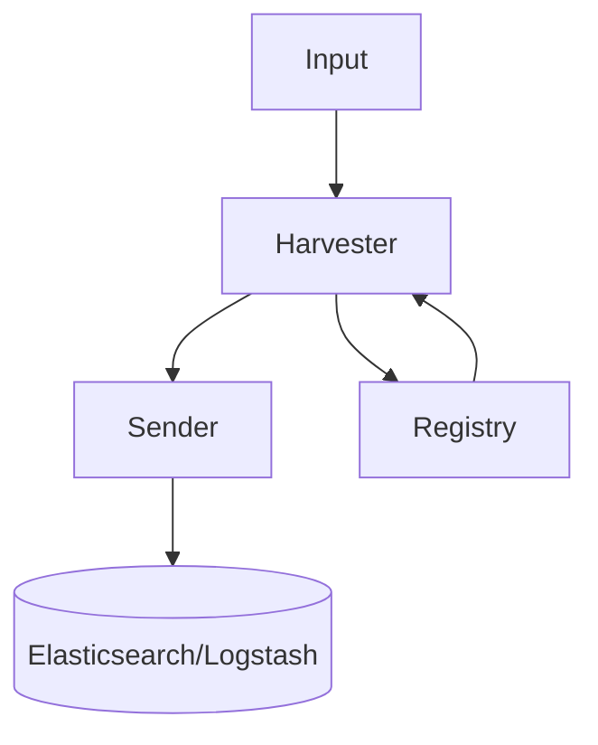
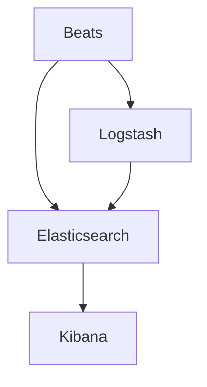

# Beats原理与代码实例讲解

## 1.背景介绍

### 1.1 What is Beats?

Beats是一个轻量级的数据发送工具,它可以安装为代理,采集各种不同类型的操作数据,并将其发送到Logstash或Elasticsearch进行进一步处理。Beats是Elastic Stack的一部分,主要用于从边缘机器收集数据,并将其发送到Elasticsearch或Logstash进行索引、分析和可视化。

Beats的核心思想是采用轻量级、无需使用Java的方式来采集数据,并将其以高效且模块化的方式发送到Elasticsearch或Logstash。这种轻量级方法使得Beats的资源占用较低,易于部署和管理。

### 1.2 Beats家族成员

Beats是一个由多个程序组成的平台,每个程序专门收集特定类型的数据,例如:

- Filebeat: 用于转发和采集日志数据。
- Metricbeat: 用于采集系统和服务的指标数据。
- Packetbeat: 用于采集网络流量数据。
- Winlogbeat: 用于采集Windows事件日志数据。
- Auditbeat: 用于采集Linux审计数据。
- Heartbeat: 用于主动监控服务的运行状况。
- Functionbeat: 用于采集云端数据。

每种Beat都被设计为单一用途,可以轻松地将其部署到所需的系统中,并将数据发送到Elasticsearch或Logstash进行进一步处理和分析。

### 1.3 Beats的优势

Beats拥有以下主要优势:

- **轻量级**: Beats程序占用资源少,可部署在资源有限的系统上。
- **模块化设计**: 每个Beat专注于特定类型的数据收集,易于扩展和自定义。
- **高效传输**: 使用持久化数据管道和压缩,可高效地将数据传输到Elasticsearch或Logstash。
- **动态配置**: 支持从Elasticsearch加载配置,实现集中管理。
- **安全性**: 支持SSL/TLS加密和基于证书的认证。
- **社区支持**: 作为Elastic Stack的一部分,Beats拥有活跃的社区和丰富的插件生态系统。

## 2.核心概念与联系

### 2.1 Beats架构概览

Beats的整体架构由以下几个核心组件组成:

1. **输入(Input)**: 负责从不同的数据源收集数据,如日志文件、指标数据、网络流量等。
2. **harvester**: 输入数据后,harvester负责读取和处理数据。
3. **发送器(Sender)**: 将处理后的数据发送到配置的输出位置,如Elasticsearch或Logstash。
4. **注册表(Registry)**: 用于持久化每个输入数据流的读取状态,以便在Beats重启后能够从上次读取的位置继续。

下面是Beats的基本架构示意图:



### 2.2 Beats与Elastic Stack集成

Beats与Elastic Stack的其他组件(Elasticsearch、Kibana、Logstash)协同工作,形成一个完整的日志分析和可视化解决方案。

- **Elasticsearch**: 用于存储和索引由Beats发送的数据。
- **Kibana**: 基于Elasticsearch中的数据提供数据可视化和操作界面。
- **Logstash**: 可选组件,用于在Beats发送数据到Elasticsearch之前进行额外的数据转换、丰富和持久化。

Beats可直接将数据发送到Elasticsearch进行索引,也可先发送到Logstash进行预处理,再由Logstash将数据发送到Elasticsearch。这种灵活的架构使得Elastic Stack能够满足各种数据采集和处理需求。



### 2.3 Beats与其他日志采集工具的对比

与其他日志采集工具(如Logstash Forwarder、Fluentd和Fluent Bit)相比,Beats具有以下优势:

- **更轻量级**: Beats的资源占用更少,适合部署在资源受限的环境中。
- **更易于管理**: Beats提供了集中配置管理和模块化设计,易于扩展和定制。
- **更高效率**: Beats使用了优化的数据传输机制,能够高效地将数据发送到Elasticsearch或Logstash。
- **专注于数据采集**: Beats专注于从各种来源采集数据,而不涉及数据转换和处理,这些工作可以由Logstash来完成。

## 3.核心算法原理具体操作步骤

Beats采用了一些核心算法和设计原则,使其能够高效、可靠地采集和发送数据。本节将介绍Beats的一些关键算法和原理。

### 3.1 Harvester的工作原理

Harvester是Beats的核心组件之一,负责从各种数据源(如日志文件、指标数据等)读取数据。Harvester的工作原理如下:

1. **打开数据源**: Harvester首先打开指定的数据源,如日志文件。
2. **查找读取位置**: Harvester会查询注册表(Registry)中存储的上次读取位置,以确定从何处开始读取数据。
3. **读取数据**: Harvester从上次读取位置开始,按行或指定的分隔符读取数据。
4. **发送数据**: 读取到的数据会被发送到Sender组件,以便进一步发送到Elasticsearch或Logstash。
5. **更新读取位置**: 每次读取完成后,Harvester会将新的读取位置写入注册表,以便下次重启时能够继续从该位置读取数据。

Harvester的设计使得Beats能够高效、可靠地采集各种数据源,并通过注册表实现持久化状态管理,确保数据不会丢失。

### 3.2 Sender的工作原理

Sender负责将Harvester读取的数据发送到Elasticsearch或Logstash。Sender的工作原理如下:

1. **构建批次**: Sender会将多个事件合并成一个批次,以提高发送效率。
2. **压缩数据**: 为了减小网络传输量,Sender会对批次数据进行压缩。
3. **加密传输(可选)**: 如果配置了SSL/TLS加密,Sender会对数据进行加密传输。
4. **发送数据**: Sender通过HTTP或TCP协议将压缩后的数据发送到配置的Elasticsearch或Logstash实例。
5. **重试机制**: 如果发送失败,Sender会根据配置的重试策略进行重试。

Sender的设计使得Beats能够高效地将数据传输到Elasticsearch或Logstash,同时支持压缩、加密和重试机制,以确保数据传输的可靠性和安全性。

### 3.3 注册表的工作原理

注册表(Registry)是Beats的另一个关键组件,用于持久化每个输入数据流的读取状态,以便在Beats重启后能够继续从上次读取的位置开始读取数据。注册表的工作原理如下:

1. **初始化**: 当Beats启动时,注册表会从磁盘加载之前存储的状态。
2. **更新状态**: 每当Harvester读取完一批数据后,它会将新的读取位置写入注册表。
3. **持久化**: 注册表会定期将内存中的状态刷新到磁盘,以确保数据持久化。
4. **恢复状态**: 如果Beats意外终止或重启,它会从注册表中读取上次的读取位置,从而继续采集数据。

注册表的设计确保了Beats能够在意外终止或重启后继续从上次读取的位置开始采集数据,避免了数据丢失的风险。

## 4.数学模型和公式详细讲解举例说明

在Beats的数据采集和传输过程中,涉及到一些数学模型和算法,用于优化性能和提高效率。本节将介绍其中一些关键模型和公式。

### 4.1 批量发送优化

为了提高数据传输效率,Beats采用了批量发送策略,将多个事件合并为一个批次进行发送。这种方式可以减少网络开销和CPU使用率。

批量发送的关键问题是确定合适的批次大小。过大的批次可能会导致延迟增加,而过小的批次则无法充分利用批量发送的优势。Beats使用了一种动态批次大小调整算法,根据实际情况动态调整批次大小。

该算法的核心思想是基于网络延迟和CPU使用率来调整批次大小。具体公式如下:

$$
BatchSize_{new} = BatchSize_{old} \times (1 + \alpha \times (TargetCPUUsage - CPUUsage) + \beta \times (TargetNetworkLatency - NetworkLatency))
$$

其中:

- $BatchSize_{new}$ 是新的批次大小
- $BatchSize_{old}$ 是旧的批次大小
- $\alpha$ 和 $\beta$ 是用于控制CPU使用率和网络延迟权重的系数
- $TargetCPUUsage$ 是目标CPU使用率
- $CPUUsage$ 是当前CPU使用率
- $TargetNetworkLatency$ 是目标网络延迟
- $NetworkLatency$ 是当前网络延迟

通过动态调整批次大小,Beats可以在CPU使用率和网络延迟之间达到更好的平衡,从而提高整体性能。

### 4.2 数据压缩算法

为了减小网络传输量,Beats在发送数据之前会对数据进行压缩。Beats支持多种压缩算法,包括gzip、lz4和snappy。不同的压缩算法在压缩率和速度方面有所权衡。

Beats使用了一种自适应压缩算法,根据实际数据特征动态选择最佳压缩算法。该算法的核心思想是估计每种压缩算法的压缩率和速度,然后选择在给定CPU限制下能够实现最小网络传输量的算法。

具体来说,对于每种压缩算法 $i$,Beats会估计其压缩率 $CompressionRatio_i$ 和压缩速度 $CompressionSpeed_i$。然后,根据目标CPU使用率 $TargetCPUUsage$ 和当前CPU使用率 $CPUUsage$,计算可用于压缩的CPU份额:

$$
AvailableCPUShare = 1 - \frac{CPUUsage}{TargetCPUUsage}
$$

接下来,Beats会计算每种压缩算法的理论网络传输量:

$$
NetworkTransfer_i = \frac{1}{CompressionRatio_i} \times \frac{1}{CompressionSpeed_i \times AvailableCPUShare}
$$

最终,Beats会选择具有最小 $NetworkTransfer_i$ 值的压缩算法,以在给定CPU限制下实现最小网络传输量。

通过自适应压缩算法,Beats可以根据实际情况选择最佳的压缩策略,在压缩率和速度之间达到平衡,从而提高整体性能。

## 4.项目实践:代码实例和详细解释说明

为了更好地理解Beats的工作原理,本节将提供一些实际代码示例,并对其进行详细解释。

### 4.1 Filebeat采集日志文件

Filebeat是Beats家族中用于采集日志文件的成员。下面是一个简单的Filebeat配置文件示例:

```yaml
filebeat.inputs:
- type: log
  enabled: true
  paths:
    - /var/log/*.log

output.elasticsearch:
  hosts: ["http://elasticsearch:9200"]
```

在这个配置文件中,我们定义了一个输入(input),类型为`log`。`paths`字段指定了要采集的日志文件路径,这里是`/var/log/*.log`。

`output.elasticsearch`部分定义了Filebeat将采集到的日志数据发送到的目的地,这里是一个Elasticsearch实例,地址为`http://elasticsearch:9200`。

下面是一个Go语言中Filebeat的简化版代码示例,展示了Harvester和Sender的工作原理:

```go
// Harvester
for _, path := range config.Paths {
    harvester := harvester.New(path)
    go harvester.Run()
}

// Sender
sender := sender.New(config.Output)
for event := range harvester.Events {
    sender.Send(event)
}
```

在这个示例中,Harvester会为每个配置的日志文件路径创建一个Harvester实例,并启动一个goroutine来运行该Harvester。Harvester会不断读取日志文件中的新数据,并将读取到的事件发送到一个channel中。

Sender则会从Harvester的事件channel中读取事件,并将这些事件发送到配置的输出目标(这里是Elasticsearch)。

### 4.2 Metricbeat采集系统指标

Metricbeat是Beats家族中用于采集系统和服务指