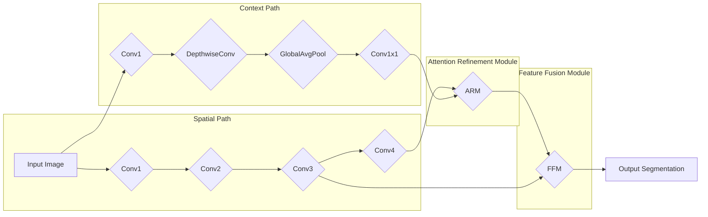

## 1. 背景介绍

### 1.1 语义分割任务的挑战

语义分割是计算机视觉领域的一项重要任务，其目标是将图像中的每个像素分配到预定义的语义类别。近年来，深度学习技术在语义分割任务中取得了显著的进展，涌现出许多优秀的模型，例如FCN、SegNet、DeepLab系列等。然而，这些模型往往需要大量的计算资源和时间来实现高精度分割，这限制了它们在实时应用场景中的应用。

### 1.2  BiSeNet的提出

为了解决语义分割任务中的效率和精度之间的矛盾，BiSeNet（Bilateral Segmentation Network）被提出。BiSeNet的核心思想是利用两个分支分别提取图像的低级细节信息和高级语义信息，然后将它们融合以实现高效且准确的语义分割。

### 1.3  BiSeNet的优势

* **高效性**: BiSeNet采用轻量级网络结构，在保证分割精度的前提下，显著降低了计算复杂度和推理时间。
* **高精度**: BiSeNet有效地融合了低级细节信息和高级语义信息，能够实现高精度的语义分割。
* **易于实现**: BiSeNet的网络结构简单易懂，易于实现和训练。

## 2. 核心概念与联系

### 2.1  空间路径（Spatial Path）

空间路径分支旨在提取图像的低级细节信息，例如边缘、纹理等。它采用轻量级卷积神经网络，例如 ResNet-18 或 MobileNetV2，并保留较高的空间分辨率，以捕获精细的细节信息。

### 2.2  语义路径（Context Path）

语义路径分支旨在提取图像的高级语义信息，例如类别、对象关系等。它采用深度可分离卷积和全局平均池化等操作，以降低计算复杂度并扩大感受野，从而捕获更丰富的语义信息。

### 2.3  注意力细化模块（Attention Refinement Module）

注意力细化模块用于融合空间路径和语义路径提取的特征。它采用注意力机制，根据语义信息对空间细节信息进行加权，从而提高分割精度。

### 2.4  特征融合模块（Feature Fusion Module）

特征融合模块将注意力细化模块的输出与空间路径的特征进行融合，生成最终的分割结果。

## 3. 核心算法原理具体操作步骤

### 3.1  BiSeNet的网络结构



### 3.2  空间路径的操作步骤

1. 输入图像经过一系列卷积层，提取低级细节特征。
2. 为了保持高分辨率，空间路径不使用池化操作。
3. 最后，输出特征图具有与输入图像相同的空间分辨率。

### 3.3  语义路径的操作步骤

1. 输入图像经过一系列卷积层，提取高级语义特征。
2. 使用深度可分离卷积降低计算复杂度。
3. 使用全局平均池化扩大感受野。
4. 最后，输出特征图具有较低的空间分辨率，但包含更丰富的语义信息。

### 3.4  注意力细化模块的操作步骤

1. 将空间路径和语义路径的特征图进行拼接。
2. 使用卷积层生成注意力权重。
3. 将注意力权重应用于空间路径的特征图，突出与语义信息相关的细节。

### 3.5  特征融合模块的操作步骤

1. 将注意力细化模块的输出与空间路径的特征图进行拼接。
2. 使用卷积层融合特征。
3. 最后，输出最终的分割结果。

## 4. 数学模型和公式详细讲解举例说明

### 4.1  深度可分离卷积

深度可分离卷积将标准卷积操作分解为深度卷积和逐点卷积两个步骤，可以有效降低计算复杂度。

**标准卷积:**

$$
O_{i,j,k} = \sum_{l=1}^{C_{in}} \sum_{m=1}^{K_h} \sum_{n=1}^{K_w} I_{i+m-1,j+n-1,l} \cdot W_{m,n,l,k}
$$

**深度可分离卷积:**

**深度卷积:**

$$
O_{i,j,l} = \sum_{m=1}^{K_h} \sum_{n=1}^{K_w} I_{i+m-1,j+n-1,l} \cdot W_{m,n,l}
$$

**逐点卷积:**

$$
O_{i,j,k} = \sum_{l=1}^{C_{in}} O_{i,j,l} \cdot W_{l,k}
$$

### 4.2  全局平均池化

全局平均池化将特征图的每个通道的所有值取平均，可以有效降低特征维度并扩大感受野。

$$
O_k = \frac{1}{H \times W} \sum_{i=1}^{H} \sum_{j=1}^{W} I_{i,j,k}
$$

### 4.3  注意力机制

注意力机制根据语义信息对空间细节信息进行加权，可以提高分割精度。

$$
O_{i,j,k} = \alpha_{i,j,k} \cdot I_{i,j,k}
$$

其中，$\alpha_{i,j,k}$ 是注意力权重，由语义路径的特征图计算得到。

## 5. 项目实践：代码实例和详细解释说明

### 5.1  环境搭建

* Python 3.6+
* PyTorch 1.7+
* OpenCV 4.5+

### 5.2  数据准备

下载 Cityscapes 数据集，并将其转换为 PyTorch 可读取的格式。

### 5.3  模型定义

```python
import torch
import torch.nn as nn
import torch.nn.functional as F

class SpatialPath(nn.Module):
    def __init__(self):
        super(SpatialPath, self).__init__()
        self.conv1 = nn.Conv2d(3, 64, kernel_size=7, stride=2, padding=3)
        self.conv2 = nn.Conv2d(64, 128, kernel_size=3, stride=2, padding=1)
        self.conv3 = nn.Conv2d(128, 256, kernel_size=3, stride=2, padding=1)
        self.conv4 = nn.Conv2d(256, 512, kernel_size=3, stride=1, padding=1)

    def forward(self, x):
        x = F.relu(self.conv1(x))
        x = F.relu(self.conv2(x))
        x = F.relu(self.conv3(x))
        x = F.relu(self.conv4(x))
        return x

class ContextPath(nn.Module):
    def __init__(self):
        super(ContextPath, self).__init__()
        self.conv1 = nn.Conv2d(3, 128, kernel_size=7, stride=2, padding=3)
        self.dwconv = nn.Sequential(
            nn.Conv2d(128, 128, kernel_size=3, stride=1, padding=1, groups=128),
            nn.Conv2d(128, 128, kernel_size=1, stride=1, padding=0)
        )
        self.avgpool = nn.AdaptiveAvgPool2d((1, 1))
        self.conv2 = nn.Conv2d(128, 128, kernel_size=1, stride=1, padding=0)

    def forward(self, x):
        x = F.relu(self.conv1(x))
        x = F.relu(self.dwconv(x))
        x = self.avgpool(x)
        x = F.relu(self.conv2(x))
        return x

class AttentionRefinementModule(nn.Module):
    def __init__(self, in_channels):
        super(AttentionRefinementModule, self).__init__()
        self.conv = nn.Conv2d(in_channels, 1, kernel_size=1, stride=1, padding=0)

    def forward(self, spatial_features, context_features):
        x = torch.cat([spatial_features, context_features], dim=1)
        attention = torch.sigmoid(self.conv(x))
        return spatial_features * attention

class FeatureFusionModule(nn.Module):
    def __init__(self, in_channels, out_channels):
        super(FeatureFusionModule, self).__init__()
        self.conv = nn.Conv2d(in_channels, out_channels, kernel_size=3, stride=1, padding=1)

    def forward(self, spatial_features, context_features):
        x = torch.cat([spatial_features, context_features], dim=1)
        x = F.relu(self.conv(x))
        return x

class BiSeNet(nn.Module):
    def __init__(self, num_classes):
        super(BiSeNet, self).__init__()
        self.spatial_path = SpatialPath()
        self.context_path = ContextPath()
        self.arm = AttentionRefinementModule(in_channels=512+128)
        self.ffm = FeatureFusionModule(in_channels=512+128, out_channels=num_classes)

    def forward(self, x):
        spatial_features = self.spatial_path(x)
        context_features = self.context_path(x)
        context_features = F.interpolate(context_features, size=spatial_features.size()[2:], mode='bilinear', align_corners=True)
        refined_features = self.arm(spatial_features, context_features)
        output = self.ffm(refined_features, spatial_features)
        return output
```

### 5.4  模型训练

```python
import torch
import torch.nn as nn
import torch.optim as optim
from torchvision import transforms
from torch.utils.data import DataLoader

# 定义超参数
batch_size = 16
learning_rate = 0.001
num_epochs = 100

# 定义数据变换
transform = transforms.Compose([
    transforms.ToTensor(),
    transforms.Normalize(mean=[0.485, 0.456, 0.406], std=[0.229, 0.224, 0.225])
])

# 加载数据集
train_dataset = Cityscapes(root='./data', split='train', mode='fine', target_type='semantic', transform=transform)
train_loader = DataLoader(train_dataset, batch_size=batch_size, shuffle=True)

# 定义模型
model = BiSeNet(num_classes=19)

# 定义损失函数和优化器
criterion = nn.CrossEntropyLoss()
optimizer = optim.Adam(model.parameters(), lr=learning_rate)

# 训练模型
for epoch in range(num_epochs):
    for i, (images, labels) in enumerate(train_loader):
        # 前向传播
        outputs = model(images)

        # 计算损失
        loss = criterion(outputs, labels)

        # 反向传播和优化
        optimizer.zero_grad()
        loss.backward()
        optimizer.step()

        # 打印训练信息
        if (i+1) % 10 == 0:
            print('Epoch [{}/{}], Step [{}/{}], Loss: {:.4f}'
                  .format(epoch+1, num_epochs, i+1, len(train_loader), loss.item()))

# 保存模型
torch.save(model.state_dict(), 'bisenet.pth')
```

### 5.5  模型评估

```python
import torch
import torch.nn as nn
from torchvision import transforms
from torch.utils.data import DataLoader

# 定义数据变换
transform = transforms.Compose([
    transforms.ToTensor(),
    transforms.Normalize(mean=[0.485, 0.456, 0.406], std=[0.229, 0.224, 0.225])
])

# 加载数据集
val_dataset = Cityscapes(root='./data', split='val', mode='fine', target_type='semantic', transform=transform)
val_loader = DataLoader(val_dataset, batch_size=1, shuffle=False)

# 加载模型
model = BiSeNet(num_classes=19)
model.load_state_dict(torch.load('bisenet.pth'))

# 评估模型
model.eval()
with torch.no_grad():
    for i, (images, labels) in enumerate(val_loader):
        # 前向传播
        outputs = model(images)

        # 计算指标
        # ...

        # 打印评估信息
        if (i+1) % 10 == 0:
            print('Step [{}/{}], mIoU: {:.4f}'
                  .format(i+1, len(val_loader), mIoU))
```

## 6. 实际应用场景

BiSeNet可以应用于各种实时语义分割场景，例如：

* **自动驾驶**: 用于道路分割、车辆检测、行人识别等。
* **机器人**: 用于场景理解、目标定位、路径规划等。
* **医学影像**: 用于肿瘤分割、器官识别、病灶检测等。
* **增强现实**: 用于虚拟物体放置、场景重建、图像编辑等。

## 7. 工具和资源推荐

* **PyTorch**: 深度学习框架
* **OpenCV**: 计算机视觉库
* **Cityscapes**: 语义分割数据集
* **BiSeNet论文**: https://arxiv.org/abs/1808.00897

## 8. 总结：未来发展趋势与挑战

### 8.1  未来发展趋势

* **轻量化**: 探索更轻量级的网络结构，以进一步提高效率。
* **多任务学习**: 将语义分割与其他任务（例如目标检测、实例分割）相结合，以提高模型的综合性能。
* **自监督学习**: 利用未标记数据进行模型训练，以降低对标注数据的依赖。

### 8.2  挑战

* **实时性**: 在保证精度的同时，进一步提高模型的推理速度。
* **泛化能力**: 提高模型在不同场景、不同数据集上的泛化能力。
* **鲁棒性**: 提高模型对噪声、遮挡等干扰因素的鲁棒性。

## 9. 附录：常见问题与解答

### 9.1  BiSeNet与其他语义分割模型相比有哪些优势？

BiSeNet的主要优势在于其高效性和高精度。与其他模型相比，BiSeNet采用轻量级网络结构，在保证分割精度的前提下，显著降低了计算复杂度和推理时间。

### 9.2  如何选择空间路径和语义路径的网络结构？

空间路径和语义路径的网络结构可以根据实际需求进行选择。一般来说，空间路径可以使用轻量级网络，例如 ResNet-18 或 MobileNetV2，以保持高分辨率。语义路径可以使用更深的网络，例如 ResNet-101，以提取更丰富的语义信息。

### 9.3  如何提高BiSeNet的分割精度？

可以通过以下方式提高BiSeNet的分割精度：

* 使用更深的网络结构
* 使用更大的训练数据集
* 使用数据增强技术
* 调整超参数

### 9.4  BiSeNet有哪些局限性？

BiSeNet的局限性在于：

* 对小目标的分割效果可能不如其他模型
* 对复杂场景的适应性可能不足
