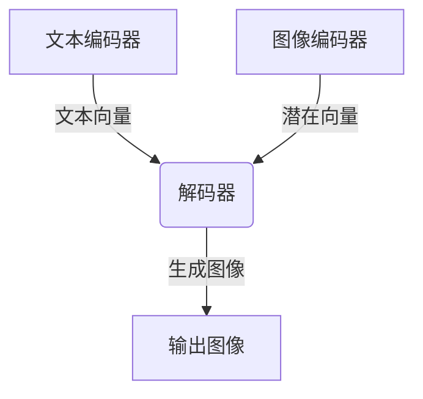

# DALL-E原理与代码实例讲解

## 1.背景介绍

### 1.1 人工智能与图像生成的发展历程

人工智能在过去几十年中取得了长足的进步,尤其是在计算机视觉和自然语言处理领域。图像生成技术作为人工智能的一个重要分支,也随着深度学习算法和计算能力的不断提高而不断发展。

早期的图像生成技术主要基于像素级别的生成对抗网络(Pixel-level Generative Adversarial Networks, GANs),如深度卷积生成对抗网络(Deep Convolutional GANs, DCGANs)。这些模型通过对抗训练的方式,学习图像的像素分布,从而生成新的图像。然而,这种方法存在模式崩溃(mode collapse)和生成图像质量不高等问题。

### 1.2 DALL-E的重大突破

2021年,OpenAI推出了DALL-E,这是一种全新的图像生成模型,能够根据自然语言描述生成高质量的图像。DALL-E的出现标志着人工智能图像生成技术的一个重大突破,引起了学术界和工业界的广泛关注。

DALL-E的核心创新在于将自然语言和图像联系起来,实现了从文本到图像的生成。它通过大规模的预训练,学习了文本和图像之间的联系,从而能够根据文本描述生成相应的图像。与传统的像素级别生成不同,DALL-E采用了一种新颖的方法,将图像分解为多个视觉概念(如物体、背景等),并根据文本描述生成每个视觉概念,最后将它们合成为最终的图像。

## 2.核心概念与联系

### 2.1 自注意力机制(Self-Attention)

自注意力机制是DALL-E的核心技术之一,它能够捕捉输入序列中不同位置之间的依赖关系。在DALL-E中,自注意力机制用于捕捉文本和图像之间的联系。

自注意力机制的工作原理如下:首先,将输入序列(文本或图像)映射为一系列向量表示。然后,对于每个向量,计算它与其他向量的相似度,得到一个注意力分数。最后,根据注意力分数对向量进行加权求和,得到该向量的新表示。通过这种方式,自注意力机制能够捕捉输入序列中任意两个位置之间的依赖关系。

在DALL-E中,自注意力机制被应用于文本编码器和图像解码器中,用于捕捉文本和图像之间的联系。具体来说,文本编码器利用自注意力机制捕捉文本中单词之间的依赖关系,生成文本的向量表示;图像解码器则利用自注意力机制捕捉生成图像中不同区域之间的依赖关系,并根据文本向量表示生成最终的图像。

### 2.2 变分自编码器(Variational Autoencoders, VAEs)

变分自编码器是另一个DALL-E的核心技术。它是一种生成模型,能够学习数据的潜在分布,并从该分布中采样生成新的数据。

变分自编码器由两个主要部分组成:编码器和解码器。编码器将输入数据(如图像)映射为潜在向量表示,而解码器则从潜在向量表示重构出原始数据。在训练过程中,变分自编码器通过最小化重构误差和潜在分布的KL散度,学习数据的潜在分布。

在DALL-E中,变分自编码器被用于图像编码和解码。具体来说,图像编码器将输入图像编码为潜在向量表示,而图像解码器则根据文本向量表示和潜在向量表示生成新的图像。通过这种方式,DALL-E能够捕捉图像的潜在语义,并根据文本描述生成新的图像。

### 2.3 transformer模型

Transformer是一种全新的序列到序列模型,由Google在2017年提出,主要用于自然语言处理任务。它完全基于自注意力机制,不再使用循环神经网络(RNNs)或卷积神经网络(CNNs)。

Transformer模型的主要优点是能够并行计算,从而提高计算效率。此外,它还能够有效地捕捉长距离依赖关系,克服了RNNs在处理长序列时容易出现梯度消失或爆炸的问题。

在DALL-E中,Transformer被用作文本编码器和图像解码器的主干网络。具体来说,文本编码器是一个标准的Transformer编码器,用于将文本编码为向量表示;而图像解码器则是一个修改过的Transformer解码器,用于根据文本向量表示和潜在向量表示生成图像。

## 3.核心算法原理具体操作步骤  

### 3.1 DALL-E的整体架构

DALL-E的整体架构如下图所示:

DALL-E的工作流程可以概括为以下几个步骤:

1. 文本编码器将输入文本编码为向量表示。
2. 图像编码器将输入图像编码为潜在向量表示。
3. 解码器根据文本向量表示和潜在向量表示生成新的图像。

接下来,我们将详细介绍每个模块的工作原理。

### 3.2 文本编码器

文本编码器的作用是将输入文本映射为向量表示,以捕捉文本的语义信息。DALL-E使用了一个标准的Transformer编码器作为文本编码器。

Transformer编码器由多个编码器层组成,每个编码器层包含两个子层:多头自注意力层和前馈网络层。自注意力层用于捕捉输入序列中不同位置之间的依赖关系,而前馈网络层则用于对每个位置的向量表示进行非线性变换。

文本编码器的工作过程如下:

1. 将输入文本tokenize为一系列token。
2. 将token映射为embedding向量。
3. 将embedding向量输入到Transformer编码器,经过多个编码器层的计算,得到文本的最终向量表示。

在DALL-E中,文本编码器的输出向量表示将被送入解码器,用于生成图像。

### 3.3 图像编码器

图像编码器的作用是将输入图像编码为潜在向量表示,以捕捉图像的语义和视觉信息。DALL-E使用了一个变分自编码器(VAE)作为图像编码器。

变分自编码器由两个主要部分组成:编码器和解码器。编码器将输入图像映射为潜在向量表示,而解码器则从潜在向量表示重构出原始图像。在训练过程中,VAE通过最小化重构误差和潜在分布的KL散度,学习图像的潜在分布。

图像编码器的工作过程如下:

1. 将输入图像输入到VAE的编码器中,得到图像的潜在向量表示。
2. 对潜在向量表示进行重参数化,以引入噪声,提高生成图像的多样性。

在DALL-E中,图像编码器的输出潜在向量表示将被送入解码器,与文本向量表示一同用于生成图像。

### 3.4 解码器

解码器是DALL-E的核心模块,它根据文本向量表示和潜在向量表示生成最终的图像。DALL-E使用了一个修改过的Transformer解码器作为解码器。

Transformer解码器与编码器类似,也由多个解码器层组成,每个解码器层包含三个子层:掩蔽多头自注意力层、编码器-解码器注意力层和前馈网络层。掩蔽多头自注意力层用于捕捉生成序列中不同位置之间的依赖关系,而编码器-解码器注意力层则用于关注输入序列(即文本向量表示和潜在向量表示)的不同部分。

解码器的工作过程如下:

1. 将文本向量表示和潜在向量表示连接,作为解码器的初始输入。
2. 解码器通过多个解码器层的计算,生成一系列向量表示,对应于生成图像的不同区域。
3. 将这些向量表示映射回像素空间,得到最终的图像。

在生成过程中,解码器采用自回归(autoregressive)的方式,逐步生成图像的不同区域。这种方式能够有效捕捉图像中不同区域之间的依赖关系,从而提高生成图像的质量。

## 4.数学模型和公式详细讲解举例说明

在介绍DALL-E的数学模型之前,我们先回顾一下自注意力机制和变分自编码器的数学原理。

### 4.1 自注意力机制

自注意力机制是Transformer模型的核心,它能够捕捉输入序列中不同位置之间的依赖关系。给定一个输入序列 $\boldsymbol{X} = (\boldsymbol{x}_1, \boldsymbol{x}_2, \ldots, \boldsymbol{x}_n)$,其中 $\boldsymbol{x}_i \in \mathbb{R}^{d_x}$ 表示第 $i$ 个位置的向量表示,自注意力机制的计算过程如下:

1. 线性投影:将输入序列映射为查询(Query)、键(Key)和值(Value)向量:

$$
\begin{aligned}
\boldsymbol{Q} &= \boldsymbol{X} \boldsymbol{W}^Q \\
\boldsymbol{K} &= \boldsymbol{X} \boldsymbol{W}^K \\
\boldsymbol{V} &= \boldsymbol{X} \boldsymbol{W}^V
\end{aligned}
$$

其中 $\boldsymbol{W}^Q \in \mathbb{R}^{d_x \times d_k}$, $\boldsymbol{W}^K \in \mathbb{R}^{d_x \times d_k}$, $\boldsymbol{W}^V \in \mathbb{R}^{d_x \times d_v}$ 分别表示查询、键和值的线性变换矩阵。

2. 计算注意力分数:对于每个查询向量 $\boldsymbol{q}_i$,计算它与所有键向量 $\boldsymbol{k}_j$ 的相似度,得到注意力分数 $\alpha_{ij}$:

$$
\alpha_{ij} = \frac{\exp(\boldsymbol{q}_i \cdot \boldsymbol{k}_j^{\top} / \sqrt{d_k})}{\sum_{l=1}^n \exp(\boldsymbol{q}_i \cdot \boldsymbol{k}_l^{\top} / \sqrt{d_k})}
$$

其中 $\sqrt{d_k}$ 是一个缩放因子,用于防止内积过大导致梯度饱和。

3. 加权求和:根据注意力分数对值向量进行加权求和,得到每个位置的新表示 $\boldsymbol{z}_i$:

$$
\boldsymbol{z}_i = \sum_{j=1}^n \alpha_{ij} \boldsymbol{v}_j
$$

通过这种方式,自注意力机制能够捕捉输入序列中任意两个位置之间的依赖关系,从而提高模型的表示能力。

### 4.2 变分自编码器

变分自编码器(VAE)是一种生成模型,能够学习数据的潜在分布,并从该分布中采样生成新的数据。VAE的核心思想是将数据 $\boldsymbol{x}$ 看作是一个潜在变量 $\boldsymbol{z}$ 的函数,即 $\boldsymbol{x} = f(\boldsymbol{z})$,其中 $f$ 是一个解码器(decoder)函数。

VAE的目标是最大化边际对数似然 $\log p(\boldsymbol{x})$,但由于后验分布 $p(\boldsymbol{z} | \boldsymbol{x})$ 通常难以计算,因此VAE引入了一个近似分布 $q(\boldsymbol{z} | \boldsymbol{x})$ 来近似后验分布。根据变分下界(variational lower bound),我们有:

$$
\log p(\boldsymbol{x}) \geq \mathbb{E}_{q(\boldsymbol{z} | \boldsymbol{x})}[\log p(\boldsymbol{x} | \boldsymbol{z})] - D_{\mathrm{KL}}(q(\boldsymbol{z} | \boldsymbol{x}) \| p(\boldsymbol{z}))
$$

其中 $p(\boldsymbol{x} | \boldsymbol{z})$ 是解码器的似然函数,而 $D_{\mathrm{K