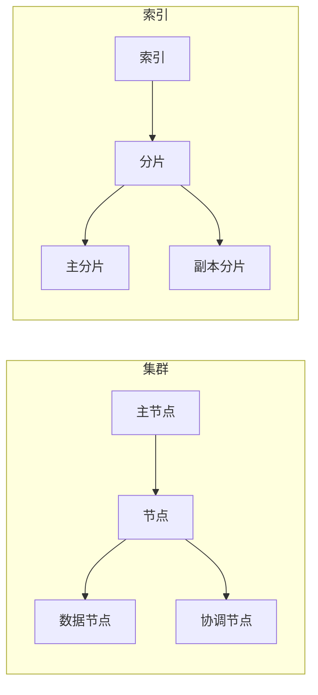

## 1. 背景介绍

### 1.1 Elasticsearch的诞生与发展

Elasticsearch是一款开源的分布式搜索和分析引擎，它的诞生源于对传统关系型数据库在海量数据检索方面效率低下的挑战。随着互联网和移动应用的快速发展，数据量呈爆炸式增长，传统数据库难以满足实时搜索、复杂分析的需求，Elasticsearch应运而生。

Elasticsearch基于Apache Lucene构建，提供了强大的全文搜索、结构化搜索、分析和可视化功能。它采用分布式架构，可以轻松地扩展到数百台服务器，处理PB级数据。Elasticsearch的易用性、高性能和可扩展性使其成为构建搜索、日志分析、数据可视化等应用的理想选择。

### 1.2 Elasticsearch的应用场景

Elasticsearch的应用场景广泛，涵盖了各个行业和领域，例如：

* **电商网站**: 用于商品搜索、推荐系统、用户行为分析等。
* **日志分析**: 用于收集、分析和可视化系统日志、应用日志、安全日志等。
* **数据分析**: 用于构建数据仓库、进行商业智能分析、数据挖掘等。
* **安全监控**: 用于实时监控安全事件、威胁情报分析、入侵检测等。

### 1.3 Elasticsearch的优势

Elasticsearch拥有众多优势，使其成为构建高性能、可扩展搜索和分析应用的首选：

* **高性能**: Elasticsearch采用倒排索引、缓存等技术，提供毫秒级的搜索响应速度。
* **可扩展性**: Elasticsearch采用分布式架构，可以轻松地扩展到数百台服务器，处理PB级数据。
* **易用性**: Elasticsearch提供RESTful API和易于使用的查询语言，方便用户快速上手。
* **丰富的功能**: Elasticsearch提供全文搜索、结构化搜索、分析、可视化等功能，满足各种应用场景的需求。
* **活跃的社区**: Elasticsearch拥有庞大而活跃的社区，提供丰富的文档、教程和支持。


## 2. 核心概念与联系

### 2.1 集群（Cluster）

Elasticsearch集群是由多个节点组成的分布式系统，它们协同工作，共同存储和处理数据。集群中的节点通过网络相互通信，共享数据和工作负载。

#### 2.1.1 集群状态

集群状态包含了集群中所有节点的信息，例如节点名称、IP地址、角色、分片分配等。集群状态由主节点维护，并定期同步到其他节点。

#### 2.1.2 主节点选举

集群需要一个主节点来协调集群的运作，例如创建索引、分配分片、监控节点状态等。主节点通过选举机制产生，通常是第一个启动的节点。

### 2.2 节点（Node）

节点是Elasticsearch集群的基本单元，它是一个独立的服务器，负责存储和处理数据。节点可以扮演不同的角色，例如主节点、数据节点、协调节点等。

#### 2.2.1 主节点（Master Node）

主节点负责管理集群状态，协调集群的运作，例如创建索引、分配分片、监控节点状态等。

#### 2.2.2 数据节点（Data Node）

数据节点负责存储和处理数据，响应搜索和索引请求。

#### 2.2.3 协调节点（Coordinating Node）

协调节点负责接收用户请求，并将请求转发到相应的数据节点，最终将结果返回给用户。

### 2.3 分片（Shard）

分片是Elasticsearch索引的最小逻辑单元，它包含一部分索引数据。每个分片都存储在一个节点上，可以是主分片或副本分片。

#### 2.3.1 主分片（Primary Shard）

主分片负责存储索引数据，响应索引请求。

#### 2.3.2 副本分片（Replica Shard）

副本分片是主分片的副本，用于提供数据冗余和高可用性。当主分片不可用时，副本分片可以接管主分片的职责。

### 2.4 核心概念联系图



## 3. 核心算法原理具体操作步骤

### 3.1 倒排索引（Inverted Index）

Elasticsearch使用倒排索引来实现高性能的全文搜索。倒排索引是一种数据结构，它将每个词映射到包含该词的文档列表。

#### 3.1.1 创建倒排索引

创建倒排索引的过程如下：

1. 对文档进行分词，将文档拆分成一个个词。
2. 对每个词建立索引，记录包含该词的文档ID和词频。
3. 将所有词的索引合并成一个倒排索引。

#### 3.1.2 搜索

当用户提交搜索请求时，Elasticsearch会根据倒排索引找到包含搜索词的文档列表，并根据相关性排序，最终返回给用户。

### 3.2 分片分配

Elasticsearch将索引数据分成多个分片，并将分片分配到集群中的不同节点上。分片分配的目的是为了提高数据可用性和查询性能。

#### 3.2.1 分片分配算法

Elasticsearch使用多种分片分配算法，例如：

* **轮询分配**: 将分片依次分配到不同的节点上。
* **基于节点属性分配**: 根据节点的属性，例如硬件配置、地理位置等，将分片分配到合适的节点上。

#### 3.2.2 分片均衡

Elasticsearch会定期检查集群中的分片分配情况，并进行分片均衡，以确保所有节点的负载均衡。

### 3.3 副本机制

Elasticsearch支持创建分片的副本，以提供数据冗余和高可用性。当主分片不可用时，副本分片可以接管主分片的职责。

#### 3.3.1 副本创建

当创建索引时，可以指定副本数量。Elasticsearch会自动创建指定数量的副本分片。

#### 3.3.2 副本同步

主分片会将数据同步到副本分片，以确保数据一致性。

#### 3.3.3 副本故障转移

当主分片不可用时，Elasticsearch会将其中一个副本分片提升为主分片，以保证数据可用性。

## 4. 数学模型和公式详细讲解举例说明

### 4.1 TF-IDF

TF-IDF (Term Frequency-Inverse Document Frequency) 是一种用于信息检索和数据挖掘的加权技术，它反映了一个词对于一个文档集或语料库中的一个文档的重要程度。

#### 4.1.1 TF (Term Frequency)

词频是指一个词在文档中出现的次数。

$$
TF(t,d) = \frac{f_{t,d}}{\sum_{t' \in d} f_{t',d}}
$$

其中，$f_{t,d}$ 表示词 $t$ 在文档 $d$ 中出现的次数。

#### 4.1.2 IDF (Inverse Document Frequency)

逆文档频率是指包含某个词的文档数的倒数的对数。

$$
IDF(t) = \log \frac{N}{df(t)}
$$

其中，$N$ 表示文档总数，$df(t)$ 表示包含词 $t$ 的文档数。

#### 4.1.3 TF-IDF

TF-IDF 是词频和逆文档频率的乘积。

$$
TF-IDF(t,d) = TF(t,d) \times IDF(t)
$$

#### 4.1.4 例子

假设有一个文档集包含 1000 篇文档，其中 100 篇文档包含词 "apple"，10 篇文档包含词 "banana"。

则 "apple" 的 IDF 为：

$$
IDF("apple") = \log \frac{1000}{100} = 1
$$

"banana" 的 IDF 为：

$$
IDF("banana") = \log \frac{1000}{10} = 2
$$

假设有一篇文档包含 5 次 "apple" 和 2 次 "banana"。

则 "apple" 的 TF-IDF 为：

$$
TF-IDF("apple") = \frac{5}{7} \times 1 = 0.71
$$

"banana" 的 TF-IDF 为：

$$
TF-IDF("banana") = \frac{2}{7} \times 2 = 0.57
$$

因此，"apple" 比 "banana" 对这篇文档更重要。

### 4.2 BM25

BM25 (Best Matching 25) 是一种用于信息检索的排序函数，它基于概率相关性模型，考虑了词频、文档长度和平均文档长度等因素。

#### 4.2.1 公式

$$
score(d,q) = \sum_{t \in q} IDF(t) \cdot \frac{f_{t,d} \cdot (k_1 + 1)}{f_{t,d} + k_1 \cdot (1 - b + b \cdot \frac{|d|}{avgdl})}
$$

其中：

* $d$ 表示文档
* $q$ 表示查询
* $t$ 表示查询词
* $f_{t,d}$ 表示词 $t$ 在文档 $d$ 中出现的次数
* $|d|$ 表示文档 $d$ 的长度
* $avgdl$ 表示所有文档的平均长度
* $k_1$ 和 $b$ 是可调参数，通常取值为 $k_1 = 1.2$ 和 $b = 0.75$

#### 4.2.2 例子

假设有一个文档集包含 1000 篇文档，平均文档长度为 1000 个词。查询 "apple banana"，其中 "apple" 在 100 篇文档中出现，"banana" 在 10 篇文档中出现。

假设有一篇文档包含 5 次 "apple" 和 2 次 "banana"，文档长度为 500 个词。

则 "apple" 的 BM25 分数为：

$$
score("apple") = 1 \cdot \frac{5 \cdot (1.2 + 1)}{5 + 1.2 \cdot (1 - 0.75 + 0.75 \cdot \frac{500}{1000})} = 1.63
$$

"banana" 的 BM25 分数为：

$$
score("banana") = 2 \cdot \frac{2 \cdot (1.2 + 1)}{2 + 1.2 \cdot (1 - 0.75 + 0.75 \cdot \frac{500}{1000})} = 1.74
$$

因此，"banana" 比 "apple" 对这篇文档更重要。

## 5. 项目实践：代码实例和详细解释说明

### 5.1 创建 Elasticsearch 集群

#### 5.1.1 安装 Elasticsearch

可以从 Elasticsearch 官网下载 Elasticsearch 的安装包，并按照官方文档进行安装。

#### 5.1.2 配置 Elasticsearch

Elasticsearch 的配置文件位于 `config/elasticsearch.yml`。可以根据需要修改配置文件，例如设置集群名称、节点角色、网络配置等。

#### 5.1.3 启动 Elasticsearch

执行 `bin/elasticsearch` 命令启动 Elasticsearch。

### 5.2 创建索引

#### 5.2.1 使用 REST API 创建索引

可以使用 Elasticsearch 的 REST API 创建索引。例如，以下代码使用 curl 命令创建一个名为 "my_index" 的索引：

```bash
curl -X PUT "http://localhost:9200/my_index" -H 'Content-Type: application/json' -d'
{
  "settings": {
    "number_of_shards": 1,
    "number_of_replicas": 0
  }
}
'
```

#### 5.2.2 使用 Elasticsearch 客户端创建索引

可以使用 Elasticsearch 的客户端库创建索引。例如，以下 Python 代码使用 Elasticsearch 的 Python 客户端库创建一个名为 "my_index" 的索引：

```python
from elasticsearch import Elasticsearch

es = Elasticsearch()

es.indices.create(index="my_index", body={
  "settings": {
    "number_of_shards": 1,
    "number_of_replicas": 0
  }
})
```

### 5.3 索引数据

#### 5.3.1 使用 REST API 索引数据

可以使用 Elasticsearch 的 REST API 索引数据。例如，以下代码使用 curl 命令索引一条文档到 "my_index" 索引：

```bash
curl -X POST "http://localhost:9200/my_index/_doc" -H 'Content-Type: application/json' -d'
{
  "title": "Elasticsearch Tutorial",
  "content": "This is a tutorial about Elasticsearch."
}
'
```

#### 5.3.2 使用 Elasticsearch 客户端索引数据

可以使用 Elasticsearch 的客户端库索引数据。例如，以下 Python 代码使用 Elasticsearch 的 Python 客户端库索引一条文档到 "my_index" 索引：

```python
from elasticsearch import Elasticsearch

es = Elasticsearch()

es.index(index="my_index", body={
  "title": "Elasticsearch Tutorial",
  "content": "This is a tutorial about Elasticsearch."
})
```

### 5.4 搜索数据

#### 5.4.1 使用 REST API 搜索数据

可以使用 Elasticsearch 的 REST API 搜索数据。例如，以下代码使用 curl 命令搜索 "Elasticsearch"：

```bash
curl -X GET "http://localhost:9200/my_index/_search" -H 'Content-Type: application/json' -d'
{
  "query": {
    "match": {
      "content": "Elasticsearch"
    }
  }
}
'
```

#### 5.4.2 使用 Elasticsearch 客户端搜索数据

可以使用 Elasticsearch 的客户端库搜索数据。例如，以下 Python 代码使用 Elasticsearch 的 Python 客户端库搜索 "Elasticsearch"：

```python
from elasticsearch import Elasticsearch

es = Elasticsearch()

results = es.search(index="my_index", body={
  "query": {
    "match": {
      "content": "Elasticsearch"
    }
  }
})

print(results)
```

## 6. 实际应用场景

### 6.1 电商网站

#### 6.1.1 商品搜索

电商网站可以使用 Elasticsearch 实现商品搜索功能。用户可以通过关键字、分类、价格等条件搜索商品。

#### 6.1.2 推荐系统

电商网站可以使用 Elasticsearch 构建推荐系统，根据用户的历史行为、兴趣爱好等信息推荐商品。

#### 6.1.3 用户行为分析

电商网站可以使用 Elasticsearch 分析用户的行为数据，例如浏览历史、购买记录、搜索记录等，以了解用户的需求和偏好。

### 6.2 日志分析

#### 6.2.1 系统日志分析

可以使用 Elasticsearch 收集和分析系统日志，例如服务器日志、应用日志、安全日志等，以监控系统运行状态、排查故障、进行安全审计等。

#### 6.2.2 应用日志分析

可以使用 Elasticsearch 收集和分析应用日志，例如用户行为日志、错误日志等，以了解应用运行情况、优化应用性能、排查故障等。

#### 6.2.3 安全日志分析

可以使用 Elasticsearch 收集和分析安全日志，例如防火墙日志、入侵检测系统日志等，以监控安全事件、进行威胁情报分析、入侵检测等。

### 6.3 数据分析

#### 6.3.1 数据仓库

可以使用 Elasticsearch 构建数据仓库，存储和分析来自多个数据源的数据，例如业务数据、用户行为数据、日志数据等。

#### 6.3.2 商业智能分析

可以使用 Elasticsearch 进行商业智能分析，例如销售分析、市场分析、客户分析等，以支持企业决策。

#### 6.3.3 数据挖掘

可以使用 Elasticsearch 进行数据挖掘，例如关联规则挖掘、聚类分析、异常检测等，以发现数据中的隐藏模式和规律。

## 7. 工具和资源推荐

### 7.1 Elasticsearch 官网

Elasticsearch 官网提供了丰富的文档、教程、博客等资源，可以帮助用户学习和使用 Elasticsearch。

### 7.2 Elasticsearch 论坛

Elasticsearch 论坛是一个活跃的社区，用户可以在论坛上提问、交流、分享经验。

### 7.3 Kibana

Kibana 是 Elasticsearch 的可视化工具，可以用于创建仪表盘、可视化数据、分析数据等。

### 7.4 Logstash

Logstash 是 Elasticsearch 的数据收集工具，可以用于收集、解析和转换来自多个数据源的数据，例如日志文件、数据库、消息队列等。

## 8. 总结：未来发展趋势与挑战

### 8.1 未来发展趋势

* **云原生**: Elasticsearch 将继续朝着云原生方向发展，提供更加灵活、便捷的云服务。
* **机器学习**: Elasticsearch 将集成更多的机器学习功能，例如异常检测、预测分析等，以提供更加智能化的搜索和分析服务。
* **数据湖**: Elasticsearch 将与数据湖技术深度融合，提供更加全面的数据存储、管理和分析能力。

### 8.2 挑战

* **数据安全**: 随着数据量的不断增长，数据安全问题日益突出，Elasticsearch 需要加强数据安全防护措施。
* **性能优化**: Elasticsearch 需要不断优化性能，以应对不断增长的数据量和查询需求。
* **生态建设**: Elasticsearch 需要不断完善生态系统，提供更加丰富的工具、插件和服务，以满足用户的多样化需求。

## 9. 附录：常见问题与解答

### 9.1 Elasticsearch 和 Solr 的区别是什么？

Elasticsearch 和 Solr 都是基于 Apache Lucene 构建的开源搜索引擎，但它们在功能、架构和应用场景上有所区别。

* **功能**: Elasticsearch 提供更加丰富的功能，例如聚合、分析、可视化等。Solr 在搜索功能上更加专注。
* **架构**: Elasticsearch