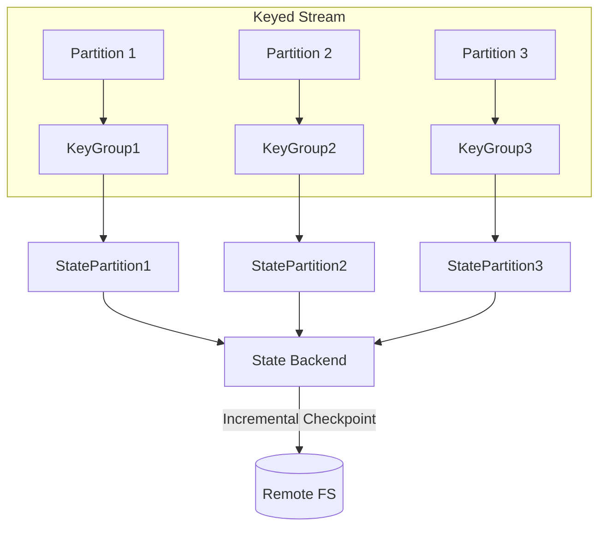
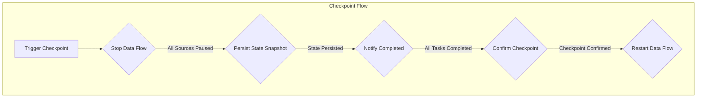

# Flink State状态管理原理与代码实例讲解

## 1.背景介绍

### 1.1 什么是有状态流处理？

在传统的批处理系统中，输入数据被视为一个静态的数据集，经过一次性处理后产生结果。然而，在现实世界中，数据通常是持续不断产生的，需要被实时处理和响应。有状态流处理(Stateful Stream Processing)应运而生，旨在高效地处理这种连续的、无边界的数据流。

有状态流处理系统能够对无限的数据流进行增量计算，根据流中的每个新事件更新结果，并维护计算所需的状态(State)。这种状态可以是窗口(Window)、计数器、机器学习模型等。与传统的无状态流处理系统相比，有状态流处理系统具有更强大的计算能力,可以支持更复杂的业务场景。

### 1.2 Flink 简介

Apache Flink 是一个开源的分布式流处理框架,最初由德国柏林大学的研究人员所开发。它为有状态的流处理提供了一个健壮且一致的基础,同时也支持传统的批处理。Flink 被设计为能够支持各种流处理场景,包括事件驱动应用、数据分析以及数据管道等。

Flink 的核心是一种称为 Streams 的数据处理模型,所有计算都被表示为对数据流进行转换的操作。它支持事件时间(Event Time)语义,能够基于事件发生的实际时间进行窗口操作,从而处理有延迟或者乱序到达的事件。另外,Flink 还提供了精确一次(Exactly-Once)的状态一致性保证,确保计算结果的正确性,即使在发生故障的情况下也不会丢失或重复计算。

### 1.3 状态管理的重要性

在有状态的流处理系统中,状态管理(State Management)是一个关键的基础设施。状态可以被视为流处理应用的"大脑",用于存储和维护计算所需的信息,如窗口数据、机器学习模型参数等。高效、可靠的状态管理对于支持复杂的计算逻辑和满足精确一次语义至关重要。

状态管理不仅涉及在内存中高效地存储和访问状态,还需要处理状态在分布式环境中的一致性问题。例如,当发生故障时,如何从最新一致的状态恢复计算;当需要扩展或缩小资源时,如何重新分区和迁移状态。此外,状态管理也需要考虑状态的生命周期管理、高可用性等方面。

Flink 为状态管理提供了一个健壮和高效的解决方案,使得开发人员能够专注于编写业务逻辑,而不必过多关注底层状态管理的细节。本文将详细介绍 Flink 状态管理的核心原理、实现方式以及实际应用示例,帮助读者深入理解这一重要的基础设施。

## 2.核心概念与联系

在深入探讨 Flink 状态管理的细节之前,我们需要先了解一些核心概念和它们之间的关系。

### 2.1 状态的类型

Flink 将状态分为以下几种类型:

#### 2.1.1 键控状态(Keyed State)

键控状态是根据键(key)来维护和访问的状态。它通常用于实现像窗口操作、连接、计数和聚合等数据驱动的计算。每个键都有自己独立的状态存储空间,状态的作用域是当前键。

键控状态又可分为以下几种:

- **ValueState**:用于存储单个值的状态,如机器学习模型权重等。
- **ListState**:用于存储无序的值集合,如窗口buffer。
- **MapState**:用于存储键值对集合。
- **ReducingState**:基于ReduceFunction定义的折叠状态。

#### 2.1.2 运算符状态(Operator State) 

运算符状态是与特定算子(Operator)相关的状态,跨越了所有数据流分区。常见的运算符状态包括:

- **ListState**:存储数据流分区的元数据,如偏移量等。
- **UnionListState**:存储来自不同数据源的元数据。
- **BroadcastState**:用于存储广播变量。

#### 2.1.3 原始状态(Raw State)

原始状态允许应用程序直接访问底层的状态后端,并自由读写字节和序列化数据。

### 2.2 状态后端(State Backends)

状态后端定义了状态的存储形式和访问方式。Flink 支持以下几种状态后端:

- **内存状态后端(MemoryStateBackend)**:状态存储在 JVM 堆内存中,性能最佳,但状态量有限制。
- **文件系统状态后端(FsStateBackend)**:状态存储在本地文件系统或远程文件系统中。
- **RocksDB 状态后端(RocksDBStateBackend)**:状态存储在嵌入式的 RocksDB 中,提供增量检查点和高吞吐。

### 2.3 容错机制

Flink 通过异步持久化状态的方式来实现容错和一致性保证,这个过程称为检查点(Checkpointing)。检查点可以让状态具有幂等性,在发生故障时可以从最近的一致状态恢复。

### 2.4 状态一致性

Flink 提供了精确一次(Exactly-Once)的状态一致性保证。这意味着即使在发生故障的情况下,每个事件也只会被处理一次,计算结果绝不会丢失或重复。

为了实现精确一次语义,Flink 采用了源头可重启(Source Replayable)和端到端的精确一次(End-to-End Exactly-Once)两种机制。前者保证从源头读取数据时不会丢失或重复;后者结合检查点和转换器(Sink)的幂等性,确保计算结果精确可重放。

## 3.核心算法原理具体操作步骤

### 3.1 键控状态实现原理

键控状态是 Flink 状态管理中最核心的部分,我们重点分析其实现原理。

键控状态的存储和访问遵循以下几个步骤:

1. **KeyedStream 分区**:KeyedStream 根据 KeySelector 将流数据划分为逻辑分区,每个分区对应一个键组(Key Group)。键组决定了状态的分布式存储位置。

2. **KeyGroup 映射**:键组通过散列函数映射到若干个状态分区(State Partition),状态分区是真正存储状态的物理分区。

3. **状态注册表**:每个算子任务(Task)都有一个状态注册表,用于注册和获取状态实例。

4. **状态序列化**:Flink 会为每种状态类型生成一个状态序列化器(State Serializer),用于将状态对象序列化为字节,存储到状态后端。

5. **状态存储**:根据配置的状态后端,将序列化后的状态存储到对应的介质(如内存、文件系统、RocksDB等)。

6. **检查点快照**:Flink 以增量的方式定期为状态制作快照,并持久化到远程文件系统,用于容错恢复。

下面是键控状态架构的示意图:



### 3.2 检查点算法

检查点是 Flink 实现容错和一致性的核心机制。我们来看一下检查点是如何工作的:

1. **检查点触发**:根据配置的时间间隔或数据条数,周期性地触发检查点。

2. **阶段一:暂停数据流**:所有的 Source 暂停数据的消费,同时阻止下游的数据传输,进入"准备好检查点"阶段。

3. **阶段二:持久化状态快照**:各个任务(Task)通过状态后端将当前状态数据持久化到远程文件系统,生成增量快照。

4. **阶段三:通知检查点完成**:当所有任务都完成状态持久化后,向 JobManager(或 Checkpoint Coordinator)通知检查点完成。

5. **阶段四:确认检查点**:当所有中间结果数据流都已经消费完成后,确认检查点并通知所有任务。

6. **阶段五:恢复数据流**:检查点确认后,所有任务重新开始数据流的消费和处理。

下面是检查点算法流程图:



上述算法保证了状态一致性,防止了数据丢失和重复计算。即使在发生故障的情况下,Flink 也可以从最近一次成功的检查点恢复计算,确保精确一次语义。

## 4.数学模型和公式详细讲解举例说明

在键控状态的实现中,Flink 使用了一种称为"键组(Key Group)"的技术,将状态分布式存储到多个物理分区中。我们用数学模型来描述这个过程。

假设有 $n$ 个并行的任务实例,每个实例都可以处理属于自己的键组的状态。我们用 $f$ 表示从键到键组的映射函数:

$$
f: Key \rightarrow \{0, 1, \cdots, k-1\}
$$

其中 $k$ 是键组的总数。映射函数 $f$ 通常是一个简单的散列函数,确保键组的分布尽量均匀。

键组和物理状态分区之间也存在映射关系 $g$:

$$
g: \{0, 1, \cdots, k-1\} \rightarrow \{0, 1, \cdots, n-1\}
$$

这样,给定一个键 $key$,我们可以先通过 $f$ 计算出它所属的键组 $i$,再通过 $g$ 找到对应的物理分区 $j$,从而定位状态的存储位置。整个过程可以表示为复合函数:

$$
h(key) = g(f(key))
$$

在实现中,Flink 默认将键组数 $k$ 设为最大并行度的 16 倍,即 $k = 16 \times \text{maxParallelism}$。这样做的目的是为了尽量减少数据移动,从而提高吞吐量。

当并行度发生变化时,Flink 会自动对状态进行重分区。假设原有并行度为 $n_1$,新的并行度为 $n_2$,重新定义新的映射函数 $g'$:

$$
g': \{0, 1, \cdots, k-1\} \rightarrow \{0, 1, \cdots, n_2-1\}
$$

Flink 会根据 $g$ 和 $g'$ 的不同,对应地重新分布状态分区,以确保状态的正确映射。

通过上述数学模型,我们可以清晰地理解 Flink 是如何高效地管理分布式状态的。合理的键组设计和状态重分区机制,确保了状态访问的性能和状态在并行实例之间的均衡分布。

## 4.项目实践:代码实例和详细解释说明

为了加深对 Flink 状态管理的理解,我们通过一个实际的代码示例来演示如何使用键控状态。这个例子实现了一个简单的点击流计数器,用于统计网页上的广告被点击的次数。

### 4.1 环境配置

首先,我们需要在项目中添加 Flink 的依赖:

```xml
<dependency>
    <groupId>org.apache.flink</groupId>
    <artifactId>flink-java</artifactId>
    <version>1.14.0</version>
</dependency>
<dependency>
    <groupId>org.apache.flink</groupId>
    <artifactId>flink-streaming-java_2.12</artifactId>
    <version>1.14.0</version>
</dependency>
```

### 4.2 数据模型

我们定义一个简单的 `AdClick` 类来表示广告点击事件:

```java