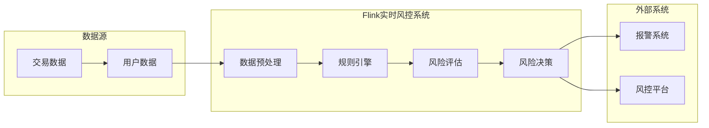

# Flink内存管理最佳实践:金融实时风控场景下的应用

作者：禅与计算机程序设计艺术

## 1. 背景介绍

### 1.1  实时风控的挑战与机遇

随着互联网金融的快速发展，金融欺诈、信用风险等问题日益突出，实时风控系统成为了保障金融安全的重要手段。实时风控系统需要在毫秒级别内对海量交易数据进行分析，识别潜在风险，并及时采取措施，这对系统的性能、吞吐量和实时性提出了极高的要求。

### 1.2  Flink在实时风控领域的优势

Apache Flink作为新一代的分布式流处理引擎，以其高吞吐、低延迟、容错性强等特点，在实时风控领域得到了广泛应用。Flink提供了丰富的API和灵活的编程模型，可以方便地实现各种复杂的业务逻辑。

### 1.3  内存管理的重要性

在Flink实时风控系统中，内存管理至关重要。合理地配置和管理内存，可以有效地提升系统性能，降低延迟，并避免内存溢出等问题。

## 2. 核心概念与联系

### 2.1  Flink内存模型

Flink的内存模型主要包括以下几个部分：

* **Network Buffers:** 用于网络数据传输的缓冲区，由TaskManager管理。
* **Managed Memory:** 由Flink管理的堆外内存，用于存储用户数据，例如状态、缓存等。
* **JVM Heap:** Java虚拟机堆内存，用于存储Java对象。

### 2.2  内存管理参数

Flink提供了丰富的内存管理参数，可以灵活地配置各个内存区域的大小，例如：

* `taskmanager.memory.flink.managed.size`：Managed Memory的大小。
* `taskmanager.memory.network.fraction`：Network Buffers占TaskManager总内存的比例。
* `taskmanager.memory.jvm.heap.size`：JVM Heap的大小。

### 2.3  内存管理工具

Flink提供了一些工具来帮助用户监控和分析内存使用情况，例如：

* **Flink Web UI:** 提供了内存使用情况的图形化界面。
* **Metrics:** 可以收集和监控各种内存指标。
* **Heap Dump:** 可以导出JVM Heap的快照，用于分析内存泄漏等问题。

## 3. 核心算法原理具体操作步骤

### 3.1  Managed Memory的分配与回收

Managed Memory采用堆外内存，由Flink统一管理，避免了JVM垃圾回收的影响。Flink使用MemorySegment来管理Managed Memory，每个MemorySegment的大小为32KB。当用户需要分配内存时，Flink会从MemoryManager申请一个或多个MemorySegment，并将这些MemorySegment分配给用户。当用户不再需要这些内存时，Flink会将这些MemorySegment回收，并返还给MemoryManager。

### 3.2  Network Buffers的分配与回收

Network Buffers用于网络数据传输，由TaskManager管理。TaskManager会根据网络流量动态地调整Network Buffers的大小。当网络流量较大时，TaskManager会分配更多的Network Buffers，以保证数据传输的效率。当网络流量较小时，TaskManager会回收一些Network Buffers，以释放内存空间。

### 3.3  JVM Heap的垃圾回收

JVM Heap的垃圾回收由JVM负责。Flink使用G1垃圾回收器，可以有效地回收大堆内存，并减少垃圾回收的停顿时间。

## 4. 数学模型和公式详细讲解举例说明

### 4.1  Managed Memory占用量估算

Managed Memory的占用量主要取决于状态的大小和缓存的大小。假设状态的大小为S，缓存的大小为C，则Managed Memory的占用量可以估算为：

```
Managed Memory = S + C
```

### 4.2  Network Buffers占用量估算

Network Buffers的占用量主要取决于网络流量和数据传输速率。假设网络流量为R，数据传输速率为V，则Network Buffers的占用量可以估算为：

```
Network Buffers = R / V
```

### 4.3  JVM Heap占用量估算

JVM Heap的占用量主要取决于Java对象的数量和大小。假设Java对象的数量为N，平均大小为S，则JVM Heap的占用量可以估算为：

```
JVM Heap = N * S
```

## 5. 项目实践：代码实例和详细解释说明

### 5.1  实时风控系统架构



### 5.2  代码实例

```java
// 设置Managed Memory的大小
env.getConfig().setManagedMemorySize(1024 * 1024 * 1024); // 1GB

// 设置Network Buffers的大小
env.getConfig().setNetworkMemoryFraction(0.2); // 20%

// 设置JVM Heap的大小
env.getConfig().setJVMHeapMemory(512 * 1024 * 1024); // 512MB
```

### 5.3  详细解释说明

* `env.getConfig().setManagedMemorySize(1024 * 1024 * 1024)`：设置Managed Memory的大小为1GB。
* `env.getConfig().setNetworkMemoryFraction(0.2)`：设置Network Buffers占TaskManager总内存的比例为20%。
* `env.getConfig().setJVMHeapMemory(512 * 1024 * 1024)`：设置JVM Heap的大小为512MB。

## 6. 实际应用场景

### 6.1  交易欺诈检测

实时风控系统可以用于检测交易欺诈行为，例如盗刷、洗钱等。系统可以根据交易金额、交易时间、交易地点等信息，识别出异常交易，并及时采取措施，防止损失扩大。

### 6.2  信用风险评估

实时风控系统可以用于评估用户的信用风险，例如贷款逾期风险、信用卡欺诈风险等。系统可以根据用户的历史交易记录、信用评分等信息，评估用户的信用等级，并根据信用等级制定不同的风控策略。

### 6.3  反洗钱

实时风控系统可以用于反洗钱，例如识别可疑交易、追踪资金流向等。系统可以根据交易金额、交易对手、交易频率等信息，识别出可疑交易，并及时上报监管部门。

## 7. 工具和资源推荐

### 7.1  Flink官网

Flink官网提供了丰富的文档、教程和示例代码，可以帮助用户快速入门和掌握Flink。

### 7.2  Flink社区

Flink社区是一个活跃的技术社区，用户可以在社区中交流经验、解决问题、获取帮助。

### 7.3  相关书籍

* **《Flink基础教程》**
* **《Flink实战》**
* **《Stream Processing with Apache Flink》**

## 8. 总结：未来发展趋势与挑战

### 8.1  未来发展趋势

* **云原生化:** Flink将更加紧密地与云平台集成，提供更加便捷的部署和运维体验。
* **AI赋能:** Flink将更加智能化，利用AI技术提升风控系统的效率和准确性。
* **实时化:** Flink将继续提升实时处理能力，满足更加苛刻的实时性要求。

### 8.2  挑战

* **海量数据处理:**  Flink需要处理越来越多的数据，这对系统的性能和吞吐量提出了更高的要求。
* **复杂业务逻辑:**  Flink需要支持更加复杂的业务逻辑，这对系统的灵活性和可扩展性提出了更高的要求。
* **安全性和可靠性:**  Flink需要保证系统的安全性和可靠性，这对系统的容错性和安全性提出了更高的要求。

## 9. 附录：常见问题与解答

### 9.1  如何选择合适的Managed Memory大小？

Managed Memory的大小应该根据状态的大小和缓存的大小来确定。如果状态和缓存较大，则需要分配更多的Managed Memory。

### 9.2  如何选择合适的Network Buffers大小？

Network Buffers的大小应该根据网络流量和数据传输速率来确定。如果网络流量较大，则需要分配更多的Network Buffers。

### 9.3  如何避免内存溢出？

* 合理地配置内存参数，避免内存过度分配。
* 监控内存使用情况，及时发现内存泄漏等问题。
* 优化代码，减少内存占用。
