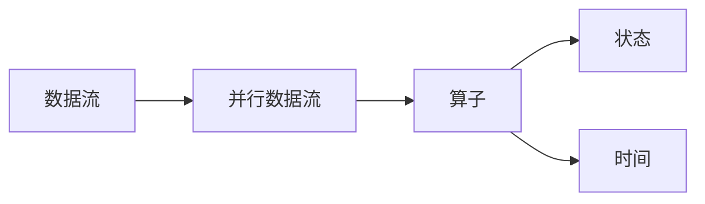

## 1. 背景介绍

### 1.1 大数据时代的流处理需求

随着互联网和物联网的快速发展，数据量呈爆炸式增长，传统的批处理框架已经无法满足实时性要求高的业务需求。流处理技术应运而生，它能够实时地处理和分析连续不断的数据流，为企业提供更及时、更准确的决策支持。

### 1.2 流处理框架的演进

早期的流处理框架，如Storm和Spark Streaming，在实时性和容错性方面存在一定的局限性。Apache Flink的出现，标志着流处理技术进入了一个新的阶段。Flink是一个分布式流处理框架，它具有高吞吐、低延迟、高容错等特点，能够满足各种流处理场景的需求。

### 1.3 Flink的优势与特点

* **高吞吐、低延迟：**Flink能够处理每秒数百万个事件，并且延迟可以控制在毫秒级别。
* **高容错性：**Flink支持精确一次的状态一致性，即使发生故障也能保证数据不丢失。
* **灵活的窗口机制：**Flink提供了多种窗口机制，可以根据时间、计数或会话等方式对数据流进行分组和聚合。
* **丰富的API和库：**Flink提供了丰富的API和库，支持SQL、DataStream、DataSet等多种编程模型。
* **易于集成：**Flink可以与Hadoop、Kafka、Elasticsearch等大数据生态系统无缝集成。

## 2. 核心概念与联系

### 2.1 数据流模型

Flink将数据抽象为数据流，数据流是由无限个数据元素组成的序列。数据元素可以是任何类型，例如字符串、数字、传感器读数等。

### 2.2 并行数据流

Flink将数据流划分为多个并行数据流，并在多个节点上并行处理。每个并行数据流由一个或多个算子组成。

### 2.3 算子

算子是Flink中处理数据流的基本单元，它接收一个或多个输入数据流，并产生一个或多个输出数据流。常见的算子包括map、filter、keyBy、reduce、window等。

### 2.4 状态和时间

Flink支持状态管理，可以存储和更新数据流的中间结果。Flink还支持事件时间和处理时间，可以根据事件发生的实际时间或处理事件的时间来进行窗口操作。

### 2.5 核心概念联系图



## 3. 核心算法原理具体操作步骤

### 3.1 窗口计算

窗口计算是流处理中常用的操作，它将数据流按照时间、计数或会话等方式进行分组，并在每个窗口内进行聚合计算。

#### 3.1.1 窗口类型

Flink支持多种窗口类型，包括：

* **滚动窗口（Tumbling Window）：**将数据流划分为固定大小、不重叠的窗口。
* **滑动窗口（Sliding Window）：**将数据流划分为固定大小、部分重叠的窗口。
* **会话窗口（Session Window）：**根据数据流中元素的间隔时间来划分窗口。
* **全局窗口（Global Window）：**将整个数据流作为一个窗口。

#### 3.1.2 窗口函数

窗口函数用于对窗口内的数据进行聚合计算，常见的窗口函数包括：

* **sum：**计算窗口内所有元素的总和。
* **min：**计算窗口内所有元素的最小值。
* **max：**计算窗口内所有元素的最大值。
* **count：**计算窗口内元素的个数。
* **reduce：**使用自定义函数对窗口内元素进行聚合。

### 3.2 状态管理

Flink支持状态管理，可以存储和更新数据流的中间结果。状态可以存储在内存或磁盘中。

#### 3.2.1 状态类型

Flink支持多种状态类型，包括：

* **值状态（Value State）：**存储单个值，例如计数器或最新值。
* **列表状态（List State）：**存储一个列表，例如所有访问过的用户ID。
* **映射状态（Map State）：**存储一个映射，例如每个用户ID对应的访问次数。

#### 3.2.2 状态后端

Flink支持多种状态后端，包括：

* **内存状态后端：**将状态存储在内存中，速度快，但容量有限。
* **RocksDB状态后端：**将状态存储在磁盘上，容量大，但速度较慢。

## 4. 数学模型和公式详细讲解举例说明

### 4.1 窗口计算公式

滚动窗口的计算公式如下：

```
窗口大小 = T
窗口起始时间 = t - (t mod T)
窗口结束时间 = 窗口起始时间 + T
```

其中，t表示当前时间，T表示窗口大小。

例如，如果窗口大小为5分钟，当前时间为10:03，则窗口起始时间为10:00，窗口结束时间为10:05。

### 4.2 状态更新公式

值状态的更新公式如下：

```
新值 = f(旧值, 输入值)
```

其中，f表示状态更新函数，旧值表示状态的当前值，输入值表示输入数据流中的元素。

例如，如果状态存储的是计数器，状态更新函数可以是f(x, y) = x + y，则每当输入数据流中出现一个元素时，计数器就会加1。

## 5. 项目实践：代码实例和详细解释说明

### 5.1 WordCount示例

WordCount是一个经典的流处理示例，它统计数据流中每个单词出现的次数。

```java
public class WordCount {

    public static void main(String[] args) throws Exception {

        // 创建执行环境
        StreamExecutionEnvironment env = StreamExecutionEnvironment.getExecutionEnvironment();

        // 从socket读取数据流
        DataStream<String> text = env.socketTextStream("localhost", 9999);

        // 将数据流转换为单词流
        DataStream<Tuple2<String, Integer>> counts = text.flatMap(new FlatMapFunction<String, Tuple2<String, Integer>>() {
            @Override
            public void flatMap(String value, Collector<Tuple2<String, Integer>> out) throws Exception {
                String[] words = value.toLowerCase().split("\\s+");
                for (String word : words) {
                    out.collect(new Tuple2<>(word, 1));
                }
            }
        })
        // 按单词分组
        .keyBy(0)
        // 统计每个单词出现的次数
        .sum(1);

        // 打印结果
        counts.print();

        // 执行程序
        env.execute("WordCount");
    }
}
```

### 5.2 代码解释

* **创建执行环境：**`StreamExecutionEnvironment.getExecutionEnvironment()`用于创建Flink的执行环境。
* **从socket读取数据流：**`env.socketTextStream("localhost", 9999)`用于从socket读取数据流。
* **将数据流转换为单词流：**`flatMap`算子用于将数据流中的每个字符串转换为多个单词。
* **按单词分组：**`keyBy(0)`用于按单词分组。
* **统计每个单词出现的次数：**`sum(1)`用于统计每个单词出现的次数。
* **打印结果：**`counts.print()`用于打印结果。
* **执行程序：**`env.execute("WordCount")`用于执行程序。

## 6. 实际应用场景

### 6.1 实时数据分析

Flink可以用于实时数据分析，例如网站流量分析、用户行为分析、传感器数据分析等。

### 6.2 欺诈检测

Flink可以用于欺诈检测，例如信用卡欺诈、保险欺诈等。

### 6.3 风险管理

Flink可以用于风险管理，例如信用风险评估、市场风险分析等。

### 6.4 物联网

Flink可以用于物联网，例如智能家居、智慧城市等。

## 7. 工具和资源推荐

### 7.1 Apache Flink官网

[https://flink.apache.org/](https://flink.apache.org/)

### 7.2 Flink中文社区

[https://flink.org.cn/](https://flink.org.cn/)

### 7.3 Flink书籍

* 《Flink原理、实战与性能优化》
* 《Flink实战》

## 8. 总结：未来发展趋势与挑战

### 8.1 未来发展趋势

* **云原生Flink：**Flink将更加紧密地与云平台集成，提供更便捷的部署和管理方式。
* **人工智能与Flink：**Flink将与人工智能技术深度融合，支持更智能的流处理应用。
* **流批一体化：**Flink将进一步发展流批一体化能力，提供统一的平台来处理流式和批处理数据。

### 8.2 面临的挑战

* **性能优化：**随着数据量的不断增长，Flink需要不断优化性能，以满足更苛刻的实时性要求。
* **生态建设：**Flink需要构建更完善的生态系统，吸引更多开发者和用户。
* **安全性和可靠性：**Flink需要提高安全性和可靠性，以确保数据安全和应用稳定性。

## 9. 附录：常见问题与解答

### 9.1 Flink和Spark Streaming的区别是什么？

Flink和Spark Streaming都是流处理框架，但它们在架构、API和性能方面存在一些区别。

* **架构：**Flink采用原生流处理架构，而Spark Streaming采用微批处理架构。
* **API：**Flink提供更丰富的API，支持SQL、DataStream、DataSet等多种编程模型。
* **性能：**Flink的性能通常优于Spark Streaming，尤其是在低延迟和高吞吐方面。

### 9.2 如何选择Flink的状态后端？

选择Flink的状态后端需要考虑以下因素：

* **数据量：**如果数据量很大，建议使用RocksDB状态后端。
* **性能要求：**如果对性能要求很高，建议使用内存状态后端。
* **成本：**RocksDB状态后端需要额外的存储成本。

### 9.3 如何进行Flink性能优化？

Flink性能优化可以从以下几个方面入手：

* **数据倾斜：**使用keyBy算子时，需要注意数据倾斜问题。
* **反压：**监控Flink的反压情况，并及时调整参数。
* **状态管理：**选择合适的状态后端，并优化状态访问效率。