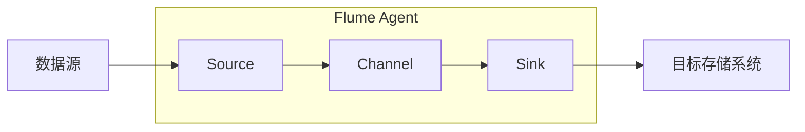

## 1. 背景介绍

### 1.1 大数据时代的数据采集挑战

随着互联网和物联网的快速发展，全球数据量呈指数级增长，我们正处于一个前所未有的“大数据”时代。海量数据的产生为各行各业带来了前所未有的机遇和挑战。如何高效、可靠地采集、存储和分析这些数据，成为了企业和组织面临的关键问题。

### 1.2 Flume：分布式日志收集系统

Apache Flume 是一个分布式、可靠、可用的系统，用于高效地收集、聚合和移动大量日志数据。它具有灵活的架构和丰富的插件生态系统，支持从各种数据源（如网络设备、应用程序日志、传感器数据等）收集数据，并将数据传输到各种目标存储系统（如 HDFS、HBase、Kafka 等）。

### 1.3 Flume Source：数据采集的入口

Flume Source 是 Flume 的数据采集组件，负责从各种数据源读取数据并将数据转换为 Flume 事件（event）。Flume 提供了丰富的 Source 类型，以支持不同类型的数据源和采集方式，例如：

* **Exec Source:**  从标准输入或文件读取数据。
* **Spooling Directory Source:** 监控指定目录下的新文件，并将文件内容作为数据源。
* **Kafka Source:** 从 Kafka 主题读取数据。
* **HTTP Source:** 接收 HTTP 请求并将请求体作为数据源。
* **NetCat Source:** 监听 TCP 端口，并将接收到的数据作为数据源。

## 2. 核心概念与联系

### 2.1 Flume Agent

Flume Agent 是 Flume 的基本工作单元，负责实际的数据采集、处理和传输工作。一个 Flume Agent 由 Source、Channel 和 Sink 三个核心组件组成：

* **Source:** 负责从数据源读取数据，并将数据转换为 Flume 事件。
* **Channel:** 作为 Source 和 Sink 之间的缓冲区，用于临时存储 Flume 事件。
* **Sink:** 负责将 Flume 事件传输到目标存储系统。

一个 Flume Agent 可以包含多个 Source、Channel 和 Sink，这些组件之间通过配置进行连接，形成一个数据流管道。

### 2.2 Flume Event

Flume Event 是 Flume 中数据传输的基本单元，它包含两部分内容：

* **Headers:** 一组键值对，用于存储事件的元数据信息，例如事件的时间戳、来源等。
* **Body:** 事件的实际数据内容，可以是任意字节序列。

### 2.3 Flume Source 生命周期

Flume Source 的生命周期可以概括为以下几个步骤：

1. **初始化:**  Source 初始化配置参数，并建立与数据源的连接。
2. **读取数据:**  Source 从数据源读取数据，并将数据转换为 Flume Event。
3. **发送事件:**  Source 将 Flume Event 发送到 Channel。
4. **关闭:**  Source 关闭与数据源的连接，并释放资源。

## 3. 核心算法原理具体操作步骤

### 3.1 Source 类型选择

Flume 提供了丰富的 Source 类型，选择合适的 Source 类型是成功进行数据采集的关键。选择 Source 类型时需要考虑以下因素：

* **数据源类型:**  例如，如果数据源是文件系统，则可以选择 Spooling Directory Source；如果数据源是 Kafka，则可以选择 Kafka Source。
* **数据格式:**  例如，如果数据格式是 JSON，则可以选择 JSON Handler；如果数据格式是 Avro，则可以选择 Avro Handler。
* **数据采集方式:**  例如，如果需要实时采集数据，则可以选择 Exec Source 或 NetCat Source；如果需要定期采集数据，则可以选择 Spooling Directory Source。

### 3.2 Source 配置

选择 Source 类型后，需要对其进行配置，包括以下参数：

* **数据源连接信息:**  例如，文件路径、Kafka broker 地址、HTTP 服务器地址等。
* **数据格式:**  例如，JSON、Avro、CSV 等。
* **数据采集方式:**  例如，轮询间隔、批量大小等。
* **事件处理逻辑:**  例如，添加时间戳、过滤数据等。

### 3.3 数据读取与事件转换

Source 负责从数据源读取数据，并将数据转换为 Flume Event。数据读取和事件转换过程可以根据 Source 类型的不同而有所区别，但一般包括以下步骤：

1. **读取数据:**  Source 从数据源读取数据，例如从文件中读取一行文本、从 Kafka 主题读取一条消息等。
2. **解析数据:**  Source 解析数据，提取需要的信息，例如从 JSON 字符串中提取字段值、从 Avro 记录中提取字段值等。
3. **构建事件:**  Source 构建 Flume Event，包括设置事件 headers 和 body。
4. **发送事件:**  Source 将 Flume Event 发送到 Channel。

### 3.4  Source 监控与管理

Flume 提供了监控和管理 Source 的机制，包括：

* **JMX:**  可以通过 JMX 监控 Source 的运行状态，例如读取数据量、发送事件数等。
* **Web UI:**  Flume 提供了 Web UI，可以查看 Source 的配置信息和运行状态。
* **日志:**  Flume 会记录 Source 的运行日志，可以用于故障排查。


## 4. 数学模型和公式详细讲解举例说明

Flume Source 本身不涉及复杂的数学模型或公式。然而，在实际应用中，我们可能需要根据具体的数据源和采集需求，对 Source 进行定制化开发，这时就可能需要用到一些数学模型和公式。

例如，假设我们需要采集网络设备的流量数据，并计算每分钟的平均流量。我们可以开发一个自定义的 Source，使用滑动窗口算法来计算平均流量。滑动窗口算法的基本原理是维护一个固定大小的窗口，随着时间的推移，窗口不断向前滑动，并计算窗口内数据的统计值。

```python
import time

class SlidingWindow:
    def __init__(self, window_size):
        self.window_size = window_size
        self.data = []

    def add(self, value):
        self.data.append((time.time(), value))
        if len(self.data) > self.window_size:
            self.data.pop(0)

    def average(self):
        if not self.
            return 0
        total = 0
        for _, value in self.
            total += value
        return total / len(self.data)

# 示例用法
window = SlidingWindow(60)  # 窗口大小为 60 秒

while True:
    # 获取网络设备的流量数据
    traffic = get_traffic_data()

    # 将流量数据添加到滑动窗口
    window.add(traffic)

    # 计算平均流量
    average_traffic = window.average()

    # 打印平均流量
    print(f"Average traffic: {average_traffic}")

    # 等待 1 秒
    time.sleep(1)
```

## 5. 项目实践：代码实例和详细解释说明

### 5.1  Spooling Directory Source 实例

以下是一个使用 Spooling Directory Source 采集文件数据的 Flume 配置文件示例：

```properties
# Name the components on this agent
agent.sources = spoolDir
agent.sinks = hdfsSink
agent.channels = memoryChannel

# Describe/configure the source
agent.sources.spoolDir.type = spooldir
agent.sources.spoolDir.spoolDir = /path/to/spool/dir
agent.sources.spoolDir.fileHeader = true
agent.sources.spoolDir.fileSuffix = .COMPLETED

# Describe/configure the sink
agent.sinks.hdfsSink.type = hdfs
agent.sinks.hdfsSink.hdfs.path = hdfs://namenode:8020/flume/events/%y-%m-%d/%H%M/%S
agent.sinks.hdfsSink.hdfs.fileType = DataStream

# Describe/configure the channel
agent.channels.memoryChannel.type = memory
agent.channels.memoryChannel.capacity = 10000
agent.channels.memoryChannel.transactionCapacity = 1000

# Bind the source and sink to the channel
agent.sources.spoolDir.channels = memoryChannel
agent.sinks.hdfsSink.channel = memoryChannel
```

**配置参数说明:**

* **spoolDir:**  监控的目录路径。
* **fileHeader:**  是否包含文件头信息。
* **fileSuffix:**  处理完成后添加的文件后缀。
* **hdfs.path:**  HDFS 目标路径。
* **hdfs.fileType:**  HDFS 文件类型，可以是 DataStream 或 SequenceFile。
* **capacity:**  Channel 的容量。
* **transactionCapacity:**  Channel 事务的容量。

### 5.2  Kafka Source 实例

以下是一个使用 Kafka Source 采集 Kafka 消息的 Flume 配置文件示例：

```properties
# Name the components on this agent
agent.sources = kafkaSource
agent.sinks = loggerSink
agent.channels = memoryChannel

# Describe/configure the source
agent.sources.kafkaSource.type = org.apache.flume.source.kafka.KafkaSource
agent.sources.kafkaSource.kafka.bootstrap.servers = kafka-broker1:9092,kafka-broker2:9092,kafka-broker3:9092
agent.sources.kafkaSource.kafka.topics = test-topic
agent.sources.kafkaSource.kafka.consumer.group.id = flume-consumer
agent.sources.kafkaSource.kafka.consumer.timeout.ms = 1000

# Describe/configure the sink
agent.sinks.loggerSink.type = logger

# Describe/configure the channel
agent.channels.memoryChannel.type = memory
agent.channels.memoryChannel.capacity = 10000
agent.channels.memoryChannel.transactionCapacity = 1000

# Bind the source and sink to the channel
agent.sources.kafkaSource.channels = memoryChannel
agent.sinks.loggerSink.channel = memoryChannel
```

**配置参数说明:**

* **kafka.bootstrap.servers:**  Kafka broker 地址列表。
* **kafka.topics:**  订阅的 Kafka 主题列表。
* **kafka.consumer.group.id:**  消费者组 ID。
* **kafka.consumer.timeout.ms:**  消费者超时时间。

## 6. 实际应用场景

### 6.1 日志收集与分析

Flume 广泛应用于日志收集和分析场景，例如：

* **Web 服务器日志收集:**  收集 Web 服务器访问日志，用于分析用户行为、网站性能等。
* **应用程序日志收集:**  收集应用程序运行日志，用于监控应用程序性能、排查故障等。
* **安全日志收集:**  收集安全设备日志，用于检测安全威胁、分析攻击行为等。

### 6.2  传感器数据采集

Flume 可以用于采集各种传感器数据，例如：

* **温度传感器:**  采集温度数据，用于环境监测、设备监控等。
* **湿度传感器:**  采集湿度数据，用于农业、工业生产等。
* **压力传感器:**  采集压力数据，用于石油化工、机械制造等。

### 6.3  社交媒体数据采集

Flume 可以用于采集社交媒体数据，例如：

* **Twitter 数据:**  采集 Twitter 推文，用于舆情监测、市场分析等。
* **Facebook 数据:**  采集 Facebook 用户信息、帖子等，用于社交网络分析、广告推荐等。

## 7. 工具和资源推荐

### 7.1 Apache Flume 官网

Apache Flume 官网提供了丰富的文档、教程和示例，是学习和使用 Flume 的最佳资源：

> https://flume.apache.org/

### 7.2  Flume 源代码

Flume 源代码托管在 Apache Git 仓库，可以下载源代码进行学习和研究：

> https://github.com/apache/flume

### 7.3  Flume 社区

Flume 有一个活跃的社区，可以在社区论坛、邮件列表等寻求帮助和交流经验：

> https://flume.apache.org/community.html

## 8. 总结：未来发展趋势与挑战

### 8.1  云原生 Flume

随着云计算的快速发展，云原生 Flume 成为未来发展趋势之一。云原生 Flume 可以更好地与云平台集成，提供更高的可扩展性和弹性。

### 8.2  边缘计算与 Flume

边缘计算的兴起为 Flume 带来了新的应用场景。Flume 可以部署在边缘设备上，用于实时采集和处理数据，减少数据传输延迟。

### 8.3  机器学习与 Flume

机器学习可以用于优化 Flume 的性能和效率，例如：

* **自动配置:**  使用机器学习自动优化 Flume 配置参数，提高数据采集效率。
* **异常检测:**  使用机器学习检测 Flume 运行过程中的异常，及时预警和处理。

## 9. 附录：常见问题与解答

### 9.1  Flume 如何保证数据可靠性？

Flume 通过 Channel 组件来保证数据可靠性。Channel 作为 Source 和 Sink 之间的缓冲区，可以防止数据丢失。Flume 提供了多种 Channel 类型，例如：

* **Memory Channel:**  将数据存储在内存中，速度快，但容量有限。
* **File Channel:**  将数据存储在磁盘文件中，容量大，但速度较慢。
* **Kafka Channel:**  将数据存储在 Kafka 主题中，兼具速度和容量优势。

### 9.2  Flume 如何实现高可用性？

Flume 可以通过配置多个 Agent 来实现高可用性。多个 Agent 可以组成一个集群，共同完成数据采集任务。当一个 Agent 故障时，其他 Agent 可以接管其工作，保证数据采集不间断。

### 9.3  Flume 如何处理数据丢失？

Flume 提供了数据丢失处理机制，例如：

* **重试:**  当 Sink 无法写入数据时，Flume 会尝试重新发送数据。
* **故障转移:**  当一个 Sink 故障时，Flume 可以将数据发送到其他 Sink。
* **数据回放:**  当数据丢失时，可以使用 Flume 的数据回放功能重新采集丢失的数据。


## 10.  核心概念原理和架构的 Mermaid流程图


