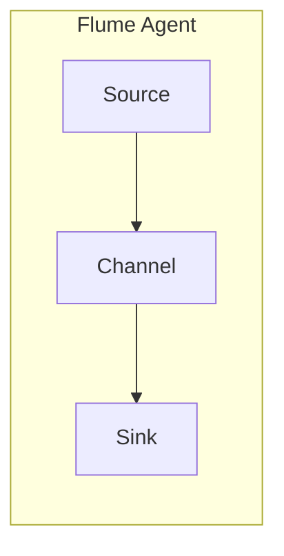
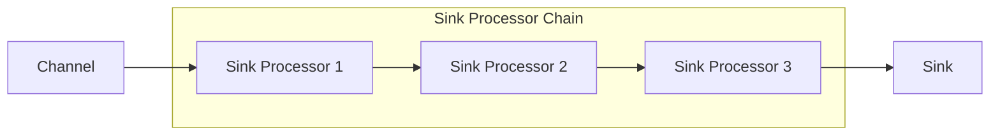

# Flume日志收集系统原理与代码实例讲解

## 1.背景介绍

### 1.1 日志收集的重要性

在当今数据驱动的世界中,日志数据扮演着至关重要的角色。日志记录着系统、应用程序和用户活动的详细信息,为故障排查、性能优化和商业智能分析提供了宝贵的数据源。然而,随着系统规模和复杂性的不断增长,有效地收集、传输和存储大量日志数据已成为一项巨大的挑战。

传统的日志收集方式通常依赖于每台机器上的日志代理程序,将日志数据发送到中央日志服务器。但这种方式存在一些明显的缺陷:

1. **可扩展性差**: 随着机器数量的增加,中央日志服务器很容易成为瓶颈。
2. **可靠性低**: 如果单点故障发生在中央日志服务器或网络中,整个日志收集系统将瘫痪。
3. **管理复杂**: 需要在每台机器上安装和配置日志代理程序,维护成本高。

为了解决这些问题,Apache Flume应运而生。它是一个分布式、可靠且高可用的日志收集系统,旨在高效地收集、聚合和移动大量日志数据。

### 1.2 Flume的设计目标

Flume的主要设计目标包括:

1. **可靠性**: Flume使用事务性的数据流管道,确保数据在传输过程中不会丢失。
2. **容错性**: Flume支持故障转移和故障恢复机制,确保系统的高可用性。
3. **扩展性**: Flume采用分布式架构,可以轻松扩展以处理大量日志数据。
4. **灵活性**: Flume支持多种数据源和数据目的地,可以轻松集成到现有的基础设施中。
5. **简单性**: Flume提供了简单易用的配置和管理接口,降低了运维成本。

## 2.核心概念与联系

### 2.1 Flume的核心组件

Flume由以下三个核心组件组成:

1. **Source(源)**: 从外部系统中消费数据,例如日志文件、网络流或其他数据源。
2. **Channel(通道)**: 一个事务性的可靠传输通道,用于临时存储来自Source的数据。
3. **Sink(汇)**: 将数据从Channel中移除,并将其传输到下一个目的地,如HDFS或其他外部系统。

这三个组件通过构建数据流管道的方式协同工作,确保日志数据可以从各种来源流向多个目的地。

```mermaid
graph LR
    subgraph Flume Agent
        Source1[Source 1] --> Channel1[Channel]
        Channel1 --> Sink1[Sink 1]
        Channel1 --> Sink2[Sink 2]
        Source2[Source 2] --> Channel1
    end
    Source1 --> |Log Data|
    Sink1 --> |HDFS|
    Sink2 --> |Kafka|
```

上图展示了一个典型的Flume数据流管道。Source从外部系统(如日志文件或网络流)中消费数据,并将其存储到Channel中。Sink从Channel中取出数据,并将其传输到下游系统(如HDFS或Kafka)。一个Flume Agent可以包含多个Source、Channel和Sink,形成复杂的数据流拓扑结构。

### 2.2 Flume事件

在Flume中,日志数据被封装为一个个Flume事件(Flume Event)。一个Flume事件由以下三个部分组成:

1. **Headers(头部)**: 一组键值对,用于存储事件的元数据信息。
2. **Body(主体)**: 实际的日志数据,以字节数组的形式存储。
3. **Channels(通道)**: 事件所属的通道信息。

Flume事件在整个数据流管道中被传递和处理,直到最终被Sink写入目的地系统。

### 2.3 Flume Agent

Flume Agent是Flume的基本执行单元,由一个Source、一个Channel和一个或多个Sink组成。每个Flume Agent都是一个独立的进程,可以在物理机或虚拟机上运行。

Flume Agent的工作流程如下:

1. Source从外部系统中消费数据,并将其封装成Flume事件。
2. Source将Flume事件存储到Channel中。
3. Sink从Channel中取出Flume事件。
4. Sink将Flume事件发送到下一个目的地。



多个Flume Agent可以组成一个复杂的数据流拓扑结构,实现日志数据从多个源头流向多个目的地的需求。

## 3.核心算法原理具体操作步骤

### 3.1 Flume事务机制

为了确保数据在传输过程中不会丢失,Flume采用了事务性的数据流管道。每个Source、Channel和Sink都实现了事务接口,以确保数据在整个管道中的一致性和可靠性。

Flume事务机制的工作流程如下:

1. Source从外部系统中消费数据,并将其封装成一个事务批次(Transaction Batch)。
2. Source将事务批次存储到Channel中,并开启一个通道事务。
3. 如果事务成功提交,数据将被Channel持久化;否则,事务将被回滚,数据被丢弃。
4. Sink从Channel中获取事务批次,并将其发送到下一个目的地。
5. 如果数据成功发送,Sink将提交事务;否则,事务将被回滚,数据保留在Channel中,等待重新发送。

这种事务机制确保了数据在整个管道中的一致性和可靠性,即使出现故障,也不会导致数据丢失。

### 3.2 Channel选择器

Channel选择器(Channel Selector)是Flume中一个重要的组件,它决定了Source将数据发送到哪个Channel。Flume提供了多种Channel选择器策略,可以根据具体需求进行选择:

1. **Replicating Channel Selector**: 将事件复制到所有配置的Channel中。
2. **Multiplexing Channel Selector**: 根据事件头部信息或负载均衡策略,将事件分发到不同的Channel中。
3. **Custom Channel Selector**: 用户可以实现自定义的Channel选择器,以满足特殊需求。

选择合适的Channel选择器策略对于优化Flume的性能和可靠性至关重要。例如,对于需要高可用性的场景,可以使用Replicating Channel Selector将数据复制到多个Channel中,以实现故障转移和故障恢复。

### 3.3 Sink处理器链

Sink处理器链(Sink Processor Chain)是Flume中另一个重要的概念。它允许在Sink将数据发送到目的地之前,对数据进行一系列的处理操作。

Sink处理器链由一个或多个Sink处理器(Sink Processor)组成,每个处理器执行特定的操作,如数据转换、过滤或路由。处理器可以按顺序或并行执行,具体取决于配置。



Sink处理器链提供了一种灵活的方式来处理和转换日志数据,使其能够满足不同的需求。例如,可以使用处理器链对日志数据进行解析、丰富或压缩,以优化存储和传输效率。

## 4.数学模型和公式详细讲解举例说明

在Flume中,没有直接涉及复杂的数学模型或公式。然而,我们可以从性能优化的角度,讨论一下Flume中的吞吐量和延迟模型。

### 4.1 吞吐量模型

Flume的吞吐量(Throughput)是指每秒可以处理的事件数量。它受多个因素的影响,包括源数据速率、Channel容量、Sink处理能力等。

假设我们有一个简单的Flume管道,包含一个Source、一个Channel和一个Sink。我们可以将吞吐量建模为:

$$
Throughput = min(SourceRate, ChannelCapacity, SinkRate)
$$

其中:

- $SourceRate$ 表示源数据的输入速率,以事件/秒为单位。
- $ChannelCapacity$ 表示Channel的容量,以事件/秒为单位。
- $SinkRate$ 表示Sink的处理速率,以事件/秒为单位。

在理想情况下,我们希望这三个因素相等,以实现最大吞吐量。但在实际场景中,通常会存在瓶颈,导致吞吐量受到限制。

例如,如果源数据速率远高于Channel容量和Sink处理能力,那么Channel将很快填满,导致Source被阻塞,无法继续接收数据。相反,如果Sink处理能力远低于源数据速率和Channel容量,那么Channel将积压大量事件,导致延迟增加。

因此,优化Flume吞吐量的关键是识别并消除瓶颈,平衡源数据速率、Channel容量和Sink处理能力。

### 4.2 延迟模型

Flume的延迟(Latency)是指一个事件从被Source消费到被Sink处理并写入目的地的时间。延迟通常由以下几个部分组成:

$$
Latency = SourceDelay + ChannelDelay + SinkDelay
$$

其中:

- $SourceDelay$ 表示Source消费数据并将其存储到Channel的延迟。
- $ChannelDelay$ 表示事件在Channel中等待被Sink取出的延迟。
- $SinkDelay$ 表示Sink从Channel取出事件并将其写入目的地的延迟。

在理想情况下,我们希望延迟尽可能小,以确保日志数据的实时性。但在实际场景中,延迟通常受到多个因素的影响,例如网络延迟、磁盘I/O延迟、CPU负载等。

例如,如果Channel容量设置过小,导致事件在Channel中积压,那么$ChannelDelay$将显著增加。相反,如果Sink处理能力过低,那么$SinkDelay$将成为瓶颈。

因此,优化Flume延迟的关键是识别并消除延迟瓶颈,平衡Source、Channel和Sink的处理能力,并根据具体场景进行合理的配置和调优。

## 4.项目实践:代码实例和详细解释说明

在本节中,我们将通过一个实际的代码示例,演示如何使用Flume收集和传输日志数据。我们将构建一个简单的Flume管道,从本地文件系统中读取日志数据,并将其写入HDFS。

### 4.1 环境准备

在开始之前,请确保您已经正确安装并配置了以下软件:

- Apache Flume
- Java Development Kit (JDK)
- Apache Hadoop (HDFS)

### 4.2 配置Flume代理

首先,我们需要配置Flume代理(Flume Agent)。创建一个名为`flume.conf`的配置文件,内容如下:

```properties
# 定义Source
agent.sources = src
agent.sources.src.type = exec
agent.sources.src.command = tail -F /path/to/log/file.log

# 定义Channel
agent.channels = ch
agent.channels.ch.type = file
agent.channels.ch.checkpointDir = /path/to/flume/checkpoint
agent.channels.ch.dataDirs = /path/to/flume/data

# 定义Sink
agent.sinks = sink
agent.sinks.sink.type = hdfs
agent.sinks.sink.hdfs.path = hdfs://namenode:8020/flume/events
agent.sinks.sink.hdfs.fileType = DataStream
agent.sinks.sink.hdfs.writeFormat = TEXT
agent.sinks.sink.hdfs.rollInterval = 30
agent.sinks.sink.hdfs.rollSize = 1024
agent.sinks.sink.hdfs.rollCount = 10

# 将Source和Sink绑定到Channel
agent.sources.src.channels = ch
agent.sinks.sink.channel = ch
```

在这个配置文件中,我们定义了以下组件:

1. **Source**: 一个`exec`类型的Source,用于从本地文件系统中读取日志文件。
2. **Channel**: 一个`file`类型的Channel,用于临时存储事件。
3. **Sink**: 一个`hdfs`类型的Sink,用于将事件写入HDFS。

请注意,您需要根据实际情况替换以下路径:

- `/path/to/log/file.log`: 您要收集的日志文件路径。
- `/path/to/flume/checkpoint`: Flume的检查点目录,用于存储事务状态。
- `/path/to/flume/data`: Flume的数据目录,用于存