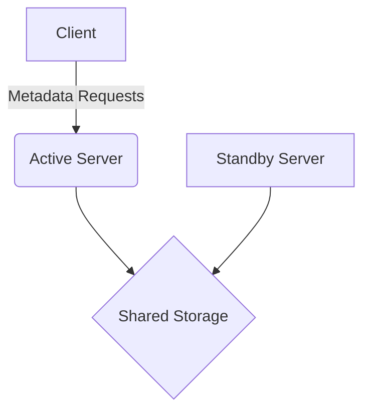
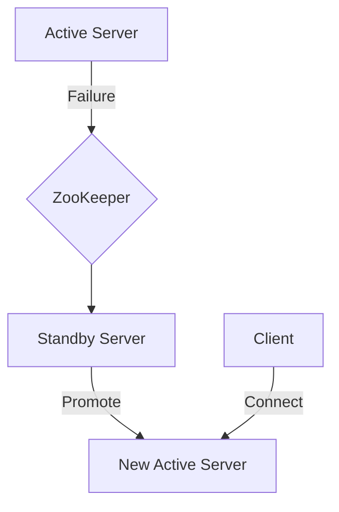
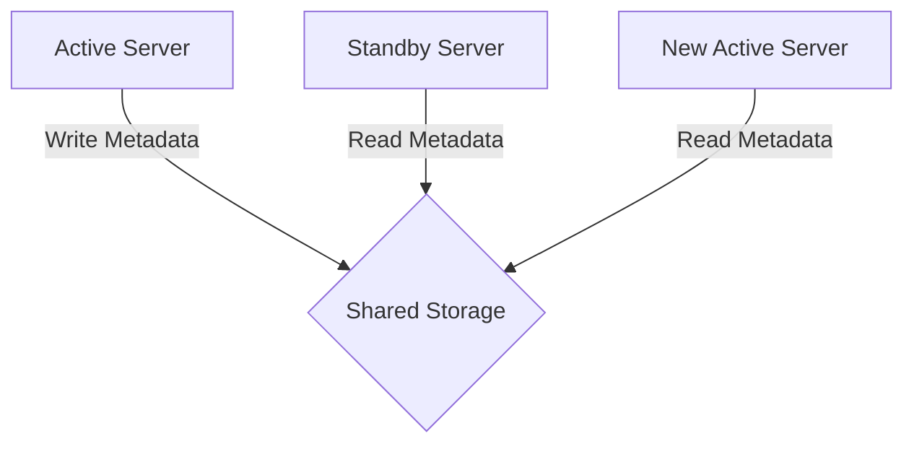
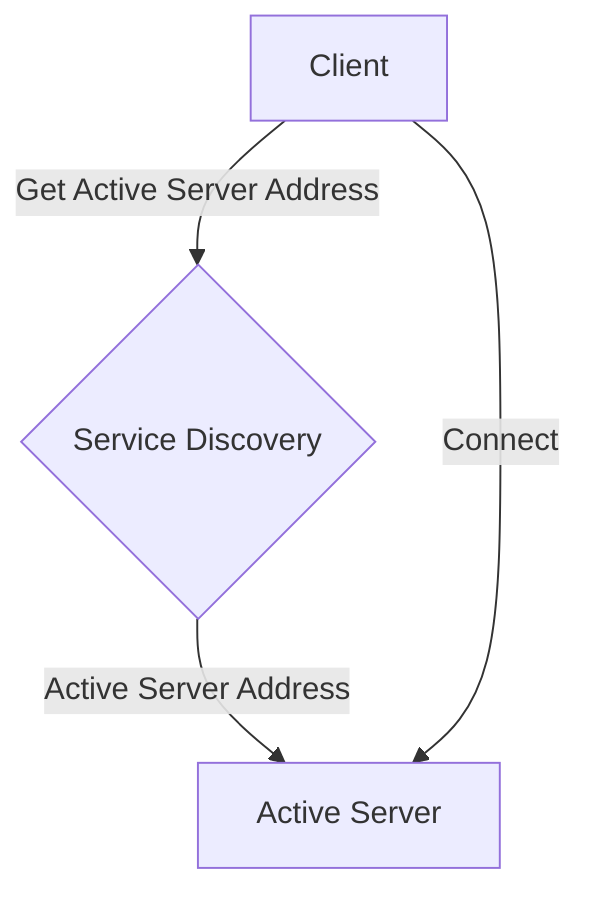

# HCatalog高可用性：保障数据服务稳定运行

## 1.背景介绍

### 1.1 数据服务的重要性

在当今数字时代,数据已经成为企业的核心资产之一。无论是传统行业还是新兴领域,数据都扮演着至关重要的角色。企业依赖数据来洞察市场趋势、优化运营流程、制定战略决策等。因此,确保数据服务的高可用性对于企业的持续运营至关重要。

### 1.2 数据服务可用性挑战

然而,由于各种原因,数据服务可能会面临中断或故障的风险。硬件故障、软件错误、网络问题、人为操作失误等都可能导致数据服务不可用。这不仅会影响企业的日常运营,还可能造成严重的经济损失和声誉损害。

### 1.3 HCatalog简介

Apache HCatalog是一个存储管理层,用于提供统一的数据抽象,从而简化了对不同数据源的访问。它是Apache Hadoop生态系统中的一个关键组件,为各种数据处理工具(如Pig、Hive、MapReduce等)提供了元数据服务。HCatalog的高可用性对于确保数据服务的稳定运行至关重要。

## 2.核心概念与联系

### 2.1 高可用性概念

高可用性(High Availability,HA)是指系统能够在一定时间内保持可操作和可访问的能力。具有高可用性的系统能够在发生故障时快速恢复,从而最大限度地减少服务中断时间。

### 2.2 HCatalog高可用性的重要性

作为Hadoop生态系统中的关键组件,HCatalog的高可用性对整个大数据平台的稳定运行至关重要。如果HCatalog服务出现中断,那么依赖它的所有数据处理工具(如Hive、Pig等)都将无法正常工作,从而影响整个数据处理管道的运行。

### 2.3 HCatalog高可用性与其他组件的关系

HCatalog高可用性与Hadoop生态系统中其他组件的高可用性密切相关。例如,HDFS的高可用性NameNode和YARN的高可用性ResourceManager都对HCatalog的高可用性产生影响。因此,确保HCatalog高可用性需要与其他组件的高可用性策略相协调。

## 3.核心算法原理具体操作步骤

### 3.1 HCatalog元数据服务器架构

HCatalog的元数据服务器采用主备架构,由一个活动服务器(Active Server)和一个备用服务器(Standby Server)组成。活动服务器负责处理所有的元数据请求,而备用服务器则处于热备状态,随时准备接管活动服务器的工作。



### 3.2 故障切换机制

当活动服务器发生故障时,备用服务器会自动接管并成为新的活动服务器。这种故障切换过程通常由一个外部组件(如ZooKeeper)来协调和管理。

1. 监控活动服务器的健康状态
2. 检测到活动服务器故障
3. 通知备用服务器接管角色
4. 备用服务器成为新的活动服务器
5. 客户端自动连接到新的活动服务器



### 3.3 元数据同步机制

为了确保在故障切换过程中不会丢失数据,HCatalog采用了共享存储来存储元数据。活动服务器和备用服务器都可以访问这个共享存储,并且会定期将元数据写入到共享存储中。

在故障切换过程中,新的活动服务器会从共享存储中读取最新的元数据,从而确保元数据的一致性和完整性。这种机制确保了即使发生故障切换,数据也不会丢失或损坏。



### 3.4 客户端连接管理

HCatalog客户端需要与活动服务器建立连接以发送元数据请求。当发生故障切换时,客户端需要自动重新连接到新的活动服务器。

这通常通过使用服务发现机制(如ZooKeeper)来实现。客户端可以从服务发现机制获取当前活动服务器的地址,并自动建立新的连接。这种机制确保了客户端始终连接到正确的活动服务器,从而保证了服务的连续性。



## 4.数学模型和公式详细讲解举例说明

在讨论HCatalog高可用性时,我们需要考虑一些与可用性相关的指标和公式。这些指标可以帮助我们量化和评估系统的可用性水平。

### 4.1 可用性公式

可用性(Availability)是指系统在给定时间内保持可操作和可访问的能力。它可以用以下公式表示:

$$
可用性 = \frac{系统可用时间}{总时间} = \frac{总时间 - 停机时间}{总时间}
$$

其中,总时间通常被定义为一个较长的时间段,如一年或一个季度。停机时间是指系统由于计划内维护或意外故障而无法提供服务的时间。

### 4.2 平均故障间隔时间(MTTF)

平均故障间隔时间(Mean Time To Failure,MTTF)是指系统在两次连续故障之间的平均运行时间。它可以用以下公式表示:

$$
MTTF = \frac{总运行时间}{故障次数}
$$

MTTF越高,说明系统故障发生的频率越低,可靠性越高。

### 4.3 平均修复时间(MTTR)

平均修复时间(Mean Time To Repair,MTTR)是指系统从发生故障到恢复正常运行所需的平均时间。它可以用以下公式表示:

$$
MTTR = \frac{总修复时间}{故障次数}
$$

MTTR越低,说明系统故障可以被更快地修复,从而减少停机时间。

### 4.4 可用性与MTTF和MTTR的关系

可用性与MTTF和MTTR之间存在以下关系:

$$
可用性 = \frac{MTTF}{MTTF + MTTR}
$$

通过提高MTTF(减少故障发生频率)和降低MTTR(加快故障修复速度),我们可以显著提高系统的可用性。

在设计和优化HCatalog高可用性架构时,我们需要关注这些指标,并采取适当的措施来提高MTTF和降低MTTR,从而达到更高的可用性水平。

## 4.项目实践:代码实例和详细解释说明

在本节中,我们将通过一个实际项目来演示如何实现HCatalog的高可用性。我们将使用Apache ZooKeeper作为协调服务,并基于共享存储来实现元数据同步。

### 4.1 环境准备

首先,我们需要准备以下环境:

- Hadoop集群(包括HDFS和YARN)
- ZooKeeper集群
- 共享存储(如NFS或HDFS)

确保这些组件都已正确配置和启动。

### 4.2 配置HCatalog服务器

接下来,我们需要配置HCatalog服务器。我们将使用两个节点,一个作为活动服务器,另一个作为备用服务器。

在每个节点上,我们需要修改`hcatalog-server.xml`配置文件,添加以下内容:

```xml
<property>
  <name>hcatalog.failover.controller.servers</name>
  <value>zookeeper1:2181,zookeeper2:2181,zookeeper3:2181</value>
</property>
<property>
  <name>hcatalog.failover.controller.active.server</name>
  <value>active-server-hostname</value>
</property>
<property>
  <name>hcatalog.failover.controller.standby.server</name>
  <value>standby-server-hostname</value>
</property>
<property>
  <name>hcatalog.failover.controller.shared.storage</name>
  <value>hdfs://namenode:8020/path/to/shared/storage</value>
</property>
```

这些配置项指定了ZooKeeper集群的地址、活动服务器和备用服务器的主机名,以及共享存储的路径。

### 4.3 启动HCatalog服务器

接下来,我们可以启动HCatalog服务器。在活动服务器节点上执行以下命令:

```bash
$ bin/hcatalog-server.sh start
```

在备用服务器节点上执行以下命令:

```bash
$ bin/hcatalog-server.sh start-standby
```

现在,HCatalog服务器已经启动,并处于高可用性模式。

### 4.4 测试故障切换

为了测试故障切换机制,我们可以模拟活动服务器的故障。在活动服务器节点上,执行以下命令:

```bash
$ bin/hcatalog-server.sh stop
```

这将停止活动服务器。您应该能够在备用服务器节点的日志中看到类似以下的消息:

```
INFO FailoverController: Becoming active server
```

这表示备用服务器已经成功接管,成为新的活动服务器。

现在,您可以尝试使用HCatalog客户端连接到新的活动服务器,并执行一些操作来验证服务是否正常运行。

### 4.5 故障恢复

在故障修复后,您可以在原始活动服务器节点上重新启动HCatalog服务器:

```bash
$ bin/hcatalog-server.sh start
```

此时,该节点将成为新的备用服务器,并从共享存储中读取最新的元数据。

通过这个实例,我们演示了如何配置和运行HCatalog高可用性架构,以及如何测试和验证故障切换机制。

## 5.实际应用场景

HCatalog高可用性架构在许多实际应用场景中发挥着重要作用,确保了数据服务的稳定运行。以下是一些典型的应用场景:

### 5.1 大数据分析平台

在大数据分析平台中,HCatalog扮演着元数据服务的角色,为各种数据处理工具(如Hive、Pig等)提供元数据支持。如果HCatalog服务中断,整个数据处理管道将无法正常运行,从而影响企业的数据分析和决策过程。因此,在这种场景下,确保HCatalog的高可用性至关重要。

### 5.2 数据湖架构

数据湖架构旨在为企业提供一个集中式的数据存储和管理解决方案。在这种架构中,HCatalog通常被用作元数据管理层,负责管理各种数据源的元数据。如果HCatalog服务出现故障,整个数据湖的可访问性和可用性都将受到影响。因此,实现HCatalog的高可用性对于确保数据湖架构的稳定运行至关重要。

### 5.3 物联网数据处理

在物联网(IoT)领域,大量的传感器和设备会持续产生海量数据。这些数据需要被实时收集、处理和分析,以支持各种应用场景,如预测性维护、智能决策等。HCatalog可以用于管理这些IoT数据的元数据,而其高可用性则确保了数据处理管道的稳定运行。

### 5.4 金融服务

金融服务行业对数据的可靠性和可用性有着极高的要求。任何数据服务中断都可能导致巨大的经济损失和声誉风险。在这种场景下,实现HCatalog的高可用性可以确保金融数据的持续可访问性,支持关键业务流程的顺利进行。

## 6.工具和资源推荐

在实现HCatalog高可用性架构时,您可能需要使用一些工具和资源。以下是一些推荐的工具和资源:

### 6.1 Apache ZooKeeper

Apache ZooKeeper是一个分布式协调服务,常被用于管理分布式应用程序的元数据和配置信息。在HCatalog高可用性架构中,ZooKeeper扮演着关键的协调角色,负责管理活动服务器和备用服务器的状态,以及协调故障切换过程。

### 6.2 共享存储