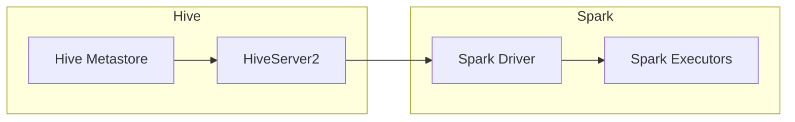

## 1. 背景介绍

### 1.1 大数据时代的数据处理挑战

随着互联网、物联网、移动互联网等技术的快速发展，全球数据量呈现爆炸式增长，大数据时代已经到来。如何高效地处理和分析海量数据，成为各个领域面临的共同挑战。

### 1.2 Hive和Spark的优势与局限性

在大数据领域，Hive和Spark是两种常用的数据处理工具。

* **Hive**：基于Hadoop的数据仓库工具，提供类似SQL的查询语言HiveQL，方便用户进行数据分析和处理。Hive的优势在于易用性和可扩展性，但其执行效率相对较低，尤其是在处理复杂查询时。
* **Spark**：基于内存计算的通用大数据处理引擎，具有快速、易用、通用等特点。Spark支持多种编程语言，包括Scala、Java、Python和R，并提供了丰富的API和库，方便用户进行各种数据处理任务。

### 1.3 Hive-Spark整合的必要性

为了充分发挥Hive和Spark各自的优势，同时克服其局限性，将Hive和Spark整合起来成为一种趋势。Hive-Spark整合可以实现以下目标：

* **提高数据处理效率**：利用Spark的内存计算能力加速Hive查询执行速度。
* **简化数据处理流程**：通过统一的接口和API，简化Hive和Spark之间的交互操作。
* **扩展数据处理能力**：结合Hive的SQL支持和Spark的机器学习库，实现更强大的数据分析功能。

## 2. 核心概念与联系

### 2.1 Hive on Spark架构

Hive on Spark是指将Spark作为Hive的执行引擎，取代传统的MapReduce引擎。其架构如下图所示：



1. **Hive Metastore**: 存储Hive的元数据信息，例如表结构、数据存储位置等。
2. **HiveServer2**: 接收来自客户端的HiveQL查询请求，并将其转换为Spark执行计划。
3. **Spark Driver**: 负责协调和管理Spark应用程序的执行。
4. **Spark Executors**: 负责执行Spark任务，并在内存中缓存数据，提高数据处理效率。

### 2.2 Hive-Spark交互流程

当用户提交HiveQL查询时，HiveServer2会将其转换为Spark执行计划，并提交给Spark Driver执行。Spark Driver会将执行计划分解成多个任务，并分配给Spark Executors执行。Spark Executors会读取Hive表数据，并在内存中进行计算，最终将结果返回给HiveServer2。

### 2.3 核心组件

* **HiveContext**: Spark SQL中的一个类，用于连接Hive Metastore，并提供HiveQL查询接口。
* **SparkSession**: Spark 2.x版本中引入的统一入口点，用于创建和管理Spark应用程序。
* **DataFrame**: Spark SQL中的一个数据结构，类似于关系型数据库中的表，可以进行结构化数据处理。

## 3. 核心算法原理具体操作步骤

### 3.1 Hive-Spark整合配置

1. **安装Spark**: 下载并安装Spark，并配置环境变量。
2. **配置Hive**: 修改Hive配置文件 `hive-site.xml`，将Hive的执行引擎设置为Spark。

```xml
<property>
  <name>hive.execution.engine</name>
  <value>spark</value>
</property>
```

3. **启动HiveServer2**: 启动HiveServer2服务，使其监听来自客户端的连接请求。

### 3.2 HiveQL查询执行流程

1. **创建HiveContext**: 在Spark应用程序中创建HiveContext对象，用于连接Hive Metastore。
2. **执行HiveQL查询**: 使用HiveContext的 `sql()` 方法执行HiveQL查询，例如：

```scala
val hiveContext = new HiveContext(sc)
val results = hiveContext.sql("SELECT * FROM my_table")
```

3. **结果处理**: 将查询结果转换为DataFrame，并进行后续处理，例如数据分析、机器学习等。

## 4. 数学模型和公式详细讲解举例说明

### 4.1 数据倾斜问题

在Hive-Spark整合中，数据倾斜是一个常见问题，会导致某些Spark Executor任务执行时间过长，影响整体效率。数据倾斜是指数据分布不均匀，导致某些键值对应的数据量过大。

### 4.2 数据倾斜解决方案

1. **预聚合**: 在Hive中对数据进行预聚合，减少数据量，例如：

```sql
SELECT key, COUNT(*) AS cnt FROM my_table GROUP BY key
```

2. **广播小表**: 将数据量较小的表广播到所有Spark Executor节点，避免数据 shuffle，例如：

```scala
val smallTable = hiveContext.table("small_table").broadcast()
val results = hiveContext.table("large_table").join(smallTable)
```

3. **使用Spark SQL的优化器**: Spark SQL的优化器可以自动识别和处理数据倾斜问题。

## 5. 项目实践：代码实例和详细解释说明

### 5.1 代码实例

```scala
import org.apache.spark.sql.SparkSession
import org.apache.spark.sql.hive.HiveContext

object HiveSparkExample {
  def main(args: Array[String]): Unit = {
    // 创建 SparkSession
    val spark = SparkSession.builder()
      .appName("HiveSparkExample")
      .enableHiveSupport()
      .getOrCreate()

    // 创建 HiveContext
    val hiveContext = new HiveContext(spark.sparkContext)

    // 执行 HiveQL 查询
    val results = hiveContext.sql("SELECT * FROM my_table")

    // 打印结果
    results.show()

    // 停止 SparkSession
    spark.stop()
  }
}
```

### 5.2 代码解释

1. 导入必要的 Spark SQL 和 Hive 类。
2. 创建 SparkSession 对象，并启用 Hive 支持。
3. 创建 HiveContext 对象，用于连接 Hive Metastore。
4. 使用 HiveContext 的 `sql()` 方法执行 HiveQL 查询。
5. 使用 DataFrame 的 `show()` 方法打印查询结果。
6. 停止 SparkSession。

## 6. 实际应用场景

### 6.1 数据仓库加速

Hive-Spark整合可以加速数据仓库查询速度，提高数据分析效率。

### 6.2 机器学习

Spark 提供丰富的机器学习库，可以与 Hive 整合，实现数据挖掘和机器学习任务。

### 6.3 实时数据分析

Spark Streaming 可以与 Hive 整合，实现实时数据分析和处理。

## 7. 总结：未来发展趋势与挑战

### 7.1 未来发展趋势

* **更紧密的整合**: Hive 和 Spark 将会更加紧密地整合，提供更 seamless 的用户体验。
* **云原生支持**: Hive 和 Spark 将会更好地支持云原生环境，例如 Kubernetes。
* **人工智能**: Hive 和 Spark 将会更好地支持人工智能应用，例如深度学习。

### 7.2 面临挑战

* **数据安全**: 如何保障 Hive 和 Spark 整合后的数据安全是一个挑战。
* **性能优化**: 如何进一步优化 Hive-Spark 整合的性能是一个持续的挑战。
* **生态系统**: 如何构建更完善的 Hive-Spark 生态系统是一个挑战。

## 8. 附录：常见问题与解答

### 8.1 如何解决 Hive-Spark 整合中的数据倾斜问题？

参考 4.2 数据倾斜解决方案。

### 8.2 如何配置 Hive-Spark 整合？

参考 3.1 Hive-Spark 整合配置。

### 8.3 如何使用 HiveContext 执行 HiveQL 查询？

参考 3.2 HiveQL 查询执行流程。
