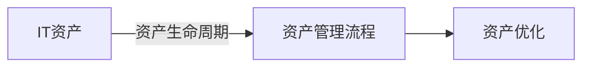

## 1.背景介绍
在过去的十年里，IT资产已经成为企业中不可或缺的一部分。然而，由于缺乏有效的管理和优化，企业的IT资源往往存在着严重的浪费现象，这不仅增加了企业的运营成本，也降低了资源的利用率。因此，如何通过优化IT资产管理来提高资源利用率并降低运营成本，已经成为了当前企业面临的一大挑战。

### 1.1 IT资产管理的定义与重要性
IT资产管理(ITAM)是一个集成的方法，用于跟踪和管理企业在其生命周期中的IT硬件和软件资产。这包括了从采购、部署、维护，到最后的处置等全过程的管理。

IT资产管理的重要性体现在以下几个方面：

- **成本控制**：通过有效的IT资产管理，企业可以避免过度采购IT设备，从而降低购买成本。同时，也可以通过提高现有IT设备的利用率，降低企业的运营成本。
- **风险管理**：未经管理的IT资产可能会导致合规风险，如未经授权的软件使用，或者未经批准的设备接入等。而有效的IT资产管理则可以帮助企业避免这些风险。
- **服务质量提升**：通过持续的IT资产管理，企业可以确保IT设备处于最佳运行状态，从而提高服务质量。

## 2.核心概念与联系
在IT资产管理中，有几个核心的概念和联系，理解这些概念和联系对于优化IT资产管理非常重要。

2.1 **IT资产**：IT资产包括了企业的所有IT硬件和软件。硬件资产包括了服务器、计算机、打印机、网络设备等，软件资产则包括了操作系统、数据库、应用程序等。

2.2 **资产生命周期**：IT资产的生命周期指的是资产从采购、部署、使用、维护，到最后的处置这一全过程。在每个阶段，都需要进行有效的管理，以确保资产的价值得到最大化。

2.3 **IT资产管理流程**：IT资产管理流程是对IT资产在其生命周期中的管理活动的规划和执行。这包括了资产的采购、接收、部署、维护和处置等环节。

2.4 **资产优化**：资产优化是指通过技术和管理手段，提高IT资产的利用率，降低资产的运营成本。这包括了资产的配置优化、使用优化和维护优化等。

这些概念之间的关系可以用下面的Mermaid流程图来表示：


## 3.核心算法原理具体操作步骤
优化IT资产管理的核心算法原理可以分为以下四个步骤：

### 3.1 资产采购
在资产采购阶段，企业需要根据业务需求，进行合理的设备选型和数量确定。过度采购不仅会增加企业的购买成本，还可能导致设备的闲置，降低资产的利用率。

### 3.2 资产部署
在资产部署阶段，企业需要根据业务需求和设备性能，进行合理的设备配置和部署。这可以确保设备的性能得到充分利用，从而提高资源利用率。

### 3.3 资产使用
在资产使用阶段，企业需要定期进行设备的性能监控和维护。这可以及时发现和解决设备问题，防止设备的故障，保证业务的正常运行。

### 3.4 资产处置
在资产处置阶段，企业需要根据设备的剩余价值和处置成本，决定是否进行设备的更换或报废。合理的设备处置可以降低企业的运营成本，同时也能避免设备的过早报废，提高资产的利用率。

## 4.数学模型和公式详细讲解举例说明
在IT资产管理中，我们可以使用数学模型来帮助我们进行决策。例如，在决定是否购买新设备时，我们可以使用成本效益分析模型来进行决策。

假设一个设备的购买成本为$C$，使用寿命为$T$，每年的运维成本为$O$，那么设备的总成本可以表示为：
$$
TC = C + T \times O
$$

而设备每年可以带来的收益为$B$，那么设备的总收益可以表示为：
$$
TB = T \times B
$$

如果设备的总收益大于总成本，那么购买这个设备就是划算的。公式可以表示为：
$$
TB > TC
$$

这个模型虽然简单，但是却可以帮助我们进行初步的决策，避免了盲目的设备采购。

## 5.项目实践：代码实例和详细解释说明
在实际的项目中，我们可以使用一些工具来帮助我们进行IT资产管理。例如，我们可以使用资产管理系统来跟踪和管理我们的设备。

以下是一个使用Python编写的简单的资产管理系统的例子：
```python
class Asset:
    def __init__(self, id, type, cost, lifespan, maintenance_cost):
        self.id = id
        self.type = type
        self.cost = cost
        self.lifespan = lifespan
        self.maintenance_cost = maintenance_cost

class AssetManager:
    def __init__(self):
        self.assets = {}

    def add_asset(self, asset):
        self.assets[asset.id] = asset

    def calculate_total_cost(self, id):
        asset = self.assets[id]
        return asset.cost + asset.lifespan * asset.maintenance_cost
```
这个系统包括了两个类：`Asset`和`AssetManager`。`Asset`类用于表示一个资产，`AssetManager`类用于管理所有的资产。我们可以使用`add_asset`方法来添加一个资产，使用`calculate_total_cost`方法来计算一个资产的总成本。

## 6.实际应用场景
IT资产管理在各种场景下都有应用，例如：

- **企业IT管理**：大型企业通常会有大量的IT设备，如何有效管理这些设备，是企业IT管理的重要问题。通过优化IT资产管理，企业可以提高设备的利用率，降低运营成本。
- **数据中心**：数据中心拥有大量的服务器和网络设备，如何有效管理这些设备，是数据中心运营的关键。通过优化IT资产管理，数据中心可以提高设备的利用率，降低运营成本。
- **云服务提供商**：云服务提供商需要管理大量的虚拟机和存储资源，如何有效管理这些资源，是云服务提供商的重要问题。通过优化IT资产管理，云服务提供商可以提高资源的利用率，降低运营成本。

## 7.工具和资源推荐
以下是一些推荐的IT资产管理工具和资源：

- **资产管理系统**：有许多商业和开源的资产管理系统，如ManageEngine AssetExplorer，Snipe-IT等，这些系统可以帮助企业进行有效的IT资产管理。
- **性能监控工具**：性能监控工具如Nagios，Zabbix等，可以帮助企业监控设备的运行状态，及时发现和解决问题。
- **ITIL框架**：ITIL框架是IT服务管理的最佳实践，其中包括了IT资产管理的一系列流程和方法。

## 8.总结：未来发展趋势与挑战
随着技术的发展，IT资产管理面临着新的趋势和挑战：

- **自动化**：随着AI和机器学习技术的发展，IT资产管理的自动化将成为可能。通过自动化，企业可以降低管理成本，提高管理效率。
- **云化**：随着云计算技术的发展，企业的IT资源越来越多地部署在云上。如何管理这些云上的资源，将是IT资产管理的新挑战。
- **安全**：随着网络攻击的增加，IT资产的安全管理越来越重要。如何保护IT资产免受攻击，将是IT资产管理的重要任务。

## 9.附录：常见问题与解答
**Q1：如何提高IT资产的利用率？**

A1：提高IT资产的利用率可以从以下几个方面进行：

- 优化资产配置：根据业务需求和设备性能，进行合理的设备配置。
- 定期维护：定期进行设备的性能监控和维护，及时发现和解决设备问题。
- 提高设备的使用率：通过调度算法，提高设备的使用率。

**Q2：如何降低IT资产的运营成本？**

A2：降低IT资产的运营成本可以从以下几个方面进行：

- 避免过度采购：根据业务需求，进行合理的设备选型和数量确定。
- 提高设备的使用寿命：通过定期维护，延长设备的使用寿命。
- 合理处置：根据设备的剩余价值和处置成本，决定设备的更换或报废。

以上就是我对于《IT资产管理优化:提高资源利用率,降低运营成本》这个话题的详细解析，希望对你有所帮助。