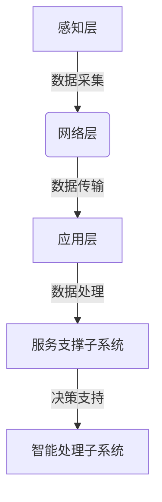
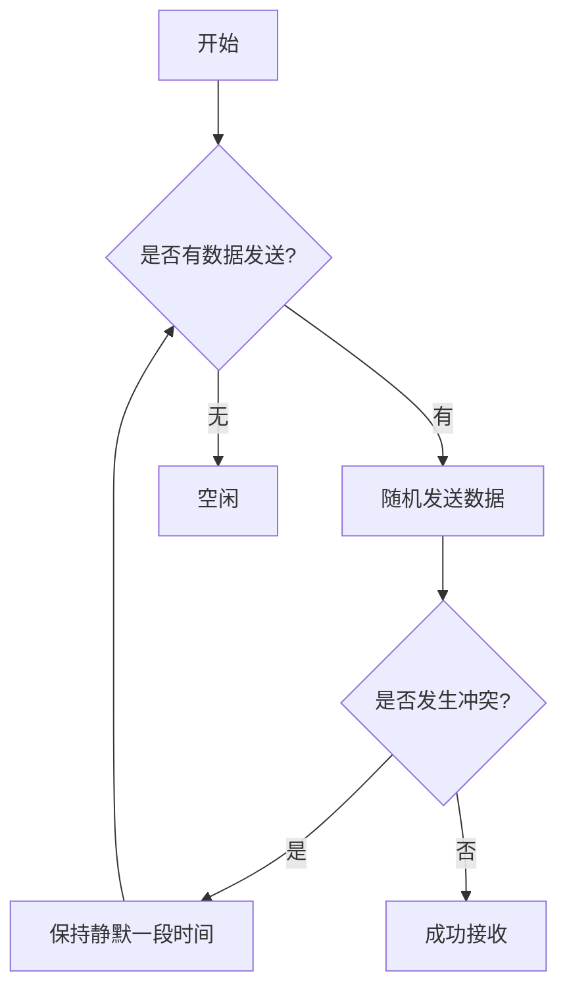
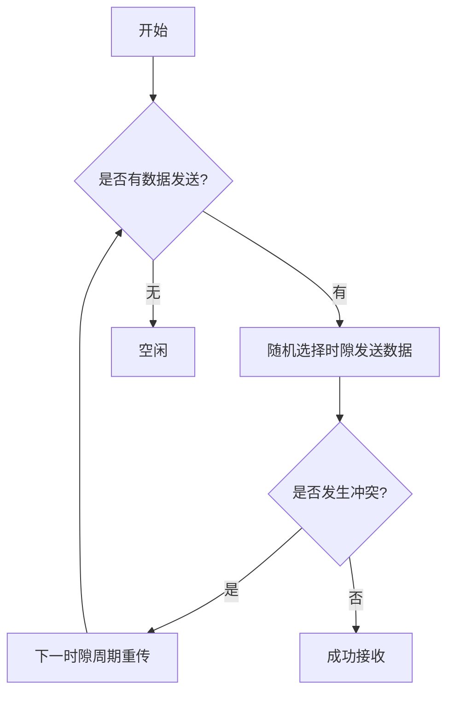
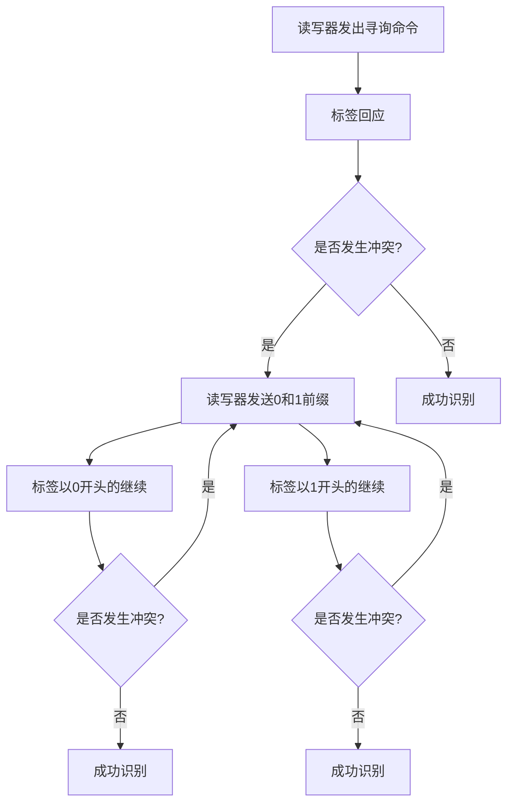
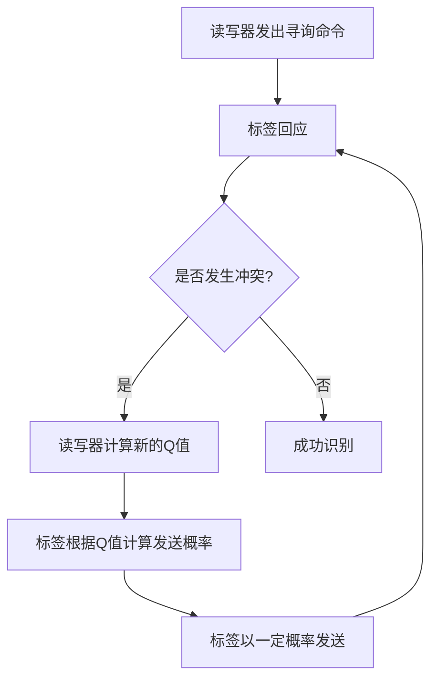
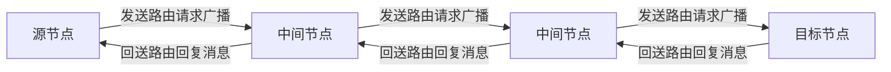
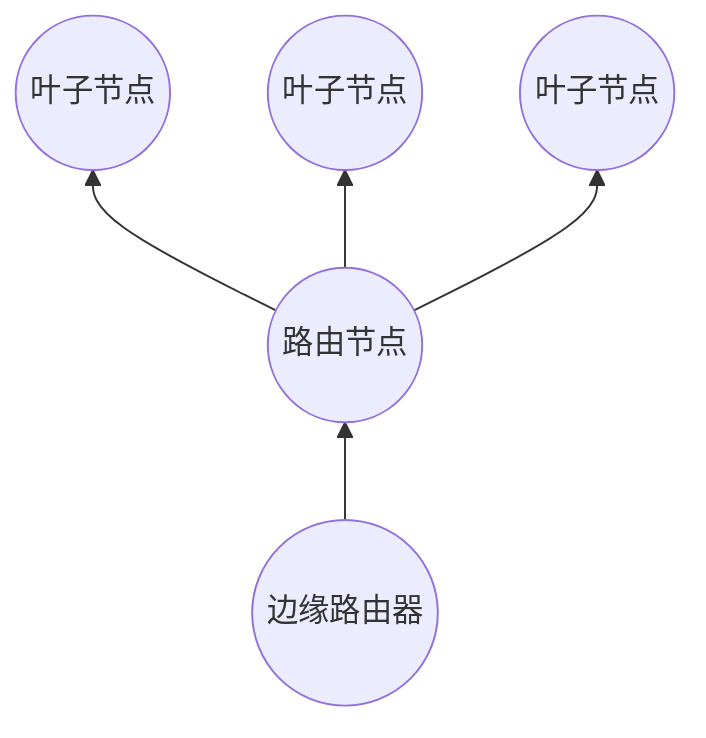

# Internet of Things 原理与代码实战案例讲解

## 1.背景介绍

### 1.1 物联网的兴起

近年来,随着互联网、移动通信和嵌入式系统等技术的飞速发展,物联网(Internet of Things,IoT)的概念应运而生。物联网旨在将各种信息传感设备与互联网相连,形成一个庞大的网络,实现物物相连、人机交互,为我们的生活、工作和社会运行带来前所未有的变革。

### 1.2 物联网的重要性

物联网被誉为继计算机、互联网之后的第三次信息产业浪潮,是推动新一轮科技革命和产业变革的重要驱动力。它将深刻影响未来智能化生产、生活和管理模式,对经济社会发展产生深远影响。

- **智慧城市**:通过物联网,可以实现城市公共资源的智能化管理,提高运营效率,为市民创造更美好的生活环境。
- **智能制造**:工厂内的设备、产品均可连接物联网,实现自动化生产和实时监控,提高生产效率和产品质量。
- **智能家居**:家用电器、安防系统等可与物联网相连,实现远程控制和智能化管理,带来全新的生活体验。
- **智慧农业**:利用物联网技术采集土壤、气象等数据,实现农业生产的智能化监测和精准决策。
- **智能医疗**:借助可穿戴设备和物联网技术,实现远程健康监测和及时医疗救助。

### 1.3 物联网的挑战

尽管物联网前景广阔,但在推广和应用过程中仍面临诸多挑战:

- **标准化**:目前物联网技术缺乏统一的标准,不同厂商的系统存在兼容性问题。
- **安全隐私**:物联网涉及大量个人和企业数据,如何保护数据安全和隐私是一大挑战。
- **网络承载**:物联网设备数量庞大,对网络带宽和时延等提出了更高要求。
- **能耗管理**:物联网终端设备需要节能,以延长电池使用寿命。
- **处理能力**:物联网产生的海量数据需要强大的计算和存储能力进行处理。

## 2.核心概念与联系

### 2.1 物联网体系结构

物联网是一个复杂的系统,涵盖感知层、网络层和应用层三个主要层次:

1. **感知层**:包括各种传感器、RFID(射频识别)设备等,负责采集环境数据并上传到网络层。
2. **网络层**:通过互联网、移动通信网络等,实现数据的传输和交换。
3. **应用层**:基于所获取的数据,开发各种应用软件,为用户提供各类智能化服务。

### 2.2 物联网关键技术

- **传感技术**:各种传感器是物联网的"眼睛"和"耳朵",负责数据采集。
- **通信技术**:确保物联网设备之间、设备与服务器之间的数据传输,如RFID、WiFi、蓝牙、5G等。
- **网络技术**:构建统一的网络平台,支持海量设备接入和数据传输。
- **计算技术**:对物联网大数据进行存储、处理和分析,提取有价值的信息。
- **安全技术**:保护物联网系统和数据的机密性、完整性和可用性。

### 2.3 物联网与其他技术的融合

物联网是一个交叉学科,需要与多种新兴技术相结合,才能发挥最大潜能:

- **云计算**:提供海量存储和计算资源,高效处理物联网大数据。
- **大数据**:挖掘物联网数据中的隐藏价值,发现新的知识和见解。
- **人工智能**:利用机器学习等技术,赋予物联网智能化决策能力。
- **边缘计算**:在靠近数据源的边缘侧进行数据处理,减轻中心节点压力。
- **区块链**:确保物联网数据的可追溯性和不可篡改性,提高信任度。

## 3.核心算法原理具体操作步骤

物联网涉及多种算法,我们重点介绍两种核心算法:RFID防冲突算法和路由算法。

### 3.1 RFID防冲突算法

RFID是物联网重要的识别和数据采集技术。当多个RFID标签同时回应读写器的询问时,会发生冲突。防冲突算法旨在避免和解决冲突,确保数据被正确读取。

#### 3.1.1 ALOHA算法

ALOHA算法是最早的防冲突算法,包括纯ALOHA和时隙ALOHA两种。

1. **纯ALOHA算法**

- 读写器持续发射查询信号。
- 标签随机选择时间发送数据,不经任何协调。
- 若发生冲突(多个标签同时发送),标签保持静默一段随机时间后重传。
- 缺点是吞吐量较低(理论值为18.4%),存在"码穿现象"。

2. **时隙ALOHA算法**

- 将时间分为一个个时隙,标签只能在时隙开始时发送数据。
- 若发生冲突,标签在下一时隙周期重传。
- 时隙ALOHA算法的吞吐量理论值为36.8%,是纯ALOHA算法的2倍。

#### 3.1.2 二进制树算法(BTA)

BTA算法通过构造二叉树的方式,有序地解决标签冲突问题。

- 当发生冲突时,读写器发送0和1前缀,将标签分为两个子集。
- 以0开头的标签保持回答,以1开头的暂时静默。反之亦然。
- 通过递归的方式,最终识别出所有标签。

BTA算法的吞吐量较高,但需要较多的查询次数。

#### 3.1.3 Q算法

Q算法基于概率原理,通过动态调整参数来优化性能。

- 如果发生冲突,读写器计算新的Q值,反馈给标签。
- 每个标签根据Q值计算一个发送概率。
- 标签以该概率决定是否发送数据。
- 通过动态调整Q值,算法可以在较高吞吐量和较低延迟间权衡。

Q算法性能优于ALOHA算法,但需要较多控制开销。

### 3.2 路由算法

在物联网中,海量设备通过多跳路由相互传递数据。路由算法直接影响网络的可靠性和实时性。

#### 3.2.1 AODV路由算法

AODV(Ad hoc On-Demand Distance Vector)是一种反应式路由算法,具有自动启动和循环检测功能。

1. **路由发现过程**

- 源节点广播路由请求(RREQ)消息。
- 中间节点记录下一跳节点,并继续广播RREQ。
- 目标节点收到RREQ后,沿反向路径回送路由回复(RREP)消息。
- 源节点收到RREP,建立路由并开始传输数据。

2. **路由维护过程**

- 每个节点周期性发送HELLO消息,检测邻居节点。
- 如果链路断开,发送路由错误(RERR)消息,通知其他节点。
- 收到RERR的节点,重新启动路由发现过程。

AODV算法具有低开销、快速响应等优点,适合移动性强的网络。但它的路由发现延迟较大。

#### 3.2.2 RPL路由算法

RPL(IPv6 Routing Protocol for Low-Power and Lossy Networks)是为资源受限的物联网设计的IPv6路由协议。

1. **路由构建过程**

- 边缘路由器作为DODAG(目的导向无环图)的根节点。
- 路由节点与根节点相连,形成DODAG的骨干网络。
- 叶子节点与最近的路由节点相连,加入DODAG。

2. **数据传输过程**

- 叶子节点将数据沿上行链路传输到路由节点。
- 路由节点利用下行链路和源路由选择最优路径,传输数据到根节点。
- 根节点通过外部网络与其他节点通信。

RPL路由具有网络组织灵活、支持多种链路层技术等特点,适合资源受限的物联网环境。

## 4. 数学模型和公式详细讲解举例说明

### 4.1 RFID防冲突算法数学模型

我们以ALOHA算法为例,分析其数学模型和性能。

#### 4.1.1 纯ALOHA模型

假设有N个标签,每个时隙内有新的数据帧到达的概率为G,则该时隙有数据发送的概率为:

$$P_r = 1 - (1-G)^N$$

若该时隙恰有一个标签发送数据,则发送成功,成功概率为:

$$P_s = NGe^{-NG}$$

当 $G=1/N$ 时, $P_s$ 取最大值 $1/e \approx 0.368$, 即纯ALOHA算法的最大吞吐量为 $0.184$。

#### 4.1.2 时隙ALOHA模型

对于时隙ALOHA算法,由于标签只能在时隙开始发送,因此发送成功的概率为:

$$P_s = NGe^{-2NG}$$

当 $G=1/2N$ 时, $P_s$ 取最大值 $1/2e \approx 0.184$, 即时隙ALOHA算法的最大吞吐量为 $0.368$。

我们可以看出,时隙ALOHA算法的最大吞吐量是纯ALOHA算法的2倍。

### 4.2 Q算法性能分析

对于Q算法,我们定义 $f_c$ 为发生冲突的概率, $f_i$ 为发生空闲的概率, $f_s$ 为发