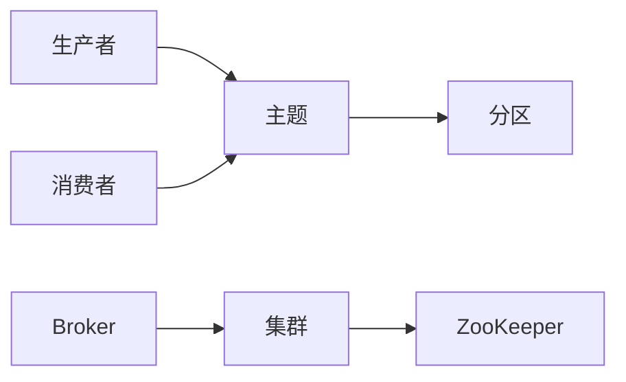

## 1. 背景介绍

### 1.1 大数据时代的挑战

随着互联网和移动设备的普及，数据量呈爆炸式增长，传统的数据库系统难以应对海量数据的存储、处理和分析需求。为了解决这些挑战，分布式计算框架应运而生，其中 Apache Kafka 作为一款高吞吐量、低延迟的分布式消息发布-订阅系统，在大数据领域扮演着重要的角色。

### 1.2 Kafka 的诞生和发展

Kafka 最初由 LinkedIn 开发，用于处理网站活动流数据。由于其出色的性能和可扩展性，Kafka 很快受到广泛关注，并于 2011 年开源。如今，Kafka 已成为 Apache 软件基金会的顶级项目，被广泛应用于实时数据管道、流处理、事件驱动架构等场景。

### 1.3 Kafka 的优势

Kafka 的主要优势包括：

* **高吞吐量:** Kafka 采用顺序写入磁盘和零拷贝技术，能够处理每秒百万级别的消息。
* **低延迟:** Kafka 通过高效的消息传递机制和批处理技术，可以实现毫秒级的消息延迟。
* **可扩展性:** Kafka 支持水平扩展，可以轻松地添加新的节点来处理不断增长的数据量。
* **持久性:** Kafka 将消息持久化到磁盘，确保数据的可靠性和安全性。
* **容错性:** Kafka 具有高可用性设计，即使部分节点发生故障，系统也能正常运行。

## 2. 核心概念与联系

### 2.1 主题与分区

Kafka 中的消息按照主题进行分类，每个主题可以包含多个分区。分区是 Kafka 并行化和可扩展性的关键，它允许将消息分布到多个节点上，从而提高吞吐量和容错性。

### 2.2 生产者与消费者

生产者负责将消息发布到 Kafka 主题，消费者则从主题中订阅并消费消息。Kafka 支持多种消息传递模式，包括点对点、发布-订阅和流处理。

### 2.3 Broker 与集群

Broker 是 Kafka 集群中的节点，负责存储消息和处理客户端请求。集群由多个 Broker 组成，它们之间通过 ZooKeeper 进行协调和管理。

### 2.4  核心概念关系图



## 3. 核心算法原理具体操作步骤

### 3.1 消息生产

生产者将消息发送到 Kafka Broker，Broker 根据消息的主题和分区信息将消息写入磁盘。Kafka 采用顺序写入的方式，将消息追加到分区日志文件的末尾，从而提高写入性能。

### 3.2 消息消费

消费者从 Kafka Broker 订阅主题并消费消息。消费者可以指定消费组，同一消费组内的消费者会共同消费主题的所有分区，每个分区只会被一个消费者消费。

### 3.3 消息传递

Kafka 支持多种消息传递模式：

* **点对点:** 每个消息只会被一个消费者消费。
* **发布-订阅:** 每个消息会被所有订阅该主题的消费者消费。
* **流处理:** 消息被视为数据流，可以进行实时处理和分析。

### 3.4 容错机制

Kafka 通过复制机制实现容错。每个分区有多个副本，其中一个副本为主副本，其他副本为跟随副本。当主副本发生故障时，Kafka 会自动将一个跟随副本提升为主副本，从而保证数据的高可用性。

## 4. 数学模型和公式详细讲解举例说明

Kafka 的性能和可扩展性与其底层的数据结构和算法密切相关。

### 4.1 分区日志

Kafka 将每个分区的消息存储在一个日志文件中，日志文件由多个片段组成。每个片段包含一定数量的消息，片段的大小可以配置。

### 4.2 消息格式

Kafka 消息由以下字段组成：

* **偏移量:** 消息在分区日志中的唯一标识符。
* **时间戳:** 消息的创建时间。
* **键:** 可选字段，用于标识消息。
* **值:** 消息的实际内容。

### 4.3 消息压缩

Kafka 支持多种消息压缩算法，包括 GZIP、Snappy 和 LZ4。压缩可以减少消息的大小，从而提高网络传输效率和存储效率。

## 5. 项目实践：代码实例和详细解释说明

以下是一个使用 Java 编写的 Kafka 生产者和消费者示例：

### 5.1 生产者示例

```java
import org.apache.kafka.clients.producer.KafkaProducer;
import org.apache.kafka.clients.producer.ProducerConfig;
import org.apache.kafka.clients.producer.ProducerRecord;
import org.apache.kafka.common.serialization.StringSerializer;

import java.util.Properties;

public class KafkaProducerExample {

    public static void main(String[] args) {
        // 创建 Kafka 生产者配置
        Properties props = new Properties();
        props.put(ProducerConfig.BOOTSTRAP_SERVERS_CONFIG, "localhost:9092");
        props.put(ProducerConfig.KEY_SERIALIZER_CLASS_CONFIG, StringSerializer.class.getName());
        props.put(ProducerConfig.VALUE_SERIALIZER_CLASS_CONFIG, StringSerializer.class.getName());

        // 创建 Kafka 生产者
        KafkaProducer<String, String> producer = new KafkaProducer<>(props);

        // 发送消息
        for (int i = 0; i < 10; i++) {
            ProducerRecord<String, String> record = new ProducerRecord<>("my-topic", "message-" + i);
            producer.send(record);
        }

        // 关闭生产者
        producer.close();
    }
}
```

### 5.2 消费者示例

```java
import org.apache.kafka.