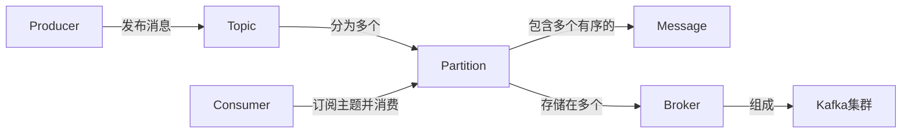

# Kafka原理与代码实例讲解

作者：禅与计算机程序设计艺术

## 1. 背景介绍

### 1.1 Kafka的诞生
Apache Kafka最初由LinkedIn开发,用作LinkedIn的活动流和运营数据处理管道的基础。现已被众多不同类型的公司作为多种类型的数据管道和消息系统使用。

### 1.2 Kafka在大数据生态中的地位
在当前的大数据生态系统中,Kafka已经成为了一个不可或缺的重要组件。它常常作为数据管道的中间件,衔接起各个数据源和数据处理引擎。Kafka可以很好地解耦数据源和数据消费者,为构建高性能、易扩展的大数据系统提供基础支持。

### 1.3 Kafka的主要特点
- 高吞吐量、低延迟:Kafka会把数据写入到磁盘,但它仍然能够保持极高的吞吐量和极低的延迟。
- 高容错:Kafka会把数据复制到多台机器上,以保证数据的安全性。 
- 易扩展:可以在线进行水平扩展,而不影响系统运行。
- 灵活性:支持在线和离线处理,可以处理实时和批处理两种场景。

## 2. 核心概念与联系

### 2.1 Producer 生产者
生产者是向Kafka发布消息的客户端。生产者可以向Kafka集群中的任意主题(Topic)发送消息。

### 2.2 Consumer 消费者
消费者是从Kafka读取消息的客户端。消费者通过订阅主题来读取消息。

### 2.3 Consumer Group 消费者组
每个消费者都属于一个特定的消费者组。一个消费者组里的消费者共同消费订阅主题的所有分区,每个分区只能由同一个消费者组里的一个消费者消费。

### 2.4 Broker
Broker 是Kafka集群的组成部分,每个Broker 是一个Kafka 服务器,可以存储消息并处理来自生产者和消费者的请求。

### 2.5 Topic 主题
消息以主题为单位进行归类,生产者向Kafka写消息,消费者从Kafka读消息,都是面向主题的。

### 2.6 Partition 分区
每个主题被分为若干个分区,分区是Kafka消息的最小存储单位。同一个主题的不同分区包含的消息是不同的。

### 2.7 Offset 位移
每个消息在分区内都有一个唯一的位移值,它唯一标识了这条消息在分区内的位置。位移值是一个单调递增的整数。

### 2.8 Replication 备份
Kafka对消息提供了多副本支持,以保证数据的安全性。每个主题可以设置多个副本,副本之间是"一主多从"的关系。

下图描述了Kafka的核心概念与它们之间的关系:



## 3.核心算法原理具体操作步骤

### 3.1 生产者发送消息的过程
1. 生产者先从Kafka集群获取分区器,用来决定消息发送到哪个分区。
2. 生产者将消息序列化。
3. 生产者根据得到的分区信息,将消息发送到Kafka Broker。
4. 如果发送成功,Kafka会返回一个包含消息的元数据,包括主题、分区、位移值等信息。
5. 如果发送失败,生产者可以自动重试。

### 3.2 消费者消费消息的过程
1. 消费者与Kafka Broker建立连接。
2. 消费者订阅需要的主题。 
3. Kafka Broker 定期向消费者推送已经提交的消息。
4. 消费者收到消息后对其进行处理。
5. 消费者定期向Kafka Broker 发送位移值,以确认消息正确处理。

### 3.3 Kafka的分区复制机制
1. 每个主题可以设置多个副本,存储在不同的Broker上,以提高可靠性。
2. 其中一个副本被选举为Leader,其他副本作为Follower。 
3. 所有的读写请求都由Leader处理,Follower被动地同步Leader的数据。
4. 当Leader失效时,其中一个Follower会被选举为新的Leader。

## 4. 数学模型和公式详细讲解举例说明

### 4.1 吞吐量模型
Kafka的吞吐量可以用以下公式来建模:

$$Throughput = \frac{MessageSize * BatchSize}{ProduceLatency + ConsumerLatency}$$

其中:
- $MessageSize$: 消息的平均大小。
- $BatchSize$: 每次生产或消费的消息数量。
- $ProduceLatency$: 生产一批消息的延迟。
- $ConsumerLatency$: 消费一批消息的延迟。

例如,假设消息平均大小为1KB,每次生产和消费的消息数量为1000,生产延迟为10ms,消费延迟为20ms,那么Kafka的吞吐量可以估计为:

$$Throughput = \frac{1KB * 1000}{10ms + 20ms} \approx 33.3 MB/s$$

### 4.2 消息保留时间模型
Kafka允许设置消息保留的时间,可以用以下公式计算磁盘占用:

$$DiskUsage = Throughput * RetentionTime$$

其中:
- $Throughput$: Kafka的吞吐量。
- $RetentionTime$: 消息保留的时间。

例如,如果Kafka的吞吐量为100MB/s,消息保留时间为7天,那么磁盘占用可以估计为:

$$DiskUsage = 100MB/s * 7days \approx 60TB$$

## 5. 项目实践：代码实例和详细解释说明

### 5.1 生产者代码实例
下面是一个使用Java编写的Kafka生产者示例:

```java
Properties props = new Properties();
props.put("bootstrap.servers", "localhost:9092");
props.put("key.serializer", "org.apache.kafka.common.serialization.StringSerializer");
props.put("value.serializer", "org.apache.kafka.common.serialization.StringSerializer");

Producer<String, String> producer = new KafkaProducer<>(props);

for (int i = 0; i < 10; i++) {
    producer.send(new ProducerRecord<>("my-topic", Integer.toString(i), "Message: " + i));
}

producer.close();
```

这段代码做了以下事情:
1. 设置Kafka Broker的地址。
2. 设置消息的键和值的序列化器。
3. 创建一个生产者实例。
4. 发送10条消息到名为"my-topic"的主题。
5. 关闭生产者。

### 5.2 消费者代码实例
下面是一个使用Java编写的Kafka消费者示例:

```java
Properties props = new Properties();
props.setProperty("bootstrap.servers", "localhost:9092");
props.setProperty("group.id", "test");
props.setProperty("key.deserializer", "org.apache.kafka.common.serialization.StringDeserializer");
props.setProperty("value.deserializer", "org.apache.kafka.common.serialization.StringDeserializer");

KafkaConsumer<String, String> consumer = new KafkaConsumer<>(props);
consumer.subscribe(Arrays.asList("my-topic"));

while (true) {
    ConsumerRecords<String, String> records = consumer.poll(Duration.ofMillis(100));
    for (ConsumerRecord<String, String> record : records) {
        System.out.printf("offset = %d, key = %s, value = %s%n", record.offset(), record.key(), record.value());
    }
}
```

这段代码做了以下事情:
1. 设置Kafka Broker的地址。
2. 设置消费组的ID。
3. 设置消息的键和值的反序列化器。
4. 创建一个消费者实例。
5. 订阅名为"my-topic"的主题。
6. 持续地拉取消息并处理。

## 6.实际应用场景

### 6.1 消息队列
Kafka可以用作消息队列,在分布式系统中实现松耦合的异步通信。生产者将消息写入Kafka,多个消费者从Kafka读取消息并处理,彼此之间不需要直接通信。

### 6.2 网站活动跟踪
Kafka常常被用来记录网站用户的各种活动,如页面访问、搜索、点击等。这些活动信息可以实时发送到Kafka,再由Spark、Flink等数据处理框架实时处理。

### 6.3 日志聚合
Kafka可以用来收集分布式应用的日志。应用将日志发送到Kafka,再由ELK（Elasticsearch, Logstash, Kibana）等工具进行处理和可视化。

### 6.4 流处理
Kafka常常作为流处理系统的数据源,如Spark Streaming、Flink等都能很好地与Kafka集成。这些框架从Kafka实时读取数据,进行计算处理,再将结果写回Kafka或其他存储系统。

## 7. 工具和资源推荐

### 7.1 Kafka官方网站
Kafka的官方网站提供了详尽的文档、教程和最新资讯,是学习和使用Kafka的权威资源。网址：https://kafka.apache.org/

### 7.2 Confluent Platform
Confluent Platform是Kafka的商业版本,提供了一些增强特性和企业级支持。它还包含了一些额外的组件如KSQL、Schema Registry等,可以让你更轻松地构建基于Kafka的数据管道。官网：https://www.confluent.io/

### 7.3 Kafka Tool
Kafka Tool是一个免费的Kafka桌面客户端,提供了方便的GUI来查看主题、消息、消费者组等信息。下载地址：https://www.kafkatool.com/

### 7.4 Conduktor
Conduktor是另一款优秀的Kafka桌面客户端,除了基本的功能外,还提供了数据生成、消息搜索、Schema Registry支持等高级特性。官网：https://www.conduktor.io/

## 8. 总结：未来发展趋势与挑战

### 8.1 云原生部署
随着云计算的普及,越来越多的公司开始在云平台上部署Kafka。各大云厂商如AWS、Azure、Google Cloud都提供了托管的Kafka服务。未来Kafka的部署将更加云原生化,与Kubernetes等云原生技术深度集成。

### 8.2 无服务器化
无服务器计算(Serverless)是云计算的一个重要趋势。未来Kafka有可能演进出无服务器版本,让用户无需管理Kafka集群,只需专注于数据的生产和消费。

### 8.3 与机器学习和人工智能的结合
Kafka作为一个高效的数据管道,非常适合作为机器学习和人工智能系统的数据源。未来Kafka可能会与TensorFlow、PyTorch等机器学习框架进一步集成,提供端到端的机器学习解决方案。

### 8.4 安全与隐私合规
随着GDPR等隐私保护法规的实施,数据安全和隐私合规成为了企业的重要课题。未来Kafka需要在安全和隐私方面持续增强,如支持数据加密、数据脱敏、访问控制等,以满足日益严格的合规要求。

总的来说,作为一个成熟的分布式消息系统,Kafka已经在众多领域得到了广泛应用。未来随着数据规模的持续增长和新技术的出现,Kafka还将不断演进,为构建下一代数据驱动型应用提供坚实的基础设施支撑。

## 9. 附录：常见问题与解答

### 9.1 Kafka如何保证消息的顺序？
Kafka通过把消息按照发送的顺序append到分区,在同一个分区内,消息是有序的。消费者在消费的时候,也是按照存储的顺序读取分区内的消息,从而保证了消息消费的顺序性。但是在不同的分区之间,消息是无序的。

### 9.2 Kafka如何保证消息不丢失？
Kafka提供了多种策略来保证消息的可靠性,主要有:
1. 把消息写入到多个副本,即使部分节点失效,也不会丢失数据。
2. 只有当消息被成功复制到所有in-sync状态的副本时,才认为消息写入成功。
3. 消费者在消费完消息后,需要手动提交位移,标记消息已经处理完成。

### 9.3 Kafka的数据传输是推还是拉？
Kafka使用的是一种独特的拉取(Pull)模式。在这种模式下,消费者主动从Broker拉取消息,并控制自己的消费速率。这与传统的消息队列使用推送(Push)模式不同。这种拉取模式可以