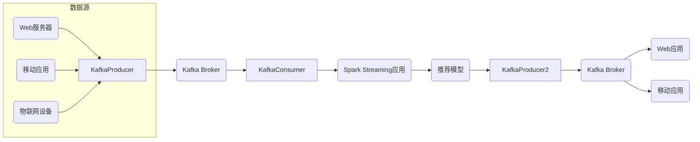

# Kafka实战：构建实时推荐系统

## 1.背景介绍

### 1.1 实时数据处理的重要性

在当今快节奏的商业环境中，实时数据处理变得越来越重要。企业需要及时获取和分析大量数据,以便快速做出决策并保持竞争优势。传统的批处理系统已经无法满足实时性的要求,因此需要一种新的数据处理范式来处理大规模的实时数据流。

### 1.2 推荐系统概述

推荐系统是一种广泛应用于电子商务、在线视频、社交媒体等领域的技术,旨在根据用户的历史行为和偏好为其提供个性化的内容或产品推荐。高质量的推荐系统不仅能提升用户体验,还可以显著提高企业的收入和用户参与度。

### 1.3 Kafka在实时推荐系统中的作用

Apache Kafka是一个分布式流处理平台,它提供了一种统一、高吞吐、低延迟的数据管道,能够实时处理大规模数据流。在构建实时推荐系统时,Kafka可以作为核心消息队列,实时接收来自各种来源的数据,并将这些数据流式传输给下游的实时计算引擎进行处理和分析。

## 2.核心概念与联系

### 2.1 Kafka核心概念

#### 2.1.1 Topic和Partition

Kafka中的消息以Topic进行分类,一个Topic可以分为多个Partition,每个Partition中的数据是有序的。通过Partition,Kafka实现了水平扩展和并行处理,从而提高了吞吐量。

#### 2.1.2 Producer和Consumer

Producer负责向Kafka发送消息,而Consumer则从Kafka订阅并消费消息。Producer和Consumer之间是完全解耦的,中间通过Topic进行通信。

#### 2.1.3 Broker和Cluster

Kafka集群由多个Broker组成,每个Broker负责存储部分Partition的数据。Kafka采用分布式存储和复制机制,可以提供高可用性和容错能力。

### 2.2 实时推荐系统核心概念

#### 2.2.1 用户行为数据

实时推荐系统需要收集和处理大量的用户行为数据,包括浏览记录、购买记录、评分、评论等。这些数据是推荐算法的基础。

#### 2.2.2 特征工程

将原始的用户行为数据转换为算法可以理解的特征向量,是实时推荐系统的关键环节之一。常用的特征包括用户属性、物品属性、上下文信息等。

#### 2.2.3 推荐算法

根据用户特征和物品特征,推荐算法计算出用户对每个物品的偏好分数,从而生成个性化的推荐列表。常用的算法包括协同过滤、内容推荐、混合推荐等。

### 2.3 Kafka与实时推荐系统的联系

Kafka作为分布式消息队列,可以高效地收集和传输实时的用户行为数据,为后续的特征工程和推荐算法提供数据源。同时,Kafka还可以将推荐结果实时推送给各个应用系统,为用户提供即时的个性化体验。

## 3.核心算法原理具体操作步骤

实时推荐系统通常包含以下几个核心步骤:

### 3.1 数据收集

通过Kafka Producer将各种来源的用户行为数据实时发送到Kafka集群中的指定Topic。这些数据可能来自网站、移动应用、物联网设备等。

### 3.2 数据预处理

Kafka Consumer从Topic中消费原始数据,进行数据清洗、转换和标准化等预处理操作,输出结构化的数据流。

### 3.3 特征工程

将预处理后的数据流输入到特征工程模块,提取用户特征、物品特征和上下文特征等,构建特征向量。

### 3.4 推荐算法

根据特征向量,利用协同过滤、内容推荐或混合推荐等算法,计算每个用户对各个物品的偏好分数,生成候选推荐列表。

### 3.5 排序和过滤

对候选推荐列表进行个性化排序和过滤,去除不合适的推荐项,生成最终的推荐列表。

### 3.6 实时推送

将个性化推荐列表通过Kafka Producer实时推送到指定的输出Topic,供下游的应用系统订阅和展示。

上述步骤可以利用流式处理框架(如Apache Spark Streaming、Apache Flink等)或者Lambda架构进行实现。Kafka作为整个数据管道的中心,确保了数据流的高效传输和处理。

## 4.数学模型和公式详细讲解举例说明

在实时推荐系统中,常用的推荐算法有协同过滤、内容推荐和混合推荐等。下面我们将介绍其中的一种常用算法:基于项目的协同过滤算法。

### 4.1 基于项目的协同过滤

基于项目的协同过滤算法的核心思想是:对于一个目标用户,找到与其有相似行为模式的其他用户,然后基于这些相似用户的偏好,为目标用户生成推荐列表。

具体步骤如下:

1. 计算物品之间的相似度

   对于任意两个物品 $i$ 和 $j$,计算它们之间的相似度 $\text{sim}(i, j)$。常用的相似度计算方法有余弦相似度、皮尔逊相关系数等。

   余弦相似度的计算公式为:

   $$\text{sim}(i, j) = \frac{\sum\limits_{u \in U} r_{ui} r_{uj}}{\sqrt{\sum\limits_{u \in U} r_{ui}^2} \sqrt{\sum\limits_{u \in U} r_{uj}^2}}$$

   其中 $U$ 表示所有用户的集合,  $r_{ui}$ 表示用户 $u$ 对物品 $i$ 的评分。

2. 计算预测评分

   对于目标用户 $u$ 和待推荐物品 $i$,计算预测评分 $\hat{r}_{ui}$:

   $$\hat{r}_{ui} = \frac{\sum\limits_{j \in I_u} \text{sim}(i, j) r_{uj}}{\sum\limits_{j \in I_u} |\text{sim}(i, j)|}$$

   其中 $I_u$ 表示用户 $u$ 已经评分过的物品集合。

3. 生成推荐列表

   根据预测评分从高到低对所有待推荐物品进行排序,取前 $N$ 个物品作为推荐列表。

### 4.2 算法优化

上述基本算法存在一些缺陷,如稀疏数据问题、新物品冷启动问题等。我们可以通过以下方式进行优化:

1. 采用基线评分 + 残差评分的模型,解决稀疏数据问题。

2. 引入内容特征,构建混合推荐算法,解决新物品冷启动问题。

3. 采用隐语义模型(如矩阵分解)捕获用户和物品的隐含特征,提高推荐精度。

4. 引入时间、地理位置等上下文信息,提供更精准的个性化推荐。

5. 采用在线学习和模型更新机制,实时捕获用户偏好的变化。

以上优化措施可以根据具体场景和需求进行选择和组合。

## 5.项目实践:代码实例和详细解释说明

在本节中,我们将提供一个基于Spark Streaming和Kafka的简单实时推荐系统的代码示例,帮助读者更好地理解实现过程。

### 5.1 系统架构



上图展示了一个典型的基于Kafka和Spark Streaming的实时推荐系统架构。各个组件的作用如下:

- **数据源**: 包括Web服务器、移动应用、物联网设备等,它们将实时的用户行为数据发送到Kafka。
- **Kafka Broker**: 作为分布式消息队列,接收和存储来自数据源的实时数据流。
- **Spark Streaming应用**: 从Kafka消费数据,进行数据预处理、特征工程和推荐算法计算。
- **推荐模型**: 根据特征向量和算法,计算出个性化的推荐列表。
- **Kafka Broker**: 将推荐结果发送到另一个Kafka Topic中。
- **Web应用/移动应用**: 从Kafka订阅并消费推荐结果,为用户提供个性化的推荐服务。

### 5.2 代码示例

以下是一个基于Spark Streaming和Kafka的简单实时推荐系统的代码示例(Python版本):

```python
from pyspark.sql import SparkSession
from pyspark.sql.functions import *
from pyspark.sql.types import *

# 创建SparkSession
spark = SparkSession.builder.appName("RecommendationSystem").getOrCreate()

# 定义Schema
userBehaviorSchema = StructType([
    StructField("userId", StringType(), True),
    StructField("itemId", StringType(), True),
    StructField("behavior", StringType(), True),
    StructField("timestamp", TimestampType(), True)
])

# 从Kafka读取数据流
kafkaDF = spark \
    .readStream \
    .format("kafka") \
    .option("kafka.bootstrap.servers", "localhost:9092") \
    .option("subscribe", "user-behavior") \
    .load() \
    .select(from_json(col("value").cast("string"), userBehaviorSchema).alias("value")) \
    .select("value.*")

# 数据预处理和特征工程
processedDF = kafkaDF \
    .filter(col("behavior").isin(["view", "purchase"])) \
    .withColumn("label", when(col("behavior") == "purchase", 1.0).otherwise(0.0)) \
    .groupBy("userId", "itemId") \
    .agg(count("*").alias("count"), max("label").alias("label"))

# 协同过滤算法
userRatedDF = processedDF.filter(col("label") == 1.0).drop("label")
itemSimilarityModel = userRatedDF.rdd \
    .map(lambda x: (x[1], (x[0], x[2]))) \
    .groupByKey() \
    .map(lambda x: (x[0], list(x[1]))) \
    .cache()

def calculateSimilarity(itemPair):
    item1 = itemPair[0]
    item2 = itemPair[1]
    
    users1 = itemSimilarityModel.lookup(item1)
    users2 = itemSimilarityModel.lookup(item2)
    
    users = set(users1) & set(users2)
    
    numerator = sum([users1.count(u) * users2.count(u) for u in users])
    denominator1 = sum([count**2 for count in [users1.count(u) for u in users]])
    denominator2 = sum([count**2 for count in [users2.count(u) for u in users]])
    
    similarity = numerator / (sqrt(denominator1) * sqrt(denominator2))
    
    return (item1, item2, similarity)

itemSimilarities = itemSimilarityModel.cartesian(itemSimilarityModel) \
    .filter(lambda x: x[0][0] != x[1][0]) \
    .map(calculateSimilarity) \
    .filter(lambda x: x[2] > 0.0)

# 生成推荐列表
def recommendItems(userRecs):
    userId = userRecs[0]
    ratedItems = userRecs[1]
    
    candidateItems = processedDF \
        .filter(col("userId") != userId) \
        .select("itemId") \
        .rdd \
        .map(lambda x: x[0]) \
        .collect()
    
    scores = itemSimilarities \
        .filter(lambda x: x[0] in ratedItems) \
        .map(lambda x: (x[1], x[2])) \
        .groupByKey() \
        .map(lambda x: (x[0], sum(x[1]))) \
        .collect()
    
    rankedScores = sorted(scores, key=lambda x: x[1], reverse=True)
    
    recommendations = [x[0] for x in rankedScores[:10]]
    
    return (userId, recommendations)

userRecs = userRatedDF \
    .rdd \
    .map(lambda x: (x[0], [x[1]])) \
    .groupByKey() \
    .map(recommendItems)

# 输出推荐结果到Kafka
recommendationSchema = StructType([
    StructField("userId", StringType(), True),
    StructField("recommendations