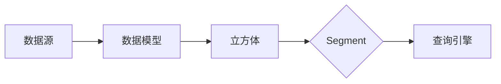

## 1. 背景介绍

### 1.1 大数据时代的数据分析挑战

随着互联网、物联网、移动互联网的快速发展，全球数据量呈现爆炸式增长，大数据时代已经到来。海量数据的存储、管理和分析成为了各个行业面临的巨大挑战。如何从海量数据中提取有价值的信息，成为了企业决策、科学研究、社会治理等领域的关键问题。

### 1.2 OLAP技术的发展历程

为了应对大数据分析的挑战，OLAP（Online Analytical Processing，联机分析处理）技术应运而生。OLAP技术旨在快速、灵活地分析海量数据，并提供多维度的分析结果，帮助用户洞察数据背后的规律和趋势。

早期的OLAP技术主要基于关系型数据库，但随着数据量的不断增长，关系型数据库的性能逐渐无法满足OLAP的需求。为了解决这一问题，出现了基于多维数据集的MOLAP（Multidimensional OLAP）技术，以及基于关系型数据库的ROLAP（Relational OLAP）技术。然而，MOLAP技术存在数据冗余、难以扩展等问题，而ROLAP技术则存在查询效率低下的问题。

### 1.3 Kylin的诞生与发展

为了解决传统OLAP技术的不足，Kylin应运而生。Kylin是一个开源的分布式分析引擎，提供Hadoop/Spark之上的SQL查询接口及多维分析（OLAP）能力以支持超大规模数据集，并且能够提供亚秒级查询响应速度。

Kylin的核心思想是**预计算**，即在数据加载时预先计算所有可能的查询结果，并将结果存储在HBase中。当用户发起查询时，Kylin可以直接从HBase中获取结果，从而实现亚秒级的查询响应速度。

## 2. 核心概念与联系

### 2.1 数据立方体（Data Cube）

数据立方体是一种多维数据模型，用于表示多维空间中的数据。它由维度（Dimension）和度量（Measure）组成。

* **维度（Dimension）**：描述数据的观察角度，例如时间、地域、产品类别等。
* **度量（Measure）**：描述数据的统计指标，例如销售额、用户数量、点击率等。

### 2.2 星型模型（Star Schema）

星型模型是一种常用的数据仓库模型，用于支持OLAP分析。它由一个事实表（Fact Table）和多个维度表（Dimension Table）组成。

* **事实表（Fact Table）**：存储业务事实数据，例如销售记录、用户行为等。
* **维度表（Dimension Table）**：存储维度信息，例如时间、地域、产品等。

### 2.3 Kylin中的核心概念

Kylin中的核心概念包括：

* **数据源（Data Source）**：Kylin支持多种数据源，例如Hive、Kafka、HBase等。
* **数据模型（Data Model）**：定义数据立方体的维度和度量。
* **立方体（Cube）**：基于数据模型构建的预计算结果。
* **Segment**：立方体被划分为多个Segment，每个Segment存储一部分预计算结果。
* **查询引擎（Query Engine）**：负责接收用户查询，并从HBase中获取预计算结果。

### 2.4 核心概念之间的联系

下图展示了Kylin中核心概念之间的联系：



## 3. 核心算法原理具体操作步骤

### 3.1 预计算原理

Kylin的核心原理是预计算，即在数据加载时预先计算所有可能的查询结果，并将结果存储在HBase中。预计算过程包括以下步骤：

1. **维度组合枚举**：根据数据模型定义的维度，枚举所有可能的维度组合。
2. **度量计算**：针对每个维度组合，计算所有度量的值。
3. **结果存储**：将计算结果存储在HBase中。

### 3.2 字典编码（Dictionary Encoding）

为了减少存储空间，Kylin使用字典编码技术对维度值进行编码。字典编码将每个维度值映射到一个整数ID，并存储ID和维度值之间的映射关系。

### 3.3 数据分段（Segmentation）

为了提高查询效率，Kylin将立方体划分为多个Segment，每个Segment存储一部分预计算结果。Segment的划分基于维度值，例如可以按照时间维度将立方体划分为多个时间段。

### 3.4 查询过程

当用户发起查询时，Kylin的查询引擎会将查询条件转换为HBase的查询请求，并从HBase中获取预计算结果。查询过程包括以下步骤：

1. **查询解析**：将SQL查询语句解析为Kylin内部的查询表示。
2. **Segment选择**：根据查询条件选择相关的Segment。
3. **HBase查询**：向HBase发起查询请求，获取预计算结果。
4. **结果聚合**：对多个Segment的结果进行聚合，得到最终的查询结果。

## 4. 数学模型和公式详细讲解举例说明

### 4.1 数据立方体模型

数据立方体模型可以使用数学公式表示：

$$
Cube = \{ (d_1, d_2, ..., d_n, m_1, m_2, ..., m_m) \}
$$

其中：

* $d_i$ 表示维度 $i$ 的值。
* $m_j$ 表示度量 $j$ 的值。

### 4.2 预计算公式

预计算过程可以表示为以下公式：

$$
Cube(d_1, d_2, ..., d_n) = (m_1(d_1, d_2, ..., d_n), m_2(d_1, d_2, ..., d_n), ..., m_m(d_1, d_2, ..., d_n))
$$

其中：

* $Cube(d_1, d_2, ..., d_n)$ 表示维度组合 $(d_1, d_2, ..., d_n)$ 对应的预计算结果。
* $m_j(d_1, d_2, ..., d_n)$ 表示度量 $j$ 在维度组合 $(d_1, d_2, ..., d_n)$ 上的值。

### 4.3 示例

假设有一个销售数据立方体，包含以下维度和度量：

* 维度：时间（年、月、日）、地域（国家、省份、城市）、产品类别（类别、子类别）
* 度量：销售额、销售数量

预计算过程会枚举所有可能的维度组合，例如：

* (2023, 1, 1, 中国, 广东, 广州, 服装, 女装)
* (2023, 1, 1, 中国, 广东, 深圳, 食品, 饮料)

针对每个维度组合，计算销售额和销售数量的值，并将结果存储在HBase中。

## 5. 项目实践：代码实例和详细解释说明

### 5.1 构建数据模型

```sql
-- 创建数据模型
CREATE MODEL kylin_sales
-- 定义维度
DIMENSIONS
  time_dimension AS "DATE(time)",
  region_dimension AS (
    country AS "CASE WHEN country IS NULL THEN 'Unknown' ELSE country END",
    province AS "CASE WHEN province IS NULL THEN 'Unknown' ELSE province END",
    city AS "CASE WHEN city IS NULL THEN 'Unknown' ELSE city END"
  ),
  product_dimension AS (
    category AS "CASE WHEN category IS NULL THEN 'Unknown' ELSE category END",
    subcategory AS "CASE WHEN subcategory IS NULL THEN 'Unknown' ELSE subcategory END"
  )
-- 定义度量
MEASURES
  sales_amount AS SUM(sales_amount),
  sales_count AS COUNT(*)
-- 指定事实表
FROM kylin_sales_fact
```

### 5.2 构建立方体

```sql
-- 构建立方体
BUILD CUBE kylin_sales_cube
-- 指定数据模型
MODEL kylin_sales
-- 定义Segment
SEGMENTS
  (
    PARTITION DATE '2023-01-01',
    PARTITION DATE '2023-02-01',
    PARTITION DATE '2023-03-01'
  )
-- 定义聚合组
AGGREGATIONS GROUPS
  (
    (time_dimension, region_dimension, product_dimension),
    (time_dimension, region_dimension),
    (time_dimension, product_dimension)
  )
```

### 5.3 查询数据

```sql
-- 查询销售额
SELECT
  time_dimension.year,
  region_dimension.country,
  SUM(sales_amount) AS sales_amount
FROM kylin_sales_cube
GROUP BY
  time_dimension.year,
  region_dimension.country
```

## 6. 实际应用场景

### 6.1 电商平台

* 分析用户行为，例如购买习惯、浏览历史等，为用户推荐商品。
* 分析商品销售情况，例如销量、库存等，优化供应链管理。
* 分析市场趋势，例如热门商品、价格波动等，制定营销策略。

### 6.2 金融行业

* 分析客户风险，例如信用评级、交易行为等，预防欺诈行为。
* 分析市场趋势，例如股票价格、利率走势等，进行投资决策。
* 分析运营效率，例如交易处理速度、客服响应时间等，优化业务流程。

### 6.3 物联网领域

* 分析设备状态，例如温度、湿度、电压等，进行故障预测和维护。
* 分析环境数据，例如空气质量、水质等，进行环境监测和治理。
* 分析交通流量，例如道路拥堵情况、车辆速度等，进行交通疏导和优化。

## 7. 总结：未来发展趋势与挑战

### 7.1 未来发展趋势

* **云原生化**：Kylin将更加紧密地与云计算平台集成，提供更加便捷的部署和管理体验。
* **实时分析**：Kylin将支持实时数据分析，满足对数据时效性要求更高的场景。
* **人工智能融合**：Kylin将融合人工智能技术，提供更加智能的分析功能，例如异常检测、趋势预测等。

### 7.2 面临的挑战

* **数据安全**：随着数据量的不断增长，数据安全问题日益突出，Kylin需要提供更加完善的安全机制，保障数据安全。
* **性能优化**：为了应对更加复杂的分析需求，Kylin需要不断优化性能，提高查询效率。
* **生态建设**：Kylin需要构建更加完善的生态系统，吸引更多开发者和用户参与，推动技术发展。

## 8. 附录：常见问题与解答

### 8.1 如何选择合适的Segment大小？

Segment大小的选择需要根据数据量、查询频率、硬件资源等因素综合考虑。一般来说，Segment大小应该控制在1GB到10GB之间。

### 8.2 如何优化Kylin查询性能？

可以通过以下方式优化Kylin查询性能：

* 优化数据模型，减少维度数量和度量数量。
* 合理划分Segment，避免单个Segment过大。
* 使用预聚合技术，减少查询时的计算量。
* 优化HBase配置，提高HBase读写性能。

### 8.3 如何解决Kylin数据倾斜问题？

数据倾斜会导致某些Segment的数据量过大，影响查询性能。可以通过以下方式解决数据倾斜问题：

* 预先对数据进行分桶，将数据均匀分布到不同的Segment中。
* 使用数据倾斜优化算法，例如加盐法、抽样法等。