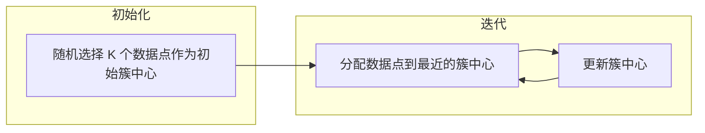

# K-均值聚类K-means原理与代码实例讲解

作者：禅与计算机程序设计艺术

## 1. 背景介绍

### 1.1 聚类分析概述

聚类分析是一种无监督学习方法，旨在将数据集中的对象根据其相似性进行分组。其目标是将数据划分到不同的簇中，使得同一簇内的对象彼此相似，而不同簇之间的对象则不相似。聚类分析广泛应用于各种领域，包括：

* **市场营销:**  客户细分，识别具有相似购买行为的客户群体。
* **图像分析:**  图像分割，将图像划分到不同的区域。
* **生物信息学:**  基因表达数据分析，将基因分组到功能相关的簇中。
* **异常检测:**  识别数据集中与其他数据点显著不同的异常值。


### 1.2 K-means聚类算法简介

K-means 算法是一种常用的划分聚类算法，它将数据集划分为 K 个簇，其中 K 是用户预先指定的参数。该算法的基本思想是迭代地将数据点分配到最近的簇中心，并更新簇中心，直到收敛。

## 2. 核心概念与联系

### 2.1 距离度量

K-means 算法依赖于距离度量来衡量数据点之间的相似性。常用的距离度量包括：

* **欧几里得距离:**  这是最常用的距离度量，它计算两点之间的直线距离。
* **曼哈顿距离:**  它计算两点之间沿坐标轴的距离之和。
* **余弦相似度:**  它衡量两个向量之间的夹角余弦值，用于文本数据等高维数据。


### 2.2 簇中心

簇中心是每个簇的代表点，它反映了簇中所有数据点的平均位置。在 K-means 算法中，簇中心是通过计算簇中所有数据点的平均值来确定的。


### 2.3 迭代过程

K-means 算法是一种迭代算法，它包括以下步骤：

1. **初始化:**  随机选择 K 个数据点作为初始簇中心。
2. **分配:**  将每个数据点分配到距离其最近的簇中心所在的簇中。
3. **更新:**  根据分配结果更新每个簇的中心。
4. **重复步骤 2 和 3，直到收敛。**


### 2.4 收敛准则

K-means 算法的收敛准则可以是：

* **簇中心不再变化:**  当簇中心不再发生变化时，算法收敛。
* **目标函数不再减小:**  K-means 算法的目标函数是所有数据点到其所属簇中心的距离平方和，当目标函数不再减小时，算法收敛。


## 3. 核心算法原理具体操作步骤

### 3.1 算法步骤

K-means 算法的具体步骤如下：

1. **输入:**  数据集 $X = \{x_1, x_2, ..., x_n\}$，簇数 K。
2. **初始化:**  随机选择 K 个数据点作为初始簇中心 $c_1, c_2, ..., c_K$。
3. **重复以下步骤，直到收敛:**
    * **分配:**  对于每个数据点 $x_i$，计算其到每个簇中心 $c_j$ 的距离 $d(x_i, c_j)$，并将 $x_i$ 分配到距离其最近的簇中心所在的簇中。
    * **更新:**  对于每个簇 $C_j$，计算其所有数据点的平均值，并将该平均值作为新的簇中心 $c_j$。
4. **输出:**  K 个簇 $C_1, C_2, ..., C_K$。


### 3.2 图示说明

下图展示了 K-means 算法的迭代过程：




## 4. 数学模型和公式详细讲解举例说明

### 4.1 目标函数

K-means 算法的目标函数是所有数据点到其所属簇中心的距离平方和，也称为簇内平方和 (WCSS)：

$$
WCSS = \sum_{j=1}^{K} \sum_{x_i \in C_j} d(x_i, c_j)^2
$$

其中，$C_j$ 表示第 $j$ 个簇，$c_j$ 表示第 $j$ 个簇的中心，$d(x_i, c_j)$ 表示数据点 $x_i$ 到簇中心 $c_j$ 的距离。


### 4.2 距离度量

常用的距离度量包括：

* **欧几里得距离:**

$$
d(x_i, x_j) = \sqrt{\sum_{k=1}^{m} (x_{ik} - x_{jk})^2}
$$

其中，$x_i$ 和 $x_j$ 是两个数据点，$m$ 是数据点的维度。

* **曼哈顿距离:**

$$
d(x_i, x_j) = \sum_{k=1}^{m} |x_{ik} - x_{jk}|
$$


### 4.3 举例说明

假设我们有一个二维数据集，包含 10 个数据点：

```
X = [[1, 2], [1, 4], [1, 0], [10, 2], [10, 4], [10, 0], [1, 1], [10, 1], [1, 3], [10, 3]]
```

我们想要将这些数据点聚类到 K=2 个簇中。

1. **初始化:**  随机选择两个数据点作为初始簇中心，例如 $c_1 = [1, 2]$ 和 $c_2 = [10, 4]$。
2. **分配:**  计算每个数据点到两个簇中心的距离，并将数据点分配到距离其最近的簇中心所在的簇中。例如，数据点 $[1, 4]$ 到 $c_1$ 的距离为 $\sqrt{(1-1)^2 + (4-2)^2} = 2$，到 $c_2$ 的距离为 $\sqrt{(10-1)^2 + (4-4)^2} = 9$，因此将 $[1, 4]$ 分配到簇 $C_1$ 中。
3. **更新:**  计算每个簇的所有数据点的平均值，并将该平均值作为新的簇中心。例如，簇 $C_1$ 中的数据点为 $[1, 2], [1, 4], [1, 0], [1, 1], [1, 3]$，其平均值为 $[(1+1+1+1+1)/5, (2+4+0+1+3)/5] = [1, 2]$，因此新的簇中心 $c_1 = [1, 2]$。
4. **重复步骤 2 和 3，直到收敛。**

最终，K-means 算法将数据集划分为两个簇：

* $C_1 = \{[1, 2], [1, 4], [1, 0], [1, 1], [1, 3]\}$
* $C_2 = \{[10, 2], [10, 4], [10, 0], [10, 1], [10, 3]\}$


## 5. 项目实践：代码实例和详细解释说明

### 5.1 Python 代码实现

```python
import numpy as np

def kmeans(X, K, max_iters=100):
  """
  K-means 聚类算法

  参数：
    X：数据集，numpy 数组，形状为 (n_samples, n_features)
    K：簇数
    max_iters：最大迭代次数

  返回值：
    centroids：簇中心，numpy 数组，形状为 (K, n_features)
    labels：每个数据点所属的簇标签，numpy 数组，形状为 (n_samples,)
  """

  # 随机选择 K 个数据点作为初始簇中心
  n_samples = X.shape[0]
  indices = np.random.choice(n_samples, K, replace=False)
  centroids = X[indices]

  # 迭代更新簇中心
  for i in range(max_iters):
    # 分配数据点到最近的簇中心
    distances = np.linalg.norm(X[:, np.newaxis, :] - centroids, axis=2)
    labels = np.argmin(distances, axis=1)

    # 更新簇中心
    new_centroids = np.array([X[labels == k].mean(axis=0) for k in range(K)])

    # 检查是否收敛
    if np.allclose(centroids, new_centroids):
      break

    centroids = new_centroids

  return centroids, labels
```


### 5.2 代码解释

* **kmeans(X, K, max_iters=100):**  该函数实现了 K-means 算法。
* **X：**  数据集，numpy 数组，形状为 (n_samples, n_features)。
* **K：**  簇数。
* **max_iters：**  最大迭代次数。
* **centroids：**  簇中心，numpy 数组，形状为 (K, n_features)。
* **labels：**  每个数据点所属的簇标签，numpy 数组，形状为 (n_samples,)。


### 5.3 使用示例

```python
# 生成示例数据集
X = np.array([[1, 2], [1, 4], [1, 0], [10, 2], [10, 4], [10, 0], [1, 1], [10, 1], [1, 3], [10, 3]])

# 设置簇数
K = 2

# 运行 K-means 算法
centroids, labels = kmeans(X, K)

# 打印簇中心
print("簇中心：", centroids)

# 打印每个数据点所属的簇标签
print("簇标签：", labels)
```


## 6. 实际应用场景

### 6.1 客户细分

在市场营销中，K-means 聚类可用于将客户细分为不同的群体，以便进行 targeted marketing。例如，我们可以根据客户的购买历史、人口统计信息和行为数据将客户聚类到不同的群体中，并为每个群体制定不同的营销策略。


### 6.2 图像分割

在图像分析中，K-means 聚类可用于将图像分割成不同的区域。例如，我们可以将图像的像素颜色值作为特征，将像素聚类到不同的颜色区域中，从而实现图像分割。


### 6.3 基因表达数据分析

在生物信息学中，K-means 聚类可用于将基因分组到功能相关的簇中。例如，我们可以将基因的表达水平作为特征，将基因聚类到不同的表达模式中，从而识别功能相关的基因簇。


### 6.4 异常检测

在异常检测中，K-means 聚类可用于识别数据集中与其他数据点显著不同的异常值。例如，我们可以将数据点的特征值作为输入，将数据点聚类到不同的簇中，并将不属于任何簇的数据点视为异常值。


## 7. 工具和资源推荐

### 7.1 Scikit-learn

Scikit-learn 是一个流行的 Python 机器学习库，它提供了 KMeans 类用于实现 K-means 聚类算法。

```python
from sklearn.cluster import KMeans

# 创建 KMeans 对象
kmeans = KMeans(n_clusters=2)

# 拟合模型
kmeans.fit(X)

# 获取簇中心
centroids = kmeans.cluster_centers_

# 获取簇标签
labels = kmeans.labels_
```


### 7.2 TensorFlow

TensorFlow 是一个开源的机器学习平台，它也提供了 K-means 聚类算法的实现。


### 7.3 其他资源

* **K-means Clustering:**  https://en.wikipedia.org/wiki/K-means_clustering
* **K-means Clustering in Python:**  https://towardsdatascience.com/k-means-clustering-in-python-8c79d3a4ac58


## 8. 总结：未来发展趋势与挑战

### 8.1 未来发展趋势

* **改进算法效率:**  研究更高效的 K-means 算法变体，例如 K-means++ 和 MiniBatch K-means。
* **处理大规模数据集:**  开发适用于大规模数据集的 K-means 算法，例如基于 MapReduce 的 K-means 算法。
* **自动确定簇数:**  研究自动确定最佳簇数的方法，例如肘部法则和轮廓系数。


### 8.2 挑战

* **对初始簇中心敏感:**  K-means 算法的结果对初始簇中心的选择很敏感，不同的初始簇中心可能导致不同的聚类结果。
* **难以处理非球形簇:**  K-means 算法更适合处理球形簇，对于非球形簇，聚类效果可能不佳。
* **需要预先指定簇数:**  K-means 算法需要用户预先指定簇数，这在实际应用中可能并不容易确定。


## 9. 附录：常见问题与解答

### 9.1 如何选择最佳簇数？

选择最佳簇数是一个重要的问题，常用的方法包括：

* **肘部法则:**  绘制 WCSS 随簇数变化的曲线，选择曲线的“肘部”作为最佳簇数。
* **轮廓系数:**  计算每个数据点的轮廓系数，选择平均轮廓系数最高的簇数。


### 9.2 如何解决 K-means 算法对初始簇中心敏感的问题？

解决 K-means 算法对初始簇中心敏感问题的方法包括：

* **多次运行 K-means 算法，选择 WCSS 最低的聚类结果。**
* **使用 K-means++ 算法初始化簇中心，该算法可以更均匀地选择初始簇中心。**


### 9.3 如何处理非球形簇？

处理非球形簇的方法包括：

* **使用核 K-means 算法，该算法可以将数据映射到更高维空间，使其更易于聚类。**
* **使用其他聚类算法，例如 DBSCAN 和层次聚类。**
