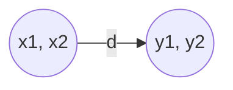

# K-最近邻KNN原理与代码实例讲解

## 1.背景介绍

### 1.1 什么是K-最近邻算法？

K-最近邻(K-Nearest Neighbor, KNN)算法是一种基本且简单的机器学习算法,广泛应用于模式识别、数据挖掘和入侵检测等领域。它的工作原理是通过计算待分类数据与已知数据之间的距离,找出K个最近的邻居,然后根据这K个邻居的多数类别来预测待分类数据的类别。

KNN算法属于基于实例的学习(Instance-based Learning)方法,也被称为惰性学习(Lazy Learning),因为在训练阶段只需要存储训练数据,而在分类的时候才进行实际的计算。这与其他机器学习算法形成了鲜明对比,后者通常在训练阶段就对数据进行处理和建模。

### 1.2 KNN算法的优缺点

优点:

1. **简单高效**:KNN算法的原理非常简单,无需建立复杂的数学模型,易于理解和实现。
2. **无需训练过程**:KNN算法不需要进行训练,只需要存储训练数据,因此非常高效。
3. **适用于非线性数据**:KNN算法能够很好地处理非线性数据,而许多传统的机器学习算法在这方面表现不佳。

缺点:

1. **计算成本高**:对于大型数据集,KNN算法需要计算待分类数据与所有训练数据之间的距离,计算量可能非常大。
2. **curse of dimensionality**:在高维空间中,由于维数的增加,数据变得越来越稀疏,导致KNN算法的性能下降。
3. **对噪声敏感**:KNN算法对异常值和噪声数据比较敏感,可能会影响算法的精度。

### 1.3 KNN算法的应用场景

KNN算法由于其简单性和高效性,被广泛应用于以下领域:

- **模式识别**:如手写字符识别、图像识别等。
- **数据挖掘**:如基因分类、客户细分等。
- **入侵检测**:通过分析网络流量数据来检测入侵行为。
- **推荐系统**:根据用户的历史行为推荐相似的产品或内容。

## 2.核心概念与联系

### 2.1 距离度量

KNN算法的核心是计算待分类数据与已知数据之间的距离,常用的距离度量方法包括:

1. **欧氏距离(Euclidean Distance)**

   欧氏距离是最常用的距离度量方法,它表示两个向量在欧式空间中的直线距离。对于$n$维空间中的两个向量$X=(x_1, x_2, ..., x_n)$和$Y=(y_1, y_2, ..., y_n)$,它们之间的欧氏距离定义为:

   $$d(X,Y) = \sqrt{\sum_{i=1}^{n}(x_i - y_i)^2}$$

2. **曼哈顿距离(Manhattan Distance)**

   曼哈顿距离也称为城市街区距离,它表示两个向量在每个维度上的绝对差值之和。对于$n$维空间中的两个向量$X=(x_1, x_2, ..., x_n)$和$Y=(y_1, y_2, ..., y_n)$,它们之间的曼哈顿距离定义为:

   $$d(X,Y) = \sum_{i=1}^{n}|x_i - y_i|$$

3. **切比雄夫距离(Chebyshev Distance)**

   切比雄夫距离是一种基于向量的最大值来度量距离的方法,也被称为棋盘距离。对于$n$维空间中的两个向量$X=(x_1, x_2, ..., x_n)$和$Y=(y_1, y_2, ..., y_n)$,它们之间的切比雄夫距离定义为:

   $$d(X,Y) = \max_{i=1,...,n}|x_i - y_i|$$

不同的距离度量方法适用于不同的场景,选择合适的距离度量对KNN算法的性能有很大影响。

### 2.2 K值的选择

K值的选择也是KNN算法中一个重要的参数。K值太小,可能会导致模型过于简单,对噪声数据敏感;K值太大,可能会使模型过于复杂,无法有效反映局部特征。通常需要通过交叉验证等方法来选择最优的K值。

### 2.3 分类决策规则

KNN算法在找到K个最近邻居后,需要根据一定的规则来确定待分类数据的类别。常用的决策规则包括:

1. **简单多数投票**:将待分类数据划分到K个最近邻居中出现次数最多的那个类别。
2. **加权投票**:根据每个邻居与待分类数据的距离赋予不同的权重,距离越近的邻居权重越大,然后根据加权投票结果确定类别。

## 3.核心算法原理具体操作步骤

KNN算法的核心步骤如下:

1. **准备训练数据**:收集并准备好标注的训练数据集。
2. **计算距离**:对于待分类的新数据,计算它与训练数据集中每个数据实例的距离。
3. **寻找最近邻居**:根据距离值,从训练数据集中找出与新数据最近的K个邻居。
4. **分类决策**:根据K个最近邻居的类别标签,通过投票等决策规则来预测新数据的类别。

我们可以用以下伪代码来描述KNN算法的具体实现:

```python
# 训练数据集
train_data = load_data('train_data.csv')
train_labels = load_data('train_labels.csv')

# 待分类的新数据
new_data = load_data('new_data.csv')

# 计算新数据与每个训练数据之间的距离
distances = []
for data in train_data:
    distance = calculate_distance(new_data, data)
    distances.append((distance, train_labels[data]))

# 按距离排序并找出K个最近邻居
distances.sort(key=lambda x: x[0])
k_neighbors = distances[:K]

# 根据K个最近邻居的标签进行投票
class_votes = {}
for neighbor in k_neighbors:
    label = neighbor[1]
    class_votes[label] = class_votes.get(label, 0) + 1

# 预测新数据的类别
predicted_label = max(class_votes, key=class_votes.get)
```

在实际应用中,我们可以使用Python的scikit-learn库来快速实现KNN算法,代码如下:

```python
from sklearn.neighbors import KNeighborsClassifier

# 加载训练数据和标签
X_train, y_train = load_data('train_data.csv', 'train_labels.csv')

# 创建KNN分类器
knn = KNeighborsClassifier(n_neighbors=5)

# 训练模型
knn.fit(X_train, y_train)

# 预测新数据的类别
X_new = load_data('new_data.csv')
y_pred = knn.predict(X_new)
```

## 4.数学模型和公式详细讲解举例说明

KNN算法本身没有复杂的数学模型,但是在计算距离时涉及到一些数学概念和公式。我们以欧氏距离为例,详细讲解其数学原理。

### 4.1 欧氏距离的定义

欧氏距离是两个点在欧式空间中的直线距离,它是最常用的距离度量方法。对于$n$维空间中的两个向量$X=(x_1, x_2, ..., x_n)$和$Y=(y_1, y_2, ..., y_n)$,它们之间的欧氏距离定义为:

$$d(X,Y) = \sqrt{\sum_{i=1}^{n}(x_i - y_i)^2}$$

这个公式可以看作是勾股定理在$n$维空间中的推广。

### 4.2 欧氏距离的几何意义

我们可以通过一个二维平面上的例子来直观地理解欧氏距离的几何意义。

假设有两个点$A(x_1, x_2)$和$B(y_1, y_2)$,它们之间的欧氏距离就是连接这两个点的直线段的长度,如下图所示:



根据勾股定理,我们可以计算出$d$的值:

$$d = \sqrt{(x_1 - y_1)^2 + (x_2 - y_2)^2}$$

这就是二维空间中欧氏距离的具体计算公式。

### 4.3 欧氏距离的性质

欧氏距离满足以下几个重要的性质:

1. **非负性**:对于任意两个向量$X$和$Y$,有$d(X,Y) \geq 0$,当且仅当$X=Y$时,距离为0。
2. **对称性**:对于任意两个向量$X$和$Y$,有$d(X,Y) = d(Y,X)$。
3. **直线性**:对于任意向量$X$、$Y$和$Z$,有$d(X,Y+Z) \leq d(X,Y) + d(X,Z)$。

这些性质使得欧氏距离成为一个合理的距离度量方法。

### 4.4 欧氏距离的应用

除了KNN算法之外,欧氏距离在许多其他领域也有广泛的应用,例如:

- **聚类分析**:使用欧氏距离作为相似度度量,对数据进行聚类。
- **图像处理**:计算两个像素点之间的欧氏距离,用于图像去噪、边缘检测等操作。
- **推荐系统**:根据用户特征向量与商品特征向量之间的欧氏距离,推荐相似的商品。

## 4.项目实践:代码实例和详细解释说明

接下来,我们将通过一个实际的代码示例,详细解释如何使用Python实现KNN算法。我们将使用scikit-learn库中的KNeighborsClassifier类。

### 4.1 导入所需库

首先,我们需要导入一些必要的Python库:

```python
import numpy as np
from sklearn.neighbors import KNeighborsClassifier
from sklearn.model_selection import train_test_split
from sklearn.datasets import load_iris
from sklearn.metrics import accuracy_score
```

- `numpy`用于数值计算
- `sklearn.neighbors`提供了KNN分类器
- `sklearn.model_selection`用于数据集划分
- `sklearn.datasets`提供了一些示例数据集
- `sklearn.metrics`用于评估模型性能

### 4.2 加载数据集

我们将使用scikit-learn提供的著名的鸢尾花数据集(Iris Dataset)作为示例:

```python
# 加载鸢尾花数据集
iris = load_iris()
X = iris.data
y = iris.target
```

这个数据集包含150个样本,每个样本有4个特征,分为3个类别(setosa、versicolor和virginica)。

### 4.3 数据集划分

为了评估模型的性能,我们需要将数据集划分为训练集和测试集:

```python
# 将数据集划分为训练集和测试集
X_train, X_test, y_train, y_test = train_test_split(X, y, test_size=0.2, random_state=42)
```

我们将20%的数据作为测试集,剩余80%作为训练集。`random_state`参数用于保证每次运行时得到相同的划分结果。

### 4.4 创建KNN分类器

接下来,我们创建一个KNN分类器实例:

```python
# 创建KNN分类器
knn = KNeighborsClassifier(n_neighbors=5)
```

这里我们设置`n_neighbors=5`,表示在预测时使用5个最近邻居进行投票。

### 4.5 训练模型

使用训练集数据训练KNN模型:

```python
# 训练模型
knn.fit(X_train, y_train)
```

这一步将计算每个训练样本与其他训练样本之间的距离,并存储起来,以备后续使用。

### 4.6 模型预测

使用训练好的模型对测试集数据进行预测:

```python
# 预测测试集
y_pred = knn.predict(X_test)
```

`predict`方法将计算每个测试样本与训练集中所有样本的距离,找出最近的K个邻居,并根据这K个邻居的标签进行投票,得到预测结果。

### 4.7 模型评估

最后,我们计算模型在测试集上的准确率,评估模型的性能:

```python
# 计算准确率
accuracy = accuracy_score(y_test, y_pred)
print(f"Accuracy: {accuracy:.2f}")
```

`accuracy_score`函数将比较预测值与真实值,计算准确率。在这个示例中,