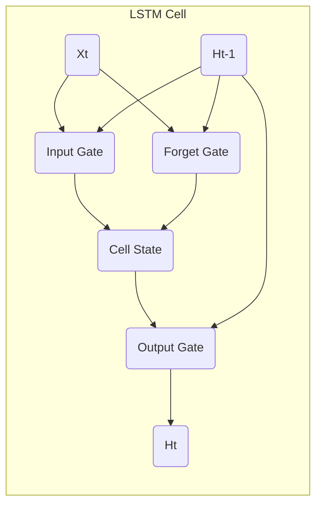

## 1. 背景介绍

### 1.1 全球能源挑战

随着全球人口的增长和经济的发展，能源需求不断攀升。然而，传统的能源生产方式，如化石燃料燃烧，带来了严重的环境问题，例如气候变化和空气污染。为了应对这些挑战，世界各国都在积极探索可持续的能源解决方案，其中包括提高能源利用效率。

### 1.2 人工智能在能源领域的应用

近年来，人工智能 (AI) 技术的快速发展为能源领域带来了新的机遇。AI 可以用于优化能源生产、分配和消费，从而提高能源利用效率。例如，AI 可以用于预测能源需求、优化电网调度、控制智能家居中的能源消耗等。

### 1.3 LSTM 在时间序列数据分析中的优势

长短期记忆网络 (LSTM) 是一种特殊类型的循环神经网络 (RNN)，特别擅长处理时间序列数据。LSTM 具有“记忆”能力，可以捕捉数据中的长期依赖关系。这使得 LSTM 非常适合用于分析能源消耗数据，这些数据通常具有时间依赖性。

## 2. 核心概念与联系

### 2.1 LSTM 网络结构

LSTM 网络由多个 LSTM 单元组成，每个单元包含三个门控机制：输入门、遗忘门和输出门。这些门控机制控制着信息的流动，使得 LSTM 可以选择性地记忆或遗忘信息。

* **输入门**：控制哪些新信息应该被添加到单元状态中。
* **遗忘门**：控制哪些旧信息应该被从单元状态中移除。
* **输出门**：控制哪些信息应该被输出到下一个时间步。

### 2.2 LSTM 如何处理时间序列数据

LSTM 通过循环的方式处理时间序列数据。在每个时间步，LSTM 单元接收当前时间步的输入数据，并结合前一个时间步的隐藏状态，计算出当前时间步的输出和新的隐藏状态。隐藏状态包含了 LSTM 对过去信息的记忆，并用于预测未来的数据。

### 2.3 LSTM 在能源应用中的优势

* **捕捉时间依赖性**：LSTM 可以捕捉能源消耗数据中的时间依赖性，例如季节性变化和日夜循环。
* **预测未来能源需求**：LSTM 可以根据历史数据预测未来的能源需求，从而优化能源生产和分配。
* **优化能源消耗**：LSTM 可以用于控制智能家居中的能源消耗，例如根据用户的习惯自动调节空调温度。

## 3. 核心算法原理具体操作步骤

### 3.1 数据预处理

* **数据清洗**：去除异常值和缺失值。
* **数据归一化**：将数据缩放到相同的范围，例如 [0, 1]。
* **特征工程**：提取与能源消耗相关的特征，例如时间、温度、湿度等。

### 3.2 模型构建

* **选择合适的 LSTM 架构**：根据数据的复杂度和预测目标选择合适的 LSTM 架构，例如堆叠多个 LSTM 层或使用双向 LSTM。
* **设置超参数**：选择合适的学习率、批大小、迭代次数等超参数。
* **训练模型**：使用历史数据训练 LSTM 模型，并根据验证集的表现调整模型参数。

### 3.3 模型评估

* **使用测试集评估模型性能**：使用未参与训练的测试集评估模型的预测精度。
* **选择合适的评估指标**：根据预测目标选择合适的评估指标，例如均方根误差 (RMSE) 或平均绝对误差 (MAE)。

### 3.4 模型部署

* **将训练好的模型部署到实际应用中**：例如将模型集成到智能电网系统或智能家居平台中。
* **实时监控模型性能**：定期评估模型的预测精度，并根据需要更新模型参数。

## 4. 数学模型和公式详细讲解举例说明

### 4.1 LSTM 单元结构



* $X_t$:  t 时刻的输入向量
* $H_{t-1}$: t-1 时刻的隐藏状态向量
* $C_{t-1}$: t-1 时刻的单元状态向量
* $i_t$: t 时刻的输入门
* $f_t$: t 时刻的遗忘门
* $o_t$: t 时刻的输出门
* $C_t$: t 时刻的单元状态向量
* $H_t$: t 时刻的隐藏状态向量

### 4.2 LSTM 单元计算公式

**输入门:**

$i_t = \sigma(W_i \cdot [h_{t-1}, x_t] + b_i)$

**遗忘门:**

$f_t = \sigma(W_f \cdot [h_{t-1}, x_t] + b_f)$

**单元状态:**

$C_t = f_t * C_{t-1} + i_t * \tanh(W_c \cdot [h_{t-1}, x_t] + b_c)$

**输出门:**

$o_t = \sigma(W_o \cdot [h_{t-1}, x_t] + b_o)$

**隐藏状态:**

$h_t = o_t * \tanh(C_t)$

其中：

* $\sigma$: sigmoid 函数
* $\tanh$: 双曲正切函数
* $W_i$, $W_f$, $W_c$, $W_o$: 权重矩阵
* $b_i$, $b_f$, $b_c$, $b_o$: 偏置向量

### 4.3 示例：预测家庭能源消耗

假设我们有一组家庭能源消耗数据，包括时间、温度、湿度和能源消耗量。我们可以使用 LSTM 模型来预测未来的能源消耗量。

1. **数据预处理:** 将时间转换为数字特征，并将所有特征归一化到 [0, 1] 范围内。
2. **模型构建:** 使用一个包含 128 个 LSTM 单元的 LSTM 层，并设置学习率为 0.001，批大小为 32，迭代次数为 100。
3. **模型训练:** 使用历史数据训练 LSTM 模型，并使用验证集评估模型性能。
4. **模型评估:** 使用测试集评估模型的预测精度，例如使用 RMSE 或 MAE 作为评估指标。
5. **模型部署:** 将训练好的模型部署到智能家居平台中，用于预测家庭未来的能源消耗量，并根据预测结果优化能源消耗策略。

## 5. 项目实践：代码实例和详细解释说明

```python
import tensorflow as tf

# 定义 LSTM 模型
model = tf.keras.Sequential([
  tf.keras.layers.LSTM(128, input_shape=(timesteps, features)),
  tf.keras.layers.Dense(1)
])

# 编译模型
model.compile(loss='mse', optimizer='adam')

# 训练模型
model.fit(X_train, y_train, epochs=100, batch_size=32)

# 评估模型
loss = model.evaluate(X_test, y_test)

# 预测未来能源消耗量
predictions = model.predict(X_future)
```

**代码解释:**

* `tf.keras.layers.LSTM(128, input_shape=(timesteps, features))`: 定义一个包含 128 个 LSTM 单元的 LSTM 层，输入数据的形状为 `(timesteps, features)`，其中 `timesteps` 表示时间步长，`features` 表示特征数量。
* `tf.keras.layers.Dense(1)`: 定义一个输出层，输出一个预测值。
* `model.compile(loss='mse', optimizer='adam')`: 编译模型，使用均方误差 (MSE) 作为损失函数，使用 Adam 优化器。
* `model.fit(X_train, y_train, epochs=100, batch_size=32)`: 使用训练数据 `X_train` 和 `y_train` 训练模型，设置迭代次数为 100，批大小为 32。
* `model.evaluate(X_test, y_test)`: 使用测试数据 `X_test` 和 `y_test` 评估模型性能，返回损失值。
* `model.predict(X_future)`: 使用模型预测未来能源消耗量，输入数据为 `X_future`。

## 6. 实际应用场景

* **智能电网:** LSTM 可以用于预测电力需求，优化电网调度，提高电网稳定性和可靠性。
* **智能家居:** LSTM 可以用于预测家庭能源消耗，优化空调温度、照明等设备的运行，提高能源利用效率。
* **新能源预测:** LSTM 可以用于预测太阳能、风能等新能源的发电量，优化能源生产和分配。
* **能源交易:** LSTM 可以用于预测能源价格波动，帮助能源交易者做出更明智的决策。

## 7. 总结：未来发展趋势与挑战

### 7.1 未来发展趋势

* **更先进的 LSTM 模型:** 研究人员正在开发更先进的 LSTM 模型，例如注意力机制 LSTM 和 Transformer-XL，以进一步提高预测精度。
* **多源数据融合:** 将 LSTM 与其他数据源（例如天气预报、传感器数据等）相结合，以提高预测的准确性和可靠性。
* **边缘计算:** 将 LSTM 模型部署到边缘设备，例如智能电表和智能家居设备，以实现实时能源优化。

### 7.2 面临的挑战

* **数据质量:** LSTM 模型的性能 heavily relies on the quality of the training data. 
* **模型可解释性:** LSTM 模型的决策过程难以解释，这可能会限制其在某些应用场景中的应用。
* **计算成本:** 训练和部署 LSTM 模型需要大量的计算资源，这可能会限制其在资源受限环境中的应用。

## 8. 附录：常见问题与解答

### 8.1 LSTM 和 RNN 的区别是什么？

LSTM 是一种特殊的 RNN，它引入了门控机制来解决 RNN 中的梯度消失问题。门控机制使得 LSTM 可以更好地捕捉数据中的长期依赖关系。

### 8.2 如何选择合适的 LSTM 架构？

LSTM 架构的选择取决于数据的复杂度和预测目标。对于简单的预测任务，可以使用单层 LSTM。对于更复杂的预测任务，可以使用多层 LSTM 或双向 LSTM。

### 8.3 如何评估 LSTM 模型的性能？

可以使用多种指标来评估 LSTM 模型的性能，例如均方根误差 (RMSE)、平均绝对误差 (MAE) 和 R 方 (R-squared)。

### 8.4 LSTM 可以用于哪些能源应用场景？

LSTM 可以用于各种能源应用场景，例如智能电网、智能家居、新能源预测和能源交易。
