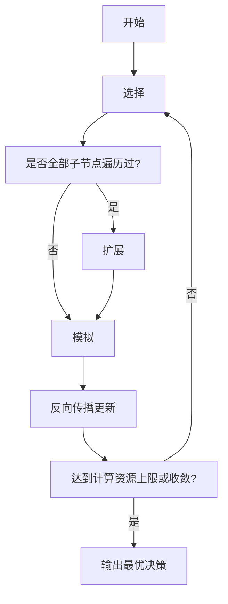

# MCTS在控制论领域的应用前景

## 1.背景介绍

### 1.1 控制论概述

控制论是一门研究如何根据系统输入和输出之间的关系，通过对被控对象施加控制作用从而使系统保持在期望状态的理论与应用学科。它广泛应用于工业生产、航空航天、机器人、交通运输等诸多领域。

传统控制理论主要包括经典控制理论(如PID控制)和现代控制理论(如最优控制、鲁棒控制等)。这些理论在许多领域取得了巨大的成功,但也存在一些局限性,例如对非线性、时变等复杂系统建模和控制存在挑战。

### 1.2 智能控制的兴起

随着人工智能技术的不断发展,智能控制理论应运而生,旨在利用人工智能算法和方法来解决复杂控制系统中的各种挑战。智能控制可分为基于知识的智能控制(如专家系统、模糊逻辑控制)和基于计算智能的智能控制(如神经网络控制、进化算法优化等)。

其中,基于计算智能的智能控制因其强大的学习和优化能力,在处理复杂、非线性、不确定等问题时表现出了巨大的潜力。蒙特卡罗树搜索(Monte Carlo Tree Search, MCTS)作为一种新兴的基于采样的最优化决策算法,在控制领域也展现出了广阔的应用前景。

## 2.核心概念与联系  

### 2.1 MCTS算法概述

MCTS是一种有效的基于采样的最优化决策算法,最早被成功应用于计算机对弈游戏领域。它通过在一个树形结构中反复采样,逐步构建一个价值估计函数,并据此选择最优决策。

MCTS的核心思想是:每个时间步,通过对可能的后续状态进行采样模拟并评估,来更新当前状态的价值估计。通过反复采样和更新,最终收敛到最优策略。MCTS主要包括四个步骤:

1. 选择(Selection)
2. 扩展(Expansion) 
3. 模拟(Simulation)
4. 反向传播(Backpropagation)



### 2.2 MCTS与控制理论的联系

控制理论中的最优控制问题,可以被等效地建模为一个马尔可夫决策过程(Markov Decision Process, MDP)。在MDP中,我们需要找到一个最优策略,使得期望的累计回报最大化。

传统的动态规划算法如价值迭代和策略迭代,需要对整个状态空间进行遍历,当状态空间过大时计算代价极高。而MCTS通过有策略的采样方式,可以避免对整个状态空间进行遍历,从而降低了复杂度。

此外,MCTS还具有如下优势:

- 可以处理大规模、连续的状态和动作空间
- 无需事先建模,只需提供模拟器生成后续状态和奖励
- 可以通过设计不同的模拟策略和终止条件,适应各种问题场景

因此,MCTS为解决复杂最优控制问题提供了一种新的有效途径。

## 3.核心算法原理具体操作步骤

MCTS算法的四个核心步骤具体操作如下:

### 3.1 选择(Selection)

选择步骤从树根开始,沿着子节点价值最高的路径向下遍历,直到遇到一个未完全探索过的节点。常用的子节点选择策略是UCB(Upper Confidence Bound),它在exploitation(利用已探索部分)和exploration(探索未知部分)之间寻求平衡:

$$\mathrm{UCB}(n) = \overline{X}_n + c\sqrt{\frac{\ln N}{n}}$$

其中$\overline{X}_n$是节点n的平均回报值,$N$是父节点的访问次数,$n$是节点n的访问次数,$c>0$是一个常数,用于权衡探索和利用。

### 3.2 扩展(Expansion)

当选择到一个未完全探索过的节点时,需要对它进行扩展。扩展过程生成该节点的一个或多个子节点,作为下一步模拟的初始状态。

### 3.3 模拟(Simulation)  

从扩展得到的新节点开始,通过某种方法(如随机策略、启发式方法等)对游戏进行模拟,直到达到终止条件(如找到终止状态、步数上限等)。模拟的结果就是一个最终的状态及其对应的回报值。

### 3.4 反向传播(Backpropagation)

将模拟得到的回报值沿着模拟路径反向传播回去,更新每个经过节点的统计数据(如访问次数、平均回报值等)。反向传播保证了每次模拟的结果被充分利用。

上述四个步骤反复执行,直到达到计算资源上限(如最大迭代次数)或收敛(如树根节点的平均回报值不再变化)。最终,树根节点对应的子节点就是最优决策。

## 4.数学模型和公式详细讲解举例说明

### 4.1 马尔可夫决策过程(MDP)

控制问题常被建模为一个MDP,其数学模型定义如下:

- 状态空间$\mathcal{S}$
- 动作空间$\mathcal{A}$ 
- 转移概率 $P(s'|s,a)$,表示在状态$s$执行动作$a$后,转移到状态$s'$的概率
- 奖励函数$R(s,a,s')$,表示在状态$s$执行动作$a$并转移到$s'$所获得的即时奖励
- 折扣因子$\gamma \in [0,1)$,用于权衡即时和未来奖励的权重

目标是找到一个策略$\pi: \mathcal{S} \rightarrow \mathcal{A}$,使得期望的累计折扣奖励最大化:

$$\max_\pi \mathbb{E}\left[\sum_{t=0}^\infty \gamma^t R(s_t, a_t, s_{t+1})\right]$$

其中$s_0$是初始状态,$a_t=\pi(s_t)$是在状态$s_t$执行的动作,$s_{t+1} \sim P(\cdot|s_t, a_t)$是下一状态。

我们定义状态价值函数$V^\pi(s)$为在状态$s$执行策略$\pi$后的期望累计回报:

$$V^\pi(s) = \mathbb{E}_\pi\left[\sum_{t=0}^\infty \gamma^t R(s_t, a_t, s_{t+1}) \Big| s_0 = s\right]$$

同理,定义动作价值函数$Q^\pi(s,a)$为在状态$s$执行动作$a$,之后按策略$\pi$执行的期望累计回报:

$$Q^\pi(s,a) = \mathbb{E}_\pi\left[\sum_{t=0}^\infty \gamma^t R(s_t, a_t, s_{t+1}) \Big| s_0 = s, a_0 = a\right]$$

则最优状态价值函数和最优动作价值函数分别为:

$$V^*(s) = \max_\pi V^\pi(s)$$
$$Q^*(s,a) = \max_\pi Q^\pi(s,a)$$

并且二者满足以下恒等式(Bellman方程):

$$V^*(s) = \max_a Q^*(s,a)$$
$$Q^*(s,a) = \mathbb{E}_{s' \sim P(\cdot|s,a)}\left[R(s,a,s') + \gamma \max_{a'} Q^*(s',a')\right]$$

### 4.2 UCT算法

MCTS算法家族中最著名的UCT(Upper Confidence Bounds applied to Trees)算法,就是应用UCB公式来实现选择步骤的。

UCT中,对于一个节点$s$和它的子节点$s'$,我们定义:

- $N(s)$为节点$s$的访问次数
- $N(s,s')$为从$s$转移到$s'$的次数
- $\overline{X}(s,s')$为从$s$转移到$s'$的平均回报值

则UCB公式为:

$$\mathrm{UCB}(s,s') = \overline{X}(s,s') + c \sqrt{\frac{\ln N(s)}{N(s,s')}}$$

UCB值越高,说明该子节点的潜在价值越大。UCT算法在选择步骤会选择当前UCB值最大的子节点。

公式中的第一项$\overline{X}(s,s')$是exploitation部分,表示利用已探索过的部分;第二项$c \sqrt{\frac{\ln N(s)}{N(s,s')}}$是exploration部分,当$N(s,s')$较小时,该项较大,算法会倾向于探索未知部分。$c>0$是一个常数,用于权衡exploitation和exploration。

UCT算法的数学证明表明,随着时间趋于无穷,UCT能够以概率1收敛到最优策略。

### 4.3 举例说明

考虑一个简单的网格世界控制问题。机器人位于一个$4 \times 4$的网格中,起点为左上角(0,0),目标为右下角(3,3)。每一步,机器人可以选择上下左右四个动作,但是每个动作都有一定概率失败(机器人原地不动)。

我们将问题建模为一个MDP:

- 状态空间$\mathcal{S}$为所有可能的机器人位置坐标(x,y)
- 动作空间$\mathcal{A}$为{上,下,左,右}
- 转移概率$P(s'|s,a)$为在状态$s$执行动作$a$后到达状态$s'$的概率
  - 比如在(0,0)执行"右"动作,有0.8的概率转移到(1,0),0.2的概率原地不动
- 奖励函数$R(s,a,s') = -1$,除了到达(3,3)时奖励为0
- 折扣因子$\gamma = 0.9$

我们可以使用UCT算法在该MDP中寻找一个最优策略。以(0,0)为根节点建立一棵树,每个节点代表一个状态,边代表执行某个动作。

在选择步骤,UCT根据UCB公式选择最有潜力的子节点。比如当前在(0,0),UCB值为:

$$\begin{align*}
\mathrm{UCB}((0,0),(1,0)) &= \overline{X}((0,0),(1,0)) + c \sqrt{\frac{\ln N((0,0))}{N((0,0),(1,0))}}\\
\mathrm{UCB}((0,0),(0,1)) &= \overline{X}((0,0),(0,1)) + c \sqrt{\frac{\ln N((0,0))}{N((0,0),(0,1))}}\\
&\ldots
\end{align*}$$

UCT会选择UCB值最大的子节点继续向下搜索。当遇到未探索的节点时,就进入扩展和模拟步骤。模拟过程可以使用随机策略或者启发式方法,直到到达(3,3)或步数上限。

模拟完成后,通过反向传播更新所经过节点的统计数据(访问次数和平均回报值)。反复执行上述步骤,最终在(0,0)节点的子节点中,UCB值最大的那个子节点对应的动作就是最优策略在(0,0)的动作。

通过这个简单的例子,我们可以直观地理解UCT算法是如何通过反复采样,逐步构建出最优策略的。

## 5. 项目实践:代码实例和详细解释说明

下面给出一个使用Python实现的简单UCT算法示例,应用于上述网格世界问题。

```python
import math
import random

class GridWorldMDP:
    def __init__(self, width, height, start, goal):
        self.width = width
        self.height = height
        self.start = start
        self.goal = goal
        self.action_prob = 0.8  # 动作成功概率
        
    def get_actions(self, state):
        x, y = state
        actions = []
        if x > 0:
            actions.append('left')
        if x < self.width - 1:
            actions.append('right')
        if y > 0:
            actions.append('up')
        if y < self.height - 1:
            actions.append('down')
        return actions
    
    def get_successor(self, state, action):
        x, y = state
        if action ==