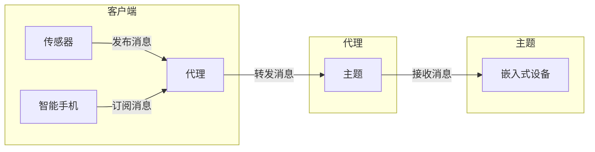

## 1. 背景介绍

### 1.1 物联网时代的通信挑战

  物联网（IoT）的快速发展带来了海量的设备和数据。这些设备需要相互连接，并与云端进行数据交换，这就对通信协议提出了新的要求。传统的通信协议，如HTTP和TCP，在处理大量设备的连接和数据传输方面效率低下，且资源消耗较大。为了解决这些问题，轻量级、高效、可靠的消息协议应运而生，MQTT就是其中佼佼者。

### 1.2 MQTT的起源和发展

  MQTT（Message Queuing Telemetry Transport）消息队列遥测传输协议，诞生于1999年，最初是为了满足石油管道监控的需求。由于其轻量级、低功耗、易于实现等特点，MQTT逐渐被广泛应用于物联网领域。2010年，MQTT成为OASIS标准，并于2014年成为ISO标准（ISO/IEC 20922），进一步推动了其发展和应用。

### 1.3 MQTT的特点和优势

  MQTT协议具有以下显著特点：

* **轻量级:** MQTT消息头非常小，最小只有2个字节，有效减少网络流量，适用于低带宽、高延迟的网络环境。
* **发布/订阅模式:** MQTT采用发布/订阅模式，消息发送者和接收者不需要建立直接连接，通过消息代理进行消息转发，实现解耦合通信。
* **QoS支持:** MQTT提供三种服务质量（QoS）级别，保证消息传输的可靠性。
* **易于实现:** MQTT协议简单易懂，便于开发和部署，支持多种编程语言和平台。

## 2. 核心概念与联系

### 2.1 客户端、代理和主题

  MQTT协议涉及三个核心组件：

* **客户端:**  指连接到MQTT代理的设备，可以是传感器、智能手机、嵌入式设备等，负责发布和订阅消息。
* **代理:**  MQTT消息代理，负责接收来自客户端的消息，并将消息转发到订阅该主题的客户端。
* **主题:**  消息的类别，用于标识消息的内容，客户端通过订阅特定主题接收消息。

  三者之间的关系可以用下图表示：



### 2.2 消息类型

  MQTT协议定义了多种消息类型，用于实现不同的功能：

* **CONNECT:** 客户端连接到代理。
* **PUBLISH:** 客户端发布消息到指定主题。
* **SUBSCRIBE:** 客户端订阅指定主题。
* **UNSUBSCRIBE:** 客户端取消订阅指定主题。
* **PINGREQ:** 客户端发送心跳包，维持与代理的连接。
* **DISCONNECT:** 客户端断开与代理的连接。

### 2.3 QoS级别

  MQTT提供三种服务质量（QoS）级别，用于控制消息传输的可靠性：

* **QoS 0 (At most once):**  消息最多发送一次，不保证消息到达接收者。
* **QoS 1 (At least once):**  消息至少发送一次，保证消息到达接收者，但可能重复发送。
* **QoS 2 (Exactly once):**  消息只发送一次，保证消息到达接收者且不重复发送。

  不同QoS级别对应不同的消息传输机制和可靠性，开发者可以根据应用场景选择合适的QoS级别。

## 3. 核心算法原理具体操作步骤

### 3.1 连接建立

  MQTT客户端通过TCP连接到MQTT代理，并在连接过程中进行以下操作：

1. 客户端发送CONNECT消息，包含客户端ID、用户名、密码等信息。
2. 代理接收CONNECT消息，验证客户端身份。
3. 代理发送CONNACK消息，确认连接建立成功。

### 3.2 消息发布

  客户端发布消息到指定主题，具体步骤如下：

1. 客户端发送PUBLISH消息，包含主题、QoS级别、消息内容等信息。
2. 代理接收PUBLISH消息，根据QoS级别进行消息存储和转发。
3. 代理将消息转发到订阅该主题的客户端。

### 3.3 消息订阅

  客户端订阅指定主题，接收该主题的消息，具体步骤如下：

1. 客户端发送SUBSCRIBE消息，包含要订阅的主题列表和QoS级别。
2. 代理接收SUBSCRIBE消息，记录客户端订阅信息。
3. 当代理接收到该主题的消息时，将消息转发到订阅该主题的客户端。

### 3.4 消息确认

  MQTT协议采用消息确认机制，保证消息传输的可靠性。根据QoS级别，消息确认机制有所不同：

* **QoS 0:**  不需要消息确认。
* **QoS 1:**  发布者发送PUBLISH消息后，接收者回复PUBREC消息确认收到消息，发布者收到PUBREC消息后回复PUBCOMP消息完成消息确认流程。
* **QoS 2:**  发布者发送PUBLISH消息后，接收者回复PUBREC消息确认收到消息，发布者收到PUBREC消息后发送PUBREL消息，接收者收到PUBREL消息后回复PUBCOMP消息完成消息确认流程。

## 4. 数学模型和公式详细讲解举例说明

  MQTT协议本身没有复杂的数学模型，其核心在于消息传输机制和QoS保证。

### 4.1 消息头结构

  MQTT消息头包含以下字段：

* **消息类型:**  标识消息类型，如CONNECT、PUBLISH、SUBSCRIBE等。
* **标志位:**  用于控制消息传输行为，如QoS级别、保留标志等。
* **剩余长度:**  表示消息体的字节数。

  不同消息类型的消息头结构略有不同，但都包含以上基本字段。

### 4.2 QoS级别保证

  MQTT QoS级别保证消息传输的可靠性，其原理是通过消息确认机制实现的。

* **QoS 0:**  不进行消息确认，消息传输效率最高，但可靠性最低。
* **QoS 1:**  接收者回复PUBREC消息确认收到消息，发布者收到PUBREC消息后回复PUBCOMP消息完成消息确认流程，保证消息至少发送一次。
* **QoS 2:**  发布者发送PUBLISH消息后，接收者回复PUBREC消息确认收到消息，发布者收到PUBREC消息后发送PUBREL消息，接收者收到PUBREL消息后回复PUBCOMP消息完成消息确认流程，保证消息只发送一次。

## 5. 项目实践：代码实例和详细解释说明

### 5.1 Python实现MQTT客户端

  以下是一个使用Python实现MQTT客户端的示例代码：

```python
import paho.mqtt.client as mqtt

# 定义MQTT代理地址和端口
broker_address = "mqtt.example.com"
broker_port = 1883

# 定义客户端ID
client_id = "my_client"

# 定义要订阅的主题
topic = "sensor/temperature"

# 定义回调函数，处理接收到的消息
def on_message(client, userdata, message):
    print("Received message on topic:", message.topic)
    print("Message payload:", message.payload.decode("utf-8"))

# 创建MQTT客户端对象
client = mqtt.Client(client_id)

# 设置回调函数
client.on_message = on_message

# 连接到MQTT代理
client.connect(broker_address, broker_port)

# 订阅主题
client.subscribe(topic)

# 开始消息循环
client.loop_forever()
```

  以上代码实现了连接到MQTT代理、订阅主题、接收消息的功能。

### 5.2 Node.js实现MQTT代理

  以下是一个使用Node.js实现MQTT代理的示例代码：

```javascript
const mosca = require("mosca");

// 创建MQTT代理服务器
const server = mosca.createServer({
  port: 1883,
});

// 监听客户端连接事件
server.on("clientConnected", (client) => {
  console.log("Client connected:", client.id);
});

// 监听客户端发布消息事件
server.on("published", (packet, client) => {
  console.log("Published message:", packet.payload.toString());
});

// 启动MQTT代理服务器
server.listen(1883, () => {
  console.log("MQTT broker listening on port 1883");
});
```

  以上代码实现了创建MQTT代理服务器、监听客户端连接和发布消息事件的功能。

## 6. 实际应用场景

### 6.1 智能家居

  MQTT协议广泛应用于智能家居领域，例如智能灯泡、智能插座、智能门锁等设备可以通过MQTT协议与智能家居平台进行通信，实现远程控制、状态监测等功能。

### 6.2 工业自动化

  在工业自动化领域，MQTT协议可以用于连接各种传感器、控制器和执行器，实现数据采集、设备控制和远程监控等功能，提高生产效率和安全性。

### 6.3 车联网

  车联网应用中，MQTT协议可以用于车辆与云端平台、车辆与车辆之间的通信，实现车辆定位、远程诊断、车队管理等功能。

### 6.4 环境监测

  环境监测领域，MQTT协议可以用于连接各种环境传感器，实现空气质量、水质、土壤等环境数据的实时采集和传输，为环境保护提供数据支持。

## 7. 总结：未来发展趋势与挑战

### 7.1 MQTT over WebSockets

  随着Web技术的不断发展，MQTT over WebSockets成为一种趋势，允许浏览器直接连接到MQTT代理，实现网页与物联网设备的交互。

### 7.2 MQTT安全

  随着物联网设备数量的增加，MQTT协议的安全性也越来越受到关注。未来MQTT协议将加强安全机制，例如支持TLS/SSL加密、身份认证等，保障物联网设备的安全通信。

### 7.3 MQTT与其他技术的融合

  MQTT协议将与其他技术，如人工智能、云计算、大数据等进行融合，实现更智能、更高效的物联网应用。

## 8. 附录：常见问题与解答

### 8.1 MQTT与HTTP的区别

  MQTT和HTTP都是通信协议，但它们的设计目标和应用场景不同。MQTT是轻量级消息协议，适用于物联网设备之间的通信，而HTTP是应用层协议，适用于网页浏览和数据传输。

### 8.2 MQTT的QoS级别如何选择

  选择合适的QoS级别取决于应用场景对消息可靠性的要求。QoS 0适用于对消息可靠性要求不高，但对传输效率要求较高的场景；QoS 1适用于对消息可靠性有一定要求的场景；QoS 2适用于对消息可靠性要求非常高的场景。

### 8.3 MQTT代理如何选择

  MQTT代理的选择取决于应用规模、性能要求、安全需求等因素。常用的MQTT代理有Mosquitto、EMQX、HiveMQ等。
