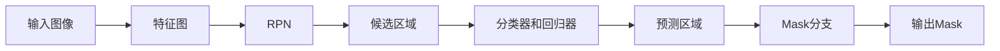

## 1.背景介绍

近年来，计算机视觉领域的发展瞬息万变。其中，图像分割和对象检测尤为引人注目。MaskR-CNN是一种强大的图像分割和对象检测算法，由Facebook AI Research (FAIR)开发，它是R-CNN系列算法的延伸。

MaskR-CNN在2017年的COCO挑战赛中一举夺得了图像分割和对象检测任务的冠军。这使得MaskR-CNN成为了对象识别、图像分割领域的基准框架。如今，无论是在科研界还是工业界，MaskR-CNN都有着广泛的应用。

本文旨在详细讲解MaskR-CNN的原理，以及如何在实践中应用这一算法。

## 2.核心概念与联系

MaskR-CNN的工作流程主要包括三个部分：区域提议网络（RPN）、分类器和回归器、以及Mask分支。下面，我们将逐一介绍这三个部分。

### 2.1 区域提议网络（RPN）

区域提议网络的主要任务是生成可能包含对象的区域。RPN通过滑动窗口的方式在特征图上生成锚点，然后预测这些锚点是否包含对象以及对象的边界框。

### 2.2 分类器和回归器

在RPN生成了候选区域之后，分类器和回归器会在这些区域上运行。分类器负责预测区域是否包含对象以及对象的类别，而回归器则负责微调区域的边界框。

### 2.3 Mask分支

Mask分支是MaskR-CNN的核心，它负责预测每个像素是否属于预测的对象。

## 3.核心算法原理具体操作步骤

MaskR-CNN的运行流程如下：

1. 输入图像经过卷积层和池化层，得到特征图。
2. 通过RPN在特征图上生成候选区域。
3. 对每个候选区域，通过分类器预测其是否包含对象以及对象的类别，通过回归器微调其边界框。
4. 对每个预测为对象的区域，通过Mask分支预测每个像素是否属于该对象。

整个过程可以表示为如下的Mermaid流程图：



## 4.数学模型和公式详细讲解举例说明

MaskR-CNN的核心是一个多任务损失函数，该函数由分类损失、回归损失和mask损失组成。其中：

1. 分类损失使用的是交叉熵损失。
2. 回归损失使用的是Smooth L1损失。
3. Mask损失使用的是二元交叉熵损失。

下面，我们将详细解释这些损失函数。

### 4.1 分类损失

分类损失使用的是交叉熵损失，公式如下：

$$
L_{cls} = -\sum_{i} y_i \log(\hat{y}_i)
$$

其中，$y_i$是真实的类别标签，$\hat{y}_i$是预测的类别概率。

### 4.2 回归损失

回归损失使用的是Smooth L1损失，公式如下：

$$
L_{reg} = \left\{\begin{array}{ll}
0.5 x^2 & \text{if } |x| < 1 \\
|x| - 0.5 & \text{otherwise}
\end{array}\right.
$$

其中，$x$是预测的边界框与真实边界框的差异。

### 4.3 Mask损失

Mask损失使用的是二元交叉熵损失，公式如下：

$$
L_{mask} = -\sum_{i} y_i \log(\hat{y}_i) + (1 - y_i) \log(1 - \hat{y}_i)
$$

其中，$y_i$是真实的像素标签，$\hat{y}_i$是预测的像素概率。

最后，MaskR-CNN的总损失函数为：

$$
L = L_{cls} + L_{reg} + L_{mask}
$$

## 5.项目实践：代码实例和详细解释说明

在Python中，可以使用`detectron2`库来实现MaskR-CNN。`detectron2`是Facebook AI Research开发的一个开源项目，它包含了许多最新的对象检测算法，包括MaskR-CNN。

以下是一个简单的示例，展示了如何使用`detectron2`来训练和使用MaskR-CNN。

首先，我们需要安装`detectron2`库。可以通过以下命令进行安装：

```bash
pip install detectron2
```

然后，我们可以使用以下代码来加载预训练的MaskR-CNN模型：

```python
from detectron2.engine import DefaultPredictor
from detectron2.config import get_cfg
from detectron2.utils.visualizer import Visualizer

# 加载配置文件
cfg = get_cfg()
cfg.merge_from_file("detectron2/configs/COCO-InstanceSegmentation/mask_rcnn_R_50_FPN_3x.yaml")

# 加载预训练模型
cfg.MODEL.WEIGHTS = "detectron2://COCO-InstanceSegmentation/mask_rcnn_R_50_FPN_3x/137849600/model_final_f10217.pkl"

# 创建预测器
predictor = DefaultPredictor(cfg)
```

有了预训练的模型，我们就可以进行对象检测和图像分割了。以下是一个简单的示例：

```python
import cv2

# 读取图像
img = cv2.imread("input.jpg")

# 进行对象检测和图像分割
outputs = predictor(img)

# 可视化结果
v = Visualizer(img[:, :, ::-1], scale=1.2)
v = v.draw_instance_predictions(outputs["instances"].to("cpu"))
cv2.imshow('result', v.get_image()[:, :, ::-1])
cv2.waitKey(0)
cv2.destroyAllWindows()
```

以上就是一个简单的MaskR-CNN的实践示例。在实际的项目中，我们可能还需要对模型进行训练，以适应特定的任务。

## 6.实际应用场景

由于MaskR-CNN的强大能力，它在许多领域都有着广泛的应用，包括：

1. 自动驾驶：通过MaskR-CNN，我们可以准确地检测和分割出路面上的车辆、行人等对象，为自动驾驶提供重要的信息。
2. 医疗图像分析：MaskR-CNN可以用于检测和分割医疗图像中的病变区域，帮助医生进行诊断。
3. 视频监控：通过MaskR-CNN，我们可以实现对视频中人员的精确检测和跟踪，提高视频监控的效果。

## 7.工具和资源推荐

如果你对MaskR-CNN感兴趣，以下是一些有用的资源：

1. `detectron2`: 这是一个由Facebook AI Research开发的开源项目，包含了许多最新的对象检测算法，包括MaskR-CNN。
2. `maskrcnn-benchmark`: 这是一个使用PyTorch实现的MaskR-CNN库，它的速度非常快，且具有良好的灵活性。
3. `matterport/Mask_RCNN`: 这是一个使用Keras实现的MaskR-CNN库，它的代码非常清晰，易于理解。

## 8.总结：未来发展趋势与挑战

MaskR-CNN的出现，使得我们可以同时进行对象检测和图像分割，极大地提高了计算机视觉的能力。然而，MaskR-CNN也面临一些挑战，包括计算量大、运行速度慢等。

随着技术的发展，我们期待有更多的算法能够解决这些问题，进一步推动计算机视觉的进步。

## 9.附录：常见问题与解答

**问：MaskR-CNN和Faster R-CNN有什么区别？**

答：MaskR-CNN是Faster R-CNN的延伸，它在Faster R-CNN的基础上增加了一个Mask分支，使得它可以同时进行对象检测和图像分割。

**问：MaskR-CNN的运行速度如何？**

答：MaskR-CNN的运行速度相对较慢，因为它需要进行对象检测和图像分割两个任务。实际的运行速度取决于许多因素，包括图像的大小、模型的复杂度、计算设备的性能等。

**问：我可以在CPU上运行MaskR-CNN吗？**

答：理论上是可以的，但在实际中，由于MaskR-CNN的计算量较大，如果在CPU上运行，可能会非常慢。因此，我们通常在GPU上运行MaskR-CNN。

**问：我可以使用MaskR-CNN进行视频分析吗？**

答：可以的。实际上，MaskR-CNN在视频分析中有着广泛的应用，包括视频监控、行为识别等。