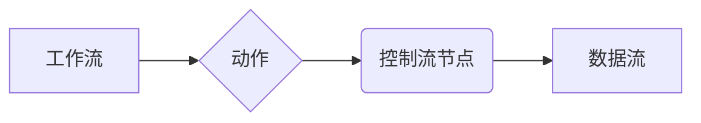

##  Oozie工作流调度原理与代码实例讲解

## 1. 背景介绍

### 1.1 大数据时代的工作流调度挑战

随着大数据时代的到来，数据处理任务日益复杂，涉及多个步骤和不同类型的计算框架。如何高效地管理和调度这些任务，成为了一个重要的挑战。传统的脚本调度方式难以满足大数据场景的需求，因为它们缺乏可扩展性、容错性和可视化等特性。

### 1.2 Oozie：应运而生的工作流调度系统

Oozie 是一个基于 Java 的工作流调度系统，专门用于管理 Hadoop 生态系统中的任务。它提供了一种可靠、可扩展和可视化的方式来定义、管理和执行复杂的工作流。Oozie 可以与 Hadoop 生态系统中的各种组件（如 Hadoop MapReduce、Hive、Pig、Sqoop 等）进行集成，从而实现端到端的数据处理流程。

## 2. 核心概念与联系

### 2.1 工作流 (Workflow)

工作流是指一系列相互关联的任务的执行顺序。Oozie 中的工作流定义了一个完整的处理流程，包括任务的类型、执行顺序、输入输出数据以及错误处理机制等。

### 2.2 动作 (Action)

动作是工作流中的基本执行单元，代表一个具体的任务。Oozie 支持多种类型的动作，例如 Hadoop MapReduce、Hive、Pig、Shell 脚本等。

### 2.3 控制流节点 (Control Flow Node)

控制流节点用于控制工作流的执行逻辑，例如决策、分支、循环等。Oozie 提供了多种控制流节点，例如 decision、fork、join 等。

### 2.4 数据流 (Data Flow)

数据流是指数据在工作流中的传递方式。Oozie 支持将数据作为参数传递给动作，或者将数据写入 HDFS 等存储系统。

### 2.5 核心概念关系图



## 3. 核心算法原理具体操作步骤

### 3.1 工作流定义

Oozie 工作流使用 hPDL (Hadoop Process Definition Language) 进行定义，它是一种基于 XML 的语言。hPDL 文件描述了工作流的结构、动作类型、执行顺序、输入输出数据以及错误处理机制等。

### 3.2 工作流提交

用户可以使用 Oozie 命令行工具或 Web UI 提交工作流。Oozie 会将工作流解析成一系列动作，并将其提交到 Hadoop 集群中执行。

### 3.3 动作执行

Oozie 会监控动作的执行状态，并根据定义的控制流逻辑决定下一步执行哪个动作。

### 3.4 工作流完成

当所有动作都成功执行后，Oozie 会将工作流标记为完成状态。

## 4. 数学模型和公式详细讲解举例说明

Oozie 没有特定的数学模型或公式。其核心算法是基于有向无环图 (DAG) 的工作流调度算法。

## 5. 项目实践：代码实例和详细解释说明

### 5.1 示例工作流：数据清洗和分析

**目标：** 从 HDFS 中读取原始数据，进行数据清洗，然后使用 Hive 进行数据分析。

**工作流定义 (workflow.xml):**

```xml
<workflow-app name="data-processing" xmlns="uri:oozie:workflow:0.1">
    <start to="clean-data"/>

    <action name="clean-data">
        <map-reduce>
            <job-tracker>${jobTracker}</job-tracker>
            <name-node>${nameNode}</name-node>
            <configuration>
                <property>
                    <name>mapred.input.dir</name>
                    <value>/user/input/raw-data</value>
                </property>
                <property>
                    <name>mapred.output.dir</name>
                    <value>/user/output/cleaned-data</value>
                </property>
            </configuration>
        </map-reduce>
        <ok to="analyze-data"/>
        <error to="fail"/>
    </action>

    <action name="analyze-data">
        <hive>
            <job-tracker>${jobTracker}</job-tracker>
            <name-node>${nameNode}</name-node>
            <script>/path/to/hive-script.hql</script>
        </hive>
        <ok to="end"/>
        <error to="fail"/>
    </action>

    <kill name="fail">
        <message>Workflow failed!</message>
    </kill>

    <end name="end"/>
</workflow-app>
```

**代码解释:**

* **workflow-app**: 定义工作流的名称和命名空间。
* **start**: 指定工作流的起始动作。
* **action**: 定义一个动作，包括动作类型、配置参数等。
* **map-reduce**: 使用 Hadoop MapReduce 处理数据。
* **hive**: 使用 Hive 进行数据分析。
* **ok**: 指定动作成功后的下一个动作。
* **error**: 指定动作失败后的下一个动作。
* **kill**: 定义一个终止动作，用于处理错误情况。
* **end**: 指定工作流的结束状态。

**执行工作流:**

```
oozie job -oozie http://oozie-server:11000/oozie -config job.properties -run
```

### 5.2 代码实例分析

* 该工作流定义了两个动作：`clean-data` 和 `analyze-data`。
* `clean-data` 动作使用 MapReduce 从 HDFS 中读取原始数据，进行数据清洗，并将结果写入 `/user/output/cleaned-data` 目录。
* `analyze-data` 动作使用 Hive 读取 `/user/output/cleaned-data` 目录中的数据，执行 Hive 脚本进行数据分析。
* 控制流节点 `ok` 和 `error` 用于控制工作流的执行逻辑，确保在每个动作成功或失败后执行相应的后续动作。
* `kill` 动作用于处理错误情况，并在工作流失败时输出错误信息。

## 6. 实际应用场景

Oozie 广泛应用于各种大数据处理场景，例如：

* **数据仓库 ETL**: 将数据从多个数据源提取、转换和加载到数据仓库中。
* **机器学习**: 训练和部署机器学习模型。
* **日志分析**: 收集、处理和分析日志数据。
* **数据挖掘**: 从大型数据集中发现模式和趋势。

## 7. 工具和资源推荐

### 7.1 Oozie 官方文档

* [Apache Oozie](https://oozie.apache.org/)

### 7.2 书籍

*  《Hadoop权威指南》
*  《Hadoop实战》

### 7.3 在线教程

* [Tutorialspoint Oozie Tutorial](https://www.tutorialspoint.com/oozie/index.htm)

## 8. 总结：未来发展趋势与挑战

### 8.1 云原生工作流调度

随着云计算的普及，云原生工作流调度系统 (例如 Argo, Airflow) 越来越受欢迎。这些系统提供了更好的可扩展性、容错性和可移植性。

### 8.2 Serverless 工作流

Serverless 计算的兴起也推动了 Serverless 工作流的发展。Serverless 工作流允许用户根据需要动态分配资源，从而提高效率并降低成本。

### 8.3 人工智能驱动的自动化

人工智能 (AI) 和机器学习 (ML) 技术可以用于自动化工作流调度，例如自动优化工作流参数、预测任务执行时间以及检测异常情况。

## 9. 附录：常见问题与解答

### 9.1 如何调试 Oozie 工作流？

Oozie 提供了多种调试工具，例如：

* **Web UI**: Oozie Web UI 提供了工作流执行状态的可视化界面，可以方便地查看工作流的执行情况、日志信息等。
* **命令行工具**: Oozie 命令行工具可以用于查看工作流状态、日志信息等。
* **日志文件**: Oozie 会将工作流执行日志写入到 HDFS 中，用户可以查看日志文件来分析问题。

### 9.2 Oozie 与其他工作流调度系统有何区别？

Oozie 专门用于 Hadoop 生态系统，而其他工作流调度系统 (例如 Azkaban, Luigi) 可能支持更广泛的平台和技术。

### 9.3 如何提高 Oozie 工作流的性能？

可以通过以下方式提高 Oozie 工作流的性能：

* **优化工作流结构**: 尽量减少动作数量，并使用并行执行来提高效率。
* **优化资源配置**: 为工作流分配足够的资源，例如内存、CPU 等。
* **使用缓存**: 对于重复执行的任务，可以使用缓存来减少计算量。