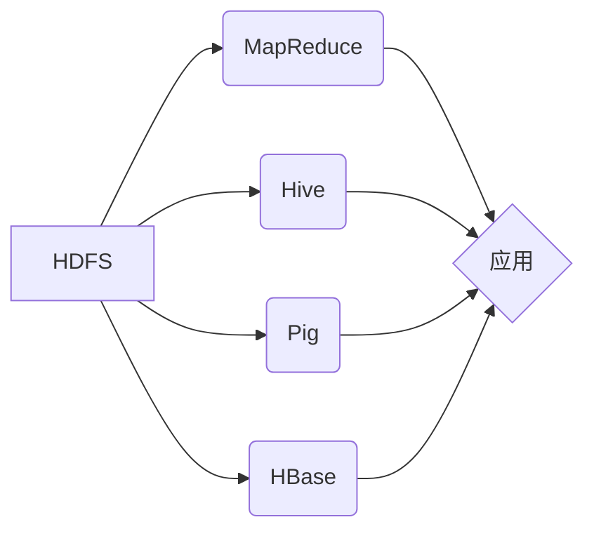

# Pig UDF原理与代码实例讲解

作者：禅与计算机程序设计艺术

## 1. 背景介绍
### 1.1 大数据处理的挑战
### 1.2 Pig的诞生与发展
### 1.3 Pig在大数据处理中的地位

## 2. 核心概念与联系
### 2.1 Pig Latin语言
#### 2.1.1 Pig Latin的设计理念
#### 2.1.2 Pig Latin的语法结构
#### 2.1.3 Pig Latin与SQL的比较
### 2.2 Pig的数据模型
#### 2.2.1 数据类型
#### 2.2.2 关系运算
#### 2.2.3 嵌套数据结构
### 2.3 Pig的执行架构
#### 2.3.1 Pig的编译过程
#### 2.3.2 Pig的执行过程
#### 2.3.3 Pig与MapReduce的关系

## 3. 核心算法原理具体操作步骤
### 3.1 Pig Latin脚本的编写
#### 3.1.1 加载数据
#### 3.1.2 过滤与转换
#### 3.1.3 分组与聚合
#### 3.1.4 连接与排序
#### 3.1.5 存储结果
### 3.2 Pig UDF的开发
#### 3.2.1 UDF的类型与作用
#### 3.2.2 UDF的开发流程
#### 3.2.3 EvalFunc接口详解
#### 3.2.4 OutputSchema注解的使用

## 4. 数学模型和公式详细讲解举例说明
### 4.1 线性回归
#### 4.1.1 最小二乘法原理
#### 4.1.2 梯度下降算法
#### 4.1.3 正则化与参数调优
### 4.2 逻辑回归
#### 4.2.1 Sigmoid函数与概率解释
#### 4.2.2 极大似然估计
#### 4.2.3 多分类逻辑回归

## 5. 项目实践：代码实例和详细解释说明 
### 5.1 数据准备
#### 5.1.1 样本数据集介绍
#### 5.1.2 数据格式转换
#### 5.1.3 数据加载到HDFS
### 5.2 Pig Latin脚本实现
#### 5.2.1 数据预处理
#### 5.2.2 特征工程
#### 5.2.3 模型训练与评估
#### 5.2.4 结果导出与可视化
### 5.3 自定义UDF开发
#### 5.3.1 需求分析
#### 5.3.2 UDF设计
#### 5.3.3 代码实现
#### 5.3.4 打包部署与测试

## 6. 实际应用场景
### 6.1 日志分析
#### 6.1.1 网站点击流日志处理
#### 6.1.2 APP用户行为分析
#### 6.1.3 服务器性能监控
### 6.2 推荐系统
#### 6.2.1 协同过滤算法
#### 6.2.2 基于内容的推荐
#### 6.2.3 混合推荐策略
### 6.3 反欺诈检测
#### 6.3.1 金融交易反欺诈
#### 6.3.2 电商订单反作弊
#### 6.3.3 社交网络虚假账号识别

## 7. 工具和资源推荐
### 7.1 编程语言
#### 7.1.1 Java
#### 7.1.2 Python 
#### 7.1.3 Scala
### 7.2 开发工具
#### 7.2.1 Eclipse
#### 7.2.2 IntelliJ IDEA
#### 7.2.3 Jupyter Notebook
### 7.3 在线学习资源
#### 7.3.1 官方文档
#### 7.3.2 MOOC课程
#### 7.3.3 技术博客

## 8. 总结：未来发展趋势与挑战
### 8.1 Pig的优势与局限性
### 8.2 Pig在大数据生态系统中的地位变化
### 8.3 新兴技术对Pig的影响
### 8.4 Pig的未来发展方向

## 9. 附录：常见问题与解答
### 9.1 Pig与Hive的区别与联系
### 9.2 Pig的数据倾斜问题解决方案
### 9.3 Pig脚本的单元测试与调试技巧
### 9.4 Pig的数据安全与权限控制

以上是一个Pig UDF原理与代码实例讲解的技术博客文章的主要框架和章节目录。接下来我将按照这个结构，对每个章节进行详细阐述，深入分析Pig的核心原理，并结合具体的代码实例来演示Pig的开发和应用。通过这篇文章，读者将全面掌握Pig的使用方法，了解Pig在大数据处理中的重要作用，学会开发Pig UDF来满足个性化的数据分析需求。

## 1. 背景介绍

### 1.1 大数据处理的挑战

随着互联网、物联网、移动设备的快速发展，数据呈现出爆炸式增长的趋势。据统计，全球每天产生的数据量高达2.5EB（1EB=10^18B），预计到2025年，全球数据总量将达到163ZB。面对如此海量的数据，传统的数据处理架构和技术已经无法满足实时性、可扩展性、高可用性等方面的要求。

大数据处理面临的主要挑战包括：

1. 数据量大：数据的规模已经超出了单机内存和磁盘的存储能力，需要采用分布式存储和计算框架来处理。

2. 数据类型多样：除了结构化数据外，还包括半结构化和非结构化数据，如文本、图片、视频等，需要采用不同的数据模型和处理方法。

3. 数据增长快：数据的产生速度远超过数据的消费速度，需要具备实时流式计算的能力，以最短的延迟获得分析结果。

4. 数据质量参差不齐：数据来源广泛，难免会存在噪声、缺失、重复等质量问题，需要在数据处理的过程中进行清洗和修复。

5. 数据安全与隐私：大数据中不可避免地包含了用户的隐私数据，如何在数据处理和分析过程中保护用户隐私,是一个亟待解决的问题。

为了应对大数据处理的挑战，学术界和工业界提出了一系列的大数据处理框架和工具，其中最具代表性的就是Google发布的三大论文：GFS、MapReduce和BigTable。这三大论文奠定了大数据技术的理论基础，并在开源社区催生了一系列的衍生项目，如Hadoop、HBase、Hive等。Pig正是在这一背景下应运而生的。

### 1.2 Pig的诞生与发展

Pig起源于Yahoo，最初是作为Hadoop的一个子项目进行开发的。Pig的设计目标是提供一种类似于SQL的高级数据流语言Pig Latin，使得开发人员能够在大规模数据集上进行复杂的数据transformations，而无需编写复杂的MapReduce程序。

Pig的主要特点包括：

1. 使用类SQL的Pig Latin语言，使开发人员能够在一个更高的抽象层次上进行编程，提高开发效率。

2. 支持UDF（用户自定义函数），可以使用Java、Python等语言编写自定义函数，扩展Pig的功能。

3. 提供了丰富的内置函数，包括关系运算、数学计算、字符串处理等，满足大多数数据处理的需求。

4. 自动优化，Pig会对用户编写的脚本进行解析和优化，生成最终的MapReduce任务，并运行在Hadoop集群上。

5. 良好的可扩展性，Pig可以与Hadoop生态系统中的其他组件（如HBase、Hive等）进行集成，构建完整的大数据处理流水线。

Pig经过多年的发展，已经成为了Hadoop生态系统中不可或缺的一员。Pig的最新版本是0.17.0，支持Hadoop 2.x、Tez等新特性。同时，Pig还支持在Spark上运行，使得Pig脚本能够以更快的速度执行。

### 1.3 Pig在大数据处理中的地位

Pig在大数据处理领域有着广泛的应用，主要体现在以下几个方面：

1. 数据ETL：Pig可以很方便地对原始数据进行清洗、转换和加载，将数据从一个格式转换为另一个格式，为后续的数据分析做好准备。

2. 数据分析：Pig提供了丰富的内置函数和UDF，可以对数据进行统计分析、数据挖掘等操作，快速获得洞见。

3. 机器学习：Pig可以与Mahout等机器学习库进行集成，实现特征工程、模型训练和预测等任务。

4. 数据可视化：Pig可以将处理后的结果数据导出到HDFS或HBase中，供Tableau、PowerBI等BI工具进行可视化展示。

5. 流式处理：Pig结合Apache Storm可以实现实时流式处理，对数据进行实时分析和处理。

下图展示了Pig在Hadoop生态系统中的位置：



可以看出，Pig与Hive、MapReduce等组件一起，构成了Hadoop生态系统的数据处理层，为上层应用提供了强大的数据支撑。

## 2. 核心概念与联系

### 2.1 Pig Latin语言

#### 2.1.1 Pig Latin的设计理念

Pig Latin是Pig的核心组成部分，它是一种面向数据流的高级语言，其设计理念主要包括以下几点：

1. 类SQL语法：Pig Latin的语法与SQL非常相似，包括了SELECT、JOIN、GROUP BY等常见操作，降低了学习成本。

2. 过程式语言：与SQL的声明式不同，Pig Latin是一种过程式语言，用户需要显式地指定数据的处理流程和顺序。

3. 支持嵌套数据：Pig Latin支持对嵌套数据结构（如Tuple、Bag、Map）进行操作，适合处理半结构化数据。

4. 延迟计算：Pig Latin采用了延迟计算的策略，只有在执行DUMP或STORE操作时，才会触发真正的计算，提高了执行效率。

5. 可扩展性：Pig Latin支持UDF，用户可以根据自己的需求，使用Java、Python等语言编写自定义函数，扩展Pig Latin的功能。

#### 2.1.2 Pig Latin的语法结构

Pig Latin脚本由一系列的语句组成，每个语句以分号结尾。Pig Latin的语法结构主要包括以下几个部分：

1. 声明语句：用于定义变量、别名、函数等，如：
```
-- 定义变量
%default input '/user/data/input'
-- 定义别名
define sum FOREACH group GENERATE group, SUM(data.value);
```

2. 加载语句：用于从HDFS、HBase等数据源中加载数据，如：
```
-- 从HDFS加载数据
logs = LOAD '/user/data/logs' USING PigStorage(',') AS (ts:long, level:chararray, message:chararray);
```

3. 转换语句：用于对数据进行过滤、分组、连接等转换操作，如：
```
-- 过滤数据
errors = FILTER logs BY level == 'ERROR';
-- 分组聚合
clicks = GROUP logs BY ts;
click_counts = FOREACH clicks GENERATE group, COUNT(logs);
```

4. 存储语句：用于将处理后的数据存储到HDFS、HBase等数据源中，如：
```
-- 存储到HDFS
STORE click_counts INTO '/user/data/output' USING PigStorage(',');
```

5. 执行语句：用于触发Pig Latin脚本的执行，如：
```
-- 本地模式执行
pig -x local myscript.pig
-- MapReduce模式执行 
pig -x mapreduce myscript.pig
```

#### 2.1.3 Pig Latin与SQL的比较

Pig Latin与SQL都是高级的数据处理语言，它们有许多相似之处，如支持SELECT、JOIN、GROUP BY等操作。但是，它们也存在一些显著的区别：

1. 语言类型：SQL是一种声明式语言，用户只需要指定需要的结果，而无需关心数据的处理过程。而Pig Latin是一种过程式语言，用户需要显式地指定数据的处理流程和顺序。

2. 数据模型：SQL主要面向结构化数据，基于关系模型进行操作。而Pig Latin更适合