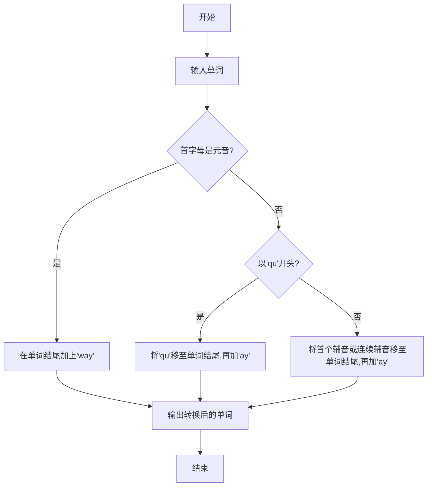

# PigLatin脚本编写最佳实践

## 1.背景介绍

### 1.1 什么是PigLatin?

PigLatin是一种基于英语的加密语言游戏,最早可以追溯到17世纪。它的基本规则是将单词的第一个辅音音素移动到单词的结尾,并加上"ay"。如果单词以元音开头,则直接在结尾加上"way"。例如,单词"hello"会变成"ellohay",而单词"apple"会变成"appleyay"。

PigLatin最初只是一种儿童游戏,但后来也被用作一种简单的加密方式,以防止外人窃听对话。虽然它的加密强度较低,但它的简单性和有趣性使其成为编程初学者练习的绝佳选择。

### 1.2 为什么要学习PigLatin脚本编写?

通过编写PigLatin转换脚本,初学者可以掌握以下编程基础知识:

- 字符串操作
- 条件语句
- 循环语句
- 函数编写
- 单元测试
- 文件输入/输出等

此外,PigLatin脚本编写也可以培养逻辑思维能力、代码设计和优化技巧。它简单有趣,却蕴含了丰富的编程实践。

## 2.核心概念与联系

### 2.1 PigLatin规则

PigLatin的规则可以总结为以下几点:

1. 如果单词以元音开头(a,e,i,o,u),则在单词结尾加上"way"。
2. 如果单词以'qu'开头,则将'qu'作为一个整体移动到单词结尾,再加上'ay'。
3. 如果单词以辅音开头,则将第一个辅音或连续的辅音移动到单词结尾,再加上'ay'。

### 2.2 字符串操作

要实现PigLatin转换,需要掌握以下字符串操作:

- 判断字符是元音还是辅音
- 获取字符串的子串
- 连接字符串
- 字符串大小写转换

### 2.3 正则表达式

正则表达式是一种用于匹配字符串模式的强大工具。在PigLatin脚本中,我们可以使用正则表达式来简化字符串判断和切分操作。

## 3.核心算法原理具体操作步骤 

### 3.1 算法流程图



### 3.2 算法步骤

1. 获取用户输入的单词
2. 判断单词首字母是否为元音
    - 如果是,则在单词结尾加上'way'
    - 如果不是,进入下一步
3. 判断单词是否以'qu'开头
    - 如果是,则将'qu'作为一个整体移动到单词结尾,再加上'ay'
    - 如果不是,进入下一步
4. 将单词首个辅音或连续辅音移动到单词结尾,再加上'ay'
5. 输出转换后的PigLatin单词

### 3.3 关键函数实现

#### 3.3.1 判断字符是否为元音

```python
def is_vowel(char):
    vowels = 'aeiou'
    return char.lower() in vowels
```

#### 3.3.2 获取单词首个辅音或连续辅音

```python
import re

def get_consonant_prefix(word):
    consonant_pattern = r'^[^aeiou]+'
    match = re.match(consonant_pattern, word)
    if match:
        return match.group()
    return ''
```

#### 3.3.3 PigLatin转换函数

```python
def convert_to_piglatin(word):
    if is_vowel(word[0]):
        return word + 'way'
    elif word.startswith('qu'):
        return word[2:] + 'quay'
    else:
        consonant_prefix = get_consonant_prefix(word)
        return word[len(consonant_prefix):] + consonant_prefix + 'ay'
```

## 4.数学模型和公式详细讲解举例说明

PigLatin转换算法本身不涉及复杂的数学模型和公式,但我们可以从正则表达式的角度进行一些分析和说明。

正则表达式是一种用于匹配字符串模式的形式语言。它基于一些特殊字符和语法规则,可以构建出极其强大和灵活的模式匹配。

在PigLatin脚本中,我们使用了以下正则表达式:

$$
^[^aeiou]+
$$

这个正则表达式的含义是:匹配字符串开头的一个或多个非元音字符。其中:

- `^` 表示字符串的开头
- `[^aeiou]` 表示一个非元音字符(否定字符集)
- `+` 表示前面的模式可以重复一次或多次

通过这个正则表达式,我们可以方便地获取单词开头的辅音前缀。

另一个相关的正则表达式是:

$$
[aeiou]
$$

它表示一个元音字符,可以用于判断一个字符是否为元音。

正则表达式虽然看起来晦涩难懂,但它提供了一种紧凑和高效的模式匹配方式,在字符串处理领域有着广泛的应用。

## 4.项目实践:代码实例和详细解释说明

下面是一个基于Python实现的PigLatin转换脚本:

```python
import re

def is_vowel(char):
    """判断字符是否为元音"""
    vowels = 'aeiou'
    return char.lower() in vowels

def get_consonant_prefix(word):
    """获取单词首个辅音或连续辅音"""
    consonant_pattern = r'^[^aeiou]+'
    match = re.match(consonant_pattern, word)
    if match:
        return match.group()
    return ''

def convert_to_piglatin(word):
    """将单词转换为PigLatin形式"""
    if is_vowel(word[0]):
        return word + 'way'
    elif word.startswith('qu'):
        return word[2:] + 'quay'
    else:
        consonant_prefix = get_consonant_prefix(word)
        return word[len(consonant_prefix):] + consonant_prefix + 'ay'

def main():
    """主函数"""
    print("Welcome to the PigLatin Translator!")
    while True:
        word = input("Enter a word (or 'q' to quit): ")
        if word.lower() == 'q':
            break
        piglatin_word = convert_to_piglatin(word)
        print(f"The PigLatin translation is: {piglatin_word}")

if __name__ == "__main__":
    main()
```

这个脚本包含以下几个主要函数:

1. `is_vowel(char)`: 判断给定字符是否为元音。
2. `get_consonant_prefix(word)`: 获取单词开头的辅音前缀。它使用正则表达式匹配模式`^[^aeiou]+`来识别非元音字符。
3. `convert_to_piglatin(word)`: 根据PigLatin规则将单词转换为PigLatin形式。它首先判断单词是否以元音开头,如果是,则直接在结尾加上'way'。如果单词以'qu'开头,则将'qu'作为一个整体移动到单词结尾,再加上'ay'。如果单词以辅音开头,则将辅音前缀移动到单词结尾,再加上'ay'。
4. `main()`: 主函数,提示用户输入单词,并将其转换为PigLatin形式。用户可以输入'q'退出程序。

### 4.1 单元测试

为了确保代码的正确性,我们可以编写单元测试:

```python
import unittest

class TestPigLatinTranslator(unittest.TestCase):
    def test_is_vowel(self):
        self.assertTrue(is_vowel('a'))
        self.assertTrue(is_vowel('e'))
        self.assertTrue(is_vowel('i'))
        self.assertTrue(is_vowel('o'))
        self.assertTrue(is_vowel('u'))
        self.assertFalse(is_vowel('b'))
        self.assertFalse(is_vowel('z'))

    def test_get_consonant_prefix(self):
        self.assertEqual(get_consonant_prefix('hello'), 'h')
        self.assertEqual(get_consonant_prefix('string'), 'str')
        self.assertEqual(get_consonant_prefix('apple'), '')

    def test_convert_to_piglatin(self):
        self.assertEqual(convert_to_piglatin('apple'), 'appleyay')
        self.assertEqual(convert_to_piglatin('hello'), 'ellohay')
        self.assertEqual(convert_to_piglatin('question'), 'estionquay')
        self.assertEqual(convert_to_piglatin('egg'), 'eggyay')

if __name__ == '__main__':
    unittest.main()
```

这个单元测试用例测试了`is_vowel`、`get_consonant_prefix`和`convert_to_piglatin`三个函数的正确性。通过运行这些测试,我们可以确保代码在各种输入情况下都能正常工作。

## 5.实际应用场景

虽然PigLatin本身只是一种简单的加密游戏,但它的实现过程涉及了许多编程基础知识,因此非常适合作为编程初学者的练习项目。以下是一些可能的应用场景:

1. **编程教学**: PigLatin转换脚本可以作为编程初学者的入门项目,帮助他们掌握字符串操作、条件语句、循环语句和函数编写等基础知识。
2. **加密通信**:虽然PigLatin的加密强度较低,但它可以作为一种简单的加密方式,防止他人窃听对话。
3. **文字游戏**: PigLatin可以作为一种有趣的文字游戏,让玩家互相转换单词或短语,增加娱乐性。
4. **编程练习**:对于有一定编程基础的开发者,编写PigLatin转换脚本可以作为一种代码设计和优化的练习,提高代码质量和可读性。

## 6.工具和资源推荐

以下是一些与PigLatin脚本编写相关的有用工具和资源:

1. **正则表达式在线测试工具**: 可以在线测试和调试正则表达式,例如 [Regex101](https://regex101.com/)。
2. **Python文档**: Python官方文档提供了丰富的语言参考和示例,对于初学者非常有用。可以访问 [Python官网](https://www.python.org/doc/)。
3. **编程练习网站**:像 [LeetCode](https://leetcode.com/) 和 [HackerRank](https://www.hackerrank.com/) 这样的网站提供了大量编程练习题,可以帮助提高编码能力。
4. **代码编辑器**:一个好的代码编辑器可以提高编码效率,推荐使用 [Visual Studio Code](https://code.visualstudio.com/) 或 [PyCharm](https://www.jetbrains.com/pycharm/)。
5. **PigLatin在线转换器**: 如果你只是想快速转换单词或短语,可以使用一些在线的PigLatin转换器,例如 [PigLatin Translator](https://www.fun-with-words.com/pigl_translator.html)。

## 7.总结:未来发展趋势与挑战

PigLatin虽然只是一个简单的加密游戏,但它反映了一些编程领域的发展趋势和挑战:

1. **可读性和可维护性**:随着代码复杂度的增加,提高代码的可读性和可维护性变得越来越重要。PigLatin脚本编写可以培养良好的代码风格和设计习惯。
2. **测试驱动开发(TDD)**:单元测试在现代软件开发中扮演着重要角色。PigLatin脚本的编写可以帮助初学者掌握TDD的基本概念和实践。
3. **正则表达式的重要性**:正则表达式是一种强大的字符串处理工具,在各种编程语言中都有广泛应用。掌握正则表达式可以提高开发效率和代码质量。
4. **编程教育的创新**: PigLatin脚本编写展示了如何通过有趣的游戏和练习来吸引初学者学习编程。未来,编程教育可能会采用更多这样的创新方式。

总的来说,PigLatin脚本编写虽然简单,但它体现了编程领域的一些核心理念和实践,对于初学者和有经验的开发者都有一定的参考价值。

## 8.附录:常见问题与解答

### 8.1 如何处理大小写?

在PigLatin转换中,通常会忽略大小写。但如