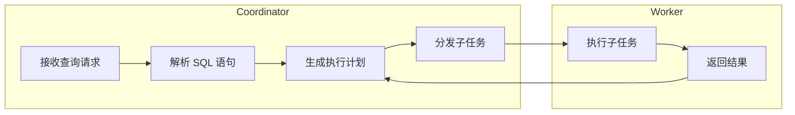

# Presto原理与代码实例讲解

作者：禅与计算机程序设计艺术

## 1. 背景介绍

### 1.1 大数据时代的挑战

随着互联网和移动设备的普及，数据规模呈爆炸式增长，传统的关系型数据库已经难以满足海量数据的存储和查询需求。大数据时代对数据处理技术提出了更高的要求，包括：

* **高并发查询：**  需要支持数千甚至数万个并发查询请求。
* **低延迟响应：**  需要在秒级甚至毫秒级内返回查询结果。
* **高吞吐量：**  需要每秒处理数百万甚至数千万条数据。
* **可扩展性：**  需要能够随着数据量的增长而扩展集群规模。
* **数据多样性：**  需要能够处理不同格式和结构的数据，例如文本、图片、视频等。

### 1.2 分布式查询引擎的兴起

为了应对大数据时代的挑战，分布式查询引擎应运而生。与传统的关系型数据库相比，分布式查询引擎具有以下优势：

* **分布式存储：**  将数据分布式存储在多个节点上，提高了数据存储容量和读取速度。
* **并行处理：**  将查询任务分解成多个子任务，并行执行，提高了查询效率。
* **容错机制：**  通过数据冗余和故障转移机制，保证了系统的高可用性。

### 1.3 Presto的诞生

Presto 是 Facebook 于 2011 年开源的分布式 SQL 查询引擎，专为交互式数据分析而设计。Presto 能够连接到各种数据源，包括 Hive、Cassandra、MySQL、Kafka 等，并支持 ANSI SQL 标准。Presto 的主要特点包括：

* **高性能：**  采用基于内存的查询执行方式，能够快速返回查询结果。
* **可扩展性：**  支持水平扩展，能够轻松扩展到数百个节点。
* **易用性：**  提供 JDBC 和 ODBC 接口，方便用户进行数据访问。
* **开放性：**  采用 Apache 2.0 许可证，方便用户进行二次开发。

## 2. 核心概念与联系

### 2.1 架构概览

Presto 采用 Master-Slave 架构，由一个 Coordinator 节点和多个 Worker 节点组成。

* **Coordinator:** 负责接收查询请求，解析 SQL 语句，生成执行计划，并将子任务分发给 Worker 节点执行。
* **Worker:** 负责执行 Coordinator 分配的子任务，并将结果返回给 Coordinator。



### 2.2 数据源

Presto 支持连接到各种数据源，包括：

* **Hive:**  Hadoop 生态系统中的数据仓库。
* **Cassandra:**  分布式 NoSQL 数据库。
* **MySQL:**  关系型数据库。
* **Kafka:**  分布式消息队列。

Presto 通过 Connector 插件来连接到不同的数据源。每个 Connector 插件负责与对应的数据源进行交互，并将数据转换成 Presto 能够理解的格式。

### 2.3 查询执行

Presto 的查询执行过程分为以下几个阶段：

1. **解析 SQL 语句:** Coordinator 接收查询请求后，首先解析 SQL 语句，生成抽象语法树（AST）。
2. **生成执行计划:** Coordinator 根据 AST 生成执行计划，包括数据读取、数据处理、数据聚合等操作。
3. **分发子任务:** Coordinator 将执行计划分解成多个子任务，并分发给 Worker 节点执行。
4. **执行子任务:** Worker 节点接收子任务后，从对应的数据源读取数据，并执行相应的操作。
5. **返回结果:** Worker 节点将执行结果返回给 Coordinator，Coordinator 将结果汇总后返回给用户。

## 3. 核心算法原理具体操作步骤

### 3.1 基于内存的查询执行

Presto 采用基于内存的查询执行方式，将所有数据都加载到内存中进行处理。这种方式能够大幅提高查询效率，但同时也对内存容量提出了更高的要求。

Presto 使用了一种叫做**管道化执行**的技术来优化内存使用。管道化执行将查询任务分解成多个阶段，每个阶段都只处理一部分数据。数据在不同阶段之间流动，避免了将所有数据都加载到内存中。

### 3.2 数据分区

Presto 支持将数据进行分区，将数据划分成多个子集，每个子集都存储在不同的节点上。数据分区能够提高数据读取效率，并支持并行处理。

Presto 支持多种数据分区方式，包括：

* **哈希分区：**  根据数据的哈希值进行分区。
* **范围分区：**  根据数据的范围进行分区。
* **列表分区：**  根据数据的列表值进行分区。

### 3.3 数据压缩

Presto 支持对数据进行压缩，减少数据存储空间和网络传输量。Presto 支持多种数据压缩算法，包括：

* **GZIP：**  通用压缩算法。
* **Snappy：**  高性能压缩算法。
* **LZ4：**  快速压缩算法。

## 4. 数学模型和公式详细讲解举例说明

### 4.1 数据倾斜

数据倾斜是指数据分布不均匀，导致某些节点处理的数据量远大于其他节点，从而影响查询效率。

Presto 提供了多种数据倾斜解决方案，包括：

* **数据重分区：**  将数据重新分区，使数据分布更加均匀。
* **广播连接：**  将较小的表广播到所有节点，避免数据倾斜。
* **动态分区裁剪：**  根据查询条件动态裁剪数据分区，减少数据读取量。

### 4.2 查询优化

Presto 提供了多种查询优化技术，包括：

* **谓词下推：**  将查询条件下推到数据源，减少数据读取量。
* **列裁剪：**  只读取查询所需的列，减少数据传输量。
* **常量折叠：**  将常量表达式预先计算，减少计算量。

## 5. 项目实践：代码实例和详细解释说明

### 5.1 连接到 Hive 数据源

```java
// 创建 Hive Connector
ConnectorConfig hiveConfig = new ConnectorConfig()
    .setName("hive")
    .setProperty("hive.metastore.uri", "thrift://localhost:9083");

// 创建 Presto 客户端
PrestoClient prestoClient = new PrestoClient(hiveConfig);

// 执行查询
QueryResponse response = prestoClient.executeQuery("SELECT * FROM hive.default.employees");

// 处理查询结果
for (List<Object> row : response.getData()) {
    System.out.println(row);
}
```

### 5.2 数据聚合

```sql
SELECT department, COUNT(*) AS employee_count
FROM hive.default.employees
GROUP BY department;
```

### 5.3 窗口函数

```sql
SELECT department, employee_name, salary,
       RANK() OVER (PARTITION BY department ORDER BY salary DESC) AS rank
FROM hive.default.employees;
```

## 6. 实际应用场景

### 6.1 交互式数据分析

Presto 非常适合用于交互式数据分析，例如：

* **商业智能：**  分析销售数据、用户行为等。
* **数据科学：**  进行数据挖掘、机器学习等。
* **日志分析：**  分析系统日志、应用程序日志等。

### 6.2 数据仓库查询

Presto 可以作为数据仓库的查询引擎，例如：

* **Hive 数据仓库：**  查询 Hive 表中的数据。
* **Cassandra 数据仓库：**  查询 Cassandra 表中的数据。

### 6.3 ETL 处理

Presto 可以用于 ETL 处理，例如：

* **数据清洗：**  清洗数据中的脏数据、错误数据等。
* **数据转换：**  将数据转换成不同的格式。
* **数据加载：**  将数据加载到目标数据仓库。

## 7. 总结：未来发展趋势与挑战

### 7.1 云原生化

随着云计算的普及，Presto 也在朝着云原生化的方向发展。Presto on Kubernetes 是一种将 Presto 部署到 Kubernetes 集群中的方案，能够提供更好的可扩展性和弹性。

### 7.2 联邦查询

联邦查询是指跨多个数据源进行查询。Presto 正在积极发展联邦查询功能，以支持跨 Hive、Cassandra、MySQL 等数据源进行查询。

### 7.3 机器学习

Presto 正在集成机器学习功能，以支持数据分析和预测。Presto 的机器学习功能将基于 Apache Spark 等机器学习框架。

## 8. 附录：常见问题与解答

### 8.1 Presto 和 Spark 的区别

Presto 和 Spark 都是分布式查询引擎，但它们的设计目标和应用场景有所不同。

* **Presto:**  专为交互式数据分析而设计，强调低延迟响应。
* **Spark:**  更加通用，支持批处理、流处理、机器学习等。

### 8.2 Presto 的性能优化

Presto 的性能优化可以从以下几个方面入手：

* **数据分区：**  合理地对数据进行分区，提高数据读取效率。
* **数据压缩：**  使用合适的压缩算法，减少数据存储空间和网络传输量。
* **查询优化：**  使用 Presto 提供的查询优化技术，减少数据读取量和计算量。
* **硬件配置：**  选择合适的硬件配置，例如 CPU、内存、网络等。

### 8.3 Presto 的社区资源

Presto 有一个活跃的社区，提供了丰富的资源，包括：

* **官方文档：**  https://prestodb.io/docs/current/
* **邮件列表：**  https://groups.google.com/forum/#!forum/presto-users
* **GitHub 仓库：**  https://github.com/prestodb/presto
