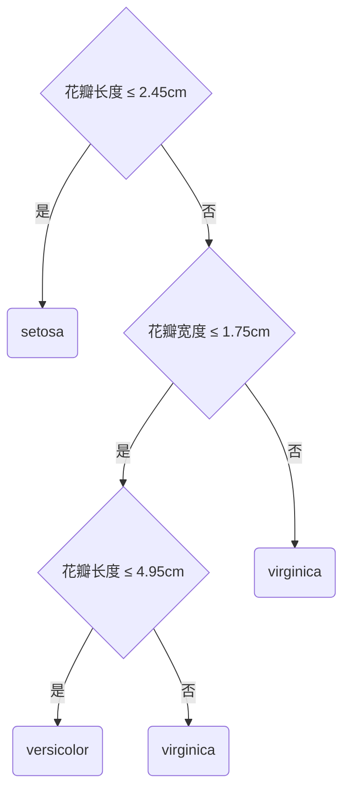

# Python机器学习实战：使用Flask构建机器学习API

作者：禅与计算机程序设计艺术

## 1.背景介绍

### 1.1 机器学习的发展和应用现状

机器学习作为人工智能的一个重要分支,在当前大数据时代得到了广泛的应用。从推荐系统、自然语言处理到计算机视觉,机器学习算法正在深刻影响着我们的生活。随着数据量的增长和计算能力的提升,机器学习模型变得越来越复杂和强大。

### 1.2 部署机器学习模型的必要性

训练好一个机器学习模型只是第一步,如何将模型应用到实际生产环境中,为用户提供服务,是一个重要的课题。将机器学习模型封装成易于调用的API接口,是实现模型部署的有效方式之一。

### 1.3 Flask在构建机器学习API中的优势  

Flask是一个流行的Python轻量级Web框架。其简洁灵活的特点,以及Python语言在机器学习领域的广泛应用,使得Flask成为构建机器学习API的绝佳选择。本文将详细介绍如何使用Flask搭建机器学习API服务。

## 2.核心概念与联系

### 2.1 机器学习工作流程概述

一个完整的机器学习项目通常包括以下步骤:

1. 收集和准备数据
2. 选择合适的模型并进行训练
3. 评估模型性能  
4. 使用训练好的模型进行预测
5. 部署模型并提供API接口

### 2.2 RESTful API简介

RESTful是一种流行的API设计风格,其核心思想包括:

- 使用HTTP方法(GET/POST/PUT/DELETE等)表示操作类型
- 使用URL表示资源的路径结构
- 使用JSON作为数据交换格式
- 无状态,每个请求包含处理所需的所有信息

### 2.3 Flask与机器学习的结合

Flask提供了一系列装饰器和辅助函数,可以很方便地编写RESTful风格的API接口。同时,大多数机器学习框架如scikit-learn、Tensorflow、PyTorch等都提供了Python接口,与Flask可以无缝对接。因此,使用Flask构建机器学习API是一种很自然的选择。

## 3.核心算法原理具体操作步骤

### 3.1 环境准备

首先需要安装必要的Python库,包括:

- Flask: Web框架
- numpy: 数值计算库 
- pandas: 数据处理库
- scikit-learn: 机器学习算法库

可以使用pip命令进行安装:

```bash
pip install flask numpy pandas scikit-learn
```

### 3.2 模型训练

接下来我们使用scikit-learn提供的Iris数据集,训练一个简单的分类模型。Iris数据集包含150条记录,每条记录有4个特征(花萼长度、花萼宽度、花瓣长度、花瓣宽度)和1个类别标签(Setosa/Versicolour/Virginica)。

```python
from sklearn.datasets import load_iris
from sklearn.model_selection import train_test_split
from sklearn.ensemble import RandomForestClassifier
import pandas as pd

# 加载数据集
iris = load_iris()
df = pd.DataFrame(iris.data, columns=iris.feature_names)
df['species'] = pd.Categorical.from_codes(iris.target, iris.target_names)

# 划分训练集和测试集
X_train, X_test, y_train, y_test = train_test_split(df[iris.feature_names], df['species'], test_size=0.2)

# 训练随机森林分类器
clf = RandomForestClassifier()
clf.fit(X_train, y_train)
```

这里我们选择了随机森林分类器进行训练,该算法是一种基于决策树集成的机器学习模型,具有准确率高、鲁棒性好、可解释性强等优点。

### 3.3 构建Flask应用

有了训练好的模型,就可以编写Flask应用,提供预测接口了。新建一个`app.py`文件,内容如下:

```python
from flask import Flask, request, jsonify

app = Flask(__name__)

@app.route('/predict', methods=['POST'])
def predict():
    # 解析请求数据
    data = request.get_json(force=True) 
    # 提取特征
    features = [data['sepal_length'], data['sepal_width'], 
                data['petal_length'], data['petal_width']]
    # 模型预测
    prediction = clf.predict([features])[0]
    # 返回结果
    return jsonify({'species': prediction})

if __name__ == '__main__':
    app.run(port=5000, debug=True)
```

这里定义了一个`/predict`接口,接受POST请求,请求数据为一个JSON对象,包含4个特征值。服务端解析请求数据,调用训练好的模型进行预测,并将结果以JSON格式返回。

### 3.4 测试API接口

启动Flask应用后,可以使用curl命令或Postman等工具测试API接口。例如:

```bash
curl -X POST \
  http://localhost:5000/predict \
  -H 'Content-Type: application/json' \
  -d '{
    "sepal_length": 5.1,
    "sepal_width": 3.5,
    "petal_length": 1.4,
    "petal_width": 0.2
}'
```

返回结果:

```json
{
    "species": "setosa"
}
```

这表明我们的机器学习API已经可以正常工作了。

## 4.数学模型和公式详细讲解举例说明

在上面的示例中,我们使用了随机森林分类器。这里对该算法做进一步说明。

随机森林是一种基于决策树的集成学习方法。它通过构建多个决策树,并将它们的预测结果进行组合,以获得更准确和稳健的预测。

### 4.1 决策树

决策树是一种树形结构,其中每个内部节点表示一个特征,每个分支代表该特征的一个取值,每个叶子节点存储一个类别。预测时,从根节点开始,根据样本的特征选择分支,直到达到叶子节点,叶子节点的类别就是预测结果。

以Iris数据集为例,一个决策树可能长这样:



决策树学习的目标是根据训练数据构建出一个泛化能力强的决策树模型。常用的算法有ID3、C4.5和CART等。这些算法通过递归地选择最佳分裂特征,生成决策树。

### 4.2 随机森林

随机森林算法包括两个核心思想:Bagging和随机特征选择。

Bagging(Bootstrap Aggregating)是一种通用的集成学习方法。给定一个训练集,Bagging通过有放回地重复抽样,生成若干个不同的训练子集,然后基于每个子集训练一个基模型,最后将这些基模型进行组合。

基于Bagging思想,随机森林在训练每棵决策树时,不仅对样本进行随机采样,还对特征进行随机选择,即每个节点分裂时,不是从所有特征中选择最佳分裂特征,而是从所有特征的一个随机子集中选择。这样可以使得每棵决策树更加多样化,从而提高集成的效果。

用数学语言描述,假设训练集为$D=\{(\mathbf{x}_1,y_1),(\mathbf{x}_2,y_2),...,(\mathbf{x}_m,y_m)\}$,随机森林学习算法如下:

1. 对 $k=1,2,...,K$:
   - 从$D$中有放回地采样,生成大小为$m$的子集$D_k$
   - 基于$D_k$,训练一棵决策树$T_k$:
     - 在每个节点上,从所有特征中随机选取$p$个,基于某个准则(如Gini系数)选择最佳分裂特征
     - 递归生成子节点,直到满足停止条件
2. 返回 $\{T_1,T_2,...,T_K\} $

给定一个新样本 $\mathbf{x}$,随机森林的预测结果由各决策树的预测结果组合得到。对于分类任务,使用投票法,即:

$$
H(\mathbf{x}) = \underset{y \in \mathcal{Y}}{\arg\max} \sum_{k=1}^K \mathbb{I}(T_k(\mathbf{x})=y)
$$

其中$\mathcal{Y}$是类别空间,$\mathbb{I}$为指示函数。对于回归任务,使用平均法,即:

$$
H(\mathbf{x}) = \frac{1}{K} \sum_{k=1}^K T_k(\mathbf{x})  
$$

随机森林通过Bagging和随机特征选择,在保持单棵决策树易于理解的同时,大大提高了模型的准确性和稳健性,因此在工业实践中得到了广泛应用。

## 5.项目实践：代码实例和详细解释说明

下面我们给出一个相对完整的示例,展示如何使用Python和Flask构建一个随机森林分类器的预测API。

首先是模型训练部分的代码:

```python
from sklearn.datasets import load_iris
from sklearn.model_selection import train_test_split
from sklearn.ensemble import RandomForestClassifier
import joblib

# 加载Iris数据集
iris = load_iris()
X = iris.data
y = iris.target

# 划分训练集和测试集
X_train, X_test, y_train, y_test = train_test_split(X, y, test_size=0.2)

# 训练随机森林分类器
clf = RandomForestClassifier()
clf.fit(X_train, y_train)

# 在测试集上评估模型
accuracy = clf.score(X_test, y_test)
print(f'Test Accuracy: {accuracy:.3f}')

# 保存模型
joblib.dump(clf, 'rf_model.pkl')
```

这里我们使用了scikit-learn提供的`load_iris`函数加载Iris数据集,并将其划分为训练集和测试集。然后训练了一个随机森林分类器,并在测试集上评估了模型的准确率。最后,我们使用joblib将训练好的模型保存到文件中,以便后续使用。

接下来是Flask应用的代码:

```python
from flask import Flask, request, jsonify
import joblib
import numpy as np

app = Flask(__name__)

# 加载模型
clf = joblib.load('rf_model.pkl')

@app.route('/predict', methods=['POST'])
def predict():
    # 解析请求数据
    data = request.get_json(force=True)
    # 提取特征
    features = np.array([data['sepal_length'], data['sepal_width'],
                         data['petal_length'], data['petal_width']])
    # 模型预测
    prediction = clf.predict(features.reshape(1, -1))
    # 返回结果
    class_names = ['setosa', 'versicolor', 'virginica']
    result = {'species': class_names[prediction[0]]}
    return jsonify(result)

if __name__ == '__main__':
    app.run(port=5000, debug=True)
```

这里我们首先加载了之前保存的模型文件。然后定义了一个`/predict`接口,接受POST请求。请求数据为一个JSON对象,包含4个特征值。我们从请求数据中提取特征,调用模型进行预测,并将预测结果转换为对应的类别名称。最后,将结果以JSON格式返回。

为了测试API,我们可以在命令行中使用curl:

```bash
curl -X POST \
  http://localhost:5000/predict \
  -H 'Content-Type: application/json' \
  -d '{
    "sepal_length": 5.1,
    "sepal_width": 3.5, 
    "petal_length": 1.4,
    "petal_width": 0.2
}'
```

服务器返回:

```json
{
  "species": "setosa"
}
```

这样,我们就构建了一个基于随机森林分类器的预测API。在实际项目中,我们还可以添加更多功能,如数据验证、异常处理、日志记录等,以提高服务的可靠性和可维护性。

## 6.实际应用场景

机器学习API可以应用于各种场景,为人们的生活和工作提供便利。例如:

- 智能客服:用户提交问题,机器学习模型自动分类并给出回复,减轻人工客服的工作量。
- 内容推荐:根据用户的历史行为和偏好,机器学习模型预测用户可能感兴趣的内容并推送。  
- 智能家居:用户发出语音指令,机器学习模型识别语义并控制对应