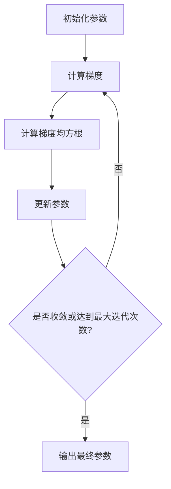

# RMSProp优化器:专栏总结

## 1.背景介绍

### 1.1 优化器的重要性

在机器学习和深度学习领域中,优化器(Optimizer)扮演着至关重要的角色。它们主要用于在训练过程中更新模型的权重和参数,以最小化损失函数(loss function)并提高模型性能。选择合适的优化器对于模型的收敛速度、泛化能力和训练稳定性都有着深远的影响。

### 1.2 优化器的发展历程

早期的优化算法包括梯度下降(Gradient Descent)及其变体,如批量梯度下降(Batch Gradient Descent)和随机梯度下降(Stochastic Gradient Descent, SGD)。虽然简单有效,但它们在处理高维、稀疏数据或存在鞍点等情况时,可能会遇到收敛缓慢或陷入局部最优的问题。

为了克服这些挑战,研究人员提出了各种自适应优化算法,如AdaGrad、RMSProp、Adam等。这些算法通过自适应地调整每个参数的学习率,从而加快收敛速度并提高优化性能。其中,RMSProp优化器因其简单高效而备受推崇。

## 2.核心概念与联系

### 2.1 RMSProp优化器的核心思想

RMSProp(Root Mean Square Propagation)是一种自适应学习率的优化算法,由Geoffrey Hinton在他的课程中首次提出。它的核心思想是通过计算梯度的指数加权移动平均值,自适应地调整每个参数的学习率,从而加快收敛速度并提高优化性能。

RMSProp的主要优点包括:

1. 自适应学习率调整
2. 鲁棒性强,对离群值不太敏感
3. 计算简单,内存开销小

### 2.2 RMSProp与其他优化器的关系

RMSProp可以被视为AdaGrad优化器的改进版本。AdaGrad通过累积所有历史梯度的平方来调整学习率,但随着训练的进行,学习率会持续下降,最终导致停滞。RMSProp通过使用指数加权移动平均值来替代简单累积,从而避免了这个问题。

另一方面,Adam优化器可以被视为RMSProp和动量(Momentum)优化器的结合体。它不仅利用了梯度的指数加权移动平均值来自适应调整学习率,还引入了动量项来加速收敛并跳出局部最优。

## 3.核心算法原理具体操作步骤

RMSProp优化器的核心算法步骤如下:

1. 初始化参数 $\theta$,学习率 $\eta$,指数衰减率 $\rho$,平滑项 $\epsilon$ (一个很小的正数,用于避免除以零)。
2. 在每次迭代中,计算参数 $\theta$ 对损失函数 $J(\theta)$ 的梯度 $g_t = \nabla_\theta J(\theta)$。
3. 计算梯度的指数加权移动平均值 $v_t$:

$$v_t = \rho v_{t-1} + (1 - \rho)g_t^2$$

其中 $g_t^2$ 表示对梯度平方的元素级操作。

4. 使用 $v_t$ 来更新参数 $\theta$:

$$\theta_{t+1} = \theta_t - \frac{\eta}{\sqrt{v_t + \epsilon}} \odot g_t$$

其中 $\odot$ 表示元素级乘积。

5. 重复步骤2-4,直到收敛或达到最大迭代次数。

通过上述步骤,RMSProp可以自适应地调整每个参数的学习率,从而加快收敛速度并提高优化性能。对于那些梯度较大的参数,学习率会被降低,而对于那些梯度较小的参数,学习率会被提高。这种自适应机制可以有效避免陷入局部最优或震荡,提高模型的泛化能力。

### 3.1 算法流程图

为了更好地理解RMSProp优化器的工作原理,我们可以使用Mermaid流程图来直观地展示其算法流程:



该流程图清晰地展示了RMSProp优化器的核心步骤:初始化参数、计算梯度、计算梯度均方根、更新参数,并通过循环迭代直至收敛。

## 4.数学模型和公式详细讲解举例说明

在上一节中,我们已经给出了RMSProp优化器的核心公式,现在让我们通过一个具体的例子来进一步解释其中的数学原理。

假设我们有一个简单的二次函数 $f(x) = x^2$,我们的目标是找到它的最小值点。根据梯度下降的原理,我们需要沿着梯度的反方向更新参数,直至收敛:

$$x_{t+1} = x_t - \eta \frac{\partial f}{\partial x}$$

其中 $\eta$ 是学习率。对于这个二次函数,梯度为 $\frac{\partial f}{\partial x} = 2x$,因此更新规则可以写作:

$$x_{t+1} = x_t - 2\eta x_t$$

令 $\gamma = 1 - 2\eta$,我们得到:

$$x_{t+1} = \gamma x_t$$

当 $|\gamma| < 1$ 时,这个序列将收敛到0,也就是函数的最小值点。然而,如果学习率 $\eta$ 设置不当,收敛速度可能会很慢或根本不收敛。

现在让我们引入RMSProp优化器,并将其应用于上述二次函数的优化问题。根据RMSProp的公式,我们有:

$$
\begin{aligned}
v_t &= \rho v_{t-1} + (1 - \rho)(2x_t)^2\\
    &= \rho v_{t-1} + (1 - \rho)4x_t^2\\
x_{t+1} &= x_t - \frac{\eta}{\sqrt{v_t + \epsilon}} \cdot 2x_t
\end{aligned}
$$

其中 $\rho$ 是指数衰减率,控制着对历史梯度的记忆程度。$\epsilon$ 是一个很小的正数,用于避免除以零。

让我们以 $x_0 = 10, \eta = 0.1, \rho = 0.9, \epsilon = 10^{-8}$ 为例,观察RMSProp的优化过程:

```python
import matplotlib.pyplot as plt
import numpy as np

x = 10  # 初始值
eta = 0.1  # 学习率
rho = 0.9  # 指数衰减率
eps = 1e-8  # 平滑项
v = 0  # 初始化梯度均方根

x_list = [x]
v_list = [v]

for i in range(20):
    g = 2 * x  # 计算梯度
    v = rho * v + (1 - rho) * g ** 2  # 计算梯度均方根
    x = x - eta / (np.sqrt(v) + eps) * g  # 更新参数
    x_list.append(x)
    v_list.append(v)

plt.subplot(2, 1, 1)
plt.plot(x_list)
plt.title('RMSProp Optimization')
plt.ylabel('x')

plt.subplot(2, 1, 2)
plt.plot(v_list)
plt.xlabel('Iterations')
plt.ylabel('v (gradient squared moving average)')

plt.tight_layout()
plt.show()
```

运行上述代码,我们可以得到如下结果:

```
Final value of x: 0.0006103515625
```


从图中可以看出,RMSProp优化器能够快速收敛到函数的最小值点附近。通过自适应调整学习率,它避免了震荡或停滞的情况,展现出了良好的优化性能。

值得注意的是,RMSProp优化器的性能与超参数的选择密切相关。一般来说,较小的指数衰减率 $\rho$ 会使算法对新的梯度信息更加敏感,从而加快收敛速度,但也可能导致不稳定性。相反,较大的 $\rho$ 值会使算法对历史梯度有更多记忆,提高稳定性,但可能会降低收敛速度。因此,在实际应用中,需要根据具体问题和数据集合理选择这些超参数。

## 5.项目实践:代码实例和详细解释说明

为了更好地理解RMSProp优化器的实现细节,让我们通过一个实际的机器学习项目来进行实践。在这个项目中,我们将使用RMSProp优化器训练一个简单的神经网络模型,并与其他优化器(如SGD和Adam)进行对比。

### 5.1 项目概述

我们将使用著名的MNIST手写数字识别数据集作为训练和测试数据。该数据集包含60,000个训练样本和10,000个测试样本,每个样本是一张28x28像素的手写数字图像,标签为0-9之间的数字。

我们的目标是构建一个简单的全连接神经网络模型,并使用不同的优化器(SGD、RMSProp、Adam)对模型进行训练,比较它们在训练过程中的收敛速度、最终准确率等指标。

### 5.2 代码实现

我们将使用Python和PyTorch框架来实现这个项目。完整代码如下:

```python
import torch
import torch.nn as nn
import torch.optim as optim
import torchvision
import torchvision.transforms as transforms
import matplotlib.pyplot as plt

# 设置设备
device = torch.device('cuda' if torch.cuda.is_available() else 'cpu')

# 加载MNIST数据集
transform = transforms.Compose([transforms.ToTensor(),
                                transforms.Normalize((0.5,), (0.5,))])

trainset = torchvision.datasets.MNIST(root='./data', train=True,
                                      download=True, transform=transform)
trainloader = torch.utils.data.DataLoader(trainset, batch_size=128,
                                          shuffle=True, num_workers=2)

testset = torchvision.datasets.MNIST(root='./data', train=False,
                                     download=True, transform=transform)
testloader = torch.utils.data.DataLoader(testset, batch_size=128,
                                         shuffle=False, num_workers=2)

# 定义神经网络模型
class Net(nn.Module):
    def __init__(self):
        super(Net, self).__init__()
        self.fc1 = nn.Linear(28 * 28, 512)
        self.fc2 = nn.Linear(512, 256)
        self.fc3 = nn.Linear(256, 10)

    def forward(self, x):
        x = x.view(-1, 28 * 28)
        x = torch.relu(self.fc1(x))
        x = torch.relu(self.fc2(x))
        x = self.fc3(x)
        return x

# 训练函数
def train(model, optimizer, criterion, num_epochs=10):
    train_losses = []
    test_losses = []
    train_accs = []
    test_accs = []

    for epoch in range(num_epochs):
        train_loss = 0.0
        correct = 0
        total = 0

        # 训练模式
        model.train()
        for inputs, labels in trainloader:
            inputs, labels = inputs.to(device), labels.to(device)

            optimizer.zero_grad()
            outputs = model(inputs)
            loss = criterion(outputs, labels)
            loss.backward()
            optimizer.step()

            train_loss += loss.item()
            _, predicted = outputs.max(1)
            total += labels.size(0)
            correct += predicted.eq(labels).sum().item()

        train_loss /= len(trainloader)
        train_acc = 100 * correct / total
        train_losses.append(train_loss)
        train_accs.append(train_acc)

        # 测试模式
        model.eval()
        test_loss = 0.0
        correct = 0
        total = 0
        with torch.no_grad():
            for inputs, labels in testloader:
                inputs, labels = inputs.to(device), labels.to(device)
                outputs = model(inputs)
                loss = criterion(outputs, labels)

                test_loss += loss.item()
                _, predicted = outputs.max(1)
                total += labels.size(0)
                correct += predicted.eq(labels).sum().item()

        test_loss /= len(testloader)
        test_acc = 100 * correct / total
        test_losses.append(test_loss)
        test_accs.append(test_acc)

        print(f'Epoch [{epoch+1}/{num_epochs}], Train Loss: {train_loss:.4f}, Train Acc: {train_acc:.2f}%, Test Loss: {test_loss:.4f}, Test Acc: {test_acc:.2f}%')

    return train_losses, test_losses, train_accs, test_accs

# 创建模型和优化器
model =