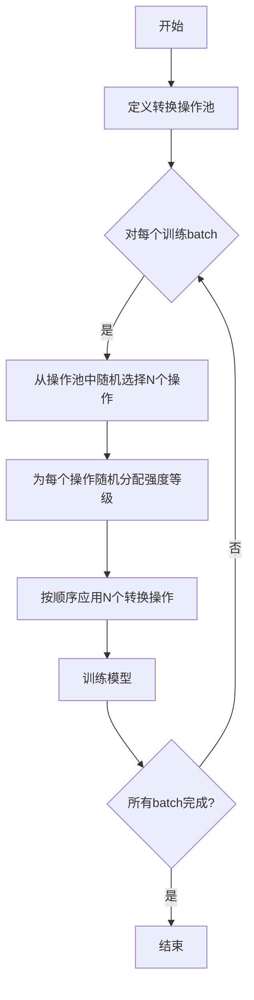

# RandAugment的优势:高效性与鲁棒性

## 1.背景介绍

### 1.1 数据增强的重要性

在深度学习领域,数据是训练模型的燃料。高质量和多样化的数据集对于构建准确和鲁棒的模型至关重要。然而,收集和标注大规模数据集是一项昂贵且耗时的过程。因此,数据增强(Data Augmentation)技术应运而生,以通过对现有数据进行一系列转换(如裁剪、旋转、添加噪声等)来人工增加训练数据的多样性,从而提高模型的泛化能力。

### 1.2 传统数据增强方法的局限性

传统的数据增强方法通常依赖于手工设计的转换策略,如随机裁剪、水平翻转等。这些方法虽然简单有效,但存在一些固有的局限性:

1. 转换策略有限:手工设计的转换策略往往有限且单一。
2. 泛化能力差:相同的转换策略被应用于所有训练样本,可能导致模型过度依赖特定的数据模式。
3. 计算效率低下:某些复杂的数据增强操作(如仿射变换)计算成本较高。

为了解决这些问题,研究人员提出了自动数据增强方法,其中RandAugment就是一种创新而高效的自动数据增强算法。

## 2.核心概念与联系

### 2.1 RandAugment算法概述

RandAugment是由Google Brain团队在2019年提出的一种数据增强方法。它的核心思想是将数据增强视为一个离散的、有限的搜索空间,并通过简单而高效的随机搜索来自动发现最优的数据增强策略。

具体来说,RandAugment由两个主要组成部分:

1. **转换操作池(Transformation Operation Pool)**: 一组预定义的数据增强转换操作,如翻转、裁剪、锐化等。
2. **随机增强策略(Random Augmentation Policy)**: 从转换操作池中随机选择一个或多个转换操作,并为每个操作分配随机的强度等级。

在训练过程中,RandAugment会为每个batch的图像数据随机应用一种增强策略。这种随机性使得模型在训练时看到更加多样化的数据分布,从而提高了模型的泛化能力。

### 2.2 RandAugment与其他数据增强方法的关系

RandAugment可以看作是自动数据增强方法的一种,与其他流行的自动数据增强算法(如AutoAugment、Fast AutoAugment等)有一些相似之处,但也有显著的区别:

- **相似点**: 都旨在自动搜索最优的数据增强策略,而不是手工设计。
- **差异点**:
  - AutoAugment等方法通过reinforcement learning或贝叶斯优化等复杂的搜索算法来发现最优策略,计算成本很高。
  - RandAugment则采用简单的随机搜索,计算效率非常高。
  - AutoAugment等方法会产生确定的、固定的最优策略,而RandAugment每次都会随机生成一种策略,增加了数据的多样性。

总的来说,RandAugment在保持较高性能的同时,极大地提高了计算效率,是一种简单而高效的自动数据增强算法。

## 3.核心算法原理具体操作步骤  

### 3.1 转换操作池

RandAugment首先定义了一个包含16种不同转换操作的转换操作池,如下所示:

1. AutoContrast
2. Equalize
3. Invert
4. Rotate
5. PosterizeX (X=4、6、8)
6. SolarizeX (X=4、6、8) 
7. SharpenX (X=0.5、0.8、1.0)
8. ShearX (X=0.3、0.7、1.0)
9. TranslateX (X=0.45、0.8) 
10. ContrastX (X=0.1、0.2、0.3、0.4、0.5、0.6、0.7、0.8、0.9、1.0)
11. ColorX (X=0.1、0.7、0.4、0.3、0.9、0.5、1.0、0.6、0.8、0.2)
12. BrightnessX (X=0.1、0.7、0.4、0.3、0.9、0.5、1.0、0.6、0.8、0.2)

其中X表示该转换操作的强度等级。这些转换操作涵盖了常见的图像处理操作,如对比度调整、亮度调整、锐化、仿射变换等。

### 3.2 随机增强策略生成

在每个训练迭代中,RandAugment会通过以下步骤随机生成一种数据增强策略:

1. 从转换操作池中随机选择 N 个不同的转换操作。N 是一个预先设定的超参数,通常取值为 2 或 3。
2. 为每个选择的转换操作随机分配一个强度等级。
3. 将这 N 个具有随机强度的转换操作按顺序应用于当前 batch 的图像数据。

通过这种随机的方式,RandAugment可以为每个 batch 生成一种独特的数据增强策略,从而增加了训练数据的多样性。

### 3.3 算法流程图

下面是RandAugment算法的流程图:



该算法流程图清晰地展示了RandAugment的核心步骤:首先定义转换操作池,然后对每个训练batch,从操作池中随机选择N个操作并分配随机强度,按顺序应用这些转换操作,最后训练模型。这个过程在所有batch完成之前会不断重复。

## 4.数学模型和公式详细讲解举例说明

虽然RandAugment算法本身相对简单,但是其中涉及到一些数学模型和公式,有助于更深入地理解其原理。

### 4.1 转换操作的数学表示

每个转换操作可以用一个函数 $f_i: \mathcal{X} \rightarrow \mathcal{X}$ 来表示,其中 $\mathcal{X}$ 是输入图像的空间。该函数将原始图像 $x \in \mathcal{X}$ 映射到一个新的增强图像 $x' \in \mathcal{X}$。

例如,对比度调整操作可以用下式表示:

$$x' = f_{\text{contrast}}(x) = (x - \mu) \times \text{contrast_level} + \mu$$

其中 $\mu$ 是图像的均值,contrast_level是对比度强度等级,取值范围为[0, 1]。

### 4.2 随机增强策略的数学表达

假设我们从转换操作池中随机选择了 N 个操作 $\{f_1, f_2, \ldots, f_N\}$,并为每个操作分配了对应的强度等级 $\{m_1, m_2, \ldots, m_N\}$。那么,RandAugment生成的随机增强策略可以表示为这 N 个转换操作的复合函数:

$$\mathcal{A}(x) = f_N(m_N) \circ f_{N-1}(m_{N-1}) \circ \ldots \circ f_1(m_1)(x)$$

其中 $\circ$ 表示函数复合操作。也就是说,RandAugment将 N 个转换操作按顺序依次应用于原始图像 $x$,得到最终的增强图像 $x'$。

### 4.3 实例分析

假设我们从转换操作池中随机选择了两个操作:对比度调整和高斯噪声添加,分别对应的强度等级为 0.7 和 0.3。那么,RandAugment生成的随机增强策略可以表示为:

$$\mathcal{A}(x) = f_{\text{noise}}(0.3) \circ f_{\text{contrast}}(0.7)(x)$$

其中,

$$f_{\text{contrast}}(0.7)(x) = (x - \mu) \times 0.7 + \mu$$
$$f_{\text{noise}}(0.3)(x) = x + \mathcal{N}(0, 0.3^2)$$

也就是说,我们首先对原始图像 $x$ 进行对比度调整,得到中间结果 $x_1$;然后在 $x_1$ 的基础上添加高斯噪声,得到最终的增强图像 $x'$。

通过上述数学模型和公式,我们可以更好地理解RandAugment背后的原理,并为进一步分析和优化该算法奠定基础。

## 5.项目实践:代码实例和详细解释说明

为了更好地理解RandAugment算法,让我们通过一个实际的代码示例来演示其实现过程。我们将使用PyTorch框架,并基于CIFAR-10数据集进行实验。

### 5.1 导入必要的库

```python
import torch
import torchvision
import torchvision.transforms as transforms
import numpy as np
```

### 5.2 定义RandAugment转换操作

我们首先定义RandAugment中使用的16种转换操作:

```python
# 转换操作及其对应的强度范围
augment_list = [
    (transforms.AutoContrast, None),
    (transforms.Equalize, None),
    (transforms.Invert, None),
    (transforms.Rotate, (0, 30)),
    (transforms.Posterize, (4, 8)),
    (transforms.Solarize, (4, 8)),
    (transforms.SharpenX, (0.5, 1.0)),
    (transforms.ShearX, (0.3, 0.7)),
    (transforms.TranslateX, (0.45, 0.8)),
    (transforms.ContrastX, (0.1, 1.9)),
    (transforms.ColorX, (0.1, 1.9)),
    (transforms.BrightnessX, (0.1, 1.9))
]

# 将每个转换操作封装为一个函数
augment_dict = {fn.__name__: (fn, v) for fn, v in augment_list}

def apply_op(img, op, level):
    fn, val = augment_dict[op]
    return fn(img.copy(), val=level if val is not None else 0.5, p=1)
```

上面的代码定义了一个字典 `augment_dict`，其中键为转换操作的名称，值为一个元组，包含对应的转换函数和强度范围。`apply_op` 函数接受一个图像、操作名称和强度等级作为输入，并应用该转换操作。

### 5.3 实现RandAugment

接下来，我们实现RandAugment的核心函数:

```python
def rand_augment(img, n, m):
    """
    img: 输入图像
    n: 选择的转换操作数量
    m: 强度等级的数量级
    """
    op_list = np.random.choice(list(augment_dict.keys()), n)
    level_list = np.random.randint(m, size=n)
    
    for op, level in zip(op_list, level_list):
        img = apply_op(img, op, level)
        
    return img
```

该函数首先从转换操作池中随机选择 `n` 个操作，并为每个操作随机分配一个强度等级 (范围为 0 到 `m-1`)。然后，它依次应用这些转换操作，并返回最终的增强图像。

### 5.4 在CIFAR-10数据集上进行实验

最后，我们将RandAugment集成到CIFAR-10数据集的数据加载过程中:

```python
# 定义数据增强策略
transform_train = transforms.Compose([
    transforms.RandomCrop(32, padding=4),
    transforms.RandomHorizontalFlip(),
    transforms.ToTensor(),
    lambda x: rand_augment(x, n=2, m=10)  # 应用RandAugment
])

# 加载CIFAR-10数据集
trainset = torchvision.datasets.CIFAR10(root='./data', train=True,
                                        download=True, transform=transform_train)
trainloader = torch.utils.data.DataLoader(trainset, batch_size=128, shuffle=True, num_workers=2)

# 训练模型
# ...
```

在这个示例中，我们将RandAugment作为一个Lambda函数应用于每个训练批次的图像数据。我们选择了 `n=2` 和 `m=10`，即从16个转换操作中随机选择2个，并为每个操作分配0到9之间的随机强度等级。

通过这个实例，您应该能够更好地理解RandAugment的实现细节。当然，在实际