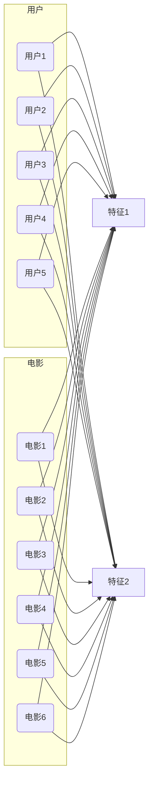

# SVD推荐算法：挖掘潜在特征的推荐引擎

## 1.背景介绍

### 1.1 推荐系统的重要性

在当今信息过载的时代，推荐系统已经成为帮助用户发现感兴趣的项目并提高用户体验的关键工具。无论是在线购物、流媒体视频、社交媒体还是新闻聚合网站,推荐系统都扮演着重要角色。有效的推荐系统不仅能够提高用户参与度和满意度,还可以为企业带来可观的收益。

### 1.2 推荐系统的挑战

然而,构建一个高质量的推荐系统并非易事。主要挑战包括:

- 数据稀疏性:用户对项目的评分往往很稀疏,导致难以准确捕捉用户偏好。
- 冷启动问题:对于新用户或新项目,缺乏历史数据,难以做出有效推荐。
- 可扩展性:随着用户和项目数量的增长,推荐系统需要能够高效地处理大规模数据。

### 1.3 SVD推荐算法的优势

在众多推荐算法中,奇异值分解(SVD)推荐算法脱颖而出,成为解决上述挑战的有力工具。SVD算法通过将用户和项目映射到相同的低维潜在特征空间,从而捕捉用户和项目之间的关系,并最小化数据稀疏性对推荐质量的影响。同时,SVD算法还具有较好的可扩展性和泛化能力,能够有效地解决冷启动问题。

## 2.核心概念与联系

### 2.1 奇异值分解(SVD)

奇异值分解是一种线性代数技术,可将任意矩阵分解为三个矩阵的乘积:

$$
A = U \Sigma V^T
$$

其中:

- $A$是$m \times n$的原始矩阵
- $U$是$m \times m$的正交矩阵,其列向量称为左奇异向量
- $\Sigma$是$m \times n$的对角矩阵,对角线上的元素称为奇异值
- $V^T$是$n \times n$的正交矩阵的转置,其列向量称为右奇异向量

通过保留最大的$k$个奇异值及对应的奇异向量,我们可以获得矩阵$A$的最优$k$阶近似:

$$
A_k = U_k \Sigma_k V_k^T
$$

这种降维技术可用于去噪、数据压缩和提取主要特征。

### 2.2 SVD在推荐系统中的应用

在推荐系统中,我们将用户对项目的评分表示为一个稀疏矩阵$R$。通过对$R$进行SVD分解,我们可以将用户和项目映射到相同的低维潜在特征空间:

$$
R \approx U_k \Sigma_k V_k^T
$$

其中:

- $U_k$的列向量表示用户在潜在特征空间中的坐标
- $V_k$的行向量表示项目在潜在特征空间中的坐标
- $\Sigma_k$反映了每个特征的重要性

通过计算用户和项目在潜在特征空间中的相似度,我们可以预测用户对未评分项目的偏好,并基于此进行个性化推荐。

## 3.核心算法原理具体操作步骤  

### 3.1 数据准备

首先,我们需要将用户对项目的评分数据转换为一个矩阵$R$。矩阵的行表示用户,列表示项目,每个元素$r_{ij}$表示用户$i$对项目$j$的评分。如果用户没有对某个项目评分,则相应的元素为空或者用默认值(如0)填充。

### 3.2 计算SVD分解

接下来,我们对矩阵$R$进行SVD分解:

$$
R \approx U_k \Sigma_k V_k^T
$$

这一步可以使用各种数值计算库(如NumPy或Matlab)中提供的SVD函数来完成。我们需要选择一个合适的$k$值,以获得最佳的降维效果。通常,$k$的值远小于$R$的行数和列数。

### 3.3 预测未知评分

对于任意一对用户$i$和项目$j$,我们可以通过计算它们在潜在特征空间中的相似度来预测用户$i$对项目$j$的评分:

$$
\hat{r}_{ij} = \mu + u_i^T \Sigma_k v_j
$$

其中:

- $\mu$是整个评分矩阵的均值
- $u_i$是$U_k$的第$i$行,表示用户$i$在潜在特征空间中的坐标
- $v_j$是$V_k^T$的第$j$列,表示项目$j$在潜在特征空间中的坐标

### 3.4 生成推荐列表

对于给定的用户,我们可以计算该用户对所有未评分项目的预测评分,并按照预测评分的大小对项目排序,从而生成个性化的推荐列表。

### 3.5 算法优化

基本的SVD推荐算法存在一些缺陷,如无法处理新增用户或项目的情况。为了提高算法的鲁棒性和准确性,我们可以采用以下优化策略:

1. 基线估计:通过考虑用户和项目的偏置项,可以提高预测的准确性。
2. 正则化:引入正则化项可以避免过拟合,提高算法的泛化能力。
3. 时间衰减:对于动态数据,我们可以给予最近的评分更高的权重。
4. 隐式反馈:除了显式评分,我们还可以利用用户的浏览历史等隐式反馈数据。

## 4.数学模型和公式详细讲解举例说明

在上一节中,我们介绍了SVD推荐算法的核心步骤。现在,让我们更深入地探讨一下算法中涉及的数学模型和公式。

### 4.1 奇异值分解(SVD)

回顾一下SVD的数学表达式:

$$
A = U \Sigma V^T
$$

其中$A$是$m \times n$的原始矩阵,$U$是$m \times m$的正交矩阵,$\Sigma$是$m \times n$的对角矩阵,其对角线元素称为奇异值,$V^T$是$n \times n$的正交矩阵的转置。

SVD可以看作是将矩阵$A$投影到一组正交基向量上,这些基向量由$U$和$V$的列向量组成。$\Sigma$中的奇异值反映了每个基向量的重要性。

通过只保留最大的$k$个奇异值及对应的奇异向量,我们可以获得矩阵$A$的最优$k$阶近似:

$$
A_k = U_k \Sigma_k V_k^T
$$

这种降维技术不仅可以减少噪声和数据冗余,还能提取出矩阵$A$的主要特征。

### 4.2 SVD在推荐系统中的应用

在推荐系统中,我们将用户对项目的评分表示为一个稀疏矩阵$R$。通过对$R$进行SVD分解,我们可以将用户和项目映射到相同的低维潜在特征空间:

$$
R \approx U_k \Sigma_k V_k^T
$$

其中:

- $U_k$的列向量表示用户在潜在特征空间中的坐标
- $V_k$的行向量表示项目在潜在特征空间中的坐标
- $\Sigma_k$反映了每个特征的重要性

举个例子,假设我们有5个用户和6个电影,评分矩阵$R$如下:

$$
R = \begin{bmatrix}
5 & 3 & 0 & 1 & ? & ? \\
4 & 0 & 0 & 3 & ? & ? \\
1 & 1 & 0 & 5 & 0 & ? \\
1 & 0 & 0 & 4 & 0 & ? \\
0 & 1 & 5 & 4 & ? & ?
\end{bmatrix}
$$

通过SVD分解,我们可以将用户和电影映射到一个2维的潜在特征空间,如下图所示:

在这个例子中,第一个潜在特征可能代表电影的"动作程度",而第二个特征可能代表"浪漫程度"。通过计算用户和电影在这两个特征上的相似度,我们可以预测用户对未评分电影的偏好,并生成个性化的推荐列表。

### 4.3 评分预测公式

对于任意一对用户$i$和项目$j$,我们可以通过计算它们在潜在特征空间中的相似度来预测用户$i$对项目$j$的评分:

$$
\hat{r}_{ij} = \mu + u_i^T \Sigma_k v_j
$$

其中:

- $\mu$是整个评分矩阵的均值
- $u_i$是$U_k$的第$i$行,表示用户$i$在潜在特征空间中的坐标
- $v_j$是$V_k^T$的第$j$列,表示项目$j$在潜在特征空间中的坐标

让我们以上面的例子为例,计算用户1对电影5的预测评分:

$$
\begin{aligned}
\hat{r}_{15} &= \mu + u_1^T \Sigma_k v_5 \\
             &= 3 + (0.8, 0.6) \begin{bmatrix}
                                2 & 0 \\
                                0 & 1
                               \end{bmatrix}
                               \begin{bmatrix}
                                0.4 \\
                                0.9
                               \end{bmatrix} \\
             &= 3 + (0.8 \times 2 \times 0.4 + 0.6 \times 1 \times 0.9) \\
             &= 3 + 1.14 \\
             &= 4.14
\end{aligned}
$$

根据这个预测结果,我们可以将电影5推荐给用户1。

### 4.4 基线估计和正则化

基本的SVD推荐算法存在一些缺陷,如无法处理新增用户或项目的情况。为了提高算法的鲁棒性和准确性,我们可以引入基线估计和正则化。

**基线估计**

我们可以将评分预测公式扩展为:

$$
\hat{r}_{ij} = \mu + b_i + b_j + u_i^T \Sigma_k v_j
$$

其中$b_i$和$b_j$分别表示用户$i$和项目$j$的偏置项。这些偏置项可以通过对历史数据进行训练得到。

**正则化**

为了避免过拟合,我们可以在优化过程中引入正则化项,例如L2正则化:

$$
\min \sum_{r_{ij} \in R} (r_{ij} - \hat{r}_{ij})^2 + \lambda(b_i^2 + b_j^2 + \|u_i\|^2 + \|v_j\|^2)
$$

其中$\lambda$是正则化参数,用于控制正则化的强度。

通过采用基线估计和正则化,我们可以显著提高SVD推荐算法的性能和泛化能力。

## 5.项目实践:代码实例和详细解释说明

为了更好地理解SVD推荐算法,让我们通过一个基于Python的实现示例来进行实践。在这个示例中,我们将使用MovieLens 100K数据集,该数据集包含了10万条电影评分记录。

### 5.1 导入所需库