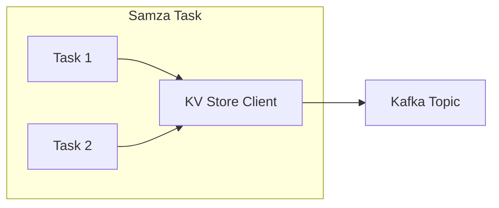

## 1. 背景介绍

### 1.1 流处理与状态管理

在现代数据处理领域，流处理已成为一种不可或缺的技术。与传统的批处理不同，流处理能够实时地处理连续不断的数据流，从而实现低延迟的数据分析和决策。然而，流处理也面临着一些挑战，其中之一就是状态管理。

流处理应用通常需要维护和更新应用程序状态，例如计数、聚合结果或机器学习模型参数。这些状态信息对于保证流处理应用的正确性和效率至关重要。传统的数据库系统难以满足流处理应用对状态管理的需求，因为它们通常针对事务性工作负载进行了优化，而流处理应用需要高吞吐量、低延迟和容错性。

### 1.2 Samza 简介

Apache Samza 是一个分布式流处理框架，它提供了一个高吞吐量、低延迟的平台，用于构建实时数据管道。Samza 的核心概念之一是 **任务（Task）**，它代表一个独立的处理单元，负责处理数据流的一部分。Samza 任务可以并行执行，从而实现高吞吐量的数据处理。

为了支持状态管理，Samza 提供了一个名为 **KV Store** 的嵌入式键值存储。KV Store 允许 Samza 任务以容错的方式存储和检索状态信息。它基于 Apache Kafka 的日志结构，并提供了一致性、持久性和高可用性。

## 2. 核心概念与联系

### 2.1 KV Store 架构

Samza KV Store 的架构如下所示：



* **Samza Task:** Samza 任务是处理数据流的独立单元。每个任务都有一个唯一的标识符，并负责处理数据流的一部分。
* **KV Store Client:** 每个 Samza 任务都包含一个 KV Store 客户端，它负责与 KV Store 进行交互。客户端提供了一组 API，用于存储、检索和删除键值对。
* **Kafka Topic:** KV Store 的数据存储在一个或多个 Kafka 主题中。每个主题都包含一系列有序的键值对，这些键值对按照时间顺序存储。

### 2.2 键值对操作

Samza KV Store 支持以下键值对操作：

* **put(key, value):** 将指定的键值对存储到 KV Store 中。
* **get(key):** 检索与指定键关联的值。
* **delete(key):** 从 KV Store 中删除指定的键值对。
* **all():** 检索 KV Store 中的所有键值对。

### 2.3 一致性和容错性

Samza KV Store 通过利用 Kafka 的日志结构来实现一致性和容错性。每个 Kafka 主题都包含一系列有序的键值对，这些键值对按照时间顺序存储。当 Samza 任务执行 put、delete 或 all 操作时，它会将相应的操作记录写入 Kafka 主题。Kafka 的复制机制确保了这些操作记录被复制到多个 broker 上，从而实现了容错性。

当 Samza 任务执行 get 操作时，它会读取 Kafka 主题中的所有操作记录，并根据最新的操作记录来确定与指定键关联的值。这种机制确保了 Samza 任务能够读取到最新的状态信息，即使在发生故障的情况下也是如此。

## 3. 核心算法原理具体操作步骤

### 3.1 写入操作

当 Samza 任务执行 put 或 delete 操作时，它会将相应的操作记录写入 Kafka 主题。操作记录包含以下信息：

* **操作类型:** put 或 delete。
* **键:** 键值对的键。
* **值:** 键值对的值（仅限 put 操作）。
* **时间戳:** 操作发生的时间。

操作记录按照时间顺序写入 Kafka 主题。Kafka 的复制机制确保了这些操作记录被复制到多个 broker 上，从而实现了容错性。

### 3.2 读取操作

当 Samza 任务执行 get 或 all 操作时，它会读取 Kafka 主题中的所有操作记录。对于每个键，它会根据最新的操作记录来确定与该键关联的值。

例如，假设有以下操作记录：

```
put(key1, value1)
put(key2, value2)
delete(key1)
put(key1, value3)
```

如果 Samza 任务执行 `get(key1)` 操作，它会读取所有操作记录，并根据最新的操作记录 `put(key1, value3)` 来确定与 `key1` 关联的值为 `value3`。

## 4. 数学模型和公式详细讲解举例说明

Samza KV Store 的数学模型可以表示为一个映射函数：

```
f: K -> V
```

其中：

* **K** 是键的集合。
* **V** 是值的集合。
* **f** 是一个映射函数，它将每个键映射到一个值。

Samza KV Store 的操作可以表示为以下数学公式：

* **put(k, v):** f(k) = v
* **delete(k):** f(k) = null
* **get(k):** 返回 f(k)

## 5. 项目实践：代码实例和详细解释说明

### 5.1 创建 KV Store

```java
// 创建 Kafka 配置
Map<String, String> kafkaConfig = new HashMap<>();
kafkaConfig.put("bootstrap.servers", "localhost:9092");

// 创建 KV Store 配置
KeyValueStoreConfig config = new KeyValueStoreConfig("my-store");
config.setChangelogTopic(new SystemStream("kafka", "my-store-changelog"));
config.setKafkaConfiguration(kafkaConfig);

// 创建 KV Store 实例
KeyValueStore<String, String> store = new RocksDbKeyValueStore<>(config);
```

### 5.2 写入键值对

```java
// 写入键值对
store.put("key1", "value1");
```

### 5.3 读取键值对

```java
// 读取键值对
String value = store.get("key1");

// 打印值
System.out.println("Value: " + value);
```

### 5.4 删除键值对

```java
// 删除键值对
store.delete("key1");
```

## 6. 实际应用场景

### 6.1 状态维护

Samza KV Store 可以用于维护流处理应用的状态信息，例如计数、聚合结果或机器学习模型参数。例如，可以使用 KV Store 来跟踪网站访问者的数量，或计算一段时间内销售额的总和。

### 6.2 分布式缓存

Samza KV Store 也可以用作分布式缓存，用于存储经常访问的数据。例如，可以使用 KV Store 来缓存数据库查询结果，或存储用户会话信息。

### 6.3 消息传递

Samza KV Store 还可以用作消息传递系统，允许 Samza 任务之间进行通信。例如，一个任务可以将消息存储在 KV Store 中，另一个任务可以检索该消息并进行处理。

## 7. 工具和资源推荐

### 7.1 Apache Samza 官方文档

Apache Samza 官方文档提供了有关 Samza KV Store 的详细信息，包括架构、API 和配置选项。

### 7.2 Apache Kafka 官方文档

Apache Kafka 官方文档提供了有关 Kafka 的详细信息，包括架构、API 和配置选项。

## 8. 总结：未来发展趋势与挑战

### 8.1 未来发展趋势

Samza KV Store 的未来发展趋势包括：

* **更高的性能:** Samza 社区正在不断努力提高 KV Store 的性能，例如通过优化写入和读取操作。
* **更丰富的功能:** Samza 社区正在探索为 KV Store 添加新功能，例如事务支持和二级索引。
* **与其他系统的集成:** Samza 社区正在努力将 KV Store 与其他系统集成，例如 Apache Flink 和 Apache Beam。

### 8.2 挑战

Samza KV Store 面临以下挑战：

* **状态一致性:** 确保在发生故障的情况下状态信息的一致性是一个挑战。
* **可扩展性:** 随着数据量的增加，KV Store 需要能够扩展以满足不断增长的需求。
* **安全性:** 确保 KV Store 中存储的数据的安全性是一个挑战。

## 9. 附录：常见问题与解答

### 9.1 如何配置 KV Store 的大小？

KV Store 的大小可以通过 `rocksdb.block.cache.size` 配置选项进行配置。

### 9.2 如何监控 KV Store 的性能？

可以使用 Samza 提供的指标来监控 KV Store 的性能，例如写入和读取延迟。

### 9.3 如何处理 KV Store 中的错误？

Samza 提供了错误处理机制，允许开发人员处理 KV Store 中的错误。例如，可以捕获异常并记录错误消息。
