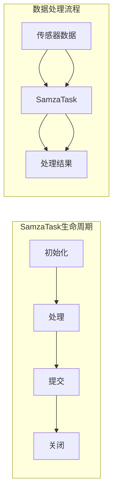

# SamzaTask在自动驾驶数据处理中的应用

作者：禅与计算机程序设计艺术

## 1. 背景介绍

### 1.1 自动驾驶数据处理的挑战

自动驾驶技术的快速发展对数据处理能力提出了前所未有的要求。海量的传感器数据需要实时处理、分析，以便做出驾驶决策。传统的批处理系统难以满足实时性要求，而基于消息队列的流处理系统则成为解决这一难题的关键。

### 1.2 Samza：高吞吐量分布式流处理框架

Apache Samza是一个开源的分布式流处理框架，它提供了高吞吐量、低延迟和容错性。Samza基于Kafka消息队列，并使用Yarn进行资源管理。

### 1.3 SamzaTask：Samza的任务执行单元

SamzaTask是Samza中最小的执行单元。它负责处理来自Kafka的消息，并执行用户定义的逻辑。SamzaTask可以并行执行，从而实现高吞吐量数据处理。

## 2. 核心概念与联系

### 2.1 Kafka：分布式消息队列

Kafka是一个分布式、高吞吐量、低延迟的消息队列系统。它被广泛用于实时数据管道和流处理应用程序。

### 2.2 Yarn：资源管理系统

Yarn是一个资源管理系统，它负责管理集群中的计算资源，并为应用程序分配资源。

### 2.3 Samza：流处理框架

Samza是一个基于Kafka和Yarn的分布式流处理框架。它提供了一个简单的编程模型，用于处理来自Kafka的消息。

### 2.4 SamzaTask：任务执行单元

SamzaTask是Samza中最小的执行单元。它负责处理来自Kafka的消息，并执行用户定义的逻辑。

## 3. 核心算法原理具体操作步骤

### 3.1 SamzaTask的生命周期

SamzaTask的生命周期包括以下几个阶段：

1. **初始化阶段:** SamzaTask从Kafka读取配置信息，并初始化内部状态。
2. **处理阶段:** SamzaTask从Kafka读取消息，并执行用户定义的逻辑。
3. **提交阶段:** SamzaTask将处理结果写入输出流。
4. **关闭阶段:** SamzaTask释放所有资源。

### 3.2 SamzaTask的并行执行

SamzaTask可以并行执行，从而实现高吞吐量数据处理。Samza使用Kafka的分区机制来实现并行执行。每个SamzaTask实例负责处理来自Kafka特定分区的消息。

## 4. 数学模型和公式详细讲解举例说明

### 4.1 数据吞吐量计算

SamzaTask的数据吞吐量可以通过以下公式计算：

```
吞吐量 = 消息数量 / 处理时间
```

**示例:** 假设一个SamzaTask实例每秒可以处理1000条消息，那么它的数据吞吐量为1000条消息/秒。

### 4.2 数据延迟计算

SamzaTask的数据延迟可以通过以下公式计算：

```
延迟 = 处理时间 - 消息创建时间
```

**示例:** 假设一个SamzaTask实例处理一条消息需要10毫秒，而该消息的创建时间是10:00:00.000，那么它的数据延迟为10毫秒。

## 5. 项目实践：代码实例和详细解释说明

### 5.1 自动驾驶数据处理示例

以下是一个使用SamzaTask处理自动驾驶数据的示例：

```java
public class AutoPilotTask extends StreamTask {

  @Override
  public void process(IncomingMessageEnvelope envelope, MessageCollector collector, TaskCoordinator coordinator) {
    // 从消息中获取传感器数据
    SensorData sensorData = (SensorData) envelope.getMessage();

    // 处理传感器数据
    // ...

    // 将处理结果写入输出流
    collector.send(new OutgoingMessageEnvelope(new SystemStream("output-stream"), processedData));
  }
}
```

**代码解释:**

* `AutoPilotTask` 类继承自 `StreamTask`，它定义了SamzaTask的逻辑。
* `process()` 方法是SamzaTask的主要处理逻辑。它接收来自Kafka的消息，并执行用户定义的逻辑。
* `IncomingMessageEnvelope` 类包含了来自Kafka的消息。
* `MessageCollector` 类用于将处理结果写入输出流。
* `TaskCoordinator` 类用于与Samza框架进行交互。

### 5.2 Samza配置文件

以下是一个Samza配置文件的示例：

```yaml
job.name: auto-pilot-job
job.default.system: kafka
task.class: com.example.AutoPilotTask
task.inputs:
  - system: kafka
    stream: sensor-data-stream
task.outputs:
  - system: kafka
    stream: processed-data-stream
```

**配置文件解释:**

* `job.name` 指定了Samza作业的名称。
* `job.default.system` 指定了默认的消息队列系统。
* `task.class` 指定了SamzaTask的类名。
* `task.inputs` 指定了SamzaTask的输入流。
* `task.outputs` 指定了SamzaTask的输出流。

## 6. 实际应用场景

### 6.1 实时路况分析

SamzaTask可以用于实时分析路况信息，例如交通流量、道路拥堵情况等。这些信息可以用于优化导航路线，并提高驾驶安全性。

### 6.2 车辆行为分析

SamzaTask可以用于分析车辆的行为，例如车速、加速度、转向角度等。这些信息可以用于识别危险驾驶行为，并提供驾驶辅助功能。

### 6.3 环境感知

SamzaTask可以用于处理来自各种传感器的数据，例如摄像头、雷达、激光雷达等。这些信息可以用于构建车辆周围环境的模型，并支持自动驾驶决策。

## 7. 工具和资源推荐

### 7.1 Apache Kafka

* 官方网站: https://kafka.apache.org/

### 7.2 Apache Yarn

* 官方网站: https://hadoop.apache.org/yarn/

### 7.3 Apache Samza

* 官方网站: https://samza.apache.org/

## 8. 总结：未来发展趋势与挑战

### 8.1 未来发展趋势

* **边缘计算:** 将数据处理任务转移到边缘设备，以减少延迟并提高实时性。
* **机器学习:** 将机器学习算法应用于自动驾驶数据处理，以提高驾驶决策的准确性和效率。
* **云原生架构:** 利用云计算平台的弹性和可扩展性，构建更灵活和高效的自动驾驶数据处理系统。

### 8.2 挑战

* **数据安全和隐私:** 确保自动驾驶数据的安全性和隐私性。
* **系统可靠性和容错性:** 构建高可靠性和容错性的自动驾驶数据处理系统。
* **算法复杂性和计算成本:** 开发高效且低成本的自动驾驶数据处理算法。

## 9. 附录：常见问题与解答

### 9.1 如何提高SamzaTask的数据吞吐量？

可以通过以下方法提高SamzaTask的数据吞吐量：

* 增加SamzaTask实例的数量。
* 优化SamzaTask的处理逻辑，减少处理时间。
* 使用更高效的硬件设备。

### 9.2 如何降低SamzaTask的数据延迟？

可以通过以下方法降低SamzaTask的数据延迟：

* 减少SamzaTask的处理时间。
* 使用更低延迟的消息队列系统。
* 优化网络连接。


## 10. Mermaid流程图


