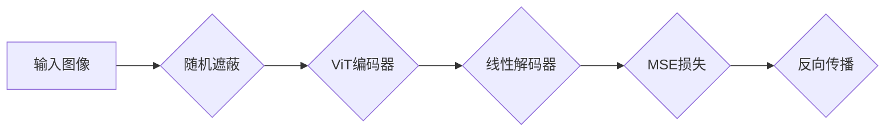

## 1. 背景介绍

### 1.1. 自监督学习的崛起

近年来，自监督学习作为一种无需人工标注数据就能学习有效特征表示的方法，在计算机视觉领域取得了巨大成功。与需要大量标注数据的监督学习相比，自监督学习能够利用海量无标签数据进行训练，从而学习到更泛化、更鲁棒的特征表示。

### 1.2. Masked Image Modeling (MIM)

Masked Image Modeling (MIM) 是一种典型的自监督学习方法，其核心思想是遮蔽图像的部分区域，然后训练模型根据剩余可见区域预测被遮蔽区域的内容。这种方法可以迫使模型学习图像的语义信息和空间结构，从而获得更强大的特征表示能力。

### 1.3. SimMIM: 简洁而高效的MIM框架

SimMIM (Simple Masked Image Modeling) 是 Facebook AI Research (FAIR) 提出的一个简洁而高效的MIM框架，它通过简化模型结构和训练过程，在保持高性能的同时，大大降低了计算成本和内存占用。SimMIM 的出现，使得 MIM 方法更容易应用于大规模数据集和复杂任务。


## 2. 核心概念与联系

### 2.1. 遮蔽策略

SimMIM 采用随机遮蔽策略，即随机选择图像中的若干个 patches 进行遮蔽。遮蔽比例通常设置为 15% 到 75% 不等，具体比例取决于数据集和任务。

### 2.2. 编码器

SimMIM 使用标准的视觉 Transformer (ViT) 作为编码器，将遮蔽后的图像编码为特征向量。ViT 是一种强大的特征提取器，能够捕捉图像的全局信息和局部细节。

### 2.3. 解码器

SimMIM 的解码器是一个轻量级的线性层，用于将编码器输出的特征向量映射回原始图像空间。解码器的目标是预测被遮蔽区域的像素值。

### 2.4. 损失函数

SimMIM 使用均方误差 (MSE) 作为损失函数，衡量解码器预测值与真实像素值之间的差异。通过最小化 MSE 损失，SimMIM 可以学习到更准确的图像表示。

## 3. 核心算法原理具体操作步骤

SimMIM 的训练过程可以概括为以下步骤：

1. **数据预处理:** 将输入图像分割成若干个 patches，并随机遮蔽一部分 patches。
2. **编码:** 将遮蔽后的图像输入 ViT 编码器，得到特征向量。
3. **解码:** 将特征向量输入线性解码器，预测被遮蔽区域的像素值。
4. **损失计算:** 计算解码器预测值与真实像素值之间的 MSE 损失。
5. **反向传播:** 根据 MSE 损失进行反向传播，更新模型参数。

## 4. 数学模型和公式详细讲解举例说明

### 4.1. ViT 编码器

ViT 编码器将输入图像  $x \in \mathbb{R}^{H \times W \times C}$  分割成  $N$  个 patches，每个 patch 的尺寸为  $P \times P$，并将每个 patch 转换为一个  $D$  维的向量。然后，ViT 将这些向量输入 Transformer 网络，得到  $N$  个  $D$  维的特征向量。

### 4.2. 线性解码器

线性解码器将 ViT 编码器输出的特征向量映射回原始图像空间。假设被遮蔽区域的像素值为  $y \in \mathbb{R}^{M}$，线性解码器的输出为  $\hat{y} \in \mathbb{R}^{M}$，则线性解码器的公式为：

$$
\hat{y} = Wz + b
$$

其中， $W \in \mathbb{R}^{M \times D}$  是权重矩阵， $b \in \mathbb{R}^{M}$  是偏置向量， $z \in \mathbb{R}^{D}$  是 ViT 编码器输出的特征向量。

### 4.3. 均方误差 (MSE) 损失

MSE 损失用于衡量解码器预测值与真实像素值之间的差异，其公式为：

$$
\mathcal{L} = \frac{1}{M} \sum_{i=1}^{M} (y_i - \hat{y}_i)^2
$$

其中， $y_i$  是真实像素值， $\hat{y}_i$  是解码器预测值。

## 5. 项目实践：代码实例和详细解释说明

### 5.1. 代码实例

```python
import torch
import torch.nn as nn
from torchvision import transforms

class SimMIM(nn.Module):
    def __init__(self, encoder, decoder, mask_ratio=0.75):
        super().__init__()
        self.encoder = encoder
        self.decoder = decoder
        self.mask_ratio = mask_ratio

    def forward(self, x):
        # 随机遮蔽图像
        x_masked = self.mask_image(x)

        # 编码
        z = self.encoder(x_masked)

        # 解码
        y_hat = self.decoder(z)

        # 计算 MSE 损失
        loss = nn.MSELoss()(y_hat, x)

        return loss

    def mask_image(self, x):
        # 获取图像尺寸
        H, W = x.shape[-2:]

        # 计算遮蔽区域大小
        mask_size = int(H * W * self.mask_ratio)

        # 随机生成遮蔽区域
        mask = torch.randint(0, H * W, (mask_size,))

        # 将遮蔽区域设置为 0
        x = x.view(-1)
        x[mask] = 0
        x = x.view(1, 3, H, W)

        return x

# 定义 ViT 编码器
encoder = ...

# 定义线性解码器
decoder = nn.Linear(encoder.output_dim, 3 * 224 * 224)

# 创建 SimMIM 模型
model = SimMIM(encoder, decoder)

# 定义优化器
optimizer = torch.optim.Adam(model.parameters(), lr=1e-4)

# 训练模型
for epoch in range(100):
    for x, _ in dataloader:
        # 前向传播
        loss = model(x)

        # 反向传播
        optimizer.zero_grad()
        loss.backward()
        optimizer.step()
```

### 5.2. 代码解释

- `SimMIM`  类定义了 SimMIM 模型，包括编码器、解码器和遮蔽比例。
- `forward()`  方法实现了模型的前向传播过程，包括遮蔽图像、编码、解码和损失计算。
- `mask_image()`  方法实现了随机遮蔽图像的功能。
- 代码实例中定义了 ViT 编码器和线性解码器，并将它们传递给  `SimMIM`  类。
- 训练过程中，使用 Adam 优化器最小化 MSE 损失。

## 6. 实际应用场景

SimMIM 作为一种高效的 MIM 方法，可以应用于各种计算机视觉任务，例如：

- **图像分类:** 学习到的特征表示可以用于图像分类任务，例如 ImageNet 分类。
- **目标检测:** SimMIM 可以作为目标检测模型的预训练模型，提高模型的性能。
- **语义分割:** SimMIM 学习到的特征表示可以用于语义分割任务，例如 Cityscapes 数据集。

## 7. 工具和资源推荐

- **PyTorch:** SimMIM 的代码实现基于 PyTorch 框架。
- **timm:** timm (pyTorch Image Models) 提供了各种预训练的 ViT 模型，可以用于 SimMIM 的编码器。
- **FairScale:** FairScale 是一个 PyTorch 扩展库，提供了各种模型并行化工具，可以用于加速 SimMIM 的训练过程。

## 8. 总结：未来发展趋势与挑战

SimMIM 作为一种简洁而高效的 MIM 方法，为自监督学习带来了新的突破。未来，MIM 方法将继续发展，并应用于更广泛的领域。

### 8.1. 未来发展趋势

- **更强大的编码器:** 研究人员将继续探索更强大的编码器结构，例如 Swin Transformer 和 ConvNeXt。
- **更有效的解码器:** 设计更有效的解码器，可以进一步提高 MIM 方法的性能。
- **多模态学习:** 将 MIM 方法扩展到多模态数据，例如图像和文本。

### 8.2. 挑战

- **理论理解:** 目前对 MIM 方法的理论理解还不够深入，需要进一步研究其工作机制。
- **计算效率:** MIM 方法的训练过程通常需要大量的计算资源，需要探索更有效的训练方法。
- **应用范围:** MIM 方法的应用范围还需要进一步扩展，例如视频理解和自然语言处理。

## 9. 附录：常见问题与解答

### 9.1. SimMIM 与 MAE 的区别是什么？

MAE (Masked Autoencoder) 是另一种 MIM 方法，它与 SimMIM 的主要区别在于解码器结构。MAE 使用一个更复杂的解码器，包含多个 Transformer 层，而 SimMIM 使用一个简单的线性解码器。

### 9.2. SimMIM 的遮蔽比例如何选择？

SimMIM 的遮蔽比例通常设置为 15% 到 75% 不等，具体比例取决于数据集和任务。一般来说，遮蔽比例越高，模型学习到的特征表示越鲁棒。

### 9.3. SimMIM 可以用于哪些下游任务？

SimMIM 可以用于各种下游任务，例如图像分类、目标检测和语义分割。


##  Mermaid 流程图


