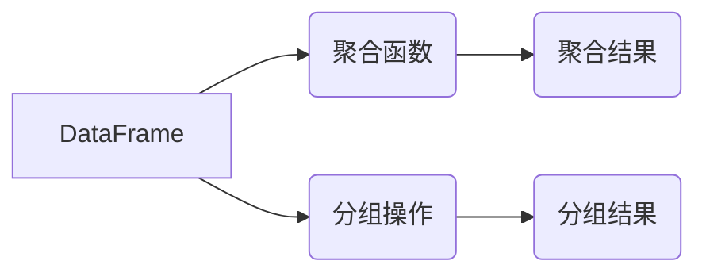

## 1. 背景介绍

### 1.1 大数据时代的挑战

随着互联网、物联网等技术的快速发展，数据量呈爆炸式增长，传统的数据处理方式已经无法满足海量数据的处理需求。大数据技术应运而生，而 Spark 作为大数据处理领域的一颗耀眼明星，凭借其高效、易用、通用等特点，被广泛应用于各个领域。

### 1.2 SparkSQL：结构化数据处理利器

SparkSQL 是 Spark 生态系统中用于处理结构化数据的模块，它提供了一种类似 SQL 的查询语言，使得用户可以方便地对结构化数据进行查询、分析和处理。SparkSQL 建立在 Spark Core 之上，充分利用了 Spark 的分布式计算能力，能够高效地处理海量数据。

### 1.3 数据聚合与分组：数据分析的基石

数据聚合与分组是数据分析中最常用的操作之一，它可以将数据按照一定的规则进行汇总和分类，从而提取出有价值的信息。SparkSQL 提供了丰富的聚合函数和分组操作，使得用户可以方便地进行数据聚合与分组分析。

## 2. 核心概念与联系

### 2.1 DataFrame：SparkSQL 的核心数据结构

DataFrame 是 SparkSQL 的核心数据结构，它是一个类似于关系型数据库中的表的分布式数据集，由若干行和列组成。每一列都有一个名称和数据类型，每一行代表一条数据记录。DataFrame 提供了丰富的 API，可以方便地进行数据查询、转换和分析。

### 2.2 聚合函数：数据汇总的利器

聚合函数用于对数据进行汇总计算，例如求和、平均值、最大值、最小值等。SparkSQL 提供了丰富的聚合函数，例如 `sum`、`avg`、`max`、`min`、`count` 等，可以满足各种数据汇总需求。

### 2.3 分组操作：数据分类的关键

分组操作用于将数据按照一定的规则进行分类，例如按照某个字段的值进行分组。SparkSQL 提供了 `groupBy` 方法进行分组操作，可以根据一个或多个字段的值对数据进行分组。

### 2.4 关系图：核心概念联系



## 3. 核心算法原理具体操作步骤

### 3.1 聚合操作原理

聚合操作的原理是将数据按照一定的规则进行汇总计算。例如，求和操作会将所有数据的值加起来，平均值操作会将所有数据的值加起来再除以数据的数量。

### 3.2 分组操作原理

分组操作的原理是将数据按照某个字段的值进行分类。例如，按照性别字段进行分组，会将所有男性数据归为一组，所有女性数据归为另一组。

### 3.3 聚合与分组操作步骤

1. 创建 DataFrame：首先需要创建一个 DataFrame，可以使用 SparkSession 的 `read` 方法读取数据源，例如 CSV 文件、JSON 文件、数据库等。
2. 选择需要聚合或分组的列：使用 `select` 方法选择需要聚合或分组的列。
3. 应用聚合函数或分组操作：使用 `agg` 方法应用聚合函数，使用 `groupBy` 方法进行分组操作。
4. 显示结果：使用 `show` 方法显示结果。

## 4. 数学模型和公式详细讲解举例说明

### 4.1 求和函数

求和函数 `sum(column)` 用于计算指定列所有值的总和。

**公式：**

```
sum(column) = column_1 + column_2 + ... + column_n
```

**示例：**

```python
# 计算所有学生的年龄总和
df.agg(sum("age")).show()
```

### 4.2 平均值函数

平均值函数 `avg(column)` 用于计算指定列所有值的平均值。

**公式：**

```
avg(column) = (column_1 + column_2 + ... + column_n) / n
```

**示例：**

```python
# 计算所有学生的平均年龄
df.agg(avg("age")).show()
```

### 4.3 分组操作

分组操作 `groupBy(column)` 用于将数据按照指定列的值进行分类。

**示例：**

```python
# 按照性别分组，计算每个性别的平均年龄
df.groupBy("gender").agg(avg("age")).show()
```

## 5. 项目实践：代码实例和详细解释说明

### 5.1 数据准备

假设我们有一个名为 `students.csv` 的 CSV 文件，包含以下数据：

```
id,name,age,gender
1,Alice,18,F
2,Bob,19,M
3,Charlie,20,M
4,David,18,M
5,Eve,19,F
```

### 5.2 代码实例

```python
from pyspark.sql import SparkSession

# 创建 SparkSession
spark = SparkSession.builder.appName("SparkSQL Aggregation and Grouping").getOrCreate()

# 读取 CSV 文件
df = spark.read.csv("students.csv", header=True, inferSchema=True)

# 计算所有学生的年龄总和
total_age = df.agg(sum("age")).first()[0]
print(f"Total age of all students: {total_age}")

# 计算所有学生的平均年龄
average_age = df.agg(avg("age")).first()[0]
print(f"Average age of all students: {average_age}")

# 按照性别分组，计算每个性别的平均年龄
gender_average_age = df.groupBy("gender").agg(avg("age"))
gender_average_age.show()

# 停止 SparkSession
spark.stop()
```

### 5.3 代码解释

1. 首先，我们创建了一个 SparkSession 对象，它是与 Spark 集群进行交互的入口点。
2. 然后，我们使用 `spark.read.csv()` 方法读取 CSV 文件，并将 `header` 参数设置为 `True` 以指示文件包含标题行，将 `inferSchema` 参数设置为 `True` 以指示 Spark 自动推断数据类型。
3. 接下来，我们使用 `agg()` 方法应用聚合函数 `sum()` 和 `avg()` 来计算所有学生的年龄总和和平均年龄。
4. 然后，我们使用 `groupBy()` 方法按照性别字段进行分组，并使用 `agg()` 方法应用聚合函数 `avg()` 来计算每个性别的平均年龄。
5. 最后，我们使用 `show()` 方法显示结果，并使用 `spark.stop()` 方法停止 SparkSession。

## 6. 实际应用场景

### 6.1 电商网站用户行为分析

电商网站可以使用 SparkSQL 对用户行为数据进行聚合和分组分析，例如：

* 计算每个用户的总消费金额。
* 计算每个商品的销量。
* 按照用户性别、年龄、地区等维度对用户进行分组，分析不同用户群体的消费行为。

### 6.2 金融行业风险控制

金融行业可以使用 SparkSQL 对交易数据进行聚合和分组分析，例如：

* 计算每个用户的交易次数和交易金额。
* 按照用户风险等级对用户进行分组，分析不同风险等级用户的交易行为。
* 识别异常交易行为，进行风险预警。

### 6.3 物联网设备数据分析

物联网领域可以使用 SparkSQL 对设备数据进行聚合和分组分析，例如：

* 计算每个设备的平均温度、湿度、光照强度等指标。
* 按照设备类型、位置等维度对设备进行分组，分析不同类型设备的运行状态。
* 识别设备故障，进行预警和维护。

## 7. 工具和资源推荐

### 7.1 Apache Spark 官方文档

Apache Spark 官方文档提供了 SparkSQL 的详细介绍、API 文档、示例代码等，是学习 SparkSQL 的最佳资源。

### 7.2 Databricks

Databricks 是一个基于 Spark 的云平台，提供了 SparkSQL 的交互式环境和丰富的工具，可以方便地进行数据分析和机器学习。

### 7.3 Spark SQL for Dummies

《Spark SQL for Dummies》是一本 SparkSQL 入门书籍，以通俗易懂的语言介绍了 SparkSQL 的基本概念、操作方法和实际应用。

## 8. 总结：未来发展趋势与挑战

### 8.1 未来发展趋势

SparkSQL 作为 Spark 生态系统中用于处理结构化数据的模块，未来将继续朝着更加高效、易用、智能的方向发展。

* 更加高效的查询引擎：SparkSQL 将继续优化查询引擎，提高查询性能，支持更复杂的查询操作。
* 更加易用的 API：SparkSQL 将提供更加易用的 API，简化数据分析流程，降低用户学习成本。
* 更加智能的数据分析：SparkSQL 将集成更加智能的数据分析算法，例如机器学习、深度学习等，帮助用户从数据中提取更加有价值的信息。

### 8.2 面临的挑战

SparkSQL 在未来发展过程中也将面临一些挑战：

* 处理非结构化数据：随着数据类型的不断丰富，SparkSQL 需要支持处理非结构化数据，例如文本、图像、视频等。
* 数据安全和隐私保护：随着数据量的不断增加，数据安全和隐私保护问题日益突出，SparkSQL 需要提供更加安全可靠的数据处理机制。
* 与其他大数据技术的融合：SparkSQL 需要与其他大数据技术，例如 Hadoop、Kafka 等进行更加紧密的融合，构建更加完整的大数据处理生态系统。

## 9. 附录：常见问题与解答

### 9.1 如何优化 SparkSQL 查询性能？

* 使用缓存：将常用的数据缓存到内存中，可以避免重复读取数据，提高查询性能。
* 使用谓词下推：将过滤条件下推到数据源，可以减少数据传输量，提高查询性能。
* 使用列式存储：将数据存储为列式格式，可以提高数据压缩率和查询性能。

### 9.2 如何处理 SparkSQL 中的 Null 值？

* 使用 `na` 函数：SparkSQL 提供了 `na` 函数，可以用于处理 Null 值，例如 `na.fill(0)` 可以将 Null 值填充为 0。
* 使用 `coalesce` 函数：`coalesce` 函数可以返回第一个非 Null 值，例如 `coalesce(column1, column2)` 可以返回 `column1` 和 `column2` 中第一个非 Null 值。

### 9.3 如何在 SparkSQL 中使用自定义函数？

* 使用 `udf` 函数：SparkSQL 提供了 `udf` 函数，可以用于注册自定义函数，例如 `udf(lambda x: x + 1)` 可以注册一个将输入值加 1 的自定义函数。
* 使用 `spark.udf.register` 方法：`spark.udf.register` 方法也可以用于注册自定义函数。
