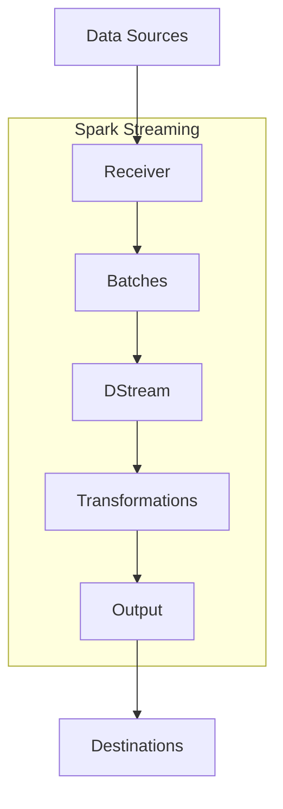
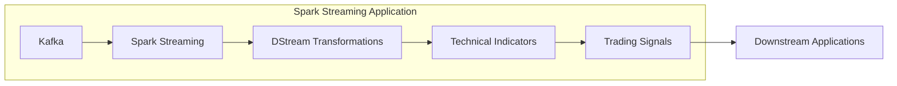

# SparkStreaming在实时股票交易数据分析中的应用

## 1.背景介绍

### 1.1 实时数据分析的重要性

在当今快节奏的商业环境中，及时获取并分析数据至关重要。实时数据分析可以为企业提供宝贵的洞察力,帮助他们做出更明智的决策,提高运营效率,并获得竞争优势。股票交易是一个典型的需要实时数据分析的领域。

### 1.2 股票交易中的实时数据分析挑战

股票交易涉及大量高频率、不断变化的数据流,如股票价格、交易量、新闻等。要从这些海量数据中提取有价值的信息并及时做出反应,需要强大的实时数据处理能力。传统的批量数据处理方法无法满足这一需求。

### 1.3 流式计算的概念

流式计算(Stream Computing)是一种新兴的大数据处理范式,旨在持续不断地处理来自各种数据源的数据流。与传统批量处理不同,流式计算以流的方式实时处理数据,能够及时生成结果。

## 2.核心概念与联系

### 2.1 Apache Spark简介

Apache Spark是一种快速、通用的集群计算系统,适用于大数据处理任务。它提供了丰富的高级API,支持多种编程语言,并具有内存计算优势,使其在迭代计算和交互式数据分析方面表现出色。

### 2.2 Spark Streaming概念

Spark Streaming是Spark生态系统中的一个关键组件,用于流式数据的实时处理。它将实时数据流分成多个小批次,并使用Spark引擎对这些批次进行高效处理。这种微批处理架构兼顾了实时性和容错性。

### 2.3 Spark Streaming与股票交易数据分析的契合

Spark Streaming通过高效地处理实时数据流,为股票交易数据分析提供了理想的解决方案。它可以实时处理股票价格、交易量等数据,并与其他数据源(如新闻)进行关联分析,从而生成及时的交易信号和洞见。

## 3.核心算法原理具体操作步骤  

### 3.1 Spark Streaming架构概览

Spark Streaming的核心架构包括以下几个主要组件:

1. **Spark Engine**: Spark的核心执行引擎,用于并行处理数据。
2. **Receiver(接收器)**: 从各种数据源(如Kafka、Flume等)接收实时数据流。
3. **Batches(批次)**: 将数据流分成多个小批次,每个批次包含一段时间内的数据。
4. **DStream(离散流)**: 由多个批次组成的数据流抽象,支持各种转换和操作。

下图展示了Spark Streaming的基本工作流程:



### 3.2 核心操作步骤

1. **创建Spark StreamingContext**

   首先需要创建StreamingContext对象,它是Spark Streaming的入口点。

   ```python
   from pyspark.streaming import StreamingContext

   sc = SparkContext(...)  # 创建SparkContext
   ssc = StreamingContext(sc, 5)  # 创建StreamingContext,批次间隔为5秒
   ```

2. **创建输入DStream**

   通过指定数据源和接收器,创建输入DStream。

   ```python
   # 从Kafka创建DStream
   kafkaStream = KafkaUtils.createStream(ssc, ...)

   # 从Socket创建DStream 
   socketStream = ssc.socketTextStream(...)
   ```

3. **对DStream执行转换操作**

   可以使用各种转换操作(map、filter、reduceByKey等)对DStream进行处理。

   ```python
   # 统计单词计数
   wordCounts = socketStream \
                  .flatMap(lambda line: line.split(" ")) \
                  .map(lambda word: (word, 1)) \
                  .reduceByKey(lambda a, b: a + b)
   ```

4. **输出操作**

   将处理结果输出到外部系统(如HDFS、数据库等)或控制台。

   ```python
   wordCounts.pprint()  # 打印到控制台
   wordCounts.saveAsTextFiles(...)  # 保存到HDFS
   ```

5. **启动Streaming上下文**

   启动StreamingContext以开始处理实时数据流。

   ```python
   ssc.start()
   ssc.awaitTermination()  # 等待处理结束
   ```

这只是Spark Streaming的基本使用流程,实际应用中还可以进行更复杂的操作,如与机器学习模型集成、与其他Spark组件配合使用等。

## 4.数学模型和公式详细讲解举例说明

在股票交易数据分析中,常用的一些数学模型和公式包括:

### 4.1 移动平均线(Moving Average)

移动平均线是技术分析中常用的工具,用于平滑股票价格曲线并识别趋势。计算公式如下:

$$
MA_n = \frac{\sum_{i=1}^{n}P_i}{n}
$$

其中:
- $MA_n$表示n日移动平均线
- $P_i$表示第i天的收盘价
- n是移动平均线的窗口大小(如20日、50日等)

例如,计算10日移动平均线:

```python
def movingAverage(prices, n=10):
    mas = []
    for i in range(n, len(prices) + 1):
        window = prices[(i - n):i]
        ma = sum(window) / n
        mas.append(ma)
    return mas
```

### 4.2 均线系统

均线系统结合多个不同周期的移动平均线,用于识别买入/卖出信号。常用的一种组合是"金叉"和"死叉":

- 金叉: 短期均线上穿长期均线,视为买入信号
- 死叉: 短期均线下穿长期均线,视为卖出信号

### 4.3 相对强弱指标(RSI)

RSI是一种常用的技术指标,用于衡量证券价格的变化速率。其计算公式为:

$$
RSI = 100 - \frac{100}{1 + RS}
$$

其中RS(相对强度)的计算方法为:

$$
RS = \frac{avg(UpGain)}{avg(DownGain)}
$$

- UpGain表示最近n天内收盘价上涨的累计值
- DownGain表示最近n天内收盘价下跌的累计值

RSI的取值范围为0-100。一般认为:
- RSI > 70,表示超买区域
- RSI < 30,表示超卖区域

这些技术指标可以与实时数据流结合,用于生成交易信号。如果将它们与机器学习模型相结合,还可以进行更复杂的分析和预测。

## 5. 项目实践:代码实例和详细解释说明

在这一部分,我们将通过一个具体的项目实践,演示如何使用Spark Streaming进行实时股票交易数据分析。我们将从Kafka接收实时股票行情数据,并计算一些常用的技术指标,如移动平均线、RSI等。

### 5.1 项目架构



1. 股票行情数据通过Kafka实时传输
2. Spark Streaming应用从Kafka消费数据,创建DStream
3. 在DStream上执行一系列转换操作,计算技术指标
4. 根据技术指标生成交易信号
5. 交易信号被下游应用(如交易系统)使用

### 5.2 代码实现

```python
from pyspark.streaming import StreamingContext
from pyspark.streaming.kafka import KafkaUtils
import json

# 创建SparkContext和StreamingContext
sc = SparkContext(appName="StockAnalytics")
ssc = StreamingContext(sc, 5)  # 批次间隔为5秒

# 从Kafka创建DStream
kafkaStream = KafkaUtils.createDirectStream(
    ssc,
    ["stock-ticks"],
    {"metadata.broker.list": "broker1:9092,broker2:9092"}
)

# 解析JSON数据
stockData = kafkaStream.map(lambda x: json.loads(x[1]))

# 计算20日移动平均线
window = stockData.window(20 * 60, 10)  # 窗口大小为20分钟,滑动间隔为10秒
mavg = window.map(lambda x: (x['ticker'], x['close'])).reduceByKey(lambda a, b: (a + b) / 2)

# 计算RSI
upGain = stockData.map(lambda x: (x['ticker'], max(0, x['close'] - x['prevClose'])))
downGain = stockData.map(lambda x: (x['ticker'], max(0, x['prevClose'] - x['close'])))

upAvg = upGain.reduceByKey(lambda a, b: a + b) / 14
downAvg = downGain.reduceByKey(lambda a, b: a + b) / 14

rs = upAvg.join(downAvg).map(lambda x: (x[0], x[1][0] / x[1][1]))
rsi = rs.map(lambda x: (x[0], 100 - (100 / (1 + x[1]))))

# 生成交易信号
signals = mavg.join(rsi).map(lambda x: generateSignal(x))

# 打印交易信号
signals.pprint()

ssc.start()
ssc.awaitTermination()
```

在上面的代码中,我们首先从Kafka创建了一个DStream `stockData`,其中包含实时股票行情数据。然后,我们对这个DStream执行了一系列转换操作:

1. `window`操作用于创建一个滑动窗口,以计算移动平均线。
2. `map`和`reduceByKey`操作用于计算20日移动平均线。
3. 另一个`map`和`reduceByKey`操作用于计算RSI指标所需的UpGain和DownGain。
4. `join`操作将移动平均线和RSI指标结合起来,生成交易信号。
5. 最后,我们使用`pprint`操作将生成的交易信号打印到控制台。

在实际应用中,您可以将生成的交易信号输出到其他系统,如交易执行系统、监控系统等。

### 5.3 性能优化

为了确保Spark Streaming应用能够及时处理大量的实时数据,我们需要进行一些性能优化:

1. **并行化计算**:充分利用Spark的并行计算能力,将计算任务分配到多个Executor上执行。
2. **持久化**:对需要重复使用的RDD进行持久化,避免重复计算。
3. **优化数据结构**:选择合适的数据结构(如HashMap)来存储和操作数据,提高效率。
4. **减少Shuffle**:尽量减少Shuffle操作,因为它会导致大量的网络传输和磁盘I/O。
5. **调整批次间隔**:根据实际需求,调整批次间隔的大小,在实时性和吞吐量之间寻求平衡。

## 6.实际应用场景

Spark Streaming在实时股票交易数据分析领域有着广泛的应用场景,包括但不限于:

1. **实时交易信号生成**:如我们在项目实践中所示,可以实时计算各种技术指标,并基于这些指标生成交易信号,供交易系统使用。
2. **实时风险管理**:通过监控实时数据流,可以及时发现异常情况(如极端价格波动),并采取相应的风险控制措施。
3. **算法交易**:将机器学习模型与实时数据流相结合,可以实现高频率的算法交易策略。
4. **实时市场监控**:分析实时市场数据,监控市场趋势和异常情况,为投资决策提供支持。
5. **实时新闻分析**:将实时新闻数据与股票行情数据关联,分析新闻对市场的影响。
6. **交易回测**:使用历史数据对交易策略进行回测和优化。

除了股票交易领域,Spark Streaming在物联网、网络安全、在线广告等领域也有着广泛的应用。

## 7.工具和资源推荐

在使用Spark Streaming进行实时数据分析时,以下工具和资源可能会对您有所帮助:

1. **Apache Kafka**:一种分布式流式处理平台,常被用作Spark Streaming的数据源。
2. **Apache Flume**:另一种流式数据收集和聚合工具,也可以与Spark Streaming集成。
3. **Apache Zeppelin**:一种基于Web的交互式笔记本环境,支持Spark、Scala等多种语言,适合进行数据探索和可视化。
4. **TA-