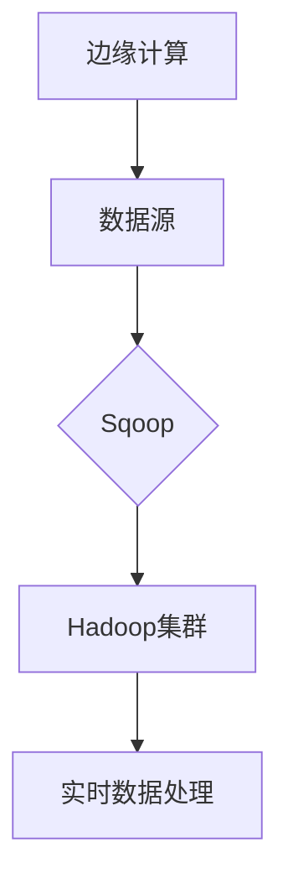

## 1. 背景介绍

### 1.1. 大数据时代的边缘计算

随着物联网、5G等技术的快速发展，越来越多的数据在网络边缘产生。边缘计算作为一种新兴的计算模式，将计算和数据存储能力推向网络边缘，更接近数据源，能够有效地减少数据传输延迟、降低带宽成本，并提高数据处理效率。

### 1.2. Sqoop：大数据迁移工具

Sqoop是一款开源的大数据迁移工具，主要用于在Hadoop和关系型数据库之间进行数据传输。它能够高效地将数据从关系型数据库导入到Hadoop分布式文件系统（HDFS）中，或将HDFS中的数据导出到关系型数据库。

### 1.3. Sqoop与边缘计算的结合：实时处理边缘数据

将Sqoop与边缘计算结合，可以实现对边缘数据的实时处理。边缘设备可以将采集到的数据存储到本地数据库，然后利用Sqoop将数据定期或实时地导入到边缘计算节点的Hadoop集群中，进行进一步的分析和处理。

## 2. 核心概念与联系

### 2.1. 边缘计算

边缘计算是指在靠近数据源头的网络边缘节点上进行数据处理和分析的计算模式。其核心思想是将计算能力下沉到网络边缘，从而减少数据传输延迟、降低带宽成本，并提高数据处理效率。

### 2.2. Sqoop

Sqoop是一款开源的大数据迁移工具，主要用于在Hadoop和关系型数据库之间进行数据传输。它支持多种数据格式，并提供丰富的配置选项，可以满足各种数据迁移需求。

### 2.3. 实时数据处理

实时数据处理是指在数据产生的同时进行处理，以满足对数据时效性要求较高的应用场景，例如实时监控、实时推荐等。

### 2.4. 核心概念联系图



## 3. 核心算法原理具体操作步骤

### 3.1. 边缘数据采集

边缘设备通过传感器、摄像头等设备采集数据，并将数据存储到本地数据库。

### 3.2. Sqoop数据导入

配置Sqoop连接器，将边缘数据库中的数据导入到边缘计算节点的Hadoop集群中。

1. **安装Sqoop**: 在边缘计算节点上安装Sqoop。

2. **配置连接器**: 配置Sqoop连接器，连接到边缘数据库。

3. **创建导入任务**: 创建Sqoop导入任务，指定数据源、目标路径、数据格式等参数。

4. **执行导入任务**: 执行Sqoop导入任务，将数据导入到Hadoop集群。

### 3.3. 实时数据处理

利用Hadoop生态系统中的实时数据处理工具，例如Spark Streaming、Flink等，对导入的数据进行实时分析和处理。

## 4. 数学模型和公式详细讲解举例说明

### 4.1. 数据传输速率

Sqoop的数据传输速率取决于多个因素，包括网络带宽、数据量、数据格式等。可以使用以下公式估算数据传输时间：

$$
T = \frac{D}{R}
$$

其中：

* $T$：数据传输时间
* $D$：数据量
* $R$：数据传输速率

**举例说明:**

假设需要将 10GB 的数据从边缘数据库导入到 Hadoop 集群，网络带宽为 100Mbps，则数据传输时间约为：

$$
T = \frac{10 \times 1024 \times 8}{100} \approx 819.2 秒
$$

### 4.2. 数据处理效率

实时数据处理的效率取决于所使用的处理工具和算法。例如，Spark Streaming 可以利用微批处理技术，将数据流切分为小的批次进行处理，从而提高处理效率。

## 5. 项目实践：代码实例和详细解释说明

### 5.1. Sqoop导入数据示例

```bash
sqoop import \
--connect jdbc:mysql://<db_host>:<db_port>/<db_name> \
--username <db_user> \
--password <db_password> \
--table <table_name> \
--target-dir /user/hadoop/data/<table_name> \
--m 1
```

**代码解释:**

* `--connect`: 指定数据库连接 URL。
* `--username`: 指定数据库用户名。
* `--password`: 指定数据库密码。
* `--table`: 指定要导入的表名。
* `--target-dir`: 指定 HDFS 上的目标路径。
* `--m`: 指定 map 任务数量，用于并行导入数据。

### 5.2. Spark Streaming实时数据处理示例

```python
from pyspark import SparkContext
from pyspark.streaming import StreamingContext

# 创建 Spark 上下文
sc = SparkContext("local[2]", "NetworkWordCount")
# 创建 Streaming 上下文，批处理间隔为 1 秒
ssc = StreamingContext(sc, 1)

# 创建 DStream，监听 9999 端口
lines = ssc.socketTextStream("localhost", 9999)

# 对数据流进行词频统计
counts = lines.flatMap(lambda line: line.split(" ")) \
              .map(lambda word: (word, 1)) \
              .reduceByKey(lambda a, b: a + b)

# 打印结果
counts.pprint()

# 启动 Streaming 上下文
ssc.start()
ssc.awaitTermination()
```

**代码解释:**

* `socketTextStream`: 创建 DStream，监听 9999 端口，接收数据流。
* `flatMap`: 将每行数据拆分为单词。
* `map`: 将每个单词映射为 (word, 1) 的键值对。
* `reduceByKey`: 对相同单词的计数进行累加。
* `pprint`: 打印结果。

## 6. 实际应用场景

### 6.1. 实时日志分析

边缘设备可以将系统日志实时导入到 Hadoop 集群，利用 Spark Streaming 等工具进行实时分析，及时发现系统异常。

### 6.2. 实时监控

边缘设备可以将传感器数据实时导入到 Hadoop 集群，利用实时数据处理工具进行实时监控，例如监测温度、湿度、压力等指标。

### 6.3. 实时推荐

边缘设备可以将用户行为数据实时导入到 Hadoop 集群，利用机器学习算法进行实时推荐，例如推荐商品、推荐服务等。

## 7. 工具和资源推荐

### 7.1. Sqoop官方文档

[https://sqoop.apache.org/docs/1.4.7/SqoopUserGuide.html](https://sqoop.apache.org/docs/1.4.7/SqoopUserGuide.html)

### 7.2. Apache Spark官方文档

[https://spark.apache.org/docs/latest/](https://spark.apache.org/docs/latest/)

### 7.3. Apache Flink官方文档

[https://flink.apache.org/docs/latest/](https://flink.apache.org/docs/latest/)

## 8. 总结：未来发展趋势与挑战

### 8.1. 未来发展趋势

* 边缘计算和实时数据处理技术将进一步融合，为边缘数据分析提供更强大的支持。
* Sqoop 将继续发展，支持更多的数据源和数据格式，并提供更丰富的功能和配置选项。
* 人工智能技术将与边缘计算和实时数据处理相结合，实现更智能化的边缘数据分析。

### 8.2. 面临的挑战

* 边缘计算环境的复杂性和异构性，给数据迁移和处理带来挑战。
* 实时数据处理对数据传输和处理效率要求较高，需要不断优化算法和工具。
* 数据安全和隐私保护是边缘计算和实时数据处理需要重点关注的问题。

## 9. 附录：常见问题与解答

### 9.1. Sqoop导入数据失败怎么办？

* 检查数据库连接配置是否正确。
* 检查目标路径是否存在，是否有写入权限。
* 检查数据格式是否与目标表匹配。

### 9.2. Spark Streaming处理数据延迟过高怎么办？

* 调整批处理间隔，减少数据处理延迟。
* 优化数据处理逻辑，提高处理效率。
* 增加计算资源，提高数据处理能力。