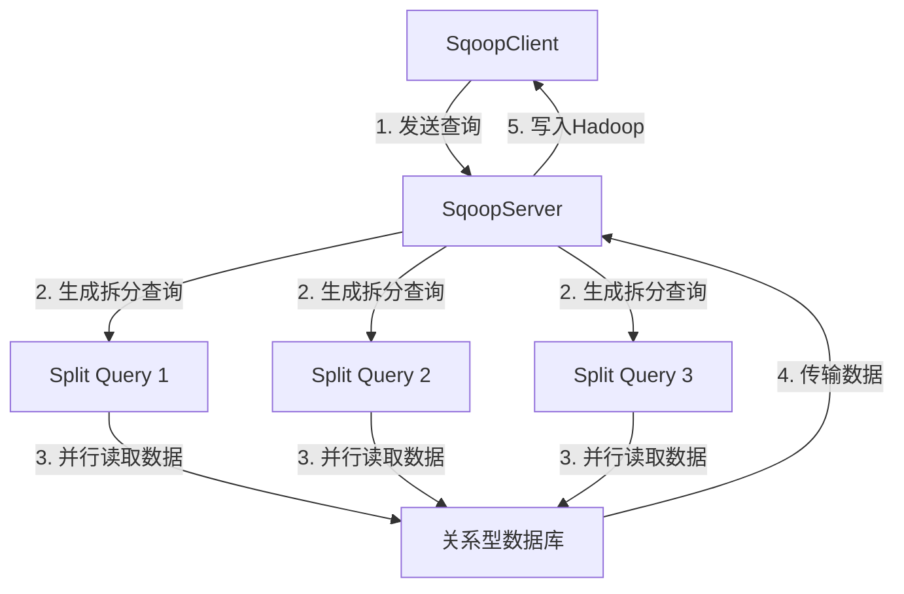

# Sqoop原理与代码实例讲解

## 1. 背景介绍

在当今大数据时代，数据已经成为企业最宝贵的资产之一。然而,这些数据通常分散存储在不同的系统中,如关系型数据库、NoSQL数据库、文件系统等。为了充分利用这些数据,我们需要一种高效的方式将它们集中到一个统一的大数据平台上,以便进行进一步的处理和分析。Apache Sqoop正是为解决这一问题而设计的一种工具。

Sqoop是一个用于在Apache Hadoop和关系数据库(RDBMS)之间高效地传输大量数据的工具。它使用了一种称为批量数据传输的技术,可以显著提高数据传输效率。Sqoop支持从RDBMS导入数据到Hadoop生态系统(如HDFS、Hive、HBase等),也支持从Hadoop导出数据到RDBMS。

## 2. 核心概念与联系

### 2.1 Sqoop架构

Sqoop由以下几个核心组件组成:

- **SqoopServer**:运行在数据库服务器上的服务器端组件,负责从RDBMS中读取数据。
- **SqoopClient**:运行在Hadoop集群上的客户端组件,负责与SqoopServer通信,协调数据传输过程。
- **SqoopTool**:命令行工具,用于执行导入和导出操作。

下图展示了Sqoop的基本架构:


### 2.2 Sqoop工作流程

1. SqoopClient向SqoopServer发送请求,描述需要传输的数据。
2. SqoopServer连接至RDBMS,使用SQL查询读取所需数据。
3. SqoopServer将数据传输给SqoopClient。
4. SqoopClient将接收到的数据写入HDFS、Hive、HBase等Hadoop组件。

### 2.3 Sqoop连接器

Sqoop支持多种数据库连接器,用于连接不同的RDBMS。常见的连接器包括:

- MySQL连接器
- Oracle连接器
- PostgreSQL连接器
- SQL Server连接器

每种连接器都有自己的特点和限制,用户需要根据实际情况选择合适的连接器。

## 3. 核心算法原理具体操作步骤 

Sqoop的核心算法是批量数据传输(Bulk Data Transfer),它可以显著提高数据传输效率。传统的数据传输方式是逐行读取和写入数据,而批量数据传输则是一次性读取和写入大量数据,从而减少了网络开销和磁盘I/O开销。

批量数据传输的具体步骤如下:

1. **创建查询**:SqoopClient向SqoopServer发送SQL查询,描述需要传输的数据。

2. **生成拆分查询**:SqoopServer根据原始查询生成多个拆分查询(Split Queries),每个拆分查询只读取数据的一部分。拆分的目的是为了并行化数据读取过程。

3. **并行读取数据**:SqoopServer并行执行多个拆分查询,从RDBMS并行读取数据。

4. **数据传输**:SqoopServer将读取到的数据分批传输给SqoopClient。

5. **写入Hadoop**:SqoopClient将接收到的数据写入HDFS、Hive或HBase等Hadoop组件。

下图展示了批量数据传输的工作流程:



通过并行化和批量化的方式,Sqoop可以显著提高数据传输效率,尤其是在处理大量数据时。

## 4. 数学模型和公式详细讲解举例说明

在批量数据传输过程中,Sqoop需要决定如何对数据进行拆分,以实现最佳的并行化效果。这个问题可以用数学建模来描述和求解。

假设我们需要从RDBMS导入一张包含 $N$ 行数据的表,Sqoop将这张表划分为 $M$ 个拆分查询。我们定义以下变量:

- $N$: 表中的总行数
- $M$: 拆分查询的数量
- $n_i$: 第 $i$ 个拆分查询需要读取的行数
- $t_i$: 第 $i$ 个拆分查询的执行时间

我们的目标是找到一种拆分方式,使得所有拆分查询的执行时间最小化,即:

$$\min \max_{1 \leq i \leq M} t_i$$

subject to:

$$\sum_{i=1}^{M} n_i = N$$

$$n_i \geq 0, \quad \forall i \in \{1, 2, \ldots, M\}$$

这是一个典型的最小最大优化问题。我们可以使用动态规划或其他优化算法来求解。

以下是一个简单的示例,假设表中有 1000 行数据,我们将其划分为 4 个拆分查询:

```
n1 = 250
n2 = 250 
n3 = 250
n4 = 250
```

这种均匀拆分的方式可以最大程度地利用并行性,从而提高整体的数据传输效率。

但是,在实际场景中,表中的数据分布可能不均匀,因此我们需要根据数据分布情况动态调整拆分策略,以达到最优的并行效果。

## 5. 项目实践:代码实例和详细解释说明

下面我们通过一个实际的代码示例来演示如何使用Sqoop从MySQL导入数据到HDFS。

### 5.1 环境准备

- Hadoop集群已经启动并运行
- MySQL数据库已经启动并运行
- Sqoop已经安装在Hadoop集群的某个节点上

### 5.2 创建测试表

在MySQL中创建一个名为`users`的测试表:

```sql
CREATE TABLE users (
    id INT PRIMARY KEY AUTO_INCREMENT,
    name VARCHAR(50) NOT NULL,
    email VARCHAR(50) NOT NULL
);

INSERT INTO users (name, email) VALUES
    ('John Doe', 'john@example.com'),
    ('Jane Smith', 'jane@example.com'),
    ('Bob Johnson', 'bob@example.com'),
    ('Alice Williams', 'alice@example.com'),
    ('Charlie Brown', 'charlie@example.com');
```

### 5.3 Sqoop导入命令

使用以下Sqoop命令从MySQL导入`users`表到HDFS:

```bash
sqoop import \
  --connect jdbc:mysql://localhost/mydatabase \
  --username myuser \
  --password mypassword \
  --table users \
  --target-dir /user/hadoop/users \
  --fields-terminated-by '\t' \
  --lines-terminated-by '\n' \
  --mysql-delimiters
```

这个命令的含义如下:

- `--connect`: 指定MySQL连接URL
- `--username`和`--password`: 指定MySQL用户名和密码
- `--table`: 指定要导入的表名
- `--target-dir`: 指定HDFS目标路径
- `--fields-terminated-by`和`--lines-terminated-by`: 指定字段和行的分隔符
- `--mysql-delimiters`: 使用MySQL默认的分隔符

执行该命令后,Sqoop将从MySQL导入`users`表的数据到HDFS的`/user/hadoop/users`目录下。

### 5.4 查看导入结果

在HDFS上查看导入的数据:

```bash
hadoop fs -cat /user/hadoop/users/part-m-00000
```

输出结果:

```
1       John Doe        john@example.com
2       Jane Smith      jane@example.com
3       Bob Johnson     bob@example.com
4       Alice Williams  alice@example.com
5       Charlie Brown   charlie@example.com
```

可以看到,`users`表中的数据已经成功导入到HDFS中。

## 6. 实际应用场景

Sqoop在许多场景下都可以发挥作用,例如:

1. **数据迁移**: 将企业的历史数据从关系型数据库迁移到Hadoop生态系统中,为大数据分析做准备。

2. **数据集成**: 定期从多个异构数据源(如RDBMS、NoSQL、文件系统等)导入数据到Hadoop,实现数据集成。

3. **ETL过程**: 在大数据ETL(提取、转换、加载)过程中,Sqoop可以作为提取数据的工具。

4. **备份和恢复**: 使用Sqoop将RDBMS中的数据导出到HDFS,作为备份;或者从HDFS导入数据到RDBMS,实现恢复。

5. **测试和开发**: 在开发和测试Hadoop应用程序时,可以使用Sqoop快速导入测试数据。

6. **物联网数据采集**: 从传感器和设备采集的数据通常存储在RDBMS中,可以使用Sqoop将这些数据导入Hadoop进行分析。

总的来说,Sqoop为在Hadoop生态系统和关系型数据库之间高效传输数据提供了一种便捷的解决方案,极大地简化了大数据集成和处理的过程。

## 7. 工具和资源推荐

除了Sqoop之外,还有一些其他工具和资源可以帮助我们更好地进行大数据集成和处理:

1. **Apache Kafka**: 一个分布式流处理平台,可以实时采集和处理大量数据,并将数据传输到Hadoop等大数据平台。

2. **Apache NiFi**: 一个数据流管理和集成工具,提供了基于Web UI的数据流编排和监控功能。

3. **Apache Flume**: 一个分布式、可靠、高可用的日志收集系统,可以将日志数据从各种来源收集并传输到Hadoop等大数据平台。

4. **Apache Hive**: 一个基于Hadoop的数据仓库工具,提供了类SQL的查询语言,可以方便地进行大数据分析。

5. **Apache Spark**: 一个快速、通用的大数据处理引擎,支持批处理、流处理、机器学习等多种应用场景。

6. **Cloudera Manager**: 一个用于部署和管理Hadoop集群的工具,可以简化集群的安装、配置和监控过程。

7. **Hortonworks Data Platform (HDP)**: 一个开源的大数据平台,集成了Hadoop、Spark、Hive、HBase等多种大数据组件。

8. **Apache Ambari**: 一个用于provisioning、managing和monitoring Apache Hadoop cluster的工具。

9. **大数据在线课程和书籍**: 如Coursera、edX等平台提供的大数据相关课程,以及《Hadoop权威指南》、《Apache Spark大数据分析》等经典书籍。

通过合理利用这些工具和资源,我们可以更好地构建和管理大数据平台,实现高效的数据集成和处理。

## 8. 总结:未来发展趋势与挑战

### 8.1 未来发展趋势

1. **云原生大数据**: 随着云计算的不断发展,未来的大数据平台将更多地部署在云环境中,以获取更好的弹性伸缩能力和资源利用率。

2. **流式处理**: 随着实时数据处理需求的增加,流式处理技术(如Apache Kafka、Apache Flink等)将得到更广泛的应用。

3. **人工智能与大数据融合**: 机器学习、深度学习等人工智能技术将与大数据处理技术更深入地融合,为各行业带来更多智能化应用。

4. **数据湖**: 数据湖(Data Lake)概念将成为企业存储和管理各种结构化、半结构化和非结构化数据的主流方式。

5. **安全和隐私保护**: 随着数据量的快速增长,数据安全和隐私保护将成为大数据领域的一大挑战和焦点。

### 8.2 挑战

1. **数据质量**: 随着数据来源和种类的增加,如何保证数据的质量和一致性将是一个挑战。

2. **数据治理**: 制定和执行数据管理政策和流程,以确保数据的可访问性、安全性和合规性,是一个巨大的挑战。

3. **技能短缺**: 大数据专业人才短缺将继续存在,培养和吸引高素