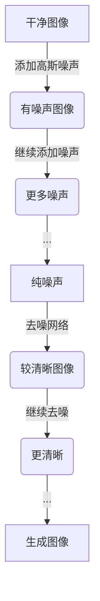
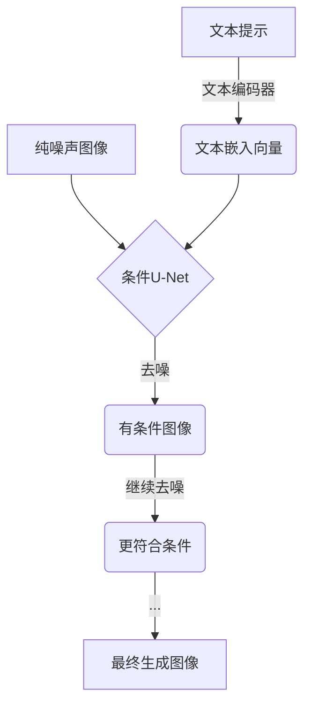
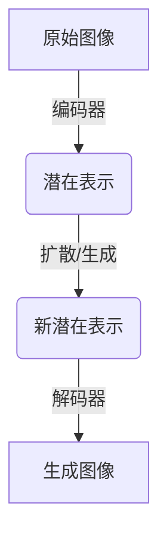
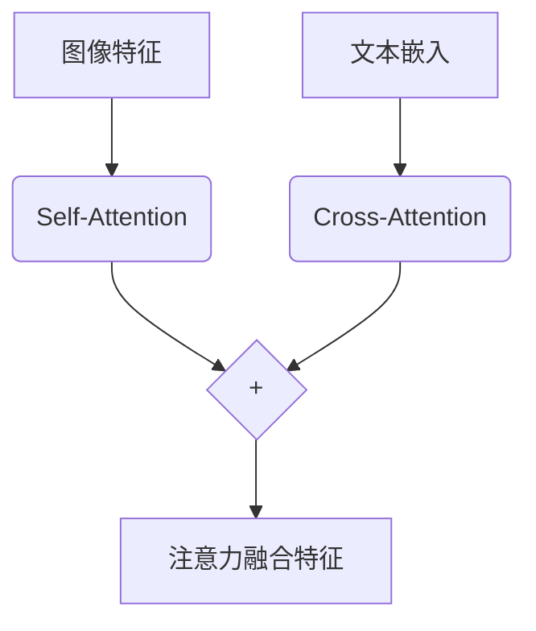

# Stable Diffusion原理与代码实例讲解

## 1.背景介绍

### 1.1 什么是Stable Diffusion?

Stable Diffusion是一种基于扩散模型(Diffusion Model)的生成式人工智能模型,它可以根据文本描述生成相应的图像。这种技术是近年来计算机视觉和自然语言处理领域的一大突破,它将文本和图像之间建立了直接的映射关系,使得人类可以用自然语言描述来生成所需的图像。

Stable Diffusion由Stability AI和LAION等机构共同开发,于2022年8月发布。它基于大规模文本-图像对数据集训练而成,具有极高的生成质量和样本多样性。

### 1.2 Stable Diffusion的应用前景

Stable Diffusion的出现为人工智能创作开辟了新的可能性。传统的计算机图形学主要依赖编程和建模,需要专业的技术和工具。而Stable Diffusion只需要一个简单的文本提示,就可以生成复杂细腻的图像,大大降低了内容创作的门槛。

Stable Diffusion可以广泛应用于插画设计、概念艺术、游戏资产生成、电影特效等领域。它还可以用于数据增广、图像编辑等任务。总的来说,Stable Diffusion为艺术家、设计师和开发者提供了强大的辅助工具,有望推动内容创作产业的变革。

## 2.核心概念与联系  

### 2.1 扩散模型(Diffusion Model)

扩散模型是Stable Diffusion的核心技术,它是一种新兴的生成式模型,可以学习任意复杂数据(如图像、音频等)的概率分布。扩散模型由两个过程组成:

1. **前向扩散过程(Forward Diffusion Process)**: 将干净的数据(如图像)逐步添加高斯噪声,直至完全变为纯噪声。
2. **逆向生成过程(Reverse Generation Process)**: 从纯噪声开始,通过学习的模型逐步去噪,最终生成所需的数据。

扩散模型的训练目标是最大化生成数据与真实数据之间的相似性。在Stable Diffusion中,扩散过程被离散化为许多个时间步骤,每个步骤的去噪都由一个独立的U-Net模型完成。

### 2.2 条件扩散(Conditional Diffusion)

标准的扩散模型生成的数据是无条件的,即模型无法控制输出的内容。Stable Diffusion采用了条件扩散(Conditional Diffusion)技术,将文本条件融入到扩散过程中,使模型可以根据文本描述生成相应的图像。

在条件扩散中,文本提示首先被文本编码器(如CLIP)编码为文本嵌入向量,然后在每个时间步的去噪过程中,该向量会被提供给U-Net作为条件输入。这样,U-Net就可以学习到文本与图像之间的对应关系,并据此生成符合文本描述的图像。

### 2.3 潜在扩散(Latent Diffusion)

Stable Diffusion采用了潜在扩散(Latent Diffusion)技术,即在图像的潜在空间(Latent Space)进行扩散和生成,而不是直接在像素空间操作。具体来说:

1. 首先使用编码器(如VGG)将图像编码为较低分辨率的潜在表示。
2. 在潜在空间进行扩散和生成过程。
3. 最后使用解码器(如VGG)将潜在表示解码为高分辨率图像。

潜在扩散的优点是计算复杂度更低,因为操作对象是低分辨率的潜在表示。同时,由于潜在空间具有更好的语义结构,在这个空间进行生成可以产生更高质量的图像。

### 2.4 注意力机制(Attention)

为了提高图像质量和样本多样性,Stable Diffusion的U-Net架构中引入了自注意力(Self-Attention)和交叉注意力(Cross-Attention)机制。

**自注意力** 可以让模型充分利用图像的长程依赖关系,提高对复杂结构和全局一致性的建模能力。

**交叉注意力** 则让文本嵌入向量对图像特征施加影响,使生成的图像能更好地匹配文本描述。

## 3.核心算法原理具体操作步骤

### 3.1 前向扩散过程

在Stable Diffusion中,前向扩散过程被离散化为T个时间步骤。在每个时间步t,会对当前潜在表示x_t添加一个高斯噪声,得到下一时间步的潜在表示x_{t+1}。公式如下:

$$x_{t+1} = \sqrt{1-\beta_t}x_t + \sqrt{\beta_t}\epsilon,\quad \epsilon \sim \mathcal{N}(0,I)$$

其中$\beta_t$是一个预定义的扩散系数,控制每个步骤添加噪声的强度。一系列的$\beta_t$构成了噪声schedule。当$t=0$时,x_0就是原始干净的潜在表示;当$t=T$时,x_T就变成了纯噪声。

### 3.2 逆向生成过程

在训练过程中,模型需要学习从噪声中恢复原始数据的能力。具体来说,对于每个时间步t,需要学习一个去噪模型$p_\theta(x_{t-1}|x_t)$,使其能够从x_t恢复到x_{t-1}。

然而,直接对联合概率$p_\theta(x_{0:T})$建模非常困难。Stable Diffusion采用了一种叫作"参数化模型"的方法,利用可训练的神经网络$\epsilon_\theta$来预测噪声分量$\epsilon$:

$$\epsilon_\theta(x_t,t) = \epsilon$$

一旦得到了噪声分量,就可以从x_t恢复到x_{t-1}:

$$x_{t-1} = \frac{1}{\sqrt{1-\beta_t}}(x_t - \frac{\beta_t}{\sqrt{1-\overline{\beta}_t}}\epsilon_\theta(x_t,t))$$

其中$\overline{\beta}_t = \prod_{s=1}^t \beta_s$是噪声schedule的积性质。

在推理阶段,我们从纯噪声x_T开始,通过上述方程逐步去噪,最终得到生成的图像x_0。

### 3.3 条件扩散

为了使模型能根据文本描述生成图像,Stable Diffusion采用了条件扩散的技术。具体来说,会先使用CLIP等模型将文本提示编码为一个文本嵌入向量c。

在每个时间步t的去噪过程中,文本嵌入c会被提供给$\epsilon_\theta$模型作为条件输入,从而影响噪声预测:

$$\epsilon_\theta(x_t,t,c)$$

通过将文本信息融入到去噪过程中,模型就学会了根据文本描述生成相应的图像。

### 3.4 采样过程

在推理阶段,为了获得多样化的输出,Stable Diffusion引入了一些采样技巧:

1. **Classifier-Free Guidance Scale**: 在预测噪声时,同时考虑无条件模型和条件模型的输出,并对两者进行加权求和。通过调节权重,可以在样本质量和多样性之间进行权衡。

2. **Latent Upscaling**: 先在较低分辨率的潜在空间生成图像,再逐步上采样至更高分辨率。这种分层生成可以提高效率和质量。

3. **PLMS Sampling**: 在每个时间步,根据当前生成图像的质量动态调整采样步长,从而产生更好的结果。

通过以上技术的配合,Stable Diffusion可以生成风格多样、质量优秀的图像样本。

## 4. 数学模型和公式详细讲解举例说明

### 4.1 扩散模型的训练目标

扩散模型的训练目标是最大化生成数据与真实数据之间的相似性,即最小化以下损失函数:

$$\mathcal{L}_\text{simple}(\theta) = \mathbb{E}_{t,x_0,\epsilon}\big[\|\epsilon - \epsilon_\theta(x_t, t)\|^2\big]$$

其中$x_t$是在时间步t时的扩散数据,$\epsilon$是对应的高斯噪声,$\epsilon_\theta$是我们需要学习的去噪模型。

直觉上,当$\epsilon_\theta$可以完美预测噪声分量时,我们就能从$x_t$精确地恢复到$x_{t-1}$,进而最终得到原始数据$x_0$。

### 4.2 变分下界目标

然而,上述简单的训练目标存在一些缺陷。直接最小化噪声不能保证生成数据的质量,也无法处理离群数据。为了解决这些问题,Stable Diffusion采用了基于变分下界(Variational Lower Bound)的训练目标:

$$\begin{aligned}
\mathcal{L}_\text{vlb}(\theta) &= \mathbb{E}_{t,x_0}\big[\|\epsilon - \epsilon_\theta(x_t,t)\|^2\big] \\
&\quad - \lambda\mathbb{E}_{t,x_0}\big[\log p_\theta(x_0|x_t)\big]
\end{aligned}$$

其中第二项是对$x_0$的似然估计,用来惩罚低质量的生成结果。$\lambda$是一个权重系数,控制两项之间的平衡。

利用变分下界目标,模型不仅可以学习去噪,还可以提高生成数据的质量和多样性。

### 4.3 条件扩散的目标

对于条件扩散,我们希望生成的数据不仅要逼近真实数据,还要满足给定的条件(如文本描述)。因此,Stable Diffusion的训练目标进一步扩展为:

$$\begin{aligned}
\mathcal{L}_\text{cond}(\theta) &= \mathbb{E}_{t,x_0,c,\epsilon}\big[\|\epsilon - \epsilon_\theta(x_t,t,c)\|^2\big] \\
&\quad - \lambda\mathbb{E}_{t,x_0,c}\big[\log p_\theta(x_0|x_t,c)\big]
\end{aligned}$$

其中$c$是条件向量(如文本嵌入),$\epsilon_\theta$现在需要基于$x_t$和$c$来预测噪声。

通过最小化条件扩散的目标函数,模型可以学习到文本与图像之间的映射关系,从而根据文本描述生成所需的图像。

### 4.4 Classifier-Free Guidance

在推理阶段,Stable Diffusion采用了一种叫做Classifier-Free Guidance的技术,以平衡样本质量和多样性。具体来说,在预测噪声时,会同时考虑无条件模型和条件模型的输出:

$$\epsilon_\text{guided} = \epsilon_\theta(x_t,t,c) + s\cdot(\epsilon_\theta(x_t,t) - \epsilon_\theta(x_t,t,c))$$

其中$s$是一个超参数,称为Guidance Scale。当$s=0$时,相当于无条件生成;当$s>0$时,条件模型的输出会被放大,从而使生成结果更符合文本描述。

通过调节$s$的值,我们可以在样本质量和多样性之间进行权衡。较大的$s$会产生更高质量但多样性较低的结果,而较小的$s$则相反。

## 5. 项目实践:代码实例和详细解释说明

在这