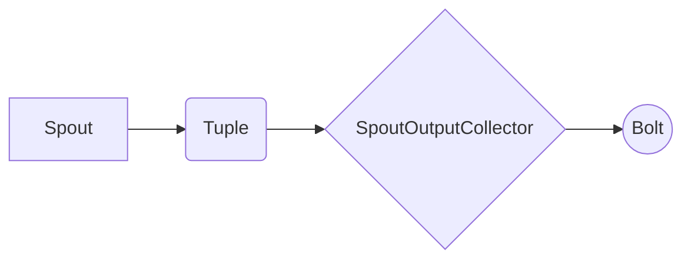

## 1. 背景介绍

### 1.1 大数据时代的实时流处理需求

随着互联网和物联网技术的快速发展，数据量呈爆炸式增长，传统的批处理方式已经无法满足实时性要求。实时流处理技术应运而生，它能够实时地处理和分析高速流动的数据流，为企业提供快速、准确的决策支持。

### 1.2 Apache Storm 简介

Apache Storm 是一个开源的分布式实时计算系统，它具有高性能、可扩展、容错性强等特点，被广泛应用于实时数据分析、机器学习、风险控制等领域。Storm 的核心概念是**拓扑(Topology)**，它是由**Spout**和**Bolt**组成的有向无环图（DAG）。其中，**Spout**负责从数据源读取数据，**Bolt**负责对数据进行处理和转换。

### 1.3 Storm Spout 的作用

**Spout**是 Storm 拓扑的源头，它负责从外部数据源（如 Kafka、Twitter、数据库等）读取数据，并将数据转换成 Storm 内部的数据结构（Tuple），然后发送给 Bolt 进行处理。Spout 的可靠性直接影响到整个拓扑的性能和稳定性。

## 2. 核心概念与联系

### 2.1 Spout 接口

Storm 为 Spout 提供了 `ISpout` 接口，该接口定义了 Spout 的核心方法：

* `open(Map conf, TopologyContext context, SpoutOutputCollector collector)`：初始化 Spout，接收配置信息、拓扑上下文和输出收集器。
* `nextTuple()`:  从数据源读取数据，并将其转换成 Tuple 发送给 Bolt。
* `ack(Object msgId)`:  当 Bolt 成功处理完 Tuple 后，会调用该方法进行确认。
* `fail(Object msgId)`:  当 Bolt 处理 Tuple 失败时，会调用该方法进行重试。
* `close()`:  关闭 Spout，释放资源。

### 2.2 Tuple

Tuple 是 Storm 内部的数据结构，它是一个有序的值列表，用于在 Spout 和 Bolt 之间传递数据。每个 Tuple 都有一个唯一的 ID，用于跟踪 Tuple 的处理状态。

### 2.3 SpoutOutputCollector

SpoutOutputCollector 是 Spout 用于发送 Tuple 的接口，它提供了以下方法：

* `emit(Tuple tuple)`:  发送 Tuple 到默认的输出流。
* `emit(String streamId, Tuple tuple)`:  发送 Tuple 到指定的输出流。
* `emitDirect(int taskId, Tuple tuple)`:  将 Tuple 直接发送到指定的 Bolt 任务。
* `emitDirect(int taskId, String streamId, Tuple tuple)`:  将 Tuple 直接发送到指定的 Bolt 任务和输出流。

### 2.4 关系图



## 3. 核心算法原理具体操作步骤

### 3.1 数据读取

Spout 首先需要从数据源读取数据，这可以通过各种方式实现，例如：

* 使用 Kafka Consumer API 从 Kafka 读取消息。
* 使用 Twitter Streaming API 从 Twitter 读取推文。
* 使用 JDBC 连接从数据库读取数据。

### 3.2 数据转换

读取到数据后，Spout 需要将其转换成 Tuple 格式，这通常需要根据数据源的格式进行相应的解析和转换。

### 3.3 Tuple 发送

Spout 使用 SpoutOutputCollector 将 Tuple 发送给 Bolt，可以选择发送到默认的输出流或指定的输出流。

### 3.4 Ack/Fail 处理

当 Bolt 处理完 Tuple 后，会向 Spout 发送 Ack 或 Fail 消息。Spout 接收 Ack 消息后，可以将该 Tuple 标记为已处理，接收 Fail 消息后，可以进行重试或其他处理。

## 4. 数学模型和公式详细讲解举例说明

由于 Spout 的实现方式多种多样，这里不做具体的数学模型和公式讲解。

## 5. 项目实践：代码实例和详细解释说明

### 5.1 Kafka Spout 示例

```java
import org.apache.storm.kafka.spout.KafkaSpout;
import org.apache.storm.kafka.spout.KafkaSpoutConfig;
import org.apache.storm.topology.TopologyBuilder;
import org.apache.storm.tuple.Fields;

public class KafkaSpoutExample {

    public static void main(String[] args) throws Exception {
        // Kafka 配置
        String bootstrapServers = "localhost:9092";
        String topicName = "test";
        String groupId = "test-group";

        // 创建 KafkaSpoutConfig
        KafkaSpoutConfig<String, String> spoutConfig = KafkaSpoutConfig.builder(bootstrapServers, topicName)
                .setGroupId(groupId)
                .build();

        // 创建 KafkaSpout
        KafkaSpout<String, String> spout = new KafkaSpout<>(spoutConfig);

        // 创建 TopologyBuilder
        TopologyBuilder builder = new TopologyBuilder();

        // 设置 Spout
        builder.setSpout("kafka-spout", spout, 1);

        // 设置 Bolt
        builder.setBolt("bolt", new MyBolt(), 1)
                .shuffleGrouping("kafka-spout");

        // 提交拓扑
        LocalCluster cluster = new LocalCluster();
        cluster.submitTopology("kafka-topology", conf, builder.createTopology());

        // 等待一段时间后关闭集群
        Thread.sleep(10000);
        cluster.killTopology("kafka-topology");
        cluster.shutdown();
    }
}

class MyBolt extends BaseRichBolt {

    @Override
    public void prepare(Map stormConf, TopologyContext context, OutputCollector collector) {
        // 初始化 Bolt
    }

    @Override
    public void execute(Tuple input) {
        // 处理 Tuple
        String message = input.getString(0);
        System.out.println("Received message: " + message);

        // 确认 Tuple 已处理
        collector.ack(input);
    }

    @Override
    public void declareOutputFields(OutputFieldsDeclarer declarer) {
        // 声明输出字段
        declarer.declare(new Fields("word"));
    }
}
```

### 5.2 代码解释

* **KafkaSpout**: 用于从 Kafka 读取数据的 Spout。
* **KafkaSpoutConfig**: KafkaSpout 的配置类，用于设置 Kafka 连接信息、主题名称、消费者组 ID 等。
* **TopologyBuilder**: 用于构建 Storm 拓扑的类。
* **MyBolt**: 用于处理 Tuple 的 Bolt。
* **LocalCluster**: 用于本地测试 Storm 拓扑的类。

## 6. 实际应用场景

Storm Spout 被广泛应用于各种实时数据处理场景，例如：

* **实时日志分析**: 从 Kafka 读取日志数据，进行实时分析和监控。
* **社交媒体分析**: 从 Twitter 读取推文，进行情感分析、话题跟踪等。
* **欺诈检测**: 从交易数据流中识别可疑交易。
* **推荐系统**: 从用户行为数据中实时生成推荐结果。

## 7. 工具和资源推荐

* **Apache Storm 官方文档**: https://storm.apache.org/
* **Storm Kafka Spout**: https://github.com/apache/storm/tree/master/external/storm-kafka-client
* **Twitter Streaming API**: https://developer.twitter.com/en/docs/twitter-api/v1/tweets/filter-realtime/overview

## 8. 总结：未来发展趋势与挑战

### 8.1 未来发展趋势

* **更高的性能和可扩展性**: 随着数据量的不断增长，对实时流处理系统的性能和可扩展性提出了更高的要求。
* **更丰富的功能**:  未来 Storm Spout 将支持更多的数据源和数据格式，并提供更丰富的功能，例如数据清洗、数据转换等。
* **更智能化**:  利用机器学习等技术，Storm Spout 将能够自动识别数据模式、优化数据处理流程。

### 8.2 面临的挑战

* **数据质量**:  实时流处理系统需要处理大量的数据，数据质量的参差不齐会影响到系统的性能和准确性。
* **系统复杂性**:  Storm 拓扑的构建和维护需要一定的技术 expertise，系统复杂性也会增加运维成本。
* **安全性**:  实时流处理系统通常处理敏感数据，需要采取相应的安全措施来保护数据的安全。

## 9. 附录：常见问题与解答

### 9.1 Spout 如何保证数据可靠性？

Spout 通过 Ack/Fail 机制来保证数据可靠性。当 Bolt 成功处理完 Tuple 后，会向 Spout 发送 Ack 消息，Spout 接收 Ack 消息后，可以将该 Tuple 标记为已处理。当 Bolt 处理 Tuple 失败时，会向 Spout 发送 Fail 消息，Spout 接收 Fail 消息后，可以进行重试或其他处理。

### 9.2 Spout 如何处理数据积压？

当数据量过大，Spout 处理速度跟不上数据输入速度时，就会出现数据积压。为了解决这个问题，可以采取以下措施：

* 增加 Spout 的并行度。
* 优化 Spout 的数据读取和处理逻辑。
* 使用消息队列来缓冲数据。


## 10.  结束语

Storm Spout 是 Storm 拓扑的关键组件之一，它负责从外部数据源读取数据，并将其转换成 Storm 内部的数据结构（Tuple），然后发送给 Bolt 进行处理。Spout 的可靠性和性能直接影响到整个拓扑的性能和稳定性。

希望本文能够帮助读者更好地理解 Storm Spout 的原理和代码实现，并为读者在实际项目中使用 Storm Spout 提供一些参考。