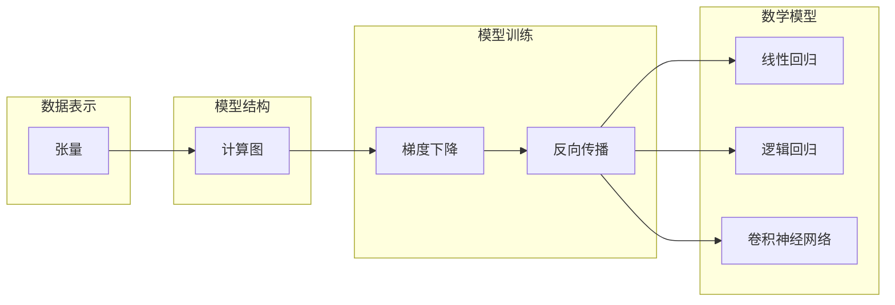

## 1. 深入浅出：深度学习框架之争

### 1.1  人工智能浪潮下的深度学习框架

近年来，人工智能（AI）技术以前所未有的速度发展，其中深度学习作为AI的核心引擎，更是引领了技术革新浪潮。深度学习的成功离不开高效、灵活的深度学习框架，它们为研究者和开发者提供了构建、训练和部署复杂神经网络模型的强大工具。TensorFlow和PyTorch作为目前最流行的两大深度学习框架，各自拥有独特的优势和庞大的用户群体，成为了推动AI技术发展的重要力量。

### 1.2  TensorFlow与PyTorch：并驾齐驱的开源巨头

TensorFlow由Google Brain团队开发，于2015年开源发布，凭借其强大的分布式计算能力和丰富的生态系统，迅速成为工业界应用最广泛的深度学习框架之一。PyTorch则由Facebook AI Research团队开发，于2016年开源发布，其灵活性和易用性深受学术界和研究者的喜爱，近年来在工业界应用也逐渐增多。

### 1.3  框架之争：技术演进与未来展望

TensorFlow和PyTorch的竞争推动了深度学习框架的快速发展，两者在功能和性能上不断完善，并相互借鉴和融合。未来，深度学习框架将朝着更加高效、灵活、易用和可扩展的方向发展，以满足日益增长的AI应用需求。

## 2. 核心概念：构建深度学习模型的基石

### 2.1  张量：数据表示的基础

深度学习框架的核心概念是张量（Tensor），它是一种多维数组，用于表示各种类型的数据，例如图像、文本、音频和视频等。张量是深度学习模型进行计算和数据处理的基本单元。

### 2.2  计算图：模型结构的抽象表示

计算图（Computational Graph）是一种用于描述深度学习模型结构的抽象表示。它将模型的计算过程表示为一个有向无环图，其中节点表示计算操作，边表示数据流动。计算图可以清晰地展示模型的结构和计算流程，方便进行模型分析和优化。

### 2.3  自动微分：高效计算梯度的利器

自动微分（Automatic Differentiation）是深度学习框架中一项重要的技术，它可以自动计算模型参数的梯度，用于模型训练和优化。自动微分技术极大地简化了深度学习模型的开发过程，使得开发者无需手动计算梯度，从而提高了开发效率。

## 3. 核心算法：模型训练的引擎

### 3.1  梯度下降：优化模型参数的经典算法

梯度下降（Gradient Descent）是深度学习中最常用的优化算法之一，它通过迭代更新模型参数，使模型的损失函数逐渐减小，最终达到最优解。梯度下降算法有多种变体，例如随机梯度下降（SGD）、动量梯度下降（Momentum）和Adam等，它们在收敛速度和稳定性方面有所不同。

#### 3.1.1 随机梯度下降（SGD）

随机梯度下降（SGD）是梯度下降算法的一种变体，它每次迭代只使用一部分训练数据来计算梯度，从而降低了计算量，提高了训练速度。但是，SGD算法容易受到噪声的影响，导致训练过程不稳定。

#### 3.1.2 动量梯度下降（Momentum）

动量梯度下降（Momentum）是SGD算法的一种改进，它在每次迭代时考虑了之前迭代的梯度方向，从而增加了训练过程的稳定性，加速了收敛速度。

#### 3.1.3 Adam

Adam是一种自适应学习率优化算法，它结合了动量梯度下降和RMSprop算法的优点，能够自动调整学习率，并在训练过程中保持较高的稳定性。

### 3.2  反向传播：计算梯度的关键步骤

反向传播（Backpropagation）是深度学习模型训练的核心算法，它利用链式法则计算模型参数的梯度，并将其用于更新参数。反向传播算法是自动微分技术的核心，它使得深度学习模型的训练过程变得高效和自动化。

## 4. 数学模型： 深入理解算法原理

### 4.1  线性回归：最简单的机器学习模型

线性回归是一种用于预测连续值输出的机器学习模型，它假设输入特征与输出之间存在线性关系。线性回归模型的数学表达式为：

$$
y = w_1x_1 + w_2x_2 + ... + w_nx_n + b
$$

其中，$y$表示模型的输出，$x_1, x_2, ..., x_n$表示输入特征，$w_1, w_2, ..., w_n$表示模型参数，$b$表示偏置项。

### 4.2  逻辑回归：用于分类问题的概率模型

逻辑回归是一种用于预测二分类问题的机器学习模型，它将线性回归模型的输出通过sigmoid函数映射到[0, 1]区间，表示样本属于正类的概率。逻辑回归模型的数学表达式为：

$$
p = \frac{1}{1 + e^{-(w_1x_1 + w_2x_2 + ... + w_nx_n + b)}}
$$

其中，$p$表示样本属于正类的概率。

### 4.3  卷积神经网络：处理图像数据的利器

卷积神经网络（CNN）是一种专门用于处理图像数据的深度学习模型，它利用卷积操作提取图像的局部特征，并通过池化操作降低特征维度，最终将提取的特征用于分类或回归任务。

## 5. 项目实践：代码实例和详细解释说明

### 5.1  TensorFlow示例：构建简单的线性回归模型

```python
import tensorflow as tf

# 定义模型输入和输出
x = tf.placeholder(tf.float32, [None, 1])
y = tf.placeholder(tf.float32, [None, 1])

# 定义模型参数
W = tf.Variable(tf.zeros([1, 1]))
b = tf.Variable(tf.zeros([1]))

# 定义模型输出
y_pred = tf.matmul(x, W) + b

# 定义损失函数
loss = tf.reduce_mean(tf.square(y - y_pred))

# 定义优化器
optimizer = tf.train.GradientDescentOptimizer(0.01).minimize(loss)

# 初始化变量
init = tf.global_variables_initializer()

# 创建会话
with tf.Session() as sess:
  # 初始化变量
  sess.run(init)

  # 训练模型
  for i in range(1000):
    # 生成训练数据
    x_train = [[i] for i in range(100)]
    y_train = [[i * 2 + 1] for i in range(100)]

    # 运行优化器
    sess.run(optimizer, feed_dict={x: x_train, y: y_train})

  # 打印模型参数
  print("W:", sess.run(W))
  print("b:", sess.run(b))
```

### 5.2  PyTorch示例：构建简单的卷积神经网络

```python
import torch
import torch.nn as nn
import torch.nn.functional as F

# 定义卷积神经网络
class Net(nn.Module):
  def __init__(self):
    super(Net, self).__init__()
    self.conv1 = nn.Conv2d(1, 6, 5)
    self.pool = nn.MaxPool2d(2, 2)
    self.conv2 = nn.Conv2d(6, 16, 5)
    self.fc1 = nn.Linear(16 * 5 * 5, 120)
    self.fc2 = nn.Linear(120, 84)
    self.fc3 = nn.Linear(84, 10)

  def forward(self, x):
    x = self.pool(F.relu(self.conv1(x)))
    x = self.pool(F.relu(self.conv2(x)))
    x = x.view(-1, 16 * 5 * 5)
    x = F.relu(self.fc1(x))
    x = F.relu(self.fc2(x))
    x = self.fc3(x)
    return x

# 创建网络实例
net = Net()

# 定义损失函数
criterion = nn.CrossEntropyLoss()

# 定义优化器
optimizer = torch.optim.SGD(net.parameters(), lr=0.001, momentum=0.9)

# 训练模型
for epoch in range(10):
  # 生成训练数据
  inputs = torch.randn(100, 1, 32, 32)
  labels = torch.randint(0, 10, (100,))

  # 清零梯度
  optimizer.zero_grad()

  # 前向传播
  outputs = net(inputs)

  # 计算损失
  loss = criterion(outputs, labels)

  # 反向传播
  loss.backward()

  # 更新参数
  optimizer.step()

  # 打印损失
  print("Epoch:", epoch, "Loss:", loss.item())
```

## 6. 实际应用场景

### 6.1  图像识别：深度学习的经典应用

图像识别是深度学习最成功的应用领域之一，例如人脸识别、物体检测、图像分类等。深度学习模型在ImageNet等大型图像数据集上取得了超越传统方法的性能，推动了图像识别技术的快速发展。

### 6.2  自然语言处理：理解和生成人类语言

自然语言处理（NLP）是人工智能的重要分支，它研究如何让计算机理解和生成人类语言。深度学习在NLP领域取得了显著成果，例如机器翻译、文本摘要、问答系统等。

### 6.3  语音识别：将语音转换为文本

语音识别是将语音信号转换为文本的技术，深度学习在语音识别领域取得了重大突破，例如自动语音识别（ASR）、语音合成（TTS）等。

## 7. 工具和资源推荐

### 7.1  TensorFlow官方网站：提供丰富的文档和教程

[https://www.tensorflow.org/](https://www.tensorflow.org/)

### 7.2  PyTorch官方网站：提供详细的文档和示例

[https://pytorch.org/](https://pytorch.org/)

### 7.3  深度学习课程：Stanford CS231n

[http://cs231n.stanford.edu/](http://cs231n.stanford.edu/)

## 8. 总结：未来发展趋势与挑战

### 8.1  模型效率：提升训练和推理速度

随着深度学习模型规模的不断增大，模型效率成为了一个重要挑战。未来的深度学习框架需要不断优化算法和硬件，以提升模型的训练和推理速度。

### 8.2  模型可解释性：理解模型决策机制

深度学习模型通常被认为是黑盒模型，其决策机制难以解释。未来的研究方向之一是提高模型的可解释性，使得开发者能够更好地理解模型的行为，并进行调试和优化。

### 8.3  模型泛化能力：应对未知数据

深度学习模型的泛化能力是指其在未见数据上的性能表现。未来的研究方向之一是提高模型的泛化能力，使其能够更好地应对未知数据，并提高模型的鲁棒性。

## 9. 附录：常见问题与解答

### 9.1  TensorFlow和PyTorch有什么区别？

TensorFlow和PyTorch是目前最流行的两大深度学习框架，它们在以下方面有所区别：

* 计算图：TensorFlow使用静态计算图，而PyTorch使用动态计算图。
* 易用性：PyTorch的API更加简洁易用，而TensorFlow的API相对复杂。
* 生态系统：TensorFlow拥有更加丰富的生态系统，包括TensorBoard、TF Serving等工具。
* 部署：TensorFlow支持多种部署方式，包括服务器、移动设备和嵌入式设备等。

### 9.2  如何选择合适的深度学习框架？

选择合适的深度学习框架需要考虑以下因素：

* 应用场景：不同的深度学习框架适用于不同的应用场景。
* 开发经验：选择熟悉的框架可以提高开发效率。
* 生态系统：丰富的生态系统可以提供更多工具和资源。
* 性能：不同的框架在性能方面有所差异。

## 10.  核心概念原理和架构 Mermaid流程图


