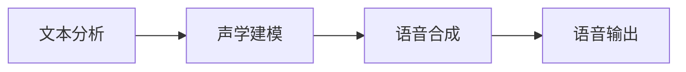

# Text-to-Speech (TTS)原理与代码实例讲解

作者：禅与计算机程序设计艺术

## 1. 背景介绍

### 1.1  TTS技术的演进

语音合成技术，也被称为文本-语音转换技术（Text-to-Speech，TTS），其历史可以追溯到 18 世纪。最初的尝试是基于机械装置，通过模拟人类声带的振动来产生声音。随着电子技术的发展，语音合成技术逐渐转向电子合成器，利用电子振荡器和滤波器来生成语音。20 世纪 70 年代，数字信号处理技术的进步使得语音合成技术迈入了新的阶段，基于规则的语音合成系统开始出现。这些系统通过预先定义的语音规则将文本转换成语音，但生成的语音质量仍然有限。

近年来，随着深度学习技术的飞速发展，基于深度学习的语音合成技术取得了突破性的进展。深度神经网络能够从大量的语音数据中学习语音的特征和规律，生成更加自然、流畅、富有表现力的语音。这也使得语音合成技术在人机交互、辅助阅读、语音助手等领域得到越来越广泛的应用。

### 1.2  TTS的应用场景

TTS技术已经渗透到我们生活的方方面面，一些常见的应用场景包括：

* **语音助手**: Siri、Alexa、Google Assistant 等语音助手都依赖于 TTS 技术来实现语音交互。
* **辅助阅读**: 盲人或低视力人士可以使用 TTS 软件将文本转换成语音，方便阅读。
* **教育**: TTS 技术可以用于语言学习，帮助学生练习发音和听力。
* **娱乐**:  TTS 技术可以用于生成虚拟角色的语音，例如游戏角色、动画人物等。
* **客服**:  TTS 技术可以用于构建自动客服系统，提供语音咨询服务。

### 1.3  TTS技术的挑战

尽管 TTS 技术取得了显著的进步，但仍然面临着一些挑战：

* **自然度**: 生成语音的自然度仍然有待提高，尤其是在处理情感、语气、韵律等方面。
* **鲁棒性**:  TTS 系统的鲁棒性需要进一步提升，以应对不同口音、语速、噪声环境等挑战。
* **个性化**:  如何根据用户的需求生成个性化的语音，例如不同的音色、语调等，也是一个重要的研究方向。

## 2. 核心概念与联系

### 2.1  文本分析

TTS 系统的第一步是对输入文本进行分析，提取文本中的语言学信息，例如：

* **分词**:  将文本分割成单词或词组。
* **词性标注**:  标注每个单词的词性，例如名词、动词、形容词等。
* **语法分析**:  分析句子的语法结构，例如主谓宾结构、定语状语补语等。
* **语义分析**:  理解句子的语义，例如句子的情感、意图等。

### 2.2  声学建模

声学建模是 TTS 系统的核心部分，其目标是建立文本特征与语音特征之间的映射关系。传统的声学建模方法主要基于隐马尔可夫模型（Hidden Markov Model，HMM），而近年来深度学习方法，例如循环神经网络（Recurrent Neural Network，RNN）和卷积神经网络（Convolutional Neural Network，CNN），在声学建模中取得了显著的成果。

### 2.3  语音合成

语音合成是 TTS 系统的最后一步，将声学模型生成的语音特征转换成可听见的声音。常用的语音合成方法包括：

* **波形拼接合成**:  将预先录制好的语音片段拼接起来，生成完整的语音。
* **参数合成**:  根据声学模型生成的语音参数，使用声码器合成语音。

### 2.4  核心概念联系

下图展示了 TTS 系统中各个核心概念之间的联系：



## 3. 核心算法原理具体操作步骤

### 3.1  文本分析

#### 3.1.1 分词

分词是将文本分割成单词或词组的过程。常用的分词方法包括：

* **基于词典的分词**:  根据预先定义的词典，将文本分割成单词。
* **基于统计的分词**:  利用统计方法，例如最大熵模型、条件随机场等，对文本进行分词。
* **基于规则的分词**:  根据预先定义的规则，例如正则表达式，对文本进行分词。

#### 3.1.2 词性标注

词性标注是标注每个单词的词性的过程。常用的词性标注方法包括：

* **基于规则的词性标注**:  根据预先定义的规则，例如词缀、上下文等，对单词进行词性标注。
* **基于统计的词性标注**:  利用统计方法，例如隐马尔可夫模型、最大熵模型等，对单词进行词性标注。
* **基于深度学习的词性标注**:  利用深度学习方法，例如循环神经网络、卷积神经网络等，对单词进行词性标注。

#### 3.1.3 语法分析

语法分析是分析句子语法结构的过程。常用的语法分析方法包括：

* **短语结构语法**:  将句子解析成短语结构树，表示句子的语法结构。
* **依存语法**:  分析句子中单词之间的依存关系，表示句子的语法结构。

#### 3.1.4 语义分析

语义分析是理解句子语义的过程。常用的语义分析方法包括：

* **词义消歧**:  确定多义词在句子中的具体含义。
* **语义角色标注**:  标注句子中每个成分的语义角色，例如施事、受事、工具等。
* **情感分析**:  分析句子的情感，例如正面、负面、中性等。

### 3.2  声学建模

#### 3.2.1 基于 HMM 的声学建模

隐马尔可夫模型（HMM）是一种统计模型，用于描述一个系统在不同状态之间的转移概率以及每个状态下观测值的概率分布。在声学建模中，HMM 可以用来描述语音信号的生成过程。

HMM 声学建模的基本原理是将语音信号看作是由一系列语音单元组成的，每个语音单元对应一个 HMM 状态。HMM 的参数包括：

* **状态转移概率**:  描述系统从一个状态转移到另一个状态的概率。
* **观测概率**:  描述每个状态下观测值的概率分布。

HMM 声学建模的训练过程是利用大量的语音数据，估计 HMM 的参数。训练完成后，HMM 可以用来预测给定文本对应的语音信号。

#### 3.2.2 基于深度学习的声学建模

近年来，深度学习方法在声学建模中取得了显著的成果。深度神经网络能够从大量的语音数据中学习语音的特征和规律，生成更加自然、流畅、富有表现力的语音。

常用的深度学习声学建模方法包括：

* **循环神经网络（RNN）**:  RNN 是一种能够处理序列数据的深度神经网络，可以用来建模语音信号的时序关系。
* **卷积神经网络（CNN）**:  CNN 是一种能够提取数据局部特征的深度神经网络，可以用来提取语音信号的频谱特征。
* **Transformer**:  Transformer 是一种基于自注意力机制的深度神经网络，在自然语言处理领域取得了显著的成果，近年来也被应用于声学建模。

### 3.3  语音合成

#### 3.3.1 波形拼接合成

波形拼接合成是将预先录制好的语音片段拼接起来，生成完整的语音。这种方法的优点是语音质量高，但缺点是需要大量的语音数据，而且生成的语音缺乏灵活性。

#### 3.3.2 参数合成

参数合成是根据声学模型生成的语音参数，使用声码器合成语音。声码器是一种能够将语音参数转换成语音信号的算法。常用的声码器包括：

* **线性预测编码（LPC）**:  LPC 是一种基于线性预测的声码器，可以有效地压缩语音信号。
* **メル周波数ケプストラム系数（MFCC）**:  MFCC 是一种基于人耳听觉特性的声码器，可以提取语音信号的感知特征。
* **WORLD 声码器**:  WORLD 声码器是一种高质量的声码器，可以生成自然、流畅的语音。

## 4. 数学模型和公式详细讲解举例说明

### 4.1  HMM 声学建模的数学模型

HMM 声学建模的数学模型可以表示为一个五元组：

$$
\lambda = (S, V, A, B, \pi)
$$

其中：

* $S = \{s_1, s_2, ..., s_N\}$ 表示状态集合，每个状态代表一个语音单元。
* $V = \{v_1, v_2, ..., v_M\}$ 表示观测值集合，每个观测值代表一个语音帧的特征向量。
* $A = \{a_{ij}\}$ 表示状态转移概率矩阵，其中 $a_{ij}$ 表示从状态 $s_i$ 转移到状态 $s_j$ 的概率。
* $B = \{b_j(k)\}$ 表示观测概率矩阵，其中 $b_j(k)$ 表示在状态 $s_j$ 下观测到 $v_k$ 的概率。
* $\pi = \{\pi_i\}$ 表示初始状态概率分布，其中 $\pi_i$ 表示初始状态为 $s_i$ 的概率。

### 4.2  HMM 参数估计

HMM 参数估计的目的是利用大量的语音数据，估计 HMM 的参数。常用的 HMM 参数估计方法包括：

* **最大似然估计（MLE）**:  MLE 的目标是找到一组 HMM 参数，使得观测数据的似然函数最大化。
* **期望最大化算法（EM 算法）**:  EM 算法是一种迭代算法，用于估计含有隐变量的模型的参数。

### 4.3  HMM 语音识别

HMM 语音识别的目的是找到最有可能生成观测语音信号的状态序列。常用的 HMM 语音识别算法包括：

* **维特比算法**:  维特比算法是一种动态规划算法，用于找到最优状态序列。
* **前向-后向算法**:  前向-后向算法用于计算观测序列的概率。

### 4.4  举例说明

假设我们要建立一个简单的 HMM 声学模型，用于识别数字 "0" 到 "9" 的语音。我们可以将每个数字对应一个 HMM 状态，每个状态的观测值是语音帧的 MFCC 特征向量。

我们可以利用大量的语音数据，使用 EM 算法估计 HMM 的参数。训练完成后，我们可以使用维特比算法识别输入语音信号对应的数字。

## 5. 项目实践：代码实例和详细解释说明

### 5.1  Python 代码实例

```python
import pyttsx3

# 初始化 TTS 引擎
engine = pyttsx3.init()

# 设置语音速度
rate = engine.getProperty('rate')
engine.setProperty('rate', rate - 50)

# 设置音量
volume = engine.getProperty('volume')
engine.setProperty('volume', volume - 0.25)

# 设置语音
voices = engine.getProperty('voices')
engine.setProperty('voice', voices[1].id)

# 合成语音
engine.say("你好，世界！")
engine.runAndWait()
```

### 5.2  代码解释

* `pyttsx3` 是一个 Python 的 TTS 库，可以用来合成语音。
* `engine = pyttsx3.init()` 初始化 TTS 引擎。
* `engine.getProperty('rate')` 获取语音速度。
* `engine.setProperty('rate', rate - 50)` 设置语音速度。
* `engine.getProperty('volume')` 获取音量。
* `engine.setProperty('volume', volume - 0.25)` 设置音量。
* `engine.getProperty('voices')` 获取可用的语音列表。
* `engine.setProperty('voice', voices[1].id)` 设置语音。
* `engine.say("你好，世界！")` 合成语音。
* `engine.runAndWait()` 等待语音合成完成。

## 6. 实际应用场景

### 6.1  语音助手

语音助手，例如 Siri、Alexa、Google Assistant 等，都依赖于 TTS 技术来实现语音交互。用户可以通过语音指令与语音助手进行交互，例如查询天气、播放音乐、设置闹钟等。

### 6.2  辅助阅读

盲人或低视力人士可以使用 TTS 软件将文本转换成语音，方便阅读。TTS 软件可以读取网页、文档、电子书等内容，并将其转换成语音播放出来。

### 6.3  教育

TTS 技术可以用于语言学习，帮助学生练习发音和听力。学生可以听 TTS 软件朗读课文，并模仿其发音。TTS 软件还可以将学生的语音录制下来，并与标准发音进行比较，帮助学生纠正发音错误。

### 6.4  娱乐

TTS 技术可以用于生成虚拟角色的语音，例如游戏角色、动画人物等。游戏开发者可以使用 TTS 软件为游戏角色配音，使游戏角色更加生动。动画制作人员可以使用 TTS 软件为动画人物配音，提高动画的制作效率。

### 6.5  客服

TTS 技术可以用于构建自动客服系统，提供语音咨询服务。用户可以通过语音与自动客服系统进行交互，例如查询订单状态、咨询产品信息等。自动客服系统可以根据用户的语音指令，自动回答用户的问题，提高客服效率。

## 7. 总结：未来发展趋势与挑战

### 7.1  未来发展趋势

TTS 技术的未来发展趋势包括：

* **更加自然、流畅、富有表现力的语音**:  随着深度学习技术的不断发展，TTS 系统生成的语音将更加自然、流畅、富有表现力。
* **更加个性化的语音**:  TTS 系统将能够根据用户的需求生成个性化的语音，例如不同的音色、语调等。
* **更加智能的语音交互**:  TTS 技术将与其他人工智能技术，例如自然语言处理、语音识别等，相结合，实现更加智能的语音交互。

### 7.2  挑战

TTS 技术仍然面临着一些挑战：

* **自然度**:  生成语音的自然度仍然有待提高，尤其是在处理情感、语气、韵律等方面。
* **鲁棒性**:  TTS 系统的鲁棒性需要进一步提升，以应对不同口音、语速、噪声环境等挑战。
* **个性化**:  如何根据用户的需求生成个性化的语音，例如不同的音色、语调等，也是一个重要的研究方向。

## 8. 附录：常见问题与解答

### 8.1  TTS 软件有哪些？

常见的 TTS 软件包括：

* **Google Cloud Text-to-Speech**:  Google 提供的云端 TTS 服务，支持多种语言和语音。
* **Amazon Polly**:  Amazon 提供的云端 TTS 服务，支持多种语言和语音。
* **Microsoft Azure Text-to-Speech**:  Microsoft 提供的云端 TTS 服务，支持多种语言和语音。
* **Balabolka**:  一款免费的桌面 TTS 软件，支持多种语言和语音。
* **NaturalReader**:  一款付费的桌面 TTS 软件，支持多种语言和语音，并提供多种功能，例如 OCR、文本朗读等。

### 8.2  如何评估 TTS 系统的质量？

评估 TTS 系统的质量常用的指标包括：

* **自然度**:  生成语音的自然度，通常通过主观评价来衡量。
* **清晰度**:  生成语音的清晰度，通常通过客观指标，例如信噪比、可懂度等，来衡量。
* **流畅度**:  生成语音的流畅度，通常通过主观评价来衡量。

### 8.3  TTS 技术有哪些应用？

TTS 技术的应用非常广泛，例如：

* 语音助手
* 辅助阅读
* 教育
* 娱乐
* 客服

### 8.4  TTS 技术的未来发展趋势是什么？

TTS 技术的未来发展趋势包括：

* 更加自然、流畅、富有表现力的语音
* 更加个性化的语音
* 更加智能的语音交互
