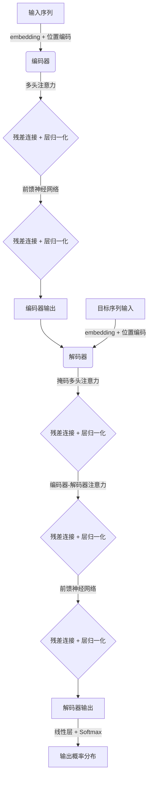

# Transformer原理与代码实战案例讲解

## 1. 背景介绍

### 1.1 序列到序列模型的发展历程

在深度学习时代到来之前，统计机器翻译模型一直是基于短语的翻译系统。这些系统将句子分割成短语,然后对每个短语进行翻译,最后将翻译结果重新组合成目标语言的句子。这种方法存在一些固有的缺陷,如无法很好地解决长距离依赖问题,也难以充分利用上下文信息。

随着深度学习技术的兴起,序列到序列(Seq2Seq)模型应运而生,为解决机器翻译等任务提供了新的思路。2014年,Google的研究人员提出了编码器-解码器(Encoder-Decoder)架构,将整个输入序列编码为一个向量,然后解码器根据该向量生成目标序列。该模型的核心是两个循环神经网络(RNN),用于捕获输入和输出序列之间的长期依赖关系。

尽管Seq2Seq模型取得了一些进展,但它仍然存在一些局限性。首先,单个向量难以完全捕获整个序列的所有信息,这被称为"信息瓶颈"问题。其次,RNN在捕获长期依赖关系方面存在一些局限性。为了解决这些问题,Transformer模型应运而生。

### 1.2 Transformer模型的重大突破

2017年,Google的研究人员在论文"Attention Is All You Need"中提出了Transformer模型,这是一种全新的基于注意力机制的序列到序列模型。Transformer完全舍弃了RNN,而是使用注意力机制来捕获输入和输出序列之间的依赖关系。这种架构不仅克服了RNN在处理长期依赖关系时的局限性,而且由于其高度并行化的特点,训练速度也大大加快。

Transformer模型在机器翻译、文本生成、对话系统等多个领域取得了出色的表现,引发了深度学习领域的一场革命。它的出现不仅推动了自然语言处理领域的发展,而且对计算机视觉、语音识别等其他领域也产生了深远的影响。

## 2. 核心概念与联系

### 2.1 注意力机制

注意力机制是Transformer模型的核心,它允许模型在编码输入序列和生成输出序列时,动态地关注与当前任务相关的信息。与RNN不同,Transformer不再依赖序列的顺序,而是通过注意力机制直接建立任意两个位置之间的联系。

注意力机制可以概括为以下三个步骤:

1. **计算注意力分数**:对于每个位置的输出,计算其与所有其他位置输出的相关性分数。
2. **注意力分布**:使用Softmax函数将注意力分数转换为注意力分布,即每个位置输出对应的注意力权重。
3. **加权求和**:使用注意力权重对所有位置的输出进行加权求和,得到最终的注意力输出。

注意力机制允许模型灵活地聚焦于与当前任务相关的信息,从而提高了模型的表现。它还可以应用于不同的任务和模态,如机器翻译、图像分类等。

### 2.2 多头注意力机制

尽管标准的注意力机制已经取得了不错的效果,但它仍然存在一些局限性。例如,它只能关注一种表示子空间,这可能会导致信息的丢失。为了解决这个问题,Transformer引入了多头注意力机制。

多头注意力机制可以被视为多个独立的注意力机制的集合,每个注意力机制都关注输入序列的不同表示子空间。具体来说,它将输入先进行线性变换,得到多个子空间表示,然后对每个子空间表示分别应用注意力机制,最后将所有注意力输出进行拼接,形成最终的多头注意力输出。

通过多头注意力机制,Transformer能够从不同的表示子空间中捕获不同的信息,从而提高了模型的表现能力。

### 2.3 位置编码

由于Transformer完全舍弃了RNN,因此它无法像RNN那样自然地捕获序列的顺序信息。为了解决这个问题,Transformer引入了位置编码的概念。

位置编码是一种将位置信息编码到输入序列的方法。具体来说,它为每个位置生成一个独特的向量,并将其与输入序列的embedding相加,从而使模型能够区分不同位置的输入。

常用的位置编码方法包括正弦位置编码和可学习的位置编码。前者使用固定的正弦函数生成位置向量,后者则将位置向量作为可训练的参数进行学习。

### 2.4 层归一化和残差连接

为了加速训练过程并提高模型的稳定性,Transformer采用了层归一化(Layer Normalization)和残差连接(Residual Connection)两种技术。

层归一化是一种对输入进行归一化的操作,它可以加快模型的收敛速度,并提高模型对不同输入分布的鲁棒性。具体来说,它对每个样本的每个特征进行归一化,使其均值为0、方差为1。

残差连接则是将输入直接传递到后面的层,并与该层的输出相加。这种设计可以缓解梯度消失或爆炸的问题,并使模型更容易训练。

## 3. 核心算法原理具体操作步骤

### 3.1 Transformer编码器

Transformer编码器的主要任务是将输入序列编码为一系列向量表示,以便后续的解码器使用。它由多个相同的层组成,每层包含两个子层:多头注意力机制和前馈神经网络。

1. **输入embedding和位置编码**:首先,将输入序列转换为embedding表示,并与位置编码相加。
2. **多头注意力子层**:然后,将embedding输入到多头注意力子层,计算自注意力输出。
3. **残差连接和层归一化**:将自注意力输出与输入相加(残差连接),并进行层归一化。
4. **前馈神经网络子层**:将归一化后的输出输入到前馈神经网络子层,进行线性变换和非线性激活。
5. **残差连接和层归一化**:将前馈神经网络的输出与上一步的输入相加(残差连接),并进行层归一化。
6. **层堆叠**:重复步骤2-5,堆叠多个编码器层。

经过多层编码器的处理,输入序列被转换为一系列向量表示,这些向量表示捕获了输入序列中的重要信息。

### 3.2 Transformer解码器

Transformer解码器的主要任务是根据编码器的输出,生成目标序列。它的结构与编码器类似,也由多个相同的层组成,每层包含三个子层:掩码多头注意力机制、编码器-解码器注意力机制和前馈神经网络。

1. **输入embedding和位置编码**:首先,将输入序列转换为embedding表示,并与位置编码相加。
2. **掩码多头注意力子层**:将embedding输入到掩码多头注意力子层,计算自注意力输出。这里使用掩码机制,确保每个位置的输出只与该位置之前的输入相关。
3. **残差连接和层归一化**:将自注意力输出与输入相加(残差连接),并进行层归一化。
4. **编码器-解码器注意力子层**:将归一化后的输出与编码器的输出进行注意力计算,得到编码器-解码器注意力输出。
5. **残差连接和层归一化**:将编码器-解码器注意力输出与上一步的输入相加(残差连接),并进行层归一化。
6. **前馈神经网络子层**:将归一化后的输出输入到前馈神经网络子层,进行线性变换和非线性激活。
7. **残差连接和层归一化**:将前馈神经网络的输出与上一步的输入相加(残差连接),并进行层归一化。
8. **层堆叠**:重复步骤2-7,堆叠多个解码器层。
9. **输出层**:最后,将解码器的输出通过一个线性层和Softmax层,生成目标序列的概率分布。

在生成序列的过程中,解码器会自回归地预测每个时间步的输出,并将预测结果作为下一个时间步的输入。

### 3.3 总体架构流程图

下面是Transformer模型的总体架构流程图:

## 4. 数学模型和公式详细讲解举例说明

### 4.1 缩放点积注意力

Transformer中使用的是缩放点积注意力机制,它可以被定义为:

$$
\text{Attention}(Q, K, V) = \text{softmax}\left(\frac{QK^T}{\sqrt{d_k}}\right)V
$$

其中:

- $Q$是查询(Query)矩阵,用于计算注意力分数
- $K$是键(Key)矩阵,也用于计算注意力分数
- $V$是值(Value)矩阵,用于计算注意力加权和
- $d_k$是缩放因子,等于$K$的最后一个维度的大小

缩放点积注意力的计算过程如下:

1. 计算查询和键之间的点积:$QK^T$
2. 对点积结果进行缩放:$\frac{QK^T}{\sqrt{d_k}}$,这有助于缓解较大的点积值导致的梯度下降过慢的问题。
3. 对缩放后的点积结果应用Softmax函数,得到注意力分数:$\text{softmax}\left(\frac{QK^T}{\sqrt{d_k}}\right)$
4. 将注意力分数与值矩阵$V$相乘,得到注意力加权和:$\text{softmax}\left(\frac{QK^T}{\sqrt{d_k}}\right)V$

缩放点积注意力机制允许模型动态地关注与当前任务相关的信息,从而提高了模型的表现。

### 4.2 多头注意力

多头注意力机制可以被定义为:

$$
\text{MultiHead}(Q, K, V) = \text{Concat}(head_1, \dots, head_h)W^O
$$

其中$head_i$是第$i$个注意力头,计算方式如下:

$$
head_i = \text{Attention}(QW_i^Q, KW_i^K, VW_i^V)
$$

这里$W_i^Q \in \mathbb{R}^{d_\text{model} \times d_k}$、$W_i^K \in \mathbb{R}^{d_\text{model} \times d_k}$和$W_i^V \in \mathbb{R}^{d_\text{model} \times d_v}$是可学习的线性投影矩阵,用于将查询、键和值投影到不同的表示子空间。$W^O \in \mathbb{R}^{hd_v \times d_\text{model}}$是另一个可学习的线性投影矩阵,用于将多个注意力头的输出拼接在一起。

多头注意力机制允许模型从不同的表示子空间中捕获不同的信息,从而提高了模型的表现能力。

### 4.3 位置编码

Transformer使用的位置编码可以被定义为:

$$
\begin{aligned}
\text{PE}_{(pos, 2i)} &= \sin\left(\frac{pos}{10000^{2i/d_\text{model}}}\right) \\
\text{PE}_{(pos, 2i+1)} &= \cos\left(\frac{pos}{10000^{2i/d_\text{model}}}\right)
\end{aligned}
$$

其中$pos$是位置索引,而$i$是维度索引。这种位置编码使用不同频率的正弦和余弦函数对不同的位置和维度进行编码,从而为模型提供了位置信息。

除了上述正弦位置编码,