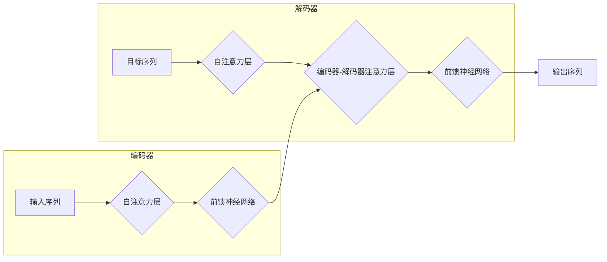

## 1. 背景介绍

### 1.1 时间序列预测的挑战

时间序列预测是数据科学领域中一个重要的研究方向，其目标是根据历史数据预测未来的趋势。 然而，时间序列数据通常具有以下特点，给预测带来了挑战：

* **非线性:** 时间序列数据往往呈现出复杂的非线性模式，难以用简单的线性模型进行拟合。
* **长程依赖:**  时间序列数据中，遥远过去的数据点可能对未来的预测产生重要影响，捕捉这种长程依赖关系是准确预测的关键。
* **噪声:** 时间序列数据中常常包含噪声，这些噪声会干扰模型的学习，降低预测精度。

### 1.2  Transformer的优势

近年来，Transformer模型在自然语言处理领域取得了巨大成功，其强大的序列建模能力使其成为处理时间序列数据的理想选择。 Transformer模型具有以下优势：

* **自注意力机制:** Transformer的核心是自注意力机制，它能够捕捉序列中任意两个位置之间的关系，有效地学习长程依赖。
* **并行计算:** Transformer的结构允许并行计算，大大提高了训练和预测的速度。
* **可扩展性:** Transformer模型可以扩展到处理非常长的序列，适用于各种规模的时间序列数据。

### 1.3 Transformer在时间序列预测中的应用

Transformer模型已经成功应用于各种时间序列预测任务，包括：

* **电力负荷预测:** 预测未来一段时间内的电力需求，帮助电力公司优化资源配置。
* **交通流量预测:** 预测道路交通流量，帮助交通管理部门优化交通信号灯控制和道路规划。
* **金融市场预测:** 预测股票价格、汇率等金融指标，帮助投资者做出更明智的投资决策。


## 2. 核心概念与联系

### 2.1 Transformer架构

Transformer模型由编码器和解码器两部分组成，如下图所示：



* **编码器:** 编码器接收输入序列，并将其转换为包含序列信息的隐藏状态。编码器由多个相同的层堆叠而成，每个层包含自注意力层和前馈神经网络。
* **解码器:** 解码器接收目标序列，并根据编码器的隐藏状态预测输出序列。解码器也由多个相同的层堆叠而成，每个层包含自注意力层、编码器-解码器注意力层和前馈神经网络。

### 2.2 自注意力机制

自注意力机制是Transformer模型的核心，它允许模型关注序列中任意两个位置之间的关系。自注意力机制的计算过程如下：

1. **计算查询(Query)、键(Key)和值(Value):**  对输入序列中的每个词向量，分别计算其查询向量、键向量和值向量。
2. **计算注意力分数:** 计算每个查询向量与所有键向量的点积，得到注意力分数矩阵。
3. **归一化注意力分数:** 对注意力分数矩阵进行softmax操作，得到归一化的注意力权重。
4. **加权求和:** 将值向量根据注意力权重进行加权求和，得到最终的输出向量。

### 2.3 位置编码

由于Transformer模型不包含循环神经网络，它无法直接感知序列中词的顺序。为了解决这个问题，Transformer模型引入了位置编码，将词的位置信息添加到词向量中。

## 3. 核心算法原理具体操作步骤

### 3.1 数据预处理

在将时间序列数据输入Transformer模型之前，需要进行数据预处理，包括：

* **数据清洗:** 处理缺失值、异常值等数据质量问题。
* **数据归一化:** 将数据缩放到相同的范围，例如[0,1]或[-1,1]。
* **数据分割:** 将数据划分为训练集、验证集和测试集。

### 3.2 模型训练

使用训练集训练Transformer模型，优化模型参数，使其能够准确地预测时间序列数据。训练过程中，需要选择合适的损失函数和优化器。

### 3.3 模型评估

使用验证集评估模型的性能，选择性能最佳的模型。常用的评估指标包括均方误差 (MSE)、平均绝对误差 (MAE) 和决定系数 (R^2)。

### 3.4 模型预测

使用训练好的模型对测试集进行预测，评估模型的泛化能力。

## 4. 数学模型和公式详细讲解举例说明

### 4.1 自注意力机制

自注意力机制的计算公式如下：

$$
Attention(Q, K, V) = softmax(\frac{QK^T}{\sqrt{d_k}})V
$$

其中：

* $Q$ 是查询矩阵，维度为 $[seq\_len, d_k]$。
* $K$ 是键矩阵，维度为 $[seq\_len, d_k]$。
* $V$ 是值矩阵，维度为 $[seq\_len, d_v]$。
* $d_k$ 是键向量的维度。
* $softmax$ 是 softmax 函数。

### 4.2 位置编码

位置编码的计算公式如下：

$$
PE_{(pos, 2i)} = sin(pos / 10000^{2i/d_{model}})
$$

$$
PE_{(pos, 2i+1)} = cos(pos / 10000^{2i/d_{model}})
$$

其中：

* $pos$ 是词在序列中的位置。
* $i$ 是维度索引。
* $d_{model}$ 是词向量的维度。

## 5. 项目实践：代码实例和详细解释说明

### 5.1 Python代码示例

```python
import torch
import torch.nn as nn

class TransformerTimeSeries(nn.Module):
    def __init__(self, input_size, hidden_size, num_layers, output_size):
        super(TransformerTimeSeries, self).__init__()
        self.encoder_layer = nn.TransformerEncoderLayer(d_model=hidden_size, nhead=8)
        self.transformer_encoder = nn.TransformerEncoder(self.encoder_layer, num_layers=num_layers)
        self.decoder = nn.Linear(hidden_size, output_size)

    def forward(self, src):
        # 添加位置编码
        src = src + self.get_positional_encoding(src.shape[1], src.shape[2])
        # 编码器
        output = self.transformer_encoder(src)
        # 解码器
        output = self.decoder(output[:, -1, :])
        return output

    def get_positional_encoding(self, seq_len, d_model):
        pe = torch.zeros(seq_len, d_model)
        position = torch.arange(0, seq_len, dtype=torch.float).unsqueeze(1)
        div_term = torch.exp(torch.arange(0, d_model, 2).float() * (-math.log(10000.0) / d_model))
        pe[:, 0::2] = torch.sin(position * div_term)
        pe[:, 1::2] = torch.cos(position * div_term)
        pe = pe.unsqueeze(0)
        return pe
```

### 5.2 代码解释

* `TransformerTimeSeries` 类定义了Transformer时间序列模型。
* `__init__` 方法初始化模型的各个组件，包括编码器、解码器和位置编码。
* `forward` 方法定义了模型的前向传播过程，包括添加位置编码、编码器、解码器。
* `get_positional_encoding` 方法计算位置编码。

## 6. 实际应用场景

### 6.1 电力负荷预测

Transformer模型可以用于预测未来一段时间内的电力需求，帮助电力公司优化资源配置。

### 6.2 交通流量预测

Transformer模型可以用于预测道路交通流量，帮助交通管理部门优化交通信号灯控制和道路规划。

### 6.3 金融市场预测

Transformer模型可以用于预测股票价格、汇率等金融指标，帮助投资者做出更明智的投资决策。

## 7. 工具和资源推荐

### 7.1 PyTorch

PyTorch是一个开源的机器学习框架，提供了丰富的工具和资源，用于构建和训练Transformer模型。

### 7.2 Hugging Face Transformers

Hugging Face Transformers是一个开源的自然语言处理库，提供了预训练的Transformer模型，可以用于各种任务，包括时间序列预测。

## 8. 总结：未来发展趋势与挑战

### 8.1 未来发展趋势

* **模型优化:** 研究人员将继续探索更有效的Transformer模型架构和训练方法，以提高时间序列预测的精度。
* **多模态数据融合:** 将时间序列数据与其他类型的数据（例如文本、图像）融合，可以提供更全面的信息，提高预测精度。
* **可解释性:**  研究人员将努力提高Transformer模型的可解释性，帮助用户理解模型的预测结果。

### 8.2 挑战

* **数据质量:** 时间序列数据通常包含噪声和缺失值，需要进行有效的数据清洗和预处理。
* **模型复杂度:** Transformer模型的复杂度较高，需要大量的计算资源进行训练和预测。
* **可解释性:**  Transformer模型的决策过程难以解释，需要开发新的方法来提高模型的可解释性。

## 9. 附录：常见问题与解答

### 9.1 如何选择合适的Transformer模型？

选择合适的Transformer模型取决于具体的任务和数据特点。需要考虑模型的复杂度、训练时间、预测精度等因素。

### 9.2 如何提高Transformer模型的预测精度？

提高Transformer模型的预测精度可以通过以下方法：

* **数据增强:** 通过增加数据量或改变数据分布来提高模型的泛化能力。
* **模型微调:** 使用预训练的Transformer模型作为基础，针对特定任务进行微调。
* **超参数优化:** 调整模型的超参数，例如学习率、批大小等。

### 9.3 如何解释Transformer模型的预测结果？

解释Transformer模型的预测结果可以通过以下方法：

* **注意力可视化:**  可视化模型的注意力权重，了解模型关注哪些输入信息。
* **特征重要性分析:** 分析哪些输入特征对模型的预测结果影响最大。
