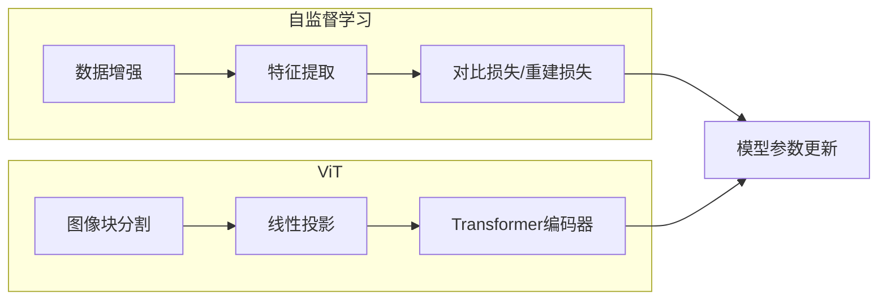

# "ViT在自监督学习中的应用"

作者：禅与计算机程序设计艺术

## 1. 背景介绍

### 1.1 自监督学习的兴起

近年来，自监督学习作为一种新的学习范式，在计算机视觉领域取得了显著的成果。与传统的监督学习需要大量标注数据不同，自监督学习可以利用未标注数据进行训练，从而降低了对数据标注的依赖，为解决数据标注成本高、周期长等问题提供了新的思路。

### 1.2  Vision Transformer (ViT)的突破

Vision Transformer (ViT) 是一种基于 Transformer 架构的图像分类模型，它将图像分割成一系列的图像块 (patch)，并将这些图像块作为输入序列送入 Transformer 编码器进行特征提取。ViT 在图像分类任务上取得了与卷积神经网络 (CNN) 相当甚至更好的性能，展现了 Transformer 在计算机视觉领域的巨大潜力。

### 1.3 ViT与自监督学习的结合

将 ViT 应用于自监督学习，可以充分发挥 ViT 强大的特征提取能力和自监督学习的优势，进一步提升模型的性能和泛化能力。

## 2. 核心概念与联系

### 2.1 自监督学习

#### 2.1.1 定义

自监督学习是一种利用辅助任务从无标签数据中学习特征表示的学习方法。辅助任务通常是数据本身的某种属性或结构，例如图像的旋转角度、视频的帧顺序等。

#### 2.1.2 常用方法

* **对比学习 (Contrastive Learning):** 通过对比正样本和负样本，学习样本之间的相似性和差异性。
* **掩码语言建模 (Masked Language Modeling):** 掩盖输入序列中的一部分信息，并训练模型预测被掩盖的信息。
* **自回归语言建模 (Autoregressive Language Modeling):**  训练模型根据之前的元素预测序列中的下一个元素。

### 2.2 Vision Transformer (ViT)

#### 2.2.1 架构

ViT 将图像分割成一系列的图像块，并将这些图像块线性投影到低维向量，然后将这些向量作为输入序列送入 Transformer 编码器进行特征提取。Transformer 编码器由多个编码层组成，每个编码层包含多头自注意力机制和前馈神经网络。

#### 2.2.2 优势

* **全局感受野:**  Transformer 的自注意力机制可以捕捉到图像的全局信息，有利于理解图像的整体语义。
* **可扩展性:**  Transformer 架构可以很容易地扩展到更大的数据集和更复杂的模型。
* **可解释性:**  Transformer 的注意力权重可以用于解释模型的决策过程。

### 2.3 ViT与自监督学习的联系

ViT 的强大特征提取能力和自监督学习的优势可以相互促进。一方面，自监督学习可以为 ViT 提供大量的无标签数据，帮助 ViT 学习更通用的特征表示。另一方面，ViT 可以利用自监督学习方法学习到的特征表示，进一步提升下游任务的性能。

## 3. 核心算法原理具体操作步骤

### 3.1 基于对比学习的自监督 ViT

#### 3.1.1 数据增强

对输入图像进行随机裁剪、颜色变换、高斯模糊等数据增强操作，生成多个不同的视图 (view)。

#### 3.1.2 特征提取

将每个视图送入 ViT 编码器，提取图像特征表示。

#### 3.1.3  对比损失

计算不同视图之间特征表示的相似性，并使用对比损失函数 (如 InfoNCE loss) 优化模型参数。对比损失函数鼓励来自同一图像的不同视图的特征表示相似，而来自不同图像的视图的特征表示不相似。

#### 3.1.4 具体操作步骤

1.  从数据集中随机选择一张图像。
2.  对该图像进行数据增强，生成两个不同的视图。
3.  将两个视图分别送入 ViT 编码器，提取特征表示。
4.  计算两个特征表示之间的相似性。
5.  使用对比损失函数计算损失值。
6.  根据损失值更新模型参数。

### 3.2 基于掩码图像建模的自监督 ViT

#### 3.2.1 掩码图像块

随机掩盖输入图像的一部分图像块，用一个特殊的 [MASK] 标记代替。

#### 3.2.2 特征提取

将掩码图像送入 ViT 编码器，提取图像特征表示。

#### 3.2.3 图像块重建

训练模型根据未被掩盖的图像块预测被掩盖的图像块。

#### 3.2.4 具体操作步骤

1.  从数据集中随机选择一张图像。
2.  随机掩盖该图像的一部分图像块。
3.  将掩码图像送入 ViT 编码器，提取特征表示。
4.  根据未被掩盖的图像块预测被掩盖的图像块。
5.  使用重建损失函数计算损失值。
6.  根据损失值更新模型参数。

## 4. 数学模型和公式详细讲解举例说明

### 4.1 对比学习

#### 4.1.1 InfoNCE 损失函数

$$
\mathcal{L} = - \sum_{i=1}^{N} \log \frac{\exp(sim(z_i, z_i^+)/\tau)}{\sum_{j=1}^{N} \exp(sim(z_i, z_j)/\tau)}
$$

其中:

* $N$ 是 batch size.
* $z_i$ 是第 $i$ 个样本的特征表示.
* $z_i^+$ 是与 $z_i$ 来自同一图像的另一个视图的特征表示.
* $sim(z_i, z_j)$ 是 $z_i$ 和 $z_j$ 之间的相似性度量, 可以是余弦相似度等.
* $\tau$ 是温度参数, 用于控制相似性分布的平滑度.

#### 4.1.2 举例说明

假设有两个样本 $x_1$ 和 $x_2$, 它们分别有两个视图 $x_1^1$, $x_1^2$ 和 $x_2^1$, $x_2^2$. 它们的特征表示分别为 $z_1^1$, $z_1^2$ 和 $z_2^1$, $z_2^2$. 则 InfoNCE 损失函数为:

$$
\mathcal{L} = - \log \frac{\exp(sim(z_1^1, z_1^2)/\tau)}{\exp(sim(z_1^1, z_1^2)/\tau) + \exp(sim(z_1^1, z_2^1)/\tau) + \exp(sim(z_1^1, z_2^2)/\tau)} - \log \frac{\exp(sim(z_2^1, z_2^2)/\tau)}{\exp(sim(z_2^1, z_1^1)/\tau) + \exp(sim(z_2^1, z_1^2)/\tau) + \exp(sim(z_2^1, z_2^2)/\tau)}
$$

### 4.2 掩码图像建模

#### 4.2.1  重建损失函数

常用的重建损失函数是交叉熵损失函数:

$$
\mathcal{L} = - \sum_{i=1}^{N} y_i \log \hat{y_i}
$$

其中:

* $N$ 是被掩盖的图像块的数量.
* $y_i$ 是第 $i$ 个被掩盖的图像块的真实值.
* $\hat{y_i}$ 是模型预测的第 $i$ 个被掩盖的图像块的值.

#### 4.2.2 举例说明

假设一个图像有 16 个图像块, 其中 4 个图像块被掩盖. 模型预测的被掩盖的图像块的值为 $\hat{y_1}$, $\hat{y_2}$, $\hat{y_3}$, $\hat{y_4}$, 真实值为 $y_1$, $y_2$, $y_3$, $y_4$. 则重建损失函数为:

$$
\mathcal{L} = - (y_1 \log \hat{y_1} + y_2 \log \hat{y_2} + y_3 \log \hat{y_3} + y_4 \log \hat{y_4})
$$

## 5. 项目实践：代码实例和详细解释说明

### 5.1 基于 PyTorch 的自监督 ViT 实现

```python
import torch
import torch.nn as nn
from torchvision import transforms

# 定义 ViT 模型
class ViT(nn.Module):
    def __init__(self, image_size, patch_size, num_classes, dim, depth, heads, mlp_dim, dropout=0.):
        super().__init__()
        # ...

    def forward(self, x):
        # ...

# 定义数据增强操作
train_transform = transforms.Compose([
    transforms.RandomResizedCrop(224),
    transforms.RandomHorizontalFlip(),
    transforms.ToTensor(),
    transforms.Normalize(mean=[0.5, 0.5, 0.5], std=[0.5, 0.5, 0.5])
])

# 定义对比学习损失函数
criterion = nn.CrossEntropyLoss()

# 定义优化器
optimizer = torch.optim.Adam(model.parameters(), lr=1e-4)

# 训练模型
for epoch in range(num_epochs):
    for images, _ in train_loader:
        # 数据增强
        images1 = train_transform(images)
        images2 = train_transform(images)

        # 特征提取
        features1 = model(images1)
        features2 = model(images2)

        # 计算对比损失
        loss = criterion(features1, features2)

        # 优化模型参数
        optimizer.zero_grad()
        loss.backward()
        optimizer.step()
```

### 5.2 代码解释

*  `ViT` 类定义了 ViT 模型的结构。
*  `train_transform` 定义了数据增强操作。
*  `criterion` 定义了对比学习损失函数。
*  `optimizer` 定义了优化器。
*  在训练循环中，首先对输入图像进行数据增强，生成两个不同的视图。然后将两个视图分别送入 ViT 编码器，提取特征表示。接着计算两个特征表示之间的相似性，并使用对比损失函数计算损失值。最后根据损失值更新模型参数。

## 6. 实际应用场景

### 6.1 图像分类

自监督 ViT 可以用于图像分类任务，例如 ImageNet 分类。通过自监督学习，ViT 可以学习到更通用的特征表示，从而提升在下游图像分类任务上的性能。

### 6.2 目标检测

自监督 ViT 可以用于目标检测任务，例如 COCO 目标检测。自监督学习可以帮助 ViT 学习到更鲁棒的特征表示，从而提升在目标检测任务上的性能。

### 6.3 语义分割

自监督 ViT 可以用于语义分割任务，例如 Cityscapes 语义分割。自监督学习可以帮助 ViT 学习到更精细的特征表示，从而提升在语义分割任务上的性能。

## 7. 工具和资源推荐

### 7.1 PyTorch

PyTorch 是一个开源的机器学习框架，提供了丰富的工具和库，方便用户构建和训练深度学习模型。

### 7.2 torchvision

torchvision 是 PyTorch 的一个工具包，提供了常用的数据集、模型和图像预处理工具。

### 7.3 Hugging Face Transformers

Hugging Face Transformers 是一个开源的自然语言处理库，也支持 ViT 模型。

## 8. 总结：未来发展趋势与挑战

### 8.1 未来发展趋势

*  **更强大的自监督学习方法:** 研究更有效的自监督学习方法，例如基于信息论的方法、基于生成模型的方法等。
*  **更有效的 ViT 架构:**  探索更适合自监督学习的 ViT 架构，例如分层 ViT、金字塔 ViT 等。
*  **多模态自监督学习:**  将 ViT 应用于多模态自监督学习，例如结合图像和文本、图像和音频等。

### 8.2 挑战

*  **数据效率:** 自监督学习需要大量的无标签数据，如何提升数据效率是一个挑战。
*  **泛化能力:** 自监督学习模型的泛化能力仍然有限，如何提升模型的泛化能力是一个挑战。
*  **可解释性:**  自监督学习模型的可解释性较差，如何提升模型的可解释性是一个挑战。

## 9. 附录：常见问题与解答

### 9.1 为什么自监督学习需要大量数据？

自监督学习需要从无标签数据中学习特征表示，而无标签数据通常包含大量的噪声和冗余信息。为了学习到有用的特征表示，模型需要处理大量的数据，以便过滤掉噪声和冗余信息。

### 9.2 如何评估自监督学习模型的性能？

自监督学习模型的性能通常通过在下游任务上的性能来评估。例如，可以使用自监督学习模型提取的特征表示进行图像分类，并评估分类精度。

### 9.3 如何提升自监督学习模型的泛化能力？

提升自监督学习模型的泛化能力可以从以下几个方面入手：

*  **使用更多样化的数据:**  使用来自不同领域、不同场景的数据进行训练。
*  **使用更强大的数据增强方法:**  使用更强大的数据增强方法，例如 Mixup、CutMix 等。
*  **使用正则化方法:**  使用正则化方法，例如 Dropout、Weight Decay 等。


## 10.  Mermaid流程图


