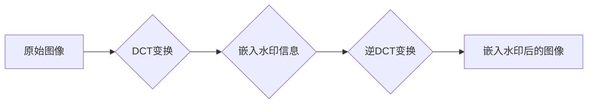

## Watermark技术的实现：Perl版

作者：禅与计算机程序设计艺术

## 1. 背景介绍

### 1.1 数字水印的概念与意义

在信息时代，数字媒体的版权保护显得尤为重要。数字水印技术作为一种有效的版权保护手段，近年来得到了广泛的关注和应用。数字水印是指将特定的信息嵌入到数字媒体中，例如图像、音频、视频等，而不影响原始媒体的感知质量。嵌入的信息可以是版权声明、作者标识、序列号等，用于标识数字媒体的来源、真实性和完整性。

数字水印技术具有以下几个重要意义：

* **版权保护:**  数字水印可以作为版权声明的载体，用于证明数字媒体的版权归属。
* **内容认证:** 数字水印可以用于验证数字媒体的真实性和完整性，防止被篡改或伪造。
* **追踪溯源:** 数字水印可以用于追踪数字媒体的传播路径，识别盗版来源。
* **隐蔽性:** 数字水印嵌入到数字媒体中，不影响原始媒体的感知质量，难以被察觉和移除。

### 1.2 Perl语言在数字水印技术中的优势

Perl语言作为一种强大的脚本语言，在文本处理、图像处理、网络编程等方面具有独特的优势。Perl语言简洁的语法、丰富的库函数以及灵活的扩展性，使得它非常适合用于实现数字水印技术。

* **强大的图像处理能力:** Perl语言拥有GD、Image::Magick等强大的图像处理库，可以方便地对图像进行读取、处理和写入操作。
* **灵活的字符串处理:** Perl语言擅长处理字符串，可以方便地将水印信息嵌入到数字媒体的元数据或其他文本区域。
* **跨平台性:** Perl语言具有良好的跨平台性，可以在不同的操作系统上运行，方便数字水印技术的移植和应用。

## 2. 核心概念与联系

### 2.1 数字水印的分类

数字水印技术可以根据不同的标准进行分类，例如：

* **根据嵌入域:** 空间域水印、变换域水印
* **根据水印的可见性:** 可见水印、不可见水印
* **根据水印的用途:** 版权保护水印、内容认证水印、追踪溯源水印

### 2.2 Perl语言中的图像处理库

Perl语言提供了丰富的图像处理库，例如：

* **GD:** GD是Perl语言中最常用的图像处理库，提供了丰富的图像处理函数，例如图像读取、写入、缩放、旋转、滤镜等。
* **Image::Magick:** Image::Magick是一个功能强大的图像处理工具，提供了更丰富的图像处理功能，例如图像合成、特效处理、格式转换等。

### 2.3 数字水印算法

常见的数字水印算法包括：

* **LSB算法:** 将水印信息嵌入到图像像素的最低有效位。
* **DCT算法:** 将水印信息嵌入到图像的离散余弦变换系数中。
* **DWT算法:** 将水印信息嵌入到图像的离散小波变换系数中。

## 3. 核心算法原理具体操作步骤

### 3.1 基于LSB算法的Perl实现

LSB算法是最简单的数字水印算法之一，其原理是将水印信息嵌入到图像像素的最低有效位。具体操作步骤如下：

1. 读取原始图像和水印信息。
2. 将水印信息转换为二进制序列。
3. 遍历图像像素，将水印信息的每一位嵌入到像素的最低有效位。
4. 保存嵌入水印后的图像。

```perl
#!/usr/bin/perl

use GD;

# 读取原始图像
my $image = GD::Image->newFromPng("original.png");

# 读取水印信息
my $watermark = "Copyright 2023";

# 将水印信息转换为二进制序列
my $watermark_bits = unpack("B*", $watermark);

# 遍历图像像素，将水印信息的每一位嵌入到像素的最低有效位
my $width = $image->width;
my $height = $image->height;
my $bit_index = 0;
for my $y (0..$height-1) {
    for my $x (0..$width-1) {
        my $pixel = $image->getPixel($x, $y);
        my $r = ($pixel >> 16) & 0xff;
        my $g = ($pixel >> 8) & 0xff;
        my $b = $pixel & 0xff;

        # 嵌入水印信息
        if ($bit_index < length($watermark_bits)) {
            my $bit = substr($watermark_bits, $bit_index, 1);
            $r = ($r & 0xfe) | $bit;
            $bit_index++;
        }

        # 设置像素颜色
        $image->setPixel($x, $y, $image->colorAllocate($r, $g, $b));
    }
}

# 保存嵌入水印后的图像
$image->png("watermarked.png");
```

### 3.2 基于DCT算法的Perl实现

DCT算法是一种变换域水印算法，其原理是将水印信息嵌入到图像的离散余弦变换系数中。具体操作步骤如下：

1. 读取原始图像和水印信息。
2. 对图像进行离散余弦变换。
3. 选择合适的DCT系数，将水印信息嵌入到系数中。
4. 对嵌入水印后的DCT系数进行逆离散余弦变换，得到嵌入水印后的图像。

```perl
#!/usr/bin/perl

use Math::DCT;

# 读取原始图像
my $image = GD::Image->newFromPng("original.png");

# 读取水印信息
my $watermark = "Copyright 2023";

# 将水印信息转换为二进制序列
my $watermark_bits = unpack("B*", $watermark);

# 对图像进行离散余弦变换
my $dct = Math::DCT->new($image);

# 选择合适的DCT系数，将水印信息嵌入到系数中
my $bit_index = 0;
for my $i (0..$dct->rows-1) {
    for my $j (0..$dct->cols-1) {
        if ($bit_index < length($watermark_bits)) {
            my $bit = substr($watermark_bits, $bit_index, 1);
            $dct->coef($i, $j) += $bit * 0.1;
            $bit_index++;
        }
    }
}

# 对嵌入水印后的DCT系数进行逆离散余弦变换
my $watermarked_image = $dct->idct;

# 保存嵌入水印后的图像
$watermarked_image->png("watermarked.png");
```

## 4. 数学模型和公式详细讲解举例说明

### 4.1 LSB算法的数学模型

LSB算法的数学模型可以表示为：

$$
P' = P + W \cdot 2^{-b}
$$

其中：

* $P$ 表示原始像素值。
* $P'$ 表示嵌入水印后的像素值。
* $W$ 表示水印信息位，取值为0或1。
* $b$ 表示嵌入水印的位平面，通常取值为最低有效位。

### 4.2 DCT算法的数学模型

DCT算法的数学模型可以表示为：

$$
D' = D + \alpha \cdot W
$$

其中：

* $D$ 表示原始DCT系数。
* $D'$ 表示嵌入水印后的DCT系数。
* $W$ 表示水印信息。
* $\alpha$ 表示水印嵌入强度。

## 5. 项目实践：代码实例和详细解释说明

### 5.1 基于LSB算法的Perl实现

以下是一个基于LSB算法的Perl实现，用于将水印信息嵌入到PNG图像中：

```perl
#!/usr/bin/perl

use GD;

# 读取原始图像
my $image = GD::Image->newFromPng("original.png");

# 读取水印信息
my $watermark = "Copyright 2023";

# 将水印信息转换为二进制序列
my $watermark_bits = unpack("B*", $watermark);

# 遍历图像像素，将水印信息的每一位嵌入到像素的最低有效位
my $width = $image->width;
my $height = $image->height;
my $bit_index = 0;
for my $y (0..$height-1) {
    for my $x (0..$width-1) {
        my $pixel = $image->getPixel($x, $y);
        my $r = ($pixel >> 16) & 0xff;
        my $g = ($pixel >> 8) & 0xff;
        my $b = $pixel & 0xff;

        # 嵌入水印信息
        if ($bit_index < length($watermark_bits)) {
            my $bit = substr($watermark_bits, $bit_index, 1);
            $r = ($r & 0xfe) | $bit;
            $bit_index++;
        }

        # 设置像素颜色
        $image->setPixel($x, $y, $image->colorAllocate($r, $g, $b));
    }
}

# 保存嵌入水印后的图像
$image->png("watermarked.png");
```

### 5.2 基于DCT算法的Perl实现

以下是一个基于DCT算法的Perl实现，用于将水印信息嵌入到PNG图像中：

```perl
#!/usr/bin/perl

use Math::DCT;

# 读取原始图像
my $image = GD::Image->newFromPng("original.png");

# 读取水印信息
my $watermark = "Copyright 2023";

# 将水印信息转换为二进制序列
my $watermark_bits = unpack("B*", $watermark);

# 对图像进行离散余弦变换
my $dct = Math::DCT->new($image);

# 选择合适的DCT系数，将水印信息嵌入到系数中
my $bit_index = 0;
for my $i (0..$dct->rows-1) {
    for my $j (0..$dct->cols-1) {
        if ($bit_index < length($watermark_bits)) {
            my $bit = substr($watermark_bits, $bit_index, 1);
            $dct->coef($i, $j) += $bit * 0.1;
            $bit_index++;
        }
    }
}

# 对嵌入水印后的DCT系数进行逆离散余弦变换
my $watermarked_image = $dct->idct;

# 保存嵌入水印后的图像
$watermarked_image->png("watermarked.png");
```

## 6. 实际应用场景

数字水印技术在各个领域都有着广泛的应用，例如：

* **版权保护:**  数字水印可以用于保护数字图像、音频、视频等媒体的版权，防止未经授权的复制和传播。
* **内容认证:** 数字水印可以用于验证数字媒体的真实性和完整性，例如，用于验证电子文档、数字签名、医疗图像等是否被篡改。
* **追踪溯源:** 数字水印可以用于追踪数字媒体的传播路径，识别盗版来源，例如，用于追踪盗版软件、音乐、电影等的传播。
* **广播监控:** 数字水印可以用于监控广播内容，例如，用于识别未经授权的广播内容或追踪广播信号的来源。

## 7. 工具和资源推荐

以下是一些常用的Perl图像处理库和数字水印工具：

* **GD:** Perl语言中最常用的图像处理库，提供了丰富的图像处理函数。
* **Image::Magick:** 一个功能强大的图像处理工具，提供了更丰富的图像处理功能。
* **OpenCV:** 一个开源的计算机视觉库，提供了丰富的图像处理和计算机视觉算法。
* **Digimarc:**  一家提供数字水印技术的公司，提供各种数字水印软件和服务。

## 8. 总结：未来发展趋势与挑战

数字水印技术作为一种有效的版权保护手段，在未来将继续得到发展和应用。未来数字水印技术的发展趋势主要包括：

* **更高的鲁棒性:**  数字水印需要抵御各种攻击，例如压缩、噪声、滤波、几何攻击等，未来的数字水印算法需要具有更高的鲁棒性。
* **更强的隐蔽性:**  数字水印需要在不影响原始媒体感知质量的前提下嵌入信息，未来的数字水印算法需要具有更强的隐蔽性。
* **更广泛的应用:**  数字水印技术将在更多领域得到应用，例如物联网、云计算、人工智能等。

数字水印技术也面临着一些挑战，例如：

* **水印攻击:**  攻击者可以尝试移除或破坏数字水印，例如，使用水印攻击算法或利用水印算法的漏洞。
* **标准化问题:**  目前数字水印技术缺乏统一的标准，不同的水印算法和应用之间存在兼容性问题。
* **法律问题:**  数字水印技术的法律效力还需要进一步明确，例如，数字水印是否可以作为版权保护的有效证据。

## 9. 附录：常见问题与解答

### 9.1 如何选择合适的数字水印算法？

选择合适的数字水印算法需要考虑以下因素：

* **应用场景:**  不同的应用场景对数字水印的要求不同，例如，版权保护水印需要具有较高的鲁棒性，而内容认证水印需要具有较高的安全性。
* **数字媒体类型:**  不同的数字媒体类型对数字水印算法的要求也不同，例如，图像水印算法需要考虑图像的视觉特性，而音频水印算法需要考虑音频的听觉特性。
* **攻击类型:**  不同的攻击类型对数字水印算法的鲁棒性要求不同，例如，压缩攻击对水印的鲁棒性要求较高，而噪声攻击对水印的隐蔽性要求较高。

### 9.2 如何评估数字水印算法的性能？

评估数字水印算法的性能需要考虑以下指标：

* **鲁棒性:**  水印算法抵抗各种攻击的能力，例如压缩、噪声、滤波、几何攻击等。
* **隐蔽性:**  水印嵌入到数字媒体中，不影响原始媒体的感知质量的程度。
* **容量:**  水印算法可以嵌入的信息量。
* **复杂度:**  水印算法的计算复杂度。

## 10. Mermaid流程图


