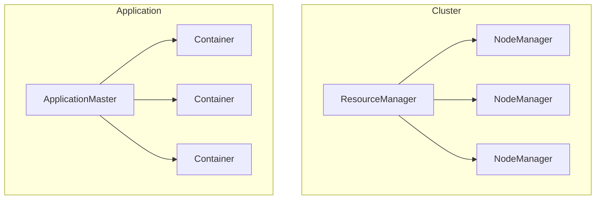
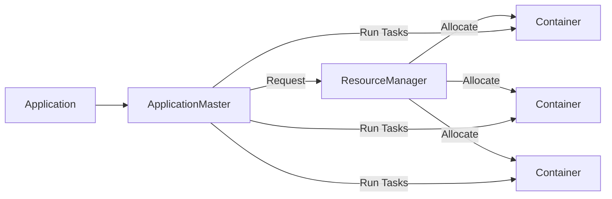

# Yarn中的ApplicationMaster：角色与功能

## 1.背景介绍

Apache Hadoop YARN (Yet Another Resource Negotiator) 是Hadoop的资源管理和任务调度框架。它负责集群资源管理和作业调度,是Hadoop 2.x版本中引入的全新架构。YARN将资源管理和作业调度/监控的功能从JobTracker剥离出来,分别由全新的ResourceManager和ApplicationMaster组件承担。

在YARN中,ApplicationMaster是管理和监控应用程序执行过程的关键组件。它负责为应用程序申请资源,跟踪应用程序的状态,并监控应用程序的执行进度。ApplicationMaster在整个应用程序生命周期中扮演着核心角色。

### 1.1 YARN架构概览

为了更好地理解ApplicationMaster的作用,我们先简单回顾一下YARN的架构:



YARN架构主要包括以下几个组件:

- **ResourceManager(RM)**: 集群资源管理和调度的主体,负责接收应用程序的资源请求,并为已接受的应用程序分配容器(Container)资源。
- **NodeManager(NM)**: 运行在每个节点上的资源和容器管理组件,负责管理节点上的资源使用和容器生命周期。
- **ApplicationMaster(AM)**: 每个应用程序对应一个AM实例,负责应用程序的执行过程管理。
- **Container**: 资源抽象的单位,包括CPU、内存等资源,用于运行应用程序的任务。

### 1.2 ApplicationMaster的职责

ApplicationMaster是应用程序与YARN之间的协调者,主要职责包括:

1. **资源协商**: 向ResourceManager协商容器资源,用于运行应用程序的任务。
2. **任务监控**: 监控容器的执行状态,跟踪任务进度。
3. **容错处理**: 重启失败的任务,确保应用程序的正常执行。
4. **服务解耦**: 将应用程序的业务逻辑与YARN资源管理框架解耦。

ApplicationMaster的引入使得整个系统更加灵活和可扩展。应用程序开发者只需要关注ApplicationMaster的实现,而不必关心底层的资源管理细节。

## 2.核心概念与联系 

为了更好地理解ApplicationMaster,我们需要了解一些关键概念及其之间的关系。

### 2.1 Application

Application是YARN中的核心概念,表示一个执行的作业或应用程序。每个Application都有一个ApplicationId唯一标识,并且与一个ApplicationMaster实例相关联。

### 2.2 ApplicationMaster

ApplicationMaster是Application的"大脑",负责管理整个Application的生命周期。它与ResourceManager协商资源,并在分配到的容器中运行应用程序的任务。

ApplicationMaster的主要职责包括:

1. **资源请求**: 向ResourceManager请求容器资源,用于运行应用程序的任务。
2. **任务分发**: 将任务分发到分配的容器中执行。
3. **任务监控**: 监控任务的执行状态,处理任务失败等异常情况。
4. **进度报告**: 定期向ResourceManager报告应用程序的进度。
5. **资源释放**: 在应用程序结束时,向ResourceManager释放所占用的资源。

ApplicationMaster通常由应用程序框架(如MapReduce)或用户自定义实现。它需要实现ApplicationMaster协议,以便与YARN进行通信和协作。

### 2.3 Container

Container是YARN中资源的抽象和封装,表示一组可用的资源(如CPU、内存等)。ApplicationMaster会向ResourceManager请求一定数量的Container,并在其中运行应用程序的任务。

Container具有以下特点:

1. **资源隔离**: 每个Container拥有独立的资源视图和执行环境。
2. **资源限制**: Container的资源使用受到限制,防止任务monopolize资源。
3. **数据本地化**: YARN会尽量将Container分配到存储输入数据的节点上,以提高数据本地性。

### 2.4 关系总结

ApplicationMaster、Application、Container之间的关系如下:

- 一个Application只有一个与之关联的ApplicationMaster实例。
- ApplicationMaster负责管理Application的整个生命周期。
- ApplicationMaster向ResourceManager请求Container资源。
- ApplicationMaster在获取的Container中运行Application的任务。

它们的关系如下图所示:



## 3.核心算法原理具体操作步骤

ApplicationMaster的核心算法原理主要包括以下几个方面:资源请求、任务分发和监控、容错处理、进度报告和资源释放。下面我们逐一进行详细分析。

### 3.1 资源请求算法

ApplicationMaster需要根据应用程序的需求向ResourceManager请求容器资源。常见的资源请求算法有:

1. **静态资源请求**

   在应用程序启动时,ApplicationMaster一次性向ResourceManager请求所需的全部资源。这种方式简单直接,但缺乏灵活性,无法动态调整资源分配。

2. **动态资源请求**  

   ApplicationMaster根据应用程序的实际运行状况,动态向ResourceManager请求或释放资源。这种方式更加灵活,可以充分利用集群资源,但实现较为复杂。

3. **基于进度的资源请求**

   ApplicationMaster根据应用程序的运行进度来确定资源请求量。当进度落后时,请求更多资源;当进度领先时,释放部分资源。这种方式可以较好地实现资源利用和应用程序执行效率的平衡。

下面是一个基于进度的资源请求算法的伪代码示例:

```python
# 定义请求资源的策略函数
def request_containers(progress):
    total_containers = 100 # 总共需要的容器数量
    containers_allocated = get_allocated_containers() # 获取已分配的容器数量
    containers_requested = total_containers - containers_allocated # 需要请求的容器数量
    
    # 根据进度动态调整请求量
    if progress < 0.2:
        containers_requested = int(containers_requested * 1.5) # 加速执行
    elif progress > 0.8:
        containers_requested = int(containers_requested * 0.5) # 减缓执行
    
    request_resources(containers_requested) # 向RM请求容器资源

# 应用程序主循环
while not is_application_completed():
    progress = get_application_progress() # 获取应用程序进度
    request_containers(progress) # 根据进度请求资源
    monitor_tasks() # 监控任务执行情况
    ...
```

### 3.2 任务分发和监控算法

ApplicationMaster需要将任务合理地分发到已分配的容器中执行,并监控任务的执行状态。常见的任务分发和监控算法包括:

1. **基于资源的分发**

   ApplicationMaster根据容器的资源情况(CPU、内存等)来分发任务,保证任务可以在容器中顺利执行。

2. **基于本地性的分发**

   ApplicationMaster优先将任务分发到存储输入数据的节点上,以提高数据本地性,减少网络传输开销。

3. **基于优先级的分发**  

   ApplicationMaster根据任务的优先级将其分发到合适的容器中执行,保证高优先级任务可以优先获得资源。

4. **任务状态监控**

   ApplicationMaster需要持续监控容器中任务的执行状态,包括运行中、已完成、失败等状态,并根据状态进行相应的处理(如重启失败任务)。

下面是一个基于本地性和优先级的任务分发算法的伪代码示例:

```python
# 获取待执行任务列表
pending_tasks = get_pending_tasks()

# 根据本地性和优先级对任务进行排序
sorted_tasks = sort_tasks_by_locality_and_priority(pending_tasks)

for task in sorted_tasks:
    # 查找满足资源需求的本地节点容器
    container = find_available_local_container(task)
    if container is None:
        # 没有满足条件的本地容器,查找远程容器
        container = find_available_remote_container(task)
    
    if container:
        launch_task_on_container(task, container)
    else:
        # 暂时无法分配容器,将任务放回pending队列
        pending_tasks.append(task)
```

### 3.3 容错处理算法

由于硬件故障、网络问题等原因,容器中的任务可能会失败。ApplicationMaster需要采取容错机制,确保应用程序可以正常执行。常见的容错处理算法包括:

1. **任务重启**

   当任务失败时,ApplicationMaster会将其重新分发到其他容器中执行。

2. **容器黑名单**

   如果某个容器频繁出现任务失败的情况,ApplicationMaster可以将其加入黑名单,避免继续在该容器上运行任务。

3. **节点故障转移**

   当某个节点发生故障时,ApplicationMaster需要将运行在该节点上的容器和任务迁移到其他节点上继续执行。

4. **应用程序重启**

   如果应用程序出现无法恢复的严重故障,ApplicationMaster可以尝试重启整个应用程序。

下面是一个简单的任务重启算法的伪代码示例:

```python
# 监控任务执行状态
def monitor_tasks():
    for task in running_tasks:
        if task.status == TaskStatus.FAILED:
            # 任务失败,重新分发执行
            redeploy_task(task)

# 重新分发失败任务
def redeploy_task(task):
    # 从可用容器列表中选择一个容器
    container = select_available_container(task)
    if container:
        launch_task_on_container(task, container)
    else:
        # 暂时无法分配容器,将任务放回pending队列
        pending_tasks.append(task)
```

### 3.4 进度报告算法

ApplicationMaster需要定期向ResourceManager报告应用程序的执行进度,以便ResourceManager可以监控应用程序的运行状态,并根据需要调整资源分配。常见的进度报告算法包括:

1. **基于任务完成度的进度报告**

   ApplicationMaster根据已完成任务的数量计算应用程序的整体进度,并定期上报给ResourceManager。

2. **基于输入/输出数据的进度报告**

   对于需要处理大量数据的应用程序(如MapReduce),ApplicationMaster可以根据已处理的输入/输出数据量来估计应用程序的进度。

3. **基于自定义指标的进度报告**

   ApplicationMaster可以根据应用程序的特定指标(如迭代次数、模型精度等)来估计应用程序的进度,并上报给ResourceManager。

下面是一个基于任务完成度的进度报告算法的伪代码示例:

```python
# 定期报告应用程序进度
def report_progress():
    total_tasks = len(all_tasks)
    completed_tasks = sum(task.status == TaskStatus.COMPLETED for task in all_tasks)
    progress = completed_tasks / total_tasks
    report_to_rm(progress)

# 应用程序主循环
while not is_application_completed():
    monitor_tasks()
    ...
    report_progress() # 定期报告进度
```

### 3.5 资源释放算法

当应用程序执行完毕或出现不可恢复的错误时,ApplicationMaster需要向ResourceManager释放所占用的容器资源。常见的资源释放算法包括:

1. **一次性释放**

   应用程序执行完毕后,ApplicationMaster一次性向ResourceManager释放所有占用的容器资源。

2. **渐进式释放**

   在应用程序接近完成时,ApplicationMaster可以逐步释放部分容器资源,以便其他应用程序可以更快地获得资源。

3. **基于优先级的释放**

   ApplicationMaster可以优先释放低优先级任务占用的容器资源,确保高优先级任务可以获得足够的资源。

下面是一个简单的一次性资源释放算法的伪代码示例:

```python
# 应用程序执行完毕,释放所有资源
def release_resources():
    for container in allocated_containers:
        release_container(container)
    
    # 通知RM应用程序已完成
    notify_rm_application_completed()

# 应用程序主循环
while not is_application_completed():
    monitor_tasks()
    ...

# 应用程序执行